# 02. DAMORI V4 통합 사이트맵 명세 (V1 Baseline)

단계: `05-설계 (V4 파이프라인 Site Map Baseline)`  
버전: `V1`  
공식 브랜드명: `DAMORI / 다모리`  
상태: `V4_SITE_MAP_BASELINE_V1` (사용자 최종 승인 기준본)  
저장 위치: `V4-설계자료/02-V4-통합-사이트맵-V1.md`  

---

## 1. 프로젝트 개요

### 1.1 최종 경험 목표
본 설계는 **"브랜드를 소개하면서 제품군까지 설득력 있게 보여주는 포트폴리오형 랜딩 경험"**을 구축하기 위한 DAMORI 브랜드의 공식 통합 사이트맵 마스터 명세 문서이다.

### 1.2 사이트맵 핵심 설계 원칙
1. **3대 대표 Page Anchor 수축**: 메인, 카테고리/서브, 브랜드 소개 총 3개 대표 페이지 중심 구조를 확립하여 과거 20개 페이지 파편화(Explosion)를 완벽히 차단함.
2. **미니멀 GNB 및 전역 기능 분리**: 1차 GNB는 3대 Anchor로 단순화하고, `SEARCH`는 Header Utility 영역의 `GLOBAL_FUNCTION`으로 관리함.
3. **Pure Need & 경험 중심 정의**: 구현 UI 명칭(`1-click Resume Band`, `10초 Snapshot`, `4대 필터 칩`)을 발라내어 상위 경험 목적("부담 없는 복귀 경험", "짧고 편안한 회고 경험", "사용자 기준 자율 탐색")으로 수용함.
4. **Product Spec Layer 분리**: `Smyth Sewn 실제본`, `120gsm 미유광 평산지` 등 기술 스펙을 Brand Core에서 배제하고 `PRODUCT_REQUIREMENT` 및 Category `1.3 Product Feature & Spec`으로 전량 이동함.

---

## 2. 설계 근거와 핵심 사용자 목표

### 2.1 Brand Source 우선순위
1. `PRIMARY_BRAND_SOURCE`: `04-기획/브랜드-기획/BRAND-PLAN.md`
2. `SECONDARY_BRAND_SOURCE`: `04-기획/브랜드-기획/BRAND-HANDOFF.md`
3. `CONFLICT_REFERENCE`: `04-기획/브랜드-보충기획/입력/00-자료-사용-매트릭스.md`

### 2.2 가상 클라이언트 도출 계보 (51 Source ➔ 7 Representative)
```text
51 Source Client (clients-51-v6.json)
       ↓ (요구사항 전수 검증 및 중복 정리)
Pure User Need (10개 Pure DNs: DN-01~08, 12, 13)
       ↓
Requirement Pattern (8개 RGs: RG-01~08)
       ↓
V4 Representative Client (7인 세트: V4-C01 은재 ~ V4-C07 다온)
```
- **의미**: 7인의 V4 클라이언트는 51명 원본 클라이언트의 Pure Need를 100% 누락 없이 대표하는 검증된 대표 가상 클라이언트 세트이다.

---

## 3. 전역 Navigation 구조 (GNB)

```text
[LOGO / HOME]  |  PRODUCTS  |  BRAND  |  [SEARCH 🔍]
```

- **`[LOGO / HOME]`**: `0.0 HOME / MAIN` (Long Scroll Portfolio Landing) 이동
- **`PRODUCTS`**: `1.0 PRODUCTS / CATEGORY-SUB` (제품군 이해 & 비주얼 탐색) 이동
- **`BRAND`**: `2.0 BRAND` (독립 브랜드 서사 페이지) 이동
- **`[SEARCH]`**: Header Utility 영역의 `GLOBAL_FUNCTION` (글로벌 서치 레이어 모듈)

---

## 4. 계층형 사이트맵 (Tree Structure)

```text
DAMORI (다모리 - 통합 사이트맵 V1)
│
├─ 0.0 HOME / MAIN (메인 - Long Scroll Portfolio Landing)
│  ├─ 0.1 First Impression (DAMORI 브랜드 존재 이유 요약)
│  ├─ 0.2 Brand Core Summary (사색의 깊이 & 미안함 없는 기록 철학 요약)
│  ├─ 0.3 Recording Experience (짧은 회고 / 글 보존 / 편안한 복귀 경험)
│  ├─ 0.4 Product Groups Intro (아날로그 & 디지털 하이브리드 결합 소개)
│  ├─ 0.5 Portfolio Showcase (대표 Product 최소 15개 이상 수용 Showcase 영역)
│  └─ 0.6 Navigation & Footer (서브페이지 연결 & 전역 푸터)
│
├─ 1.0 PRODUCTS / CATEGORY-SUB (카테고리·서브 - 제품군 이해 & 비주얼 탐색)
│  ├─ 1.1 Visual Hero (카테고리 비주얼 표현)
│  ├─ 1.2 Product Group Exploration (제품군 비주얼 탐색 갤러리)
│  ├─ 1.3 Product Feature & Specification (소재, 제본, 잉크 번짐, 실측 치수 대조)
│  └─ 1.4 Autonomous Exploration (사용자 기준 자율 탐색 영역)
│
└─ 2.0 BRAND (브랜드 소개 - 독립 브랜드 서사 페이지)
   ├─ 2.1 DAMORI Introduction (브랜드 소개 및 존재 이유)
   ├─ 2.2 Recording Philosophy (의무가 아닌 쉼표로서의 기록 철학)
   ├─ 2.3 Core Values & User Value (Zero Strain, Data Integrity, Autonomy)
   ├─ 2.4 Analog & Digital Principle (물성과 편의성의 상호 보완 관계)
   └─ 2.5 Product Principle (도구를 바라보는 DAMORI의 제품 원칙)
```

---

## 5. 페이지별 상세표

| Depth | Page ID | Page/Section Name | 목적 | 핵심 콘텐츠 | 주요 기능 | 연결 Page | Traceability Source |
|---|---|---|---|---|---|---|---|
| **1.0** | `0.0` | `HOME / MAIN` | 포트폴리오 랜딩 & 첫인상 | 서사 히로, 브랜드 요약, 대표 15개 쇼케이스 | 스크롤 애니메이션, 퀵 서브 연결 | 1.0, 2.0 | `BRAND_CORE` + `PROJECT_CONSTRAINT` |
| 2.1 | `0.1` | `First Impression` | 브랜드 존재 이유 전달 | DAMORI 브랜드 미션 & 쉼표 메시지 | 시각 텍스트 히로 | 2.0 | `BRAND_CORE` |
| 2.2 | `0.2` | `Brand Core Summary` | 사색 관점 및 핵심가치 요약 | 편안함, 보존성, 자율성 요약 카드 | 상세 브랜드 링크 | 2.0 | `BRAND_CORE` |
| 2.3 | `0.3` | `Recording Experience` | 상위 기록 경험 소개 | 짧은 회고, 글 보존, 편안한 복귀 경험 | 경험 인터랙션 카드 | 1.0 | `V4-C03,C04,C06` + `PURE_NEED` |
| 2.4 | `0.4` | `Product Groups Intro` | 아날로그/디지털 제품군 소개 | 하이브리드 기록 도구 라인업 | 카테고리 퀵 포커스 | 1.0 | `PRODUCT_SOURCE` |
| 2.5 | `0.5` | `Portfolio Showcase` | 시각 쇼케이스 갤러리 | 대표 Product 최소 15개 이상 수용 영역 | 시각 패키지 캐러셀 | 1.0 | `PRODUCT_SOURCE` + `PROJECT_CONSTRAINT` |
| 2.6 | `0.6` | `Navigation & Footer` | 전역 이동 & 정보 제공 | 푸터 정보, 카테고리/브랜드 이동 | 전역 링크 | 1.0, 2.0 | `PROJECT_CONSTRAINT` |
| **1.0** | `1.0` | `PRODUCTS` | 제품군 이해 & 비주얼 탐색 | 비주얼 히로, 제품 탐색, 스펙 대조 | 카테고리 필터, 실측 대조 뷰 | 0.0, 2.0 | `PRODUCT_SOURCE` + `V4-C07` + `RG-07,08` |
| 2.1 | `1.1` | `Visual Hero` | 카테고리 시각 아이덴티티 | 제품군 대표 포트폴리오 비주얼 | 시각 갤러리 인터랙션 | 1.2 | `PROJECT_CONSTRAINT` |
| 2.2 | `1.2` | `Product Group Exploration`| 약 200개 인벤토리 Pool 탐색 | 유연한 제품 그룹 비주얼 갤러리 | 라인업 탐색 | 1.3 | `PRODUCT_SOURCE` |
| 2.3 | `1.3` | `Product Feature & Spec` | 기술/소재/치수 실측 대조 | 소재, 평면 펼침 제본, 번짐 저감, 치수 대조 | 실측 치수 대조 표 | 1.4 | `PRODUCT_REQUIREMENT` + `V4-C01` |
| 2.4 | `1.4` | `Autonomous Exploration` | 사용자 기준 자율 탐색 | 무가입/무진단 자율 조건 탐색 | 사용자 기준 조건 탐색기 | 1.0 | `V4-C07` + `DN-07,08` |
| **1.0** | `2.0` | `BRAND` | DAMORI 존재 이유 & 철학 | 브랜드 가치, 기록 철학, 결합 원칙 | 깊이 있는 서사 읽기 | 0.0, 1.0 | `BRAND_CORE` + `PROJECT_CONSTRAINT` |
| 2.1 | `2.1` | `DAMORI Introduction` | 브랜드 아이덴티티 및 명칭 | DAMORI 브랜드의 의미와 비전 | 브랜드 서사 카드 | 2.2 | `BRAND_CORE` |
| 2.2 | `2.2` | `Recording Philosophy` | 사색의 관점 설명 | "기록은 의무가 아닌 쉼표" 메시지 | 감성 아키텍처 뷰 | 2.3 | `BRAND_CORE` |
| 2.3 | `2.3` | `Core Values & User Value`| 상위 가치 3종 전달 | Zero Strain, Data Integrity, Autonomy | 가치 카드 모듈 | 2.4 | `BRAND_CORE` |
| 2.4 | `2.4` | `Analog & Digital Principle`| 아날로그와 디지털 결합 관점 | 물성 감성과 디지털 편의성 보완 원칙 | 결합 아키텍처 | 2.5 | `BRAND_CORE` |
| 2.5 | `2.5` | `Product Principle` | 도구를 바라보는 관점 | 도구를 과시하지 않는 담백한 제품 원칙 | 제품 원칙 가이드 | 1.0 | `BRAND_CORE` |

---

## 6. 공통 영역 (Header, Navigation, Footer, Global Function)

- **Header**: `[LOGO / HOME]`, `PRODUCTS`, `BRAND`, `[SEARCH 🔍]`
- **Global Function (`SEARCH`)**: Header Utility 영역에 위치하며, 사용자가 필요한 제품/콘텐츠를 찾을 수 있도록 돕는 전역 탐색 레이어 모듈.
- **Footer**: DAMORI 브랜드 요약 정보, Copyright, 전역 링크, 오프라인 로컬 백업 안내, 전역 접근성 방침 안내.

---

## 7. 주요 User Journey (V4 7인 대표 Client 수용)

1. **`V4-C01 (은재 - 장문 사색)`**: `HOME` (0.1 브랜드 첫인상) ➔ `BRAND` (2.2 기록 철학 및 2.5 제품 원칙 확인) ➔ `PRODUCTS` (1.3 제본 및 번짐 저감 스펙 확인) ➔ **목표 달성**
2. **`V4-C02 (지안 - 일정 통제)`**: `HOME` ➔ `PRODUCTS` (1.2 디지털 세로 플래너 서식 그룹 탐색) ➔ **목표 달성**
3. **`V4-C03 (하람 - 저부담 회고)`**: `HOME` (0.3 짧고 부담 없는 회고 경험 섹션 확인) ➔ **목표 달성**
4. **`V4-C04 (소담 - 글 보존)`**: `HOME` ➔ `PRODUCTS` (1.3 글-서식 분리 프레임 서식 확인) ➔ **목표 달성**
5. **`V4-C05 (태오 - 오프라인)`**: `HOME` (0.6 오프라인 로컬 파일 백업 안내 확인) ➔ **목표 달성**
6. **`V4-C06 (이준 - 기록 복귀)`**: `HOME` (0.3 부담 없이 다시 이어가는 기록 경험 확인) ➔ **목표 달성**
7. **`V4-C07 (다온 - 자율 탐색)`**: `HOME` ➔ `PRODUCTS` (1.4 사용자 기준 자율 탐색 & 1.3 치수 대조 표 사용) ➔ **목표 달성**

---

## 8. 예외 상태 및 Global Rule

### 8.1 GLOBAL_ACCESSIBILITY_RULE
- WCAG 2.1 AA 고대비 색상 적용 (`#6B7F5E` 올리브 & `#FFFFFF` 화이트), 명확한 키보드 포커스 링 지정, 스크린 리더 대체 텍스트 준수.

### 8.2 GLOBAL_RESPONSIVE_RULE
- Desktop, Tablet, Mobile 3대 뷰포트에서 동일한 정보 구조 레이아웃 안정성 및 탐색 일관성 유지.

---

## 9. 가정 및 확인 필요사항

- **로그인 / 마이페이지**: 현재 V4 사이트맵에서는 제외하며, 후속 단계에서 명확한 필요성이 확인될 경우에만 `[가정]`으로 재검토함.
- **카테고리 수 및 제품 15개 선정**: 현재 약 200개 Raw Product Source Pool을 보존하며, 정확한 카테고리 수 및 대표 15개 제품 최종 선정을 후속 단계 검증 항목으로 이관함.

---

## 10. Design Opportunity 별도 기록 (후속 UI 후보)

1. `자율 탐색 조건 UI 후보`: 사용자 기준 조건 탐색 칩 매트릭스 UI 후보 (구체 조건 수 미확정)
2. `짧은 회고 입력 UI 후보`: 무설정 원터치 시각 회고 팝업 폼 UI 후보
3. `부담 없는 복귀 지원 UI 후보`: 연속 출석 파기 경고 없는 복귀 응원 밴드 및 최근 작성 노트 포커스 모듈 UI 후보
4. `제품 차이 비교 UI 후보`: 소재 & 치수 1:1 대조 비교표 UI 후보

---

## 11. Mermaid Flowchart

```mermaid
graph TD
    %% DAMORI V4 Integrated Site Map (V1 Baseline)
    
    subgraph GNB ["전역 내비게이션 (GNB)"]
        HOME["[LOGO / HOME] 0.0 메인 (Long Scroll Landing)"]
        PRODUCTS["PRODUCTS 1.0 카테고리·서브"]
        BRAND["BRAND 2.0 브랜드 소개"]
        SEARCH_UTIL["[SEARCH 🔍] 글로벌 탐색 (Global Function)"]
    end

    subgraph MAIN_TREE ["0.0 HOME / MAIN (Long Scroll Portfolio Landing)"]
        M_01["0.1 First Impression<br/>(DAMORI 브랜드 존재 이유)"]
        M_02["0.2 Brand Core Summary<br/>(사색의 깊이 & 죄책감 없는 기록)"]
        M_03["0.3 Recording Experience<br/>(짧은 회고 / 글 보존 / 편안한 복귀)"]
        M_04["0.4 Product Groups Intro<br/>(아날로그 & 디지털 결합 소개)"]
        M_05["0.5 Portfolio Showcase<br/>(대표 Product 최소 15개 수용 영역)"]
        M_06["0.6 Navigation & Footer<br/>(서브연결 & 전역 푸터)"]
        
        HOME --> M_01
        HOME --> M_02
        HOME --> M_03
        HOME --> M_04
        HOME --> M_05
        HOME --> M_06
    end

    subgraph PRODUCTS_TREE ["1.0 PRODUCTS (CATEGORY / SUB - 제품군 이해 & 비주얼 탐색)"]
        P_01["1.1 Visual Hero<br/>(카테고리 비주얼 표현)"]
        P_02["1.2 Product Group Exploration<br/>(제품군 비주얼 탐색 갤러리)"]
        P_03["1.3 Product Feature & Spec<br/>(소재, 제본, 잉크 번짐, 실측 치수 대조)"]
        P_04["1.4 Autonomous Exploration<br/>(사용자 기준 자율 탐색)"]
        
        PRODUCTS --> P_01
        PRODUCTS --> P_02
        PRODUCTS --> P_03
        PRODUCTS --> P_04
    end

    subgraph BRAND_TREE ["2.0 BRAND (독립 브랜드 서사 페이지)"]
        B_01["2.1 DAMORI Introduction<br/>(브랜드 존재 이유)"]
        B_02["2.2 Recording Philosophy<br/>(의무가 아닌 쉼표로서의 기록 철학)"]
        B_03["2.3 Core Values & User Value<br/>(Zero Strain, Data Integrity, Autonomy)"]
        B_04["2.4 Analog & Digital Principle<br/>(물성과 편의성의 상호 보완 관계)"]
        B_05["2.5 Product Principle<br/>(도구를 바라보는 DAMORI의 제품 원칙)"]
        
        BRAND --> B_01
        BRAND --> B_02
        BRAND --> B_03
        BRAND --> B_04
        BRAND --> B_05
    end

    subgraph GLOBAL_EXTRAS ["전역 기능 & 규범 (Global Extras)"]
        GF_SEARCH["GLOBAL FUNCTION: SEARCH<br/>(헤더 글로벌 제품/서식 자율 탐색 팝업 모듈)"]
        GR_ACCESSIBILITY["GLOBAL RULE: ACCESSIBILITY_RULE<br/>(WCAG 2.1 AA 고대비 & 키보드 포커스 링)"]
        GR_RESPONSIVE["GLOBAL RULE: RESPONSIVE_RULE<br/>(Desktop / Tablet / Mobile 레이아웃 일관성)"]
    end

    SEARCH_UTIL -.-> GF_SEARCH

    %% Style definitions
    style HOME fill:#6B7F5E,color:#FFFFFF,stroke:#3A4832,stroke-width:2px
    style PRODUCTS fill:#6B7F5E,color:#FFFFFF,stroke:#3A4832,stroke-width:2px
    style BRAND fill:#6B7F5E,color:#FFFFFF,stroke:#3A4832,stroke-width:2px
    style SEARCH_UTIL fill:#8A9A7E,color:#FFFFFF,stroke:#3A4832,stroke-dasharray: 5 5
```



---

## 12. 검토 결과 및 종합 판정

- **누락 검증**: V4 7인 대표 클라이언트의 Pure Need와 8개 Requirement Pattern의 반영 누락 없음이 확인됨.
- **중복 검사**: 메인(랜딩 서사), 카테고리(비주얼 탐색 & 치수 대조), 브랜드(존재 이유 & 철학) 3개 페이지 역할이 완전하게 분리됨.
- **연결 검증**: 모든 2차 세부 섹션이 1차 GNB 및 메인 Long Scroll과 1~2클릭으로 도달 가능하여 끊긴 링크 0건.
- **Label 및 Depth**: 레이블의 직관성이 우수하며 평균 Depth 2.4로 이동 구조가 매우 안정적임.
- **Mobile 접근 일관성**: Mobile 뷰포트에서도 동일한 GNB 3대 앵커 및 전역 검색 유틸리티가 명확히 일치함.
