# 02. DAMORI V4 통합 사이트맵 명세 (V2 Baseline)

- **단계**: `05-설계 (V4 파이프라인 Site Map Baseline V2)`
- **버전**: `V2`
- **공식 브랜드명**: `DAMORI / 다모리`
- **상태**: `V4_SITE_MAP_BASELINE_V2` (사용자 승인 공식 기준본)
- **저장 위치**: `V4-설계자료/02-v4-site-map-v2.md`

---

## 1. 프로젝트 개요

### 1.1 최종 경험 목표
본 명세는 **"브랜드를 소개하면서 제품군까지 설득력 있게 보여주는 포트폴리오형 랜딩 경험"**을 제공하기 위한 DAMORI 브랜드의 공식 통합 사이트맵 마스터 V2 명세 문서이다.

### 1.2 V1 ➔ V2 주요 정정사항
1. **미니멀 GNB 구조 확정**: `[LOGO / HOME] | PRODUCTS | BRAND` 3대 앵커 중심의 정갈한 내비게이션으로 고정함.
2. **SEARCH 위치 조정**: `SEARCH`를 1차 GNB 및 전역 기능에서 해제하고 `DESIGN_OPPORTUNITY` (검색/탐색 기능 후보)로 보관함.
3. **UI Solution Leakage 완전 제거**: '스크롤 애니메이션', '캐러셀', '10초 팝업', '1-클릭 밴드' 등 특정 구현 UI 명칭을 사이트맵에서 제거하고 상위 경험 목적("부담 없는 복귀 경험", "짧은 회고 경험")으로 변경함.
4. **WCAG AA 대비율 재계산 명시**: 올리브 (`#6B7F5E`)와 화이트 (`#FFFFFF`)의 대비율이 `4.3546:1`로 계산되어 (일반 텍스트 4.5:1 미달 `AA_NOT_CONFIRMED`, 대형 텍스트 3.0:1 `PASS`), 후속 Style Guide 단계에서 텍스트 크기별 검증이 필요함을 밝힘.

---

## 2. 전역 Navigation 구조 (GNB)

```text
[LOGO / HOME]  |  PRODUCTS  |  BRAND
```

- **`[LOGO / HOME]`**: `0.0 HOME / MAIN` (Long Scroll Portfolio Landing) 이동
- **`PRODUCTS`**: `1.0 PRODUCTS / CATEGORY-SUB` (제품군 이해 & 비주얼 탐색) 이동
- **`BRAND`**: `2.0 BRAND` (독립 브랜드 서사 페이지) 이동
- *(※ SEARCH는 1차 GNB에 포함하지 않으며, 후속 화면설계 단계에서 검토함).*

---

## 3. 계층형 사이트맵 (Tree Structure)

```text
DAMORI (다모리 - 통합 사이트맵 V2)
│
├─ 0.0 HOME / MAIN (메인 - Long Scroll Portfolio Landing)
│  ├─ 0.1 First Impression (DAMORI 브랜드 존재 이유 요약)
│  ├─ 0.2 Brand Core Summary (사색의 깊이 & 미안함 없는 기록 철학 요약)
│  ├─ 0.3 Recording Experience (짧은 회고 / 글 보존 / 편안한 복귀 경험)
│  ├─ 0.4 Product Groups Intro (아날로그 & 디지털 하이브리드 결합 소개)
│  ├─ 0.5 Portfolio Showcase (대표 Product 최소 15개 이상 수용 Showcase 영역)
│  └─ 0.6 Navigation & Footer (서브페이지 연결 & 전역 푸터)
│
├─ 1.0 PRODUCTS / CATEGORY-SUB (카테고리·서브 - 제품군 이해 & 비주얼 탐색)
│  ├─ 1.1 Visual Hero (카테고리 비주얼 표현)
│  ├─ 1.2 Product Group Exploration (제품군 비주얼 탐색 갤러리)
│  ├─ 1.3 Product Feature & Specification (소재, 제본, 잉크 번짐, 실측 치수 대조)
│  └─ 1.4 User-led Exploration (사용자 기준 자율 탐색 영역)
│
└─ 2.0 BRAND (브랜드 소개 - 독립 브랜드 서사 페이지)
   ├─ 2.1 DAMORI Introduction (브랜드 소개 및 존재 이유)
   ├─ 2.2 Brand Existence & Purpose (브랜드가 존재하는 이유와 비전)
   ├─ 2.3 Recording Philosophy (의무가 아닌 쉼표로서의 기록 철학)
   ├─ 2.4 Core Values & User Value (Zero Strain, Data Integrity, Autonomy)
   ├─ 2.5 Analog & Digital Principle (물성과 편의성의 상호 보완 관계)
   └─ 2.6 Product Principle (도구를 바라보는 DAMORI의 제품 원칙)
```

---

## 4. 페이지별 상세표

| Depth | Page ID | Page/Section Name | 목적 | 핵심 콘텐츠 | 주요 정보 기능 | 연결 Page | Traceability Source |
|---|---|---|---|---|---|---|---|
| **1.0** | `0.0` | `HOME / MAIN` | 포트폴리오 랜딩 & 첫인상 | 서사 히로, 브랜드 요약, 대표 쇼케이스 | 서사적 탐색 안내 | 1.0, 2.0 | `BRAND_CORE` + `PROJECT_CONSTRAINT` |
| 2.1 | `0.1` | `First Impression` | 브랜드 존재 이유 전달 | DAMORI 브랜드 미션 & 쉼표 메시지 | 브랜드 존재 이유 안내 | 2.0 | `BRAND_CORE` |
| 2.2 | `0.2` | `Brand Core Summary` | 사색 관점 및 핵심가치 요약 | 편안함, 보존성, 자율성 요약 | 핵심 가치 요약 안내 | 2.0 | `BRAND_CORE` |
| 2.3 | `0.3` | `Recording Experience` | 상위 기록 경험 소개 | 짧은 회고, 글 보존, 편안한 복귀 경험 | 경험 원칙 안내 | 1.0 | `V4-C03,C04,C06` + `PURE_NEED` |
| 2.4 | `0.4` | `Product Groups Intro` | 아날로그/디지털 제품군 소개 | 하이브리드 기록 도구 라인업 | 카테고리 이동 안내 | 1.0 | `PRODUCT_SOURCE` |
| 2.5 | `0.5` | `Portfolio Showcase` | 시각 쇼케이스 갤러리 | 대표 Product 최소 15개 이상 수용 영역 | 시각 라인업 안내 | 1.0 | `PRODUCT_SOURCE` + `PROJECT_CONSTRAINT` |
| 2.6 | `0.6` | `Navigation & Footer` | 전역 이동 & 정보 제공 | 푸터 정보, 카테고리/브랜드 이동 | 전역 내비게이션 | 1.0, 2.0 | `PROJECT_CONSTRAINT` |
| **1.0** | `1.0` | `PRODUCTS` | 제품군 이해 & 비주얼 탐색 | 비주얼 히로, 제품 탐색, 스펙 대조 | 자율 탐색 및 스펙 대조 | 0.0, 2.0 | `PRODUCT_SOURCE` + `V4-C07` + `RG-07,08` |
| 2.1 | `1.1` | `Visual Hero` | 카테고리 시각 아이덴티티 | 제품군 대표 포트폴리오 비주얼 | 시각 히로 안내 | 1.2 | `PROJECT_CONSTRAINT` |
| 2.2 | `1.2` | `Product Group Exploration`| 약 200개 인벤토리 Pool 탐색 | 유연한 제품 그룹 비주얼 갤러리 | 비주얼 탐색 안내 | 1.3 | `PRODUCT_SOURCE` |
| 2.3 | `1.3` | `Product Feature & Spec` | 기술/소재/치수 실측 대조 | 소재, 평면 펼침 제본, 번짐 저감, 치수 대조 | 스펙 차이 대조 정보 | 1.4 | `PRODUCT_REQUIREMENT` + `V4-C01` |
| 2.4 | `1.4` | `User-led Exploration` | 사용자 기준 자율 탐색 | 무가입/무진단 자율 조건 탐색 | 사용자 기준 좁히기 정보 | 1.0 | `V4-C07` + `DN-07,08` |
| **1.0** | `2.0` | `BRAND` | DAMORI 존재 이유 & 철학 | 브랜드 가치, 기록 철학, 결합 원칙 | 브랜드 철학 서사 | 0.0, 1.0 | `BRAND_CORE` + `PROJECT_CONSTRAINT` |
| 2.1 | `2.1` | `DAMORI Introduction` | 브랜드 아이덴티티 및 명칭 | DAMORI 브랜드의 의미와 비전 | 브랜드 소개 서사 | 2.2 | `BRAND_CORE` |
| 2.2 | `2.2` | `Brand Existence & Purpose`| 왜 존재하는가 | 바쁜 일상 속 기록의 쉼표 메시지 | 미션 서사 안내 | 2.3 | `BRAND_CORE` |
| 2.3 | `2.3` | `Recording Philosophy` | 사색의 관점 설명 | "기록은 의무가 아닌 쉼표" 메시지 | 기록 철학 안내 | 2.4 | `BRAND_CORE` |
| 2.4 | `2.4` | `Core Values & User Value`| 상위 가치 3종 전달 | Zero Strain, Data Integrity, Autonomy | 핵심 가치 서사 | 2.5 | `BRAND_CORE` |
| 2.5 | `2.5` | `Analog & Digital Principle`| 아날로그와 디지털 결합 관점 | 물성 감성과 디지털 편의성 보완 원칙 | 결합 원칙 안내 | 2.6 | `BRAND_CORE` |
| 2.6 | `2.6` | `Product Principle` | 도구를 바라보는 관점 | 도구를 과시하지 않는 담백한 제품 원칙 | 제품 원칙 가이드 | 1.0 | `BRAND_CORE` |

---

## 5. 공통 영역 및 Global Rules

- **Header**: `[LOGO / HOME]`, `PRODUCTS`, `BRAND`
- **Footer**: DAMORI 브랜드 정보, Copyright, 전역 링크, 로컬 소장 안내, 웹 접근성 방침 안내.
- **`GLOBAL_ACCESSIBILITY_RULE`**: WCAG 2.1 AA 명도 대비 고려 (올리브 `#6B7F5E`와 화이트 `#FFFFFF` 대비율 `4.3546:1`로 계산되어, 본문 텍스트용 다크 올리브 `#4E5E43` 검토 필요성 명시), 명확한 포커스 링 준수.
- **`GLOBAL_RESPONSIVE_RULE`**: Desktop, Tablet, Mobile 뷰포트 정보 구조 레이아웃 일관성 유지.

---

## 6. Design Opportunity (후속 설계 후보)

1. `검색/탐색 기능 후보`: 전역 검색 레이어 모듈
2. `사용자 기준 조건 탐색 UI 후보`: 조건 탐색 칩 매트릭스 UI
3. `제품 차이 비교 UI 후보`: 소재 & 치수 1:1 대조 비교표 UI
4. `짧은 기록 경험 표현 UI 후보`: 저부담 시각 회고 팝업 UI
5. `부담 없는 복귀 표현 UI 후보`: 복귀 응원 밴드 및 최근 작성 포커스 UI

---

## 7. Mermaid Flowchart

```mermaid
graph TD
    %% DAMORI V4 Integrated Site Map (V2 Baseline)
    
    subgraph GNB ["전역 내비게이션 (GNB)"]
        HOME["[LOGO / HOME] 0.0 메인 (Long Scroll Landing)"]
        PRODUCTS["PRODUCTS 1.0 카테고리·서브"]
        BRAND["BRAND 2.0 브랜드 소개"]
    end

    subgraph MAIN_TREE ["0.0 HOME / MAIN (Long Scroll Portfolio Landing)"]
        M_01["0.1 First Impression<br/>(DAMORI 브랜드 존재 이유 요약)"]
        M_02["0.2 Brand Core Summary<br/>(사색의 깊이 & 미안함 없는 기록)"]
        M_03["0.3 Recording Experience<br/>(짧은 회고 / 글 보존 / 편안한 복귀)"]
        M_04["0.4 Product Groups Intro<br/>(아날로그 & 디지털 결합 소개)"]
        M_05["0.5 Portfolio Showcase<br/>(대표 Product 최소 15개 수용 영역)"]
        M_06["0.6 Navigation & Footer<br/>(서브연결 & 전역 푸터)"]
        
        HOME --> M_01
        HOME --> M_02
        HOME --> M_03
        HOME --> M_04
        HOME --> M_05
        HOME --> M_06
    end

    subgraph PRODUCTS_TREE ["1.0 PRODUCTS (CATEGORY / SUB - 제품군 이해 & 비주얼 탐색)"]
        P_01["1.1 Visual Hero<br/>(카테고리 비주얼 표현)"]
        P_02["1.2 Product Group Exploration<br/>(제품군 비주얼 탐색 갤러리)"]
        P_03["1.3 Product Feature & Spec<br/>(소재, 제본, 잉크 번짐, 실측 치수 대조)"]
        P_04["1.4 User-led Exploration<br/>(사용자 기준 자율 탐색)"]
        
        PRODUCTS --> P_01
        PRODUCTS --> P_02
        PRODUCTS --> P_03
        PRODUCTS --> P_04
    end

    subgraph BRAND_TREE ["2.0 BRAND (독립 브랜드 서사 페이지)"]
        B_01["2.1 DAMORI Introduction<br/>(브랜드 소개 및 비전)"]
        B_02["2.2 Brand Existence & Purpose<br/>(브랜드가 존재하는 이유와 비전)"]
        B_03["2.3 Recording Philosophy<br/>(의무가 아닌 쉼표로서의 기록 철학)"]
        B_04["2.4 Core Values & User Value<br/>(Zero Strain, Data Integrity, Autonomy)"]
        B_05["2.5 Analog & Digital Principle<br/>(물성과 편의성의 상호 보완 관계)"]
        B_06["2.6 Product Principle<br/>(도구를 바라보는 DAMORI의 제품 원칙)"]
        
        BRAND --> B_01
        BRAND --> B_02
        BRAND --> B_03
        BRAND --> B_04
        BRAND --> B_05
        BRAND --> B_06
    end

    subgraph GLOBAL_RULES ["전역 설계 규범 (Global Rules)"]
        GR_ACCESSIBILITY["GLOBAL RULE: ACCESSIBILITY_RULE<br/>(WCAG 2.1 AA 명도 대비 검증 & 포커스 링)"]
        GR_RESPONSIVE["GLOBAL RULE: RESPONSIVE_RULE<br/>(Desktop / Tablet / Mobile 레이아웃 일관성)"]
    end

    %% Style definitions
    style HOME fill:#6B7F5E,color:#FFFFFF,stroke:#3A4832,stroke-width:2px
    style PRODUCTS fill:#6B7F5E,color:#FFFFFF,stroke:#3A4832,stroke-width:2px
    style BRAND fill:#6B7F5E,color:#FFFFFF,stroke:#3A4832,stroke-width:2px
```



---

## 8. 검토 결과

- **누락 검증**: V4 7인 대표 클라이언트의 Pure Need가 상위 경험 목적으로 매핑 완료됨.
- **중복 검사**: 메인(랜딩 요약), 카테고리(비주얼 탐색/스펙 대조), 브랜드(존재 이유/철학) 3개 페이지의 역할이 명확히 분리됨.
- **GNB & Search**: GNB 3대 앵커 미니멀화 완료, Search는 `DESIGN_OPPORTUNITY`로 분리 완료.
