# 02. DAMORI V4 통합 사이트맵 명세 (V3 Baseline)

- **단계**: `05-설계 (V4 파이프라인 Site Map Baseline V3)`
- **버전**: `V3`
- **프로젝트 브랜드명**: `DAMORI / 다모리`
- **상태**: `CURRENT_WORKING_BASELINE`
- **저장 위치**: `V4-설계자료/02-v4-site-map-v3.md`

---

## 1. 프로젝트 개요

### 1.1 최종 경험 목표
본 명세서는 **"브랜드를 소개하면서 제품군까지 설득력 있게 보여주는 포트폴리오형 랜딩 경험"**을 제공하기 위한 DAMORI 브랜드의 공식 통합 사이트맵 마스터 V3 명세 문서이다.

### 1.2 V2 ➔ V3 주요 보완사항
1. **필수 16개 목차 복원**: 주요 사용자 경로(User Journey), 설계 근거, 핵심 사용자 목표, 가정 및 확인 필요사항 등 16개 필수 목차를 복원함.
2. **C05 Site Scope 재정정**: 오프라인·로컬 소장 요구를 원본 서비스 요구로 보존하고, 현재 3 Page 사이트에서는 `OUT_OF_CURRENT_SCOPE_REFERENCE`로 분리함.
3. **Site-level User Journey 복원**: 7인 대표 클라이언트의 여행 경로를 포트폴리오 웹사이트 수준의 목표 달성 기준으로 작성함.
4. **Canonical Label 통일**: MMD와 SVG 다이어그램의 라벨을 마크다운 명세의 한국어 명칭과 1:1로 대응시킴.

---

## 2. V2 ➔ V3 보완사항

- `SEARCH`는 1차 GNB 및 Global Function에서 전면 제외하고 `HOLD_DESIGN_OPPORTUNITY`로 보관함.
- `ACCESSIBILITY_RULE`은 소프트 올리브 (`#6B7F5E`)와 화이트 (`#FFFFFF`)의 대비율 `4.3546:1`을 밝히고, 본문 텍스트용 다크 올리브(`#4E5E43`) 검토 필요성을 표기함.

---

## 3. 설계 근거

DAMORI V4 사이트맵은 **Source Master (51 VC) ➔ Pure Need (10 DN) ➔ Pattern (8 RG) ➔ Representative Client (7명)**의 파이프라인과 DAMORI Brand Core를 결합하여 설계되었다. 51개 소스를 억지로 51개 페이지로 늘리지 않고, 메인, 카테고리/서브, 브랜드소개 3대 대표 Page Anchor로 수축 통합하였다.

---

## 4. 가상 클라이언트 근거

- `V4-C01 (은재)`: `PRODUCTS` (제본/지질 대조) & `BRAND` (제품 원칙)
- `V4-C02 (지안)`: `PRODUCTS` (타임라인 서식 특성 안내)
- `V4-C03 (하람)`: `HOME` (저부담 회고 경험 미리보기)
- `V4-C04 (소담)`: `PRODUCTS` (글 보존 서식 구조 안내)
- `V4-C05 (태오)`: 원본 오프라인·로컬 소장 요구 보존 (`OUT_OF_CURRENT_SCOPE_REFERENCE`, 현재 Page 직접 수용 없음)
- `V4-C06 (이준)`: `HOME` (미안함 없는 복귀 철학 미리보기) & `BRAND` (기록 철학)
- `V4-C07 (다온)`: `PRODUCTS` (자율 탐색 & 실측 치수 대조표)

---

## 5. 핵심 사용자 목표 (Portfolio Site Scope Only)

- DAMORI 브랜드 존재 이유 및 기록 철학 이해.
- 자신의 기록 목적에 맞는 하이브리드 제품군 비주얼 탐색.
- 제품 소재, 제본, 필기 적합성 정보 및 실측 치수 대조 정보 확인.
- 가입이나 진단 강요 없이 자율적으로 제품 후보를 좁히기.

---

## 6. 전역 Navigation 구조 (GNB)

```text
[LOGO / HOME]  |  PRODUCTS  |  BRAND
```

- **`[LOGO / HOME]`**: `0.0 HOME / MAIN` (Long Scroll Portfolio Landing) 이동
- **`PRODUCTS`**: `1.0 PRODUCTS / CATEGORY-SUB` (제품군 이해 & 비주얼 탐색) 이동
- **`BRAND`**: `2.0 BRAND` (독립 브랜드 서사 페이지) 이동

---

## 7. 계층형 사이트맵 (Tree Structure)

```text
DAMORI (다모리 - 통합 사이트맵 V3)
│
├─ 0.0 HOME / MAIN (메인 - Long Scroll Portfolio Landing)
│  ├─ 0.1 First Impression (DAMORI 브랜드 존재 이유 요약)
│  ├─ 0.2 Brand Core Summary (사색의 깊이 & 미안함 없는 기록 철학 요약)
│  ├─ 0.3 Recording Experience (짧은 회고 / 글 보존 / 편안한 복귀 경험)
│  ├─ 0.4 Product Groups Intro (아날로그 & 디지털 하이브리드 결합 소개)
│  ├─ 0.5 Portfolio Showcase (대표 Product 최소 15개 이상 수용 Showcase 영역)
│  └─ 0.6 Navigation & Footer (서브페이지 연결 & 전역 푸터)
│
├─ 1.0 PRODUCTS / CATEGORY-SUB (카테고리·서브 - 제품군 이해 & 비주얼 탐색)
│  ├─ 1.1 Visual Hero (카테고리 비주얼 표현)
│  ├─ 1.2 Product Group Exploration (제품군 비주얼 탐색 갤러리)
│  ├─ 1.3 Product Feature & Specification (소재, 제본, 필기 적합성, 실측 치수 대조)
│  └─ 1.4 User-led Exploration (사용자 기준 자율 탐색 영역)
│
└─ 2.0 BRAND (브랜드 소개 - 독립 브랜드 서사 페이지)
   ├─ 2.1 DAMORI Introduction (브랜드 소개 및 비전)
   ├─ 2.2 Brand Existence & Purpose (브랜드가 존재하는 이유와 비전)
   ├─ 2.3 Recording Philosophy (의무가 아닌 쉼표로서의 기록 철학)
   ├─ 2.4 Core Values & User Value (Zero Strain, Data Integrity, Autonomy)
   ├─ 2.5 Analog & Digital Principle (물성과 편의성의 상호 보완 관계)
   └─ 2.6 Product Principle (도구를 바라보는 DAMORI의 제품 원칙)
```

---

## 8. 페이지별 상세표

| Depth | Page ID | Page/Section Name | 목적 | 핵심 콘텐츠 | 주요 정보 기능 | 연결 Page | Traceability Source |
|---|---|---|---|---|---|---|---|
| **1.0** | `0.0` | `HOME / MAIN` | 포트폴리오 랜딩 & 첫인상 | 서사 히로, 브랜드 요약, 대표 쇼케이스 | 서사적 탐색 안내 | 1.0, 2.0 | `BRAND_CORE` + `PROJECT_CONSTRAINT` |
| 2.1 | `0.1` | `First Impression` | 브랜드 존재 이유 전달 | DAMORI 브랜드 미션 & 쉼표 메시지 | 브랜드 존재 이유 안내 | 2.0 | `BRAND_CORE` |
| 2.2 | `0.2` | `Brand Core Summary` | 사색 관점 및 핵심가치 요약 | 편안함, 보존성, 자율성 요약 | 핵심 가치 요약 안내 | 2.0 | `BRAND_CORE` |
| 2.3 | `0.3` | `Recording Experience` | 상위 기록 경험 소개 | 짧은 회고, 글 보존, 편안한 복귀 경험 | 경험 원칙 안내 | 1.0 | `V4-C03,C04,C06` + `PURE_NEED` |
| 2.4 | `0.4` | `Product Groups Intro` | 아날로그/디지털 제품군 소개 | 하이브리드 기록 도구 라인업 | 카테고리 이동 안내 | 1.0 | `PRODUCT_SOURCE` |
| 2.5 | `0.5` | `Portfolio Showcase` | 시각 쇼케이스 갤러리 | 대표 Product 최소 15개 이상 수용 영역 | 시각 라인업 안내 | 1.0 | `PRODUCT_SOURCE` + `PROJECT_CONSTRAINT` |
| 2.6 | `0.6` | `Navigation & Footer` | 전역 이동 & 정보 제공 | 푸터 정보, 카테고리/브랜드 이동 | 전역 내비게이션 | 1.0, 2.0 | `PROJECT_CONSTRAINT` |
| **1.0** | `1.0` | `PRODUCTS` | 제품군 이해 & 비주얼 탐색 | 비주얼 히로, 제품 탐색, 스펙 대조 | 자율 탐색 및 스펙 대조 | 0.0, 2.0 | `PRODUCT_SOURCE` + `V4-C07` + `RG-07,08` |
| 2.1 | `1.1` | `Visual Hero` | 카테고리 시각 아이덴티티 | 제품군 대표 포트폴리오 비주얼 | 시각 히로 안내 | 1.2 | `PROJECT_CONSTRAINT` |
| 2.2 | `1.2` | `Product Group Exploration`| 약 200개 인벤토리 Pool 탐색 | 유연한 제품 그룹 비주얼 갤러리 | 비주얼 탐색 안내 | 1.3 | `PRODUCT_SOURCE` |
| 2.3 | `1.3` | `Product Feature & Spec` | 기술/소재/치수 실측 대조 | 소재, 평면 펼침 제본, 필기 적합성 정보, 치수 대조 | 스펙 차이 대조 정보 | 1.4 | `PRODUCT_REQUIREMENT` + `V4-C01` |
| 2.4 | `1.4` | `User-led Exploration` | 사용자 기준 자율 탐색 | 무가입/무진단 비실행형 탐색 기준 안내 | 관련 정보 범위 참고 | 1.0 | `V4-C07` + `DN-07,08` |
| **1.0** | `2.0` | `BRAND` | DAMORI 존재 이유 & 철학 | 브랜드 가치, 기록 철학, 결합 원칙 | 브랜드 철학 서사 | 0.0, 1.0 | `BRAND_CORE` + `PROJECT_CONSTRAINT` |
| 2.1 | `2.1` | `DAMORI Introduction` | 브랜드 아이덴티티 및 명칭 | DAMORI 브랜드의 의미와 비전 | 브랜드 소개 서사 | 2.2 | `BRAND_CORE` |
| 2.2 | `2.2` | `Brand Existence & Purpose`| 왜 존재하는가 | 바쁜 일상 속 기록의 쉼표 메시지 | 미션 서사 안내 | 2.3 | `BRAND_CORE` |
| 2.3 | `2.3` | `Recording Philosophy` | 사색의 관점 설명 | "기록은 의무가 아닌 쉼표" 메시지 | 기록 철학 안내 | 2.4 | `BRAND_CORE` |
| 2.4 | `2.4` | `Core Values & User Value`| 상위 가치 3종 전달 | Zero Strain, Data Integrity, Autonomy | 핵심 가치 서사 | 2.5 | `BRAND_CORE` |
| 2.5 | `2.5` | `Analog & Digital Principle`| 아날로그와 디지털 결합 관점 | 물성 감성과 디지털 편의성 보완 원칙 | 결합 원칙 안내 | 2.6 | `BRAND_CORE` |
| 2.6 | `2.6` | `Product Principle` | 도구를 바라보는 관점 | 도구를 과시하지 않는 담백한 제품 원칙 | 제품 원칙 가이드 | 1.0 | `BRAND_CORE` |

---

## 9. 공통 영역 (Header, Navigation, Footer)

- **Header**: `[LOGO / HOME]`, `PRODUCTS`, `BRAND`
- **Footer**: DAMORI 브랜드 기본 정보, Copyright, 전역 내비게이션 보조 링크.

---

## 10. 주요 사용자 경로 (Site-level User Journey)

1. **`V4-C01 (은재 - 장문 사색)`**: `HOME` ➔ `PRODUCTS (1.3 제본 및 필기 적합성 정보 대조)` ➔ `BRAND (2.6 제품 원칙 확인)` ➔ **사이트 수준 정보 탐색 목표 달성**
2. **`V4-C02 (지안 - 일정 통제)`**: `HOME` ➔ `PRODUCTS (1.2 플래너 서식 탐색 & 1.3 시간축 레이아웃 특성 파악)` ➔ **사이트 수준 서식 탐색 목표 달성**
3. **`V4-C03 (하람 - 저부담 회고)`**: `HOME (0.3 짧고 부담 없는 회고 경험 섹션 확인)` ➔ `PRODUCTS (1.2 간결 양식 미리보기)` ➔ **사이트 수준 회고 경험 이해 목표 달성**
4. **`V4-C04 (소담 - 글 보존)`**: `HOME` ➔ `PRODUCTS (1.3 글 원본 보존 레이어 구조 및 템플릿 안내 확인)` ➔ **사이트 수준 보존 원칙 이해 목표 달성**
5. **`V4-C05 (태오 - 오프라인)`**: 오프라인·로컬 소장 요구는 원본 서비스 요구로 추적하되 현재 3 Page 사이트의 지원 기능이나 사용자 경로로 제공하지 않음 (`OUT_OF_CURRENT_SCOPE_REFERENCE`).
6. **`V4-C06 (이준 - 기록 복귀)`**: `HOME (0.3 부담 없이 다시 이어가는 기록 경험 확인)` ➔ `BRAND (2.3 기록 철학 읽기)` ➔ **사이트 수준 복귀 철학 이해 목표 달성**
7. **`V4-C07 (다온 - 자율 탐색)`**: `HOME` ➔ `PRODUCTS (1.4 사용자 기준 자율 좁히기 & 1.3 실측 치수 대조표 탐색)` ➔ **사이트 수준 자율 대조 목표 달성**

---

## 11. 예외 상태 및 Global Rule

- **`GLOBAL_ACCESSIBILITY_RULE`**: WCAG 2.1 AA 명도 대비 검증 (소프트 올리브 `#6B7F5E`와 화이트 `#FFFFFF` 대비율 `4.3546:1`로 계산되어, 본문 텍스트용 다크 올리브 `#4E5E43` 검토 필요성 기술), 포커스 링 준수.
- **`GLOBAL_RESPONSIVE_RULE`**: Desktop, Tablet, Mobile 뷰포트 정보 구조 레이아웃 일관성 유지.

---

## 12. 가정 및 확인 필요사항

- **로그인 / 마이페이지**: V4 사이트맵에서 전면 제외.
- **카테고리 수 및 제품 15개 선정**: 약 200개 Raw Product Pool을 유지하며, 카테고리 수 및 대표 15개 제품 최종 선정을 후속 단계 검증 항목으로 이관함.

---

## 13. Product Source 상태

- **Raw Product Source**: 약 200개 보존 (`products-200-v6.json` 0건 변동)
- **Category 수 / 이름**: 미확정
- **대표 Product 15개**: 미선정 (메인 0.5 Portfolio Showcase에 최소 15개 수용 가능한 구조만 확보)

---

## 14. Design Opportunity (후속 설계 후보)

1. `검색/탐색 기능 후보`: 전역 검색 레이어 모듈 (`HOLD_DESIGN_OPPORTUNITY`)
2. `사용자 기준 조건 탐색 UI 후보`: 조건 탐색 칩 매트릭스 UI
3. `제품 차이 비교 UI 후보`: 소재 & 치수 1:1 대조 비교표 UI
4. `짧은 기록 경험 표현 UI 후보`: 저부담 시각 회고 팝업 UI
5. `부담 없는 복귀 표현 UI 후보`: 복귀 응원 밴드 및 최근 작성 포커스 UI

---

## 15. Mermaid Flowchart

```mermaid
graph TD
    %% DAMORI V4 Integrated Site Map (V3 Baseline)
    
    subgraph GNB ["전역 내비게이션 (GNB)"]
        HOME["[LOGO / HOME] 0.0 메인 (Long Scroll Landing)"]
        PRODUCTS["PRODUCTS 1.0 카테고리·서브"]
        BRAND["BRAND 2.0 브랜드 소개"]
    end

    subgraph MAIN_TREE ["0.0 HOME / MAIN (Long Scroll Portfolio Landing)"]
        M_01["0.1 First Impression<br/>(DAMORI 브랜드 존재 이유 요약)"]
        M_02["0.2 Brand Core Summary<br/>(사색의 깊이 & 미안함 없는 기록)"]
        M_03["0.3 Recording Experience<br/>(짧은 회고 / 글 보존 / 편안한 복귀)"]
        M_04["0.4 Product Groups Intro<br/>(아날로그 & 디지털 결합 소개)"]
        M_05["0.5 Portfolio Showcase<br/>(대표 Product 최소 15개 수용 영역)"]
        M_06["0.6 Navigation & Footer<br/>(서브연결 & 전역 푸터)"]
        
        HOME --> M_01
        HOME --> M_02
        HOME --> M_03
        HOME --> M_04
        HOME --> M_05
        HOME --> M_06
    end

    subgraph PRODUCTS_TREE ["1.0 PRODUCTS (CATEGORY / SUB - 제품군 이해 & 비주얼 탐색)"]
        P_01["1.1 Visual Hero<br/>(카테고리 비주얼 표현)"]
        P_02["1.2 Product Group Exploration<br/>(제품군 비주얼 탐색 갤러리)"]
        P_03["1.3 Product Feature & Spec<br/>(소재, 제본, 필기 적합성, 실측 치수 대조)"]
        P_04["1.4 User-led Exploration<br/>(사용자 기준 자율 탐색)"]
        
        PRODUCTS --> P_01
        PRODUCTS --> P_02
        PRODUCTS --> P_03
        PRODUCTS --> P_04
    end

    subgraph BRAND_TREE ["2.0 BRAND (독립 브랜드 서사 페이지)"]
        B_01["2.1 DAMORI Introduction<br/>(브랜드 소개 및 비전)"]
        B_02["2.2 Brand Existence & Purpose<br/>(브랜드가 존재하는 이유와 비전)"]
        B_03["2.3 Recording Philosophy<br/>(의무가 아닌 쉼표로서의 기록 철학)"]
        B_04["2.4 Core Values & User Value<br/>(Zero Strain, Data Integrity, Autonomy)"]
        B_05["2.5 Analog & Digital Principle<br/>(물성과 편의성의 상호 보완 관계)"]
        B_06["2.6 Product Principle<br/>(도구를 바라보는 DAMORI의 제품 원칙)"]
        
        BRAND --> B_01
        BRAND --> B_02
        BRAND --> B_03
        BRAND --> B_04
        BRAND --> B_05
        BRAND --> B_06
    end

    subgraph GLOBAL_RULES ["전역 설계 규범 (Global Rules)"]
        GR_ACCESSIBILITY["GLOBAL RULE: ACCESSIBILITY_RULE<br/>(WCAG 2.1 AA 명도 대비 검증 & 포커스 링)"]
        GR_RESPONSIVE["GLOBAL RULE: RESPONSIVE_RULE<br/>(Desktop / Tablet / Mobile 레이아웃 일관성)"]
    end

    %% Style definitions
    style HOME fill:#6B7F5E,color:#FFFFFF,stroke:#3A4832,stroke-width:2px
    style PRODUCTS fill:#6B7F5E,color:#FFFFFF,stroke:#3A4832,stroke-width:2px
    style BRAND fill:#6B7F5E,color:#FFFFFF,stroke:#3A4832,stroke-width:2px
```



---

## 16. 검토 결과

- **누락 검증**: 필수 16개 목차를 확인했으며 V4 7인 대표 클라이언트의 Site-level Journey 반영 누락은 현재 기준 0건임.
- **중복 검사**: 메인, 카테고리, 브랜드 3개 페이지 역할이 분리됨.
- **GNB & Search**: 미니멀 GNB 고정, Search는 `HOLD_DESIGN_OPPORTUNITY`로 분리 완료됨.
