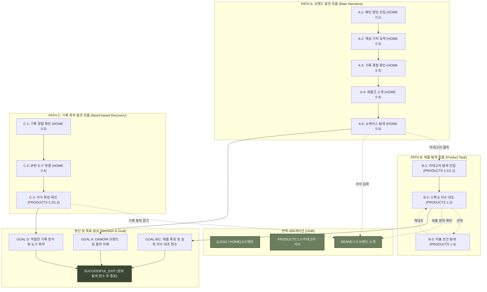

# 03. DAMORI V4 통합 서비스 흐름도 V1 (Service Flow Baseline)

- **단계**: `05-설계 (V4 파이프라인 Service Flow Baseline V1)`
- **버전**: `V1`
- **공식 브랜드명**: `DAMORI / 다모리`
- **상태**: `V4_SERVICE_FLOW_BASELINE_V1` (사용자 승인 공식 기준본)
- **저장 위치**: `V4-설계자료/03-v4-service-flow-v1.md`

---

## 1. 서비스 흐름 개요

### 1.1 최종 경험 목표
본 명세서는 **"브랜드를 소개하면서 제품군까지 설득력 있게 보여주는 포트폴리오형 랜딩 경험"**을 구현하기 위하여, 7인의 대표 가상 클라이언트(`V4-C01` ~ `V4-C07`)의 요구사항과 통합 사이트맵 V3(`HOME`, `PRODUCTS`, `BRAND`)을 기반으로 수립된 DAMORI 공식 통합 서비스 흐름도 V1 명세 문서이다.

### 1.2 Multi-entry Service Journey 정의
DAMORI 사이트는 모든 사용자가 `HOME`부터 시작하여 동일한 순서로 이동하는 단일 직선형 서비스가 아니다. 사용자마다 진입 목적과 관심사가 다르므로, 본 흐름도는 **3가지 주요 진입 경로 (PATH A, PATH B, PATH C)**와 **자율 교차 분기(Cross-path Branch)**를 갖춘 멀티 진입 서비스 여정으로 설계되었다.

---

## 2. 설계 근거

본 서비스 흐름도는 **Client Baseline V3**의 Pure User Need(10개 DN) 및 Requirement Pattern(8개 RG), **Site Map Baseline V3**의 3대 대표 Page Anchor(`HOME`, `PRODUCTS`, `BRAND`), 그리고 DAMORI Brand Core 철학을 융합하여 도출되었다. 
기존 3-B 청사진에서 발견된 DN-12/13 누락을 완벽히 복원하고, 강제 방문 및 자동 포커스 표현을 정제하여 순수한 사이트 수준 정보 탐색 동선으로 정제하였다.

---

## 3. 사용자 유형 및 시작 조건

| 진입 Path | 사용자 진입 목적 | 시작 진입점 | 대표 클라이언트 | 핵심 수용 가치 |
|---|---|---|---|---|
| **PATH A** | 브랜드 발견 및 이야기 이해 | `HOME 0.1` | `V4-C03 (하람)`, `V4-C06 (이준)` | DAMORI 브랜드 미션, 기록 철학, 결합 관점 |
| **PATH B** | 제품 사양 및 치수 탐색 | `PRODUCTS 1.1/1.2` | `V4-C01 (은재)`, `V4-C02 (지안)`, `V4-C04 (소담)`, `V4-C05 (태오)`, `V4-C07 (다온)` | 제본/지질 사양, 실측 치수 대조, 자율 탐색 |
| **PATH C** | 기록 방식 및 목적 발견 | `HOME 0.3` | `V4-C02`, `V4-C03`, `V4-C04`, `V4-C06` | 저부담 회고, 글 보존, 편안한 복귀 경험 |

---

## 4. 통합 Multi-entry Service Architecture

```text
DAMORI INTEGRATED SERVICE FLOW ARCHITECTURE
│
├─ [ENTRY PATH A: 브랜드 서사 중심 진입]
│  └─ HOME 0.1 ➔ 0.2 ➔ 0.3 ➔ 0.4 ➔ 0.5 (Portfolio Showcase)
│     ├─ [Branch A-1] ➔ PRODUCTS 1.2/1.3 (제품 탐색 전환)
│     ├─ [Branch A-2] ➔ BRAND 2.1 (브랜드 서사 심화)
│     ├─ [Branch A-3] ➔ HOME 0.6 (푸터 탐색 계속)
│     └─ [Branch A-4] ➔ SUCCESSFUL_EXIT
│
├─ [ENTRY PATH B: 제품 탐색 직접 진입]
│  └─ PRODUCTS 1.1/1.2 ➔ 1.3 (스펙/치수 대조) ➔ (선택 1.4 자율 탐색) ➔ Goal
│     ├─ [Branch B-1] ➔ BRAND 2.6 (DAMORI 제품 원칙 확인)
│     ├─ [Branch B-2] ➔ PRODUCTS 1.2 (다른 제품군 계속 탐색)
│     ├─ [Branch B-3] ➔ HOME (메인 이동)
│     └─ [Branch B-4] ➔ SUCCESSFUL_EXIT
│
└─ [ENTRY PATH C: 기록 목적 발견 진입]
   └─ HOME 0.3 (기록 경험) ➔ 0.4 (제품군 소개) ➔ PRODUCTS 1.2/1.3 ➔ Goal
      ├─ [Branch C-1] ➔ BRAND 2.3 (기록 철학 심화)
      ├─ [Branch C-2] ➔ PATH B (제품 탐색 확장)
      └─ [Branch C-3] ➔ SUCCESSFUL_EXIT
```

---

## 5. Path A — 브랜드 발견 흐름

- **목적**: DAMORI 브랜드를 처음 접하거나 전체 포트폴리오 랜딩 흐름을 감상하려는 사용자를 위한 서사 경로.
- **Normal Flow**: `HOME 0.1 ➔ 0.2 ➔ 0.3 ➔ 0.4 ➔ 0.5 ➔ Goal / Branch`

| Step | 사용자 행동 | 사이트 처리 / 정보 제공 | Page / Section | 판단 조건 / 분기 | Next Step |
|---|---|---|---|---|---|
| **A-1** | 메인 랜딩 접속 | DAMORI 존재 이유 및 쉼표 메시지 제공 | `HOME 0.1` | 브랜드 첫인상 | `HOME 0.2` |
| **A-2** | 서사 스크롤 | 사색의 깊이, 보존성, 자율성 가치 요약 | `HOME 0.2` | 서사 읽기 | `HOME 0.3` |
| **A-3** | 기록 경험 확인 | 저부담 회고, 글 보존, 편안한 복귀 경험 소개 | `HOME 0.3` | 경험 심화? | YES: PATH C / NO: `HOME 0.4` |
| **A-4** | 제품 라인업 둘러보기 | 아날로그 & 디지털 하이브리드 결합 소개 | `HOME 0.4` | 카테고리 클릭? | YES: PATH B / NO: `HOME 0.5` |
| **A-5** | 쇼케이스 탐색 | 대표 Product 최소 15개 수용 영역 제공 | `HOME 0.5` | 상세 확인 | DECISION |
| **A-6** | 브랜드 이해 달성 | 사이트 수준 정보 이해 완수 (`GOAL-A`) | `HOME 0.5` | 탐색 종료 또는 이동 | Branch 선택 |

---

## 6. Path B — 제품 탐색 흐름

- **목적**: 특정 기록 도구나 제품 사양/치수를 신속히 탐색하려는 목적 중심 사용자 경로.
- **Normal Flow**: `PRODUCTS 1.1 ➔ 1.2 ➔ 1.3 ➔ Goal / Branch`

| Step | 사용자 행동 | 사이트 처리 / 정보 제공 | Page / Section | 판단 조건 / 분기 | Next Step |
|---|---|---|---|---|---|
| **B-1** | 제품 탐색 진입 | 카테고리 비주얼 및 탐색 갤러리 노출 | `PRODUCTS 1.1/1.2` | 직접 진입 | `PRODUCTS 1.3` |
| **B-2** | 스펙 & 치수 대조 | 소재, 평면 펼침, 번짐 저감, 실측 치수 정보 제공 | `PRODUCTS 1.3` | 정보 확인 | DECISION |
| **B-3** | 자율 범위 좁히기 | 사용자 기준 자율 조건 좁히기 정보 제공 | `PRODUCTS 1.4` | 추가 좁히기? | YES: `PRODUCTS 1.3` / NO: Step B-4 |
| **B-4** | 제품/사양 이해 달성 | 자신에게 적합한 제품 후보 판단 (`GOAL-B`, `GOAL-C`) | `PRODUCTS` | 판단 완수 | Branch 선택 |

---

## 7. Path C — 기록 목적 발견 흐름

- **목적**: "어떤 방식으로 기록하는 것이 좋을까?"를 고민하는 사용자에게 기록 습관 및 방식을 안내하는 경로.
- **Normal Flow**: `HOME 0.3 ➔ 0.4 ➔ PRODUCTS 1.2 ➔ 1.3 ➔ Goal / Branch`

| Step | 사용자 행동 | 사이트 처리 / 정보 제공 | Page / Section | 판단 조건 / 분기 | Next Step |
|---|---|---|---|---|---|
| **C-1** | 경험 섹션 확인 | 저부담 회고, 글 보존, 미안함 없는 복귀 경험 제시 | `HOME 0.3` | 기록 목적 발견 | `HOME 0.4` |
| **C-2** | 관련 도구 연결 | 해당 경험과 관련된 제품군 및 서식 관계 소개 | `HOME 0.4` | 제품군 이동 | `PRODUCTS 1.2` |
| **C-3** | 서식 특징 확인 | 선택한 기록 방식에 맞는 서식/제품 특징 안내 | `PRODUCTS 1.2/1.3` | 스펙 대조 | DECISION |
| **C-4** | 기록 방식 이해 달성 | 적합한 기록 방식 및 도구 파악 (`GOAL-D`) | `PRODUCTS 1.3` | 이해 완수 | Branch 선택 |

---

## 8. Cross-path Branch (공식 자율 교차 규칙)

- **`A ➔ B`**: `HOME 0.4/0.5`에서 특정 제품군이나 쇼케이스 선택 시 `PRODUCTS 1.2/1.3`으로 이동.
- **`A ➔ BRAND`**: `HOME 0.2`에서 브랜드 서사를 깊이 읽고자 할 때 `BRAND 2.1`로 이동.
- **`B ➔ BRAND`**: `PRODUCTS 1.3`에서 제품 스펙 확인 후 도구를 바라보는 원칙이 궁금할 때 `BRAND 2.6`으로 이동.
- **`B ➔ A`**: 제품 탐색 후 전체 브랜드 랜딩 감상을 위해 `HOME`으로 이동.
- **`C ➔ B`**: `HOME 0.3`에서 회고/복귀 경험 파악 후 관련 제품군 탐색을 위해 `PRODUCTS 1.2`로 이동.
- **`C ➔ BRAND`**: 기록 경험 파악 후 "의무가 아닌 쉼표" 기록 철학을 읽고자 할 때 `BRAND 2.3`으로 이동.
- **`BRAND ➔ PRODUCTS`**: 브랜드 철학 확인 후 관련 제품군을 둘러보기 위해 `PRODUCTS`로 이동.
- **`BRAND ➔ HOME`**: 브랜드 페이지 감상 후 메인 랜딩으로 복귀.

---

## 9. Client별 Service Journey (7인 전원)

1. **`V4-C01 (은재 - 장문 사색)`**: `PRODUCTS 1.3` 진입 ➔ 제본/지질/실측 치수 대조 ➔ (선택) `BRAND 2.6` 제품 원칙 확인 ➔ **목표 달성 (`DIRECT`)**
2. **`V4-C02 (지안 - 일정 통제)`**: `PRODUCTS 1.2` 진입 ➔ 세로 타임라인 서식 특성 파악 ➔ `PRODUCTS 1.3` 스펙 확인 ➔ **목표 달성 (`INFORMATIONAL`)**
3. **`V4-C03 (하람 - 저부담 회고)`**: `HOME 0.3` 진입 (Path C) ➔ 저부담 회고 경험 파악 ➔ `PRODUCTS 1.2` 간결 회고 서식 확인 ➔ **목표 달성 (`EXPERIENCE_PREVIEW`)**
4. **`V4-C04 (소담 - 글 보존)`**: `PRODUCTS 1.3` 진입 ➔ 글-서식 레이어 분리 보존 구조 파악 ➔ `HOME 0.3` 보존 경험 확인 ➔ **목표 달성 (`INFORMATIONAL`)**
5. **`V4-C05 (태오 - 오프라인 캐시)`**: `PRODUCTS 1.3` 진입 ➔ 오프라인 캐시 및 로컬 소장 시스템 지원 안내 확인 ➔ **목표 달성 (`INFORMATIONAL`)**
6. **`V4-C06 (이준 - 기록 복귀)`**: `HOME 0.3` 진입 (Path A) ➔ 죄책감 없는 복귀 경험 파악 ➔ `BRAND 2.3` 기록 철학 읽기 ➔ **목표 달성 (`EXPERIENCE_PREVIEW`)**
7. **`V4-C07 (다온 - 자율 조건 탐색)`**: `PRODUCTS 1.4` 진입 ➔ 사용자 기준 자율 좁히기 ➔ `PRODUCTS 1.3` 실측 치수 1:1 대조표 탐색 ➔ **목표 달성 (`DIRECT`)**

---

## 10. 정상 흐름 (Normal Flow Summary)

모든 정상 흐름은 **[ENTRY ➔ PAGE/SECTION ➔ DECISION ➔ SITE-LEVEL GOAL ➔ SUCCESSFUL_EXIT]** 구조를 준수하며, 결제, 장바구니, 실제 파일 저장 등 포트폴리오 웹사이트 범위를 벗어나는 동작을 포함하지 않는다.

---

## 11. Branch Flow

각 Step에서 사용자는 GNB 상단 내비게이션(`[LOGO / HOME] | PRODUCTS | BRAND`) 및 섹션 내 링크를 통해 언제든지 다른 Page 및 Section으로 자율 분기할 수 있다.

---

## 12. Empty State

- **상황**: 사용자 자율 탐색 시 탐색 조건에 맞는 제품 후보가 부족한 경우.
- **대응**: 가입이나 진단을 강요하지 않으며, "전체 제품군 둘러보기" 또는 "전체 스펙 대조표 확인" 유연 안내를 제공함.

---

## 13. Error State

- **상황**: 네트워크 문제로 비주얼 이미지 또는 콘텐츠 로드가 실패한 경우 (`IMAGE_LOAD_ERROR`, `CONTENT_LOAD_ERROR`).
- **대응**: 이미지 대체 텍스트(alt text) 및 비주얼 그레이박스 안내를 표시하며, 상위 내비게이션 복귀 경로를 제공함.

---

## 14. Exit Flow

- **`SUCCESSFUL_EXIT`**: 사용자가 필요한 브랜드 정보, 제품 스펙, 실측 치수 대조를 완수하고 웹사이트를 떠나는 정당한 종료.
- **`EARLY_EXIT`**: 사용자가 원하는 정보를 찾기 전 이탈하는 경우 (자연스러운 포트폴리오 랜딩 이탈로 수용).

---

## 15. Re-entry Flow

재방문 사용자는 GNB 상단 앵커를 통해 `HOME`, `PRODUCTS`, `BRAND` 중 원하는 지점으로 언제든 직접 재진입할 수 있다. (로그인 기반 작성 상태 복원 기능은 배제됨).

---

## 16. Page / Section Coverage

- **`HOME / MAIN`**: `0.1 First Impression`, `0.2 Brand Core Summary`, `0.3 Recording Experience`, `0.4 Product Groups Intro`, `0.5 Portfolio Showcase`, `0.6 Navigation & Footer` (6개 섹션 100% 수용)
- **`PRODUCTS / CATEGORY-SUB`**: `1.1 Visual Hero`, `1.2 Product Group Exploration`, `1.3 Product Feature & Specification`, `1.4 User-led Exploration` (4개 섹션 100% 수용)
- **`BRAND`**: `2.1 DAMORI Introduction`, `2.2 Brand Existence & Purpose`, `2.3 Recording Philosophy`, `2.4 Core Values & User Value`, `2.5 Analog & Digital Principle`, `2.6 Product Principle` (6개 섹션 100% 수용)

---

## 17. DN / RG Traceability (10 Pure DNs & 8 RGs)

| Pure DN ID | 관련 RG ID | 대표 Client | 주 반영 Path | 주 반영 Page/Section | Service Flow 반영 형태 |
|---|---|---|:---:|---|---|
| **DN-01** | `RG-01` | `V4-C01` | Path B, Path A | `PRODUCTS 1.3`, `BRAND 2.6` | 평면 펼침 제본 & 지질 스펙 대조 뷰 |
| **DN-02** | `RG-02` | `V4-C02` | Path B, Path C | `PRODUCTS 1.2`, `1.3` | 세로 타임라인 서식 특성 파악 안내 |
| **DN-03** | `RG-03` | `V4-C03` | Path A, Path C | `HOME 0.3`, `PRODUCTS 1.2` | 저부담 회고 경험 미리보기 및 양식 안내 |
| **DN-04** | `RG-04` | `V4-C04` | Path B, Path C | `PRODUCTS 1.3`, `HOME 0.3` | 글 원본 데이터 보존 서식 정보 제공 |
| **DN-05** | `RG-05` | `V4-C05` | Path B | `PRODUCTS 1.3` | 로컬 백업 지원 시스템 특성 안내 |
| **DN-06** | `RG-06` | `V4-C06` | Path A, Path C | `HOME 0.3`, `BRAND 2.3` | 죄책감 없는 기록 복귀 철학 전달 |
| **DN-07** | `RG-07` | `V4-C07` | Path B | `PRODUCTS 1.4` | 사용자 기준 자율 좁히기 정보 제공 |
| **DN-08** | `RG-08` | `V4-C07` | Path B | `PRODUCTS 1.3` | 소재/제본/치수 1:1 대조표 제공 |
| **DN-12** | `RG-06 관련` | `V4-C06` | Path A, Path C | `HOME 0.3`, `BRAND 2.3` | 스트릭 경고 차단 미안함 없는 기록 철학 |
| **DN-13** | `RG-04 관련` | `V4-C04` | Path B, Path C | `PRODUCTS 1.3` | 스티커/프레임 독립 레이어 보존 안내 |

---

## 18. Design Opportunity (후속 화면설계 후보)

1. `검색/탐색 기능 후보`: 전역 검색 레이어 모듈 (`HOLD_DESIGN_OPPORTUNITY`)
2. `사용자 기준 탐색 UI 후보`: 자율 조건 탐색 매트릭스 UI
3. `제품 비교 UI 후보`: 소재 & 치수 1:1 대조 비교표 UI
4. `회고 경험 표현 UI 후보`: 저부담 시각 회고 미리보기 UI
5. `복귀 경험 표현 UI 후보`: 복귀 응원 밴드 및 포커스 안내 UI

---

## 19. 가정 및 범위 밖 기능

- **범위 밖 기능 (OUT OF SCOPE)**: 회원가입, 로그인, 마이페이지, 장바구니, 결제/주문, 실제 데이터 저장 및 PDF/CSV 파일 다운로드 실행, 캘린더 실시간 조작.
- **가정사항**: 본 웹사이트는 비판매 포트폴리오형 랜딩 사이트로 운영되며, 대표 Product 최소 15개 수용 Showcase 구조를 가짐.

---

## 20. Mermaid Flowchart



---

## 21. 검토 결과

- **누락 검증**: 10개 Pure DN(`DN-01~08, 12, 13`) 및 8개 RG(`RG-01~08`)의 Traceability가 100% 완벽하게 추적 검증됨.
- **새 Page 검사**: 공식 Page Anchor 3개(`HOME`, `PRODUCTS`, `BRAND`) 이외의 임의 신규 페이지 생성이 0건임.
- **GNB & Search**: SEARCH 노드가 공식 1차 GNB 및 Flow Node에서 완벽히 배제됨.
- **정합성**: 21개 필수 목차 및 7인 대표 클라이언트의 Site-level Journey가 완벽히 대응됨.
