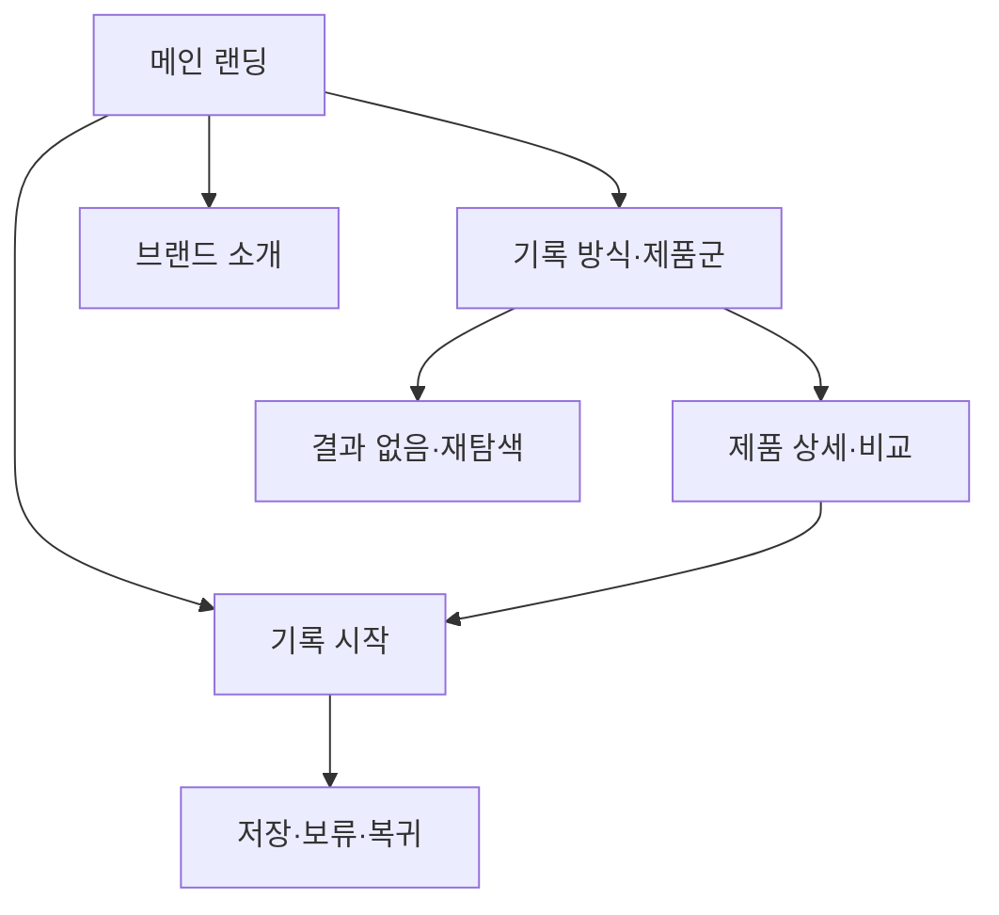

# VC-01 은재 — 사이트구조맵 A안 V2

## 1. 통합 분석·Client 근거

- Client: VC-01 은재 / 아날로그 장문 기록
- 통합 분석 기준: 브랜드 정보·사용자 유형·사용자 목표·주요 기능·콘텐츠를 검토한 뒤 개별 Client 요구를 우선 반영
- 핵심 목표: 긴 글을 부담 없이 시작하고 일정·회고·제품 탐색을 기록 흐름으로 연결
- Client 요구: REQ-001
- 제품 연결: PROD-001·002·003·031·032·033·061·062·063·064·095
- 대표 15개 선정: 미실행

## 2. 사이트구조맵 분석 결과

| Client 요구·REQ | 메뉴 | 콘텐츠 | 기능 | 연결 페이지 | 근거/가정 |
|---|---|---|---|---|---|
| 긴 글 기록 시작·REQ-001 | 기록 방식·제품군 | 장문 기록 예시·제품군 | 목적 선택·비교·보류 | 제품 상세·기록 시작 | V4 Client 근거 |
| 기록 맥락 유지·REQ-001 | 메인 랜딩 | 일정·회고 연결 콘텐츠 | 앵커 이동·복귀 | 기록 시작 | 제품 후보 연결 |

## 3. 사이트맵

- 1차: 메인 랜딩 / 기록 방식·제품군 / 브랜드 소개 / 기록 시작
  - 2차 메인: Hero / 핵심 가치 / 제품 레일 / 기록 방식 / Footer
  - 2차 기록 방식·제품군: 장문 기록 / 일정·회고 / 아날로그·디지털 연결 / 비교 가이드
    - 3차: 제품 목록 / 제품 상세 / 제품 비교 / 사용 상황·기록 예시
  - 2차 브랜드 소개: 브랜드 방향 / 제작 과정 / 기록 철학 / 제품과 콘텐츠 관계
  - 2차 기록 시작: 목적 선택 / 방식 선택 / 첫 기록 / 저장·보류

## 4. 상태·여정·예외

- 공통: Header·전역 메뉴·검색·현재 위치·Footer
- 상태: 비회원 탐색(가정), 비교·보류, 기록 진행, 저장·복귀(가정)
- 여정: 메인 → 기록 목적 → 제품군 → 비교·보류 → 기록 시작
- 예외: 결과 없음, 저장 실패, 취소, 이전 위치 복귀

## 5. Mermaid

## 6. 검증·파일 용도

- MD·MMD Mermaid 코드: 일치
- SVG: 동일 노드·연결의 벡터 표현, 한글 폰트 대체 포함
- 누락·중복·끊긴 연결: 1차 점검 완료
- 상대 경로: `04-사이트구조맵-출력물/VC-01-은재-사이트구조맵-V2/`
- 파일 용도: MD 분석·검증, MMD 재사용, SVG 시각 확인
