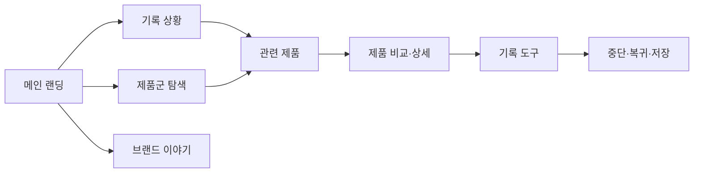

# VC-01 은재 — 사이트구조맵 B안 V2

## 통합 분석·Client 근거

- 기준: 통합 브랜드·사용자·콘텐츠 분석 후 VC-01 요구 우선
- 요구·REQ: 장문 기록 맥락 유지 / REQ-001
- 제품 연결: PROD-001·002·003·031·032·033·061·062·063·064·095
- 대표 15개: 미실행

## 사이트구조맵 분석 결과

| 요구·REQ | 메뉴 | 콘텐츠 | 기능 | 연결 | 근거/가정 |
|---|---|---|---|---|---|
| 상황을 이해한 뒤 선택·REQ-001 | 기록 상황 | 장문·일정·회고 사례 | 상황 선택·제품 연결 | 관련 제품 | Client V4 근거 |
| 기록 흐름 유지·REQ-001 | 기록 도구 | 시작·진행·복귀 | 저장·중단·복귀 | 메인·상세 | 일부 상태 가정 |

## 사이트맵

- 1차: 메인 랜딩 / 기록 상황 / 제품군 탐색 / 브랜드 이야기 / 기록 도구
  - 2차 기록 상황: 오래 쓰는 기록 / 일정과 메모 / 다시 시작 / 기록 예시
  - 2차 제품군 탐색: 장문 기록 / 일정 연결 / 회고·리뷰 / 비교 허브
    - 3차: 상황 콘텐츠 / 관련 제품 / 제품 상세·비교
  - 2차 브랜드 이야기: 방향 / 제작 과정 / 기록 철학 / 포트폴리오
  - 2차 기록 도구: 시작 / 진행 / 보류 / 복귀

## 상태·여정·예외

- 공통: Header·검색·현재 위치·Footer
- 상태: 비회원 탐색(가정), 비교, 기록 진행, 보류·복귀
- 여정: 상황 콘텐츠 → 관련 제품 → 비교 → 기록 도구
- 예외: 제품 없음, 비교 취소, 기록 중단, 저장 실패

## Mermaid

## 검증·경로

- MD·MMD 일치, SVG 동일 연결 확인
- 중복·끊긴 링크 1차 점검
- 경로: `04-사이트구조맵-출력물/VC-01-은재-사이트구조맵-V2/`
