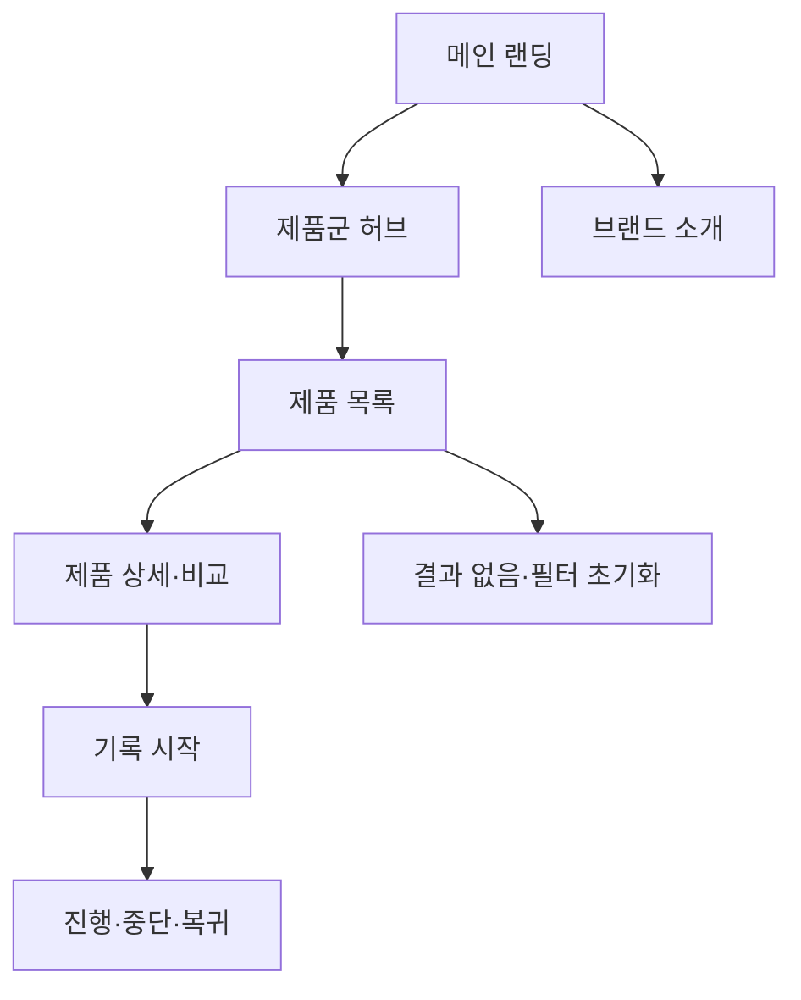

# VC-01 은재 — 사이트구조맵 C안 V2

## 통합 분석·Client 근거

- 기준: 통합 분석을 바탕으로 VC-01의 긴 기록·제품군 탐색 요구를 우선 반영
- 요구·REQ: 기록 시작과 제품군 이해 / REQ-001
- 제품 연결: PROD-001·002·003·031·032·033·061·062·063·064·095
- 대표 15개: 미실행

## 사이트구조맵 분석 결과

| 요구·REQ | 메뉴 | 콘텐츠 | 기능 | 연결 | 근거/가정 |
|---|---|---|---|---|---|
| 제품군 전체 방향·REQ-001 | 제품군 허브 | 장문·일정·회고·전환 | 카테고리·비교 | 상세·기록 | 제품 후보 분석 |
| 기록 진입·REQ-001 | 메인/기록 시작 | 사용 장면·목적 선택 | CTA·중단·복귀 | 제품 상세 | Client V4 |

## 사이트맵

- 1차: 메인 랜딩 / 제품군 허브 / 브랜드 소개 / 기록 시작
  - 2차 메인: Hero / 제품군 미리보기 / 사용 장면 / 기록 CTA / 브랜드 요약
  - 2차 제품군 허브: 장문 기록 / 일정·메모 / 회고·리뷰 / 아날로그·디지털 전환
    - 3차: 제품 목록 / 제품 상세 / 비교 / 관련 콘텐츠
  - 2차 브랜드 소개: 방향 / 제작·재료 / 포트폴리오 / 제품 관계
  - 2차 기록 시작: 목적·분량 / 방식 / 시작 / 중단·복귀

## 상태·여정·예외

- 공통: Header·검색·브레드크럼·Footer
- 상태: 신규 탐색, 비교, 기록 진행, 보류·복귀(일부 가정)
- 여정: 메인 → 제품군 허브 → 상세·비교 → 기록 시작
- 예외: 결과 없음, 필터 초기화, 비교 부족, 취소·복귀

## Mermaid

## 검증·경로

- MD·MMD 일치, SVG 동일 연결 확인
- 포트폴리오 탐색과 판매 목적 구분 필요를 기록
- 경로: `04-사이트구조맵-출력물/VC-01-은재-사이트구조맵-V2/`
