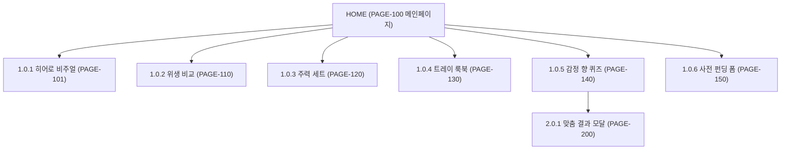

# 🗺️ SOAPHE (이지은 CD) 사이트맵 명세서

---

## 📌 1. 프로젝트 개요 및 설계 목적
- **프로젝트명:** SOAPHE (소피) 웰니스 오브제 데스크톱 메인페이지 & 감정 향 퀴즈
- **클라이언트:** 클라이언트 2. 이지은 리드 크리에이티브 디렉터
- **핵심 목표:** 웰니스 비누 + 오브제형 트레이 세트 사전 펀딩(30% 할인 + 각인) 및 1:1 감정 향 추천 퀴즈 유도.

---

## 📐 2. 설계 근거 및 핵심 사용자 목표

### 설계 근거 (Design Rationale)
1. **웰니스 오브제 미학:** 비누 받침대의 물 고임/짓무름 불편을 감각적인 조형 물 빠짐 오브제형 트레이로 해결.
2. **1:1 감정 향 큐레이션:** 3단계 감정 문진 퀴즈를 통한 사용자 정서 진단 후 맞춤 향 & 트레이 세트 추천.
3. **지속가능한 공간 오브제:** 세면대 ➔ 데스크 명함/주얼리 보관 트레이 변신 룩북 제공.

---

## 🌳 3. 계층형 사이트맵 (Hierarchy Taxonomy)

### 1차 Depth: 메인페이지 (`PAGE-100`)
- **2차 Depth: 1.0 메인 바디 영역**
  - **3차 Depth 1.0.1:** `PAGE-101` 히어로 비주얼 (웰니스 비누 + 오브제형 트레이 세트 3D)
  - **3차 Depth 1.0.2:** `PAGE-110` 위생 비교 (물고임 무름 ↔ 조형 물 빠짐 트레이)
  - **3차 Depth 1.0.3:** `PAGE-120` 주력 세트 스펙 (비누+오브제 트레이 360도 뷰)
  - **3차 Depth 1.0.4:** `PAGE-130` 트레이 변신 룩북 (세면대 ↔ 데스크 주얼리 보관)
  - **3차 Depth 1.0.5:** `PAGE-140` 감정 향 퀴즈 (1:1 정서 진단 문진)
  - **3차 Depth 1.0.6:** `PAGE-150` 사전 펀딩 폼 (30% 할인 사전 펀딩 신청)

### 1차 Depth: 맞춤 결과 모달 (`PAGE-200`)
- **2차 Depth: 2.0 완료 결과 카드**
  - **3차 Depth 2.0.1:** `PAGE-200` 1:1 맞춤 향 & 오브제 트레이 세트 추천 카드 레이어

---

## 🔄 4. Mermaid 사이트맵 코드

