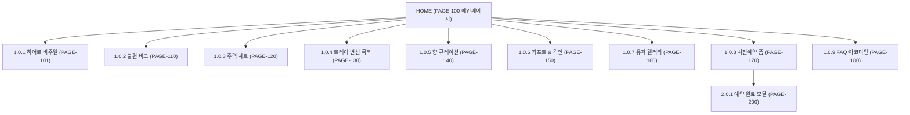

# 🗺️ SOAPHE (한수진 대표) 사이트맵 명세서

---

## 📌 1. 프로젝트 개요 및 설계 목적
- **프로젝트명:** SOAPHE (소피) 라이프스타일 뷰티 데스크톱 메인페이지 & 사전예약
- **클라이언트:** 클라이언트 1. 한수진 대표 (SOAPHE 브랜드 총괄)
- **핵심 목표:** 기존 비누 받침대의 무름/찌꺼기 관리를 조형 물 빠짐 오브제형 트레이로 해결하고, 주 상품인 '비누 + 오브제형 트레이 세트'의 사전예약(35% 할인 + 각인 혜택) 전환 유도.

---

## 📐 2. 설계 근거 및 핵심 사용자 목표

### 설계 근거 (Design Rationale)
1. **문제 해결 중심 포지셔닝:** 기존 받침대의 미관 저해 및 위생 불쾌감을 감각적인 물 빠짐 오브제형 트레이로 깔끔하게 해소.
2. **주력 상품 결합 하이라이트:** 단품 판매가 아닌 '비누 + 오브제형 트레이 스타터 세트'를 메인 히어로 및 Primary CTA 목표로 설정.
3. **지속가능한 공간 오브제:** 비누 소진 후 세면대 ➔ 데스크 명함, 반지, 차 키 보관 트레이 변신 룩북 제시.
4. **직관적 향 정보 시각화:** Top/Middle/Base 향 노트 및 향 강도 프로필을 3종 스펙트럼 필터로 제공.

### 핵심 사용자 목표 (User Goals)
- **일반 방문자 (2030 직장인/1인 가구):** 욕실 인테리어를 높이는 오브제형 트레이와 실패 없는 비누 향을 확인하고 35% 할인 혜택으로 사전예약 신청.
- **선물 구매자:** 카카오톡 선물하기 및 집들이/생일 선물용 럭셔리 포장 키트와 이니셜 각인 서비스를 확인.

---

## 🌐 3. 전역 내비게이션 구조 (GNB)

- **브랜드 로고:** SOAPHE (클릭 시 메인 `PAGE-100` 톱으로 이동)
- **메인 내비게이션 메뉴:**
  1. `브랜드 스토리` (`PAGE-100#story`)
  2. `오브제 트레이` (`PAGE-100#tray`)
  3. `비누 라인업` (`PAGE-100#lineup`)
  4. `향 가이드` (`PAGE-100#scent`)
  5. `사전예약 35%` (`PAGE-170` Primary CTA 버튼)
- **보조 유틸리티:** Sticky 사전예약 Floating 바 (`PAGE-170` 이동)

---

## 🌳 4. 계층형 사이트맵 (Hierarchy Taxonomy)

### 1차 Depth: 메인페이지 (`PAGE-100`)
- **2차 Depth: 1.0 메인 바디 영역**
  - **3차 Depth 1.0.1:** `PAGE-101` 히어로 비주얼 (비누 + 오브제형 트레이 세트 3D)
  - **3차 Depth 1.0.2:** `PAGE-110` 위생/불편 비교 (받침대 찌꺼기 ↔ 오브제 트레이 물 빠짐)
  - **3차 Depth 1.0.3:** `PAGE-120` 주력 세트 스펙 (트레이 1EA + 비누 3종 360도 뷰)
  - **3차 Depth 1.0.4:** `PAGE-130` 트레이 변신 룩북 (세면대 ↔ 데스크 명함/주얼리 보관)
  - **3차 Depth 1.0.5:** `PAGE-140` 향 큐레이션 가이드 (3종 향 노트 스펙트럼)
  - **3차 Depth 1.0.6:** `PAGE-150` 기프트 & 각인 (보자기 포장 & 이니셜 각인)
  - **3차 Depth 1.0.7:** `PAGE-160` 유저 인증 갤러리 (2030 공간 인테리어 인증샷)
  - **3차 Depth 1.0.8:** `PAGE-170` 사전예약 신청 폼 (35% 할인 + 각인 혜택 폼)
  - **3차 Depth 1.0.9:** `PAGE-180` FAQ 아코디언 (물 빠짐 관리 및 스펙 FAQ)

### 1차 Depth: 사전예약 완료 모달 (`PAGE-200`)
- **2차 Depth: 2.0 완료 확인 모달**
  - **3차 Depth 2.0.1:** `PAGE-200` 사전예약 완료 확인 레이어 (티켓 발급 & 카톡 알림 신청)

---

## 📑 5. 페이지 명세표 (Page Specification Table)

| 페이지 ID | 페이지명 | 계층 | 목적 | 핵심 콘텐츠 | 주요 기능 & UI 요소 | 연결 페이지 |
| :--- | :--- | :--- | :--- | :--- | :--- | :--- |
| `PAGE-100` | 메인 랜딩 | 1차 (공통) | SOAPHE 브랜드 정체성 전달 및 사전예약 유도 | 메인 히어로, 위생비교, 세트소개, 향가이드, 사전예약 | GNB, Sticky CTA, 스크롤 인디케이터 | `PAGE-101`~`PAGE-180` |
| `PAGE-101` | 히어로 비주얼 | 3차 (공통) | 메인 시각적 첫인상 형성 | 비누 + 오브제형 트레이 세트 3D 컷 | 3D 조형 모션 뷰어, 사전예약 숏컷 | `PAGE-170` |
| `PAGE-110` | 불편 비교 섹션 | 3차 (공통) | 문제 정의 및 솔루션 제시 | 받침대 찌꺼기 ↔ 오브제 트레이 물 빠짐 대조 | Before/After 슬라이더, 혜택 카드 | `PAGE-120` |
| `PAGE-120` | 주력 세트 섹션 | 3차 (공통) | 주 상품 세트 가치 각인 | 트레이 1EA + 비누 3종 구성품 스펙 | 360도 회전 뷰어, 세트 옵션표 | `PAGE-170` |
| `PAGE-130` | 트레이 변신 룩북 | 3차 (공통) | 지속가능한 공간 활용성 전달 | 세면대 위 컷 vs 데스크 명함/주얼리 보관 컷 | `세면대` ↔ `데스크` 2단 스위칭 탭 | `PAGE-140` |
| `PAGE-140` | 향 큐레이션 가이드 | 3차 (공통) | 직관적 향 정보 전달 | Top/Middle/Base 향 노트, 향 강도 지표 | 3종 향 스펙트럼 필터 UI | `PAGE-170` |
| `PAGE-150` | 기프트 & 각인 | 3차 (공통) | 선물용 소장 가치 극대화 | 럭셔리 포장 키트 컷, 이니셜 각인 프리뷰 | 캘리그라피 이니셜 각인 입력 폼 | `PAGE-170` |
| `PAGE-160` | 유저 인증 갤러리 | 3차 (공통) | 소셜 프루프 구축 | 2030 유저 실사용 인스타그램 공간 사진 | 마우스 오버 팝업, SNS 링크 | `PAGE-170` |
| `PAGE-170` | 사전예약 신청 폼 | 3차 (공통) | 사전예약 정보 수집 및 전환 | 35% 할인 타이머, 성함/연락처/향 선택 폼 | 유효성 검사 폼, 사전예약 제출 버튼 | `PAGE-200` |
| `PAGE-180` | FAQ 아코디언 | 3차 (공통) | 이탈 방지 및 우려 해소 | 물 빠짐 관리, 트레이 재질 FAQ | 아코디언 토글 인터랙션 | `PAGE-170` |
| `PAGE-200` | 예약 완료 모달 | 2차 (결과) | 예약 확정 안내 | 예약 번호 티켓, 혜택 안내, 카톡 알림 신청 | 카카오톡 알림 버튼, 확인 닫기 | `PAGE-100` |

---

## 🏷️ 6. 공통 / 회원 상태 / 예외 영역 구분 명세

- **공통 영역 (Global):** GNB (`PAGE-100` 상단 고정), 하단 푸터, Sticky 사전예약 Floating CTA 바
- **회원 상태별 영역:** 회원가입이 필요 없는 비회원 전용 10초 간편 예약 폼 일관 적용
- **예외 영역 (Exception):** 폼 미입력 시 `PAGE-170` 인라인 경고 문구 및 사전예약 완료 모달(`PAGE-200`)

---

## 🔄 7. Mermaid 사이트맵 코드

