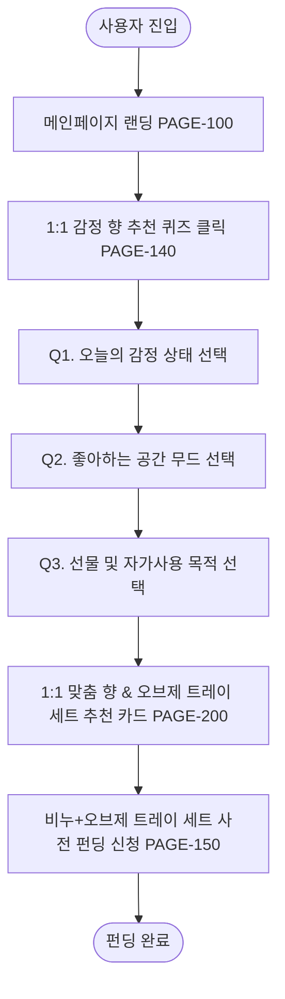

# 🔄 SOAPHE (이지은 CD) 서비스 흐름도 명세서

---

## 📌 1. 서비스 흐름 개요
- **목적:** 방문자가 감정 향 추천 퀴즈(`PAGE-140`)를 진행하고, 1:1 맞춤 추천 결과(`PAGE-200`)를 확인한 후 사전 펀딩(`PAGE-150`)을 완료하는 웰니스 서비스를 정의함.

---

## 📑 2. 단계별 상세 흐름 명세표 (Flow Step Matrix)

| 단계 | 단계명 | 사용자 행동 | 시스템 처리 | 표시 화면 ID | 다음 진입 조건 |
| :--- | :--- | :--- | :--- | :--- | :--- |
| **01** | 진입 | 메인 URL 접속 | 웰니스 3D 트레이 비주얼 및 GNB 렌더링 | `PAGE-100` | 퀴즈 버튼 클릭 |
| **02** | 퀴즈 시작 | `향 추천 퀴즈 시작` 클릭 | `PAGE-140` 감정 퀴즈 위치로 포커스 이동 | `PAGE-140` | 질문 응답 |
| **03** | 감정 선택 | 퀴즈 라디오 선택 | 1:1 맞춤 향 및 오브제 트레이 세트 알고리즘 매칭 | `PAGE-140` | 결과 버튼 클릭 |
| **04** | 결과 확인 | `추천 결과 확인` 클릭 | 맞춤 결과 모달(`PAGE-200`) 오버레이 노출 | `PAGE-200` | 펀딩 이동 클릭 |
| **05** | 펀딩 작성 | `사전 펀딩 신청` 클릭 | `PAGE-150` 사전 펀딩 폼으로 이동 (30% 할인) | `PAGE-150` | 폼 작성 제출 |
| **06** | 완료 | `펀딩 제출` 클릭 | 유효성 검사 성공 후 완료 모달 노출 | `PAGE-200` | 확인 닫기 |

---

## 🔄 3. Mermaid 전체 서비스 흐름도

