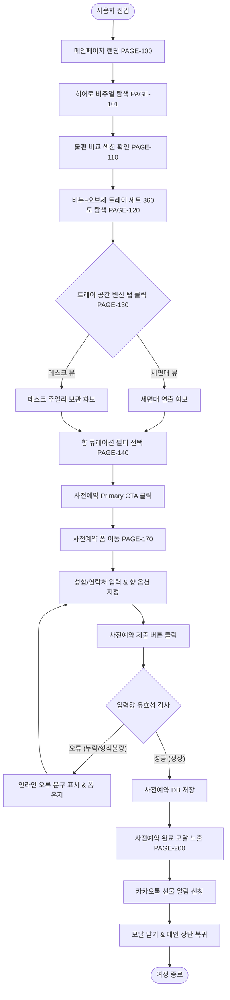

# 🔄 SOAPHE (한수진 대표) 서비스 흐름도 명세서

---

## 📌 1. 서비스 흐름 개요
- **목적:** 방문자가 SOAPHE 브랜드의 해결책(오브제형 트레이)과 주력 상품(비누+오브제 트레이 세트)을 탐색하고, 사전예약(`PAGE-170` ➔ `PAGE-200`)까지 완수하는 전체 서비스 플로우를 명확히 정의함.
- **여정 원칙:** `탐색 → 문제 인식 → 세트 확인 → 향 선택 → 사전예약 입력 → 결과 확인` 순의 직관적 흐름 준수.

---

## 👤 2. 사용자 유형과 시작 조건

| 구분 | 상세 명세 |
| :--- | :--- |
| **사용자 유형** | - **일반 타깃 (2030 직장인/1인 가구):** 욕실 인테리어 및 비누 무름 관리를 목적으로 방문. - **선물 구매자:** 카카오톡 선물하기, 집들이 선물용 고급 세트를 검색하는 구매자. |
| **시작 조건** | SOAPHE 메인 URL 직접 접속 또는 인스타그램/29CM 광고 링크 클릭 (`PAGE-100`) |

---

## 🚀 3. 핵심 정상 흐름 (Happy Path)

1. **메인 진입 (`PAGE-100` / `PAGE-101`):** 메인 랜딩 진입 후 비누 + 오브제형 트레이 세트 3D 키 비주얼 확인.
2. **불편 해결 및 가치 인식 (`PAGE-110` / `PAGE-120`):** 받침대 찌꺼기 문제 대비 오브제 트레이 물 빠짐 구조와 세트 스펙 검토.
3. **트레이 변신 탐색 (`PAGE-130`):** 세면대 ↔ 데스크 명함/주얼리 보관 트레이 2단 스위칭 탭으로 공간 변신 확인.
4. **향 큐레이션 선택 (`PAGE-140`):** 시그니처 3종 향 노트 및 향 강도 필터 선택.
5. **사전예약 폼 이동 (`PAGE-170`):** Primary CTA(`사전예약 35% 혜택받기`) 클릭으로 폼 위치 스무스 스크롤 이동.
6. **정보 입력 및 제출 (`PAGE-170`):** 성함, 연락처, 향 옵션 입력 후 유효성 검사 통과 및 제출.
7. **예약 완료 (`PAGE-200`):** 사전예약 완료 모달 팝업이 노출되며, 티켓 발급 및 카카오톡 선물 알림 신청 완료.

---

## 🔀 4. 분기, 오류, 이탈, 재진입 흐름 (Branching & Exception Flows)

- **입력값 오류 분기:**
  - 성함/연락처 미입력 또는 11자리 번호 형식 오류 시 제출이 차단되고 폼 입력란 하단에 인라인 경고 문구(`* 올바른 휴대폰 번호 11자리를 입력해주세요`) 표시.
- **향 선택 변경 분기:**
  - 사전예약 제출 전 언제든 향 필터 탭(`PAGE-140`)을 재클릭하여 주력 세트 비누 향 선택 변경 가능.
- **이탈 및 재진입 흐름:**
  - 탐색 중 이탈 시도 시 화면 하단 고정 **Sticky Primary CTA 바**를 통해 1초 만에 `PAGE-170` 사전예약 폼 재진입 지원.
  - 사전예약 완료 모달(`PAGE-200`)에서 '확인 닫기'를 누르면 메인 랜딩(`PAGE-100`) 상단 복귀.

---

## 📑 5. 단계별 상세 흐름 명세표 (Flow Step Matrix)

| 단계 | 단계명 | 사용자 행동 (User Action) | 시스템 처리 (System Action) | 표시 화면 ID | 다음 진입 조건 |
| :--- | :--- | :--- | :--- | :--- | :--- |
| **01** | 진입 | 메인 URL 접속 | GNB 및 3D 조형 모션 렌더링 | `PAGE-100` / `PAGE-101` | 스크롤 이동 |
| **02** | 문제 인식 | 하단 스크롤 | 기존 받침대 찌꺼기 ↔ 오브제 트레이 비교 카드 노출 | `PAGE-110` | 추가 스크롤 |
| **03** | 세트 탐색 | 360도 뷰어 호버 | 오브제 트레이 재질 및 비누 결합 360도 뷰 실행 | `PAGE-120` | 스크롤 |
| **04** | 트레이 변신 | `데스크 보관` 탭 클릭 | 세면대 연출 화보 ➔ 데스크 명함/주얼리 보관 화보 교체 | `PAGE-130` | 향 탭 클릭 |
| **05** | 향 선택 | `포근함` / `우디` / `퓨어` 탭 클릭 | 해당 비누의 Top/Middle/Base 향 노트 & 강도 바 업데이트 | `PAGE-140` | CTA 클릭 |
| **06** | 폼 이동 | `사전예약 35%` CTA 클릭 | `PAGE-170` 폼 위치로 스무스 스크롤 이동 | `PAGE-170` | 폼 입력 작성 |
| **07** | 정보 입력 | 성함, 연락처 입력 및 향 선택 | 실시간 필드 유효성 검사 및 작성 완료 표시 | `PAGE-170` | 제출 버튼 클릭 |
| **08** | 제출 판단 | `사전예약 신청` 클릭 | 유효성 검사 (성공 vs 오류 인라인 메시지) | `PAGE-170` | 검사 성공 시 09단계 이동 |
| **09** | 예약 완료 | 완료 티켓 확인 및 카톡 알림 클릭 | DB 예약 저장, 완료 모달(`PAGE-200`) 오버레이 | `PAGE-200` | 확인 닫기 클릭 |
| **10** | 종료 | 모달 닫기 버튼 클릭 | 모달 닫고 메인 `PAGE-100` 상단 복귀 | `PAGE-100` | 여정 완료 |

---

## 🔄 6. Mermaid 전체 서비스 흐름도

