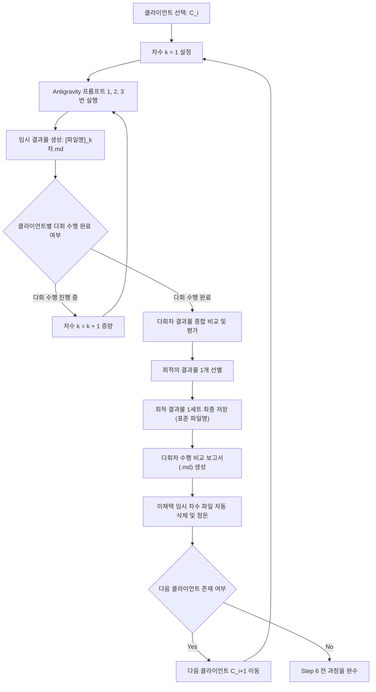

# 🤖 설계 자동화 파이프라인 마스터 지시서 (`설계 자동화 파이프라인.md`)

이 문서는 사용자가 **`'[제외단계]단계 제외 하고 설계 자동화 시작해'`** (예: `'[]단계 제외 하고 설계 자동화 시작해'`, `'[리서치, 분류]단계 제외 하고 설계 자동화 시작해'`) 명령어를 수신했을 때, AI 에이전트가 각 단계별 `.md` 및 `skill` 파일 명세를 참조하여 **[리서치 ➔ 분류 ➔ 분석(경로B) ➔ 가상클라이언트 생성 ➔ 가상클라이언트 분석 ➔ 가상클라이언트 분석 기반 설계]** 6단계 프로세스를 중단 없이 자율 실행하도록 제어하는 표준 자동화 지시서입니다.

---

## ⚡ 1. 단축 실행 트리거 및 동적 제어 규칙 (Trigger & Execution Control)

> [!IMPORTANT]
> **사용자 전용 단축 명령어:**  
> - `"[제외단계]단계 제외 하고 설계 자동화 시작해"`  
> 
> **동적 파싱 및 실행 조건:**
> 1. 대괄호 `[...]` 안의 문자를 파싱하여 지정된 제외 단계를 추출합니다.
> 2. `[]` 처럼 빈 대괄호인 경우, 6개 전체 단계를 1단계(리서치)부터 6단계(분석 기반 설계)까지 순차 실행합니다.
> 3. `[리서치, 분류]` 처럼 특정 단계가 명시된 경우, 해당 단계를 스킵(Skip)하고 지정되지 않은 최우선 단계부터 동적으로 진입하여 파이프라인을 실행합니다.

---

## 📌 2. 전체 파이프라인 프로세스 흐름도 (Pipeline Architecture)

```mermaid
graph TD
    Trigger["명령어: '[제외단계]단계 제외 하고 설계 자동화 시작해'"] --> Parse{제외 단계 파싱}

    subgraph Step 1: 리서치 단계
        Parse -- "리서치 미제외" --> S1_1[리서치.md & 리서치_skill.md 로드]
        S1_1 --> S1_2[200개 레퍼런스 수집 & 파킹/불량 필터링]
        S1_2 --> S1_3[사이트 리서치 결과 & 사이트_레퍼런스_DB 동시 저장]
    end

    subgraph Step 2: 분류 단계
        S1_3 --> S2_1[분류.md & 통합 skill.md 로드]
        Parse -- "분류부터 시작" --> S2_1
        S2_1 --> S2_2[카테고리/무드/기능 체계적 분류 200개 구축]
        S2_2 --> S2_3[사이트 분류 결과 폴더 저장]
    end

    subgraph Step 3: 분석 단계 (경로 B)
        S2_3 --> S3_1[분석.md & 분석_skill.md 로드]
        Parse -- "분석부터 시작" --> S3_1
        S3_1 --> S3_2[경로 B 고정: 200개 사이트 심층 UX/IA Teardown 분석]
        S3_2 --> S3_3[사이트 분석 결과 폴더 저장]
    end

    subgraph Step 4: 가상클라이언트 생성 단계
        S3_3 --> S4_1[가상 클라이언트 생성.md & 가상클라이언트_생성_skill.md 로드]
        Parse -- "가상클라이언트 생성부터 시작" --> S4_1
        S4_1 --> S4_2[5대 사전 분석 자료 연동 & 평가 단어 100% 제거]
        S4_2 --> S4_3[가상클라이언트 폴더 저장]
    end

    subgraph Step 5: 가상클라이언트 분석 단계
        S4_3 --> S5_1[가상 클라이언트 기반 분석 자동화.md & skill 로드]
        Parse -- "가상클라이언트 분석부터 시작" --> S5_1
        S5_1 --> S5_2[클라이언트별 최적 8개 사이트 자동 추출 및 심층 분석]
        S5_2 --> S5_3[가상 클라이언트 기반 분석 결과 폴더 저장]
    end

    subgraph Step 6: 가상클라이언트 분석 기반 설계 단계 (Antigravity 프롬프트 1,2,3 연동)
        S5_3 --> S6_1[Antigravity 프롬프트.txt 1, 2, 3번 연동]
        Parse -- "설계부터 시작" --> S6_1
        S6_1 --> S6_2["클라이언트 1명당 다회 수행 (Multi-Execution)"]
        S6_2 --> S6_3["다회차 결과 종합 평가 및 최적 결과물 1개 선별"]
        S6_3 --> S6_4["최적 결과물 1세트 저장 & 다회차 비교 보고서 생성"]
        S6_4 --> S6_5[미채택 임시 차수 파일 정리 후 다음 클라이언트 이동]
    end

    S6_5 --> End[최종 파이프라인 완성 보고]
```

---

## 📚 3. 단계별 로드 파일, 실행 규칙 및 결과물 저장 경로 (Stage-by-Stage Specifications)

---

### 1️⃣ Step 1: 리서치 단계 (Research Phase)

* **참조 및 로딩 대상 스킬/MD 파일:**
  1. [`C:\Users\SBS\leg\md파일\리서치\리서치.md`](file:///C:/Users/SBS/leg/md%ED%8C%8C%EC%9D%BC/%EB%A6%AC%EC%84%9C%EC%B9%98/%EB%A6%AC%EC%84%9C%EC%B9%98.md)
  2. [`C:\Users\SBS\leg\skill 파일\리서치_skill.md`](file:///C:/Users/SBS/leg/skill%20%ED%8C%8C%EC%9D%BC/%EB%A6%AC%EC%84%9C%EC%B9%98_skill.md)
* **입력 참고 자료:**
  - [`C:\Users\SBS\leg\브랜드 관련 자료.txt`](file:///C:/Users/SBS/leg/%EB%B8%8C%EB%9E%A6%EB%93%9C%20%EA%B4%80%EB%A0%A8%20%EC%9E%90%EB%A3%8C.txt)
  - [`C:\Users\SBS\leg\사이트 리서치 결과\기존_레퍼런스 사이트_96개.txt`](file:///C:/Users/SBS/leg/%EC%82%AC%EC%9D%B4%ED%8A%B8%20%EB%A6%AC%EC%84%9C%EC%B9%98%20%EA%B2%B0%EA%B3%BC/%EA%B8%B0%EC%A1%B4_%EB%A6%AC%ED%8F%AC%EB%9F%B0%EC%8A%A4%20%EC%82%AC%EC%9D%B4%ED%8A%B8_96%EA%B0%9C.txt)
* **핵심 실행 규칙:**
  - 웰니스, 친환경 스킨케어, 오브제 카테고리의 유효 웹사이트 탐색 수집 (단 1개의 중복 도메인도 허용하지 않음).
  - 파킹 도메인, SSL 미지원, 404/500 에러 사이트 100% 필터링 (`discarded_sites.txt` 이관).
* **기존 폴더 구조 기반 결과물 저장 경로 (Dual Storage):**
  - **주 산출물:** [`C:\Users\SBS\leg\사이트 리서치 결과\soaphe_classified_references_final_200개.txt`](file:///C:/Users/SBS/leg/%EC%82%AC%EC%9D%B4%ED%8A%B8%20%EB%A6%AC%EC%84%9C%EC%B9%98%20%EA%B2%B0%EA%B3%BC/)
  - **DB 동시 저장:** [`C:\Users\SBS\leg\사이트_레퍼런스_DB\soaphe_classified_references_final_200개.txt`](file:///C:/Users/SBS/leg/%EC%82%AC%EC%9D%B4%ED%8A%B8_%EB%A6%AC%EC%84%9C%EC%B9%98_DB/)

---

### 2️⃣ Step 2: 분류 단계 (Classification Phase)

* **참조 및 로딩 대상 스킬/MD 파일:**
  1. [`C:\Users\SBS\leg\md파일\분류_분석_통합\분류.md`](file:///C:/Users/SBS/leg/md%ED%8C%8C%EC%9D%BC/%EB%B6%84%EB%A5%98_%EB%B6%84%EC%84%9D_%ED%86%B5%ED%95%A9/%EB%B6%84%EB%A5%98.md)
  2. [`C:\Users\SBS\leg\skill 파일\통합 skill.md`](file:///C:/Users/SBS/leg/skill%20%ED%8C%8C%EC%9D%BC/%ED%86%B5%ED%95%95%20skill.md)
* **입력 참고 자료:**
  - [`C:\Users\SBS\leg\사이트 리서치 결과\`](file:///C:/Users/SBS/leg/%EC%82%AC%EC%9D%B4%ED%8A%B8%20%EB%A6%AC%EC%84%9C%EC%B9%98%20%EA%B2%B0%EA%B3%BC/) 폴더 내 모든 `.txt` 파일 (`soaphe_classified_references_final_200개.txt`, `기존_레퍼런스 사이트_96개.txt`, `soaphe_raw_references.txt` 등)
* **핵심 실행 규칙:**
  - 200개 레퍼런스 사이트를 1등 카테고리, 브랜드 성격, UX 특성별로 체계적 구조화.
* **기존 폴더 구조 기반 결과물 저장 경로:**
  - [`C:\Users\SBS\leg\사이트 분류 결과\soaphe_classified_report_200개.txt`](file:///C:/Users/SBS/leg/%EC%82%AC%EC%9D%B4%ED%8A%B8%20%EB%B6%84%EB%A5%98%20%EA%B2%B0%EA%B3%BC/)

---

### 3️⃣ Step 3: 분석 단계 (경로 B 고정) (Teardown Analysis Phase - Path B)

* **참조 및 로딩 대상 스킬/MD 파일:**
  1. [`C:\Users\SBS\leg\md파일\분류_분석_통합\분석.md`](file:///C:/Users/SBS/leg/md%ED%8C%8C%EC%9D%BC/%EB%B6%84%EB%A5%98_%EB%B6%84%EC%84%9D_%ED%86%B5%ED%95%A9/%EB%B6%84%EC%84%9D.md) (**[경로 B]** 지정 기준)
  2. [`C:\Users\SBS\leg\skill 파일\분석_skill.md`](file:///C:/Users/SBS/leg/skill%20%ED%8C%8C%EC%9D%BC/%EB%B6%84%EC%84%9D_skill.md)
* **입력 참고 자료:**
  - [`C:\Users\SBS\leg\사이트 분류 결과\`](file:///C:/Users/SBS/leg/%EC%82%AC%EC%9D%B4%ED%8A%B8%20%EB%B6%84%EB%A5%98%20%EA%B2%B0%EA%B3%BC/) 폴더 내 모든 `.txt` 파일 (`soaphe_classified_report_200개.txt`, `soaphe_classified_report_20개.txt` 등)
* **핵심 실행 규칙:**
  - **경로 B(경로 B - 심층 Teardown 분석)** 규격을 고정 적용하여 200개 사이트의 정보구조(IA), 내비게이션 경로, 10대 바디 콘텐츠 배치를 해체 분석.
* **기존 폴더 구조 기반 결과물 저장 경로:**
  - [`C:\Users\SBS\leg\사이트 분석 결과\soaphe_teardown_analysis_200개.txt`](file:///C:/Users/SBS/leg/%EC%82%AC%EC%9D%B4%ED%8A%B8%20%EB%B6%84%EC%84%9D%20%EA%B2%B0%EA%B3%BC/)

---

### 4️⃣ Step 4: 가상클라이언트 생성 단계 (Virtual Client Generation Phase)

* **참조 및 로딩 대상 스킬/MD 파일:**
  1. [`C:\Users\SBS\leg\md파일\가상 클라이언트\가상 클라이언트 생성.md`](file:///C:/Users/SBS/leg/md%ED%8C%8C%EC%9D%BC/%EA%B0%80%EC%83%81%20%ED%81%B4%EB%9D%BC%EC%9D%B4%EC%96%B8%ED%8A%B8/%EA%B0%80%EC%83%81%20%ED%81%B4%EB%9D%BC%EC%9D%B4%EC%96%B8%ED%8A%B8%20%EC%83%9D%EC%84%B1.md)
  2. [`C:\Users\SBS\leg\skill 파일\가상클라이언트_생성_skill.md`](file:///C:/Users/SBS/leg/skill%20%ED%8C%8C%EC%9D%BC/%EA%B0%80%EC%83%81%ED%81%B4%EB%9D%BC%EC%9D%B4%EC%96%B8%ED%8A%B8_%EC%83%9D%EC%84%B1_skill.md)
* **사전 필수 5대 로딩 문서 (Mandatory Inputs):**
  - `페르소나/페르소나.txt`, `가상 인터뷰/인터뷰_분석_보고서.md`, `가상 인터뷰/페르소나_20인_인터뷰_분석_보고서.md`, `브랜드 관련 자료.txt`, `가상클라이언트/예시 파일/가상클라이언트_예시파일_분석_보고서.md`
* **핵심 작성 규칙:**
  - `평가용`, `평가 난이도`, `주요 평가 역량` 등 평가 관련 단어 100% 완전 제거.
  - 9대 필수 항목(공통조건, 클라이언트 기본정보, 요청내용, 서비스내용, 핵심타깃, 디자인방향, 메인페이지 10대콘텐츠, 필수UI, 제한조건) 명세 작성.
* **기존 폴더 구조 기반 결과물 저장 경로:**
  - [`C:\Users\SBS\leg\가상클라이언트\가상클라이언트_[번호]_[이름]_[브랜드명].md`](file:///C:/Users/SBS/leg/%EA%B0%80%EC%83%81%ED%81%B4%EB%9D%BC%EC%9D%B4%EC%96%B8%ED%8A%B8/)
  - 예: `가상클라이언트_1_한수진_소피.md`, `가상클라이언트_2_이지은_SOAPHE.md`

---

### 5️⃣ Step 5: 가상클라이언트 분석 단계 (Virtual Client Analysis Phase)

* **참조 및 로딩 대상 스킬/MD 파일:**
  1. [`C:\Users\SBS\leg\md파일\가상 클라이언트\가상 클라이언트 기반 분석 자동화.md`](file:///C:/Users/SBS/leg/md%ED%8C%8C%EC%9D%BC/%EA%B0%80%EC%83%81%20%ED%81%B4%EB%9D%BC%EC%9D%B4%EC%96%B8%ED%8A%B8/%EA%B0%80%EC%83%81%20%ED%81%B4%EB%9D%BC%EC%9D%B4%EC%96%B8%ED%8A%B8%20%EA%B8%B0%EB%B0%98%20%EB%B6%84%EC%84%9D%20%EC%9E%90%EB%8F%99%ED%99%94.md)
  2. [`C:\Users\SBS\leg\skill 파일\가상_클라이언트_기반_분석_자동화_skill.md`](file:///C:/Users/SBS/leg/skill%20%ED%8C%8C%EC%9D%BC/%EA%B0%80%EC%83%81_%ED%81%B4%EB%9D%BC%EC%9D%B4%EC%96%B8%ED%8A%B8_%EA%B8%B0%EB%B0%98_%EB%B6%84%EC%84%9D_%EC%9E%90%EB%8F%99%ED%99%94_skill.md)
  3. [`C:\Users\SBS\leg\md파일\가상 클라이언트\가상 클라이언트 기반 분석 결과 작성 양식.md`](file:///C:/Users/SBS/leg/md%ED%8C%8C%EC%9D%BC/%EA%B0%80%EC%83%81%20%ED%81%B4%EB%9D%BC%EC%9D%B4%EC%96%B8%ED%8A%B8/%EA%B0%80%EC%83%81%20%ED%81%B4%EB%9D%BC%EC%9D%B4%EC%96%B8%ED%8A%B8%20%EA%B8%B0%EB%B0%98%20%EB%B6%84%EC%84%9D%20%EA%B2%B0%EA%B3%BC%20%EC%9E%91%EC%84%B1%20%EC%96%91%EC%8B%9D.md)
* **입력 참고 자료:**
  - Step 4에서 생성된 가상클라이언트 `.md` 파일
  - `사이트 리서치 결과` 폴더 내 200개 레퍼런스 사이트 목록
* **핵심 실행 규칙:**
  - 클라이언트 무드/타깃에 부합하는 최적 8개 레퍼런스 사이트 자동 선별 및 9단계 심층 UX/IA 구조 분석.
* **기존 폴더 구조 기반 결과물 저장 경로:**
  - [`C:\Users\SBS\leg\가상 클라이언트 기반 분석 결과\가상클라이언트_[번호]_[이름]_[브랜드명]_분석결과.md`](file:///C:/Users/SBS/leg/%EA%B0%80%EC%83%81%20%ED%81%B4%EB%9D%BC%EC%9D%B4%EC%96%B8%ED%8A%B8%20%EA%B8%B0%EB%B0%98%20%EB%B6%84%EC%84%9D%20%EA%B2%B0%EA%B3%BC/)

---

### 6️⃣ Step 6: 가상클라이언트 분석 기반 설계 단계 (Design Generation & Iteration Phase)

> [!IMPORTANT]
> **Antigravity 프롬프트 연동 및 최적 결과물 단일 보관 규칙:**  
> 이 단계에서는 [`C:\Users\SBS\leg\프롬프트\Antigravity 프롬프트.txt`](file:///C:/Users/SBS/leg/%ED%94%84%EB%A1%AC%ED%94%84%ED%8A%B8/Antigravity%20%ED%94%84%EB%A1%AC%ED%94%84%ED%8A%B8.txt) 내 **[1. 사이트맵 제작]**, **[2. 서비스 흐름도 제작]**, **[3. 화면 설계서 제작]** 1, 2, 3번 프롬프트를 차례대로 자동 적용합니다. **클라이언트 한 명당 다회 수행**을 실시하되, **최적의 결과물 1개 세트만 최종 산출물로 보관**하며(결과물이 1개이므로 불필요한 태그 없이 깔끔한 표준 파일명 사용), 다회 수행 과정에서의 비교 평가 내역은 **`다회차_비교_보고서.md`**로 정리하고 미채택 임시 차수 파일은 자동 정돈합니다.

#### 📌 프롬프트 1, 2, 3 연동 명세

| 연동 프롬프트 | 주요 역할 및 입력 파일 | 생성 결과물 및 규칙 | 저장 폴더 (기존 구조) |
| :--- | :--- | :--- | :--- |
| **[1. 사이트맵 제작]** | - 입력: Step 5의 `분석결과.md`<br>- 브랜드 정보, 사용자 목표 기반 계층 설계 | 1. `사이트맵.md` (전역 내비, 계층 표, Mermaid)<br>2. `사이트맵.mmd` (Mermaid 순수 코드)<br>3. `사이트맵.svg` (벡터 이미지) | [`C:\Users\SBS\leg\가상 클라이언트 기반 설계 결과\사이트맵\[이름]\`](file:///C:/Users/SBS/leg/%EA%B0%80%EC%83%81%20%ED%81%B4%EB%9D%BC%EC%9D%B4%EC%96%B8%ED%8A%B8%20%EA%B8%B0%EB%B0%98%20%EC%84%A4%EA%B3%84%20%EA%B2%B0%EA%B3%BC/%EC%82%AC%EC%9D%B4%ED%8A%B8%EB%A7%B5/) |
| **[2. 서비스 흐름도 제작]** | - 입력: `사이트맵.md` 및 추가 참고자료<br>- 핵심 정상 흐름 및 이탈/분기 수립 | 1. `서비스_흐름도.md` (단계별 흐름 표, Mermaid)<br>2. `서비스_흐름도.mmd`<br>3. `서비스_흐름도.svg` | [`C:\Users\SBS\leg\가상 클라이언트 기반 설계 결과\서비스 흐름도\[이름]\`](file:///C:/Users/SBS/leg/%EA%B0%80%EC%83%81%20%ED%81%B4%EB%9D%BC%EC%9D%B4%EC%96%B8%ED%8A%B8%20%EA%B8%B0%EB%B0%98%20%EC%84%A4%EA%B3%84%20%EA%B2%B0%EA%B3%BC/%EC%84%9C%EB%B9%84%EC%8A%A4%20%ED%9D%90%EB%A6%84%EB%8F%84/) |
| **[3. 화면 설계서 제작]** | - 입력: `사이트맵.md` & `서비스_흐름도.md`<br>- 전체 화면 와이어프레임 & 명세 제작 | 1. `화면_설계서.md` (화면 ID, UI, 5대 상태 Matrix)<br>2. `와이어프레임.html` (단독 실행 가능 HTML)<br>3. `화면_목록.json` | [`C:\Users\SBS\leg\가상 클라이언트 기반 설계 결과\화면 설계서\[이름]\`](file:///C:/Users/SBS/leg/%EA%B0%80%EC%83%81%20%ED%81%B4%EB%9D%BC%EC%9D%B4%EC%96%B8%ED%8A%B8%20%EA%B8%B0%EB%B0%98%20%EC%84%A4%EA%B3%84%20%EA%B2%B0%EA%B3%BC/%ED%99%94%A9%EB%A9%B4%20%EC%84%A4%EA%B3%84%EC%84%9C/) |
| **[비교 분석 보고서]** | - 입력: 차수별 생성 결과물 전체 대조 데이터 | 1. `가상클라이언트_[번호]_[이름]_다회차_비교_보고서.md`<br>(차수별 평가 점수, 개선 내역 및 최적 선정 근거 리포트) | [`C:\Users\SBS\leg\가상 클라이언트 기반 설계 결과\비교 보고서\[이름]\`](file:///C:/Users/SBS/leg/%EA%B0%80%EC%83%81%20%ED%81%B4%EB%9D%BC%EC%9D%B4%EC%96%B8%ED%8A%B8%20%EA%B8%B0%EB%B0%98%20%EC%84%A4%EA%B3%84%20%EA%B2%B0%EA%B3%BC/) |

---

## 🔄 4. 가상클라이언트별 다회 수행 & 최적 결과물 단일 보관 알고리즘 (Multi-Execution & Optimal Selection Rules)

> [!CAUTION]
> **클라이언트 1명당 다회 수행 후 최적 결과물 1세트 단일 보관 + 다회차 비교 보고서 생성 정책**



### 📌 다회 수행 및 최적 산출물 단일 보관 세부 알고리즘

1. **클라이언트별 다회 수행 (Multi-Execution per Client):**
   - 각 가상클라이언트(예: 한수진, 이지은 등)에 대하여 Step 6 프롬프트 1, 2, 3 세트를 클라이언트 한 명당 다회(차수 $k=1, 2, 3 \dots$)로 반복 수행합니다.
2. **다회차 결과물 평가 및 최적안 선별 (Evaluation & Selection):**
   - 차수별로 생성된 결과물의 구조적 완성도, UX 흐름의 적절성, 계층 설계 정교함 및 요구사항 반영률을 종합 비교하여 **가장 우수한 최적의 결과물 1개**를 최종 선정합니다.
3. **최적 결과물 단일 보관 (Clean Filename Storage):**
   - 최종 선정된 최적의 결과물 1세트를 저장합니다. 산출물 폴더에는 최적의 결과물만 보존되므로 불필요한 `(최적)` 태그 없이 **깔끔한 표준 파일명**으로 확정 보관합니다. (예: `사이트맵.md`, `서비스_흐름도.md`, `화면_설계서.md`, `와이어프레임.html` 등)
4. **다회차 비교 요약 보고서 생성 (Comparison Report Generation):**
   - 다회 수행 과정에서의 차수별 비교 항목, 차이점, 주요 개선 사항 및 최종 선정 근거를 정리한 **`가상클라이언트_[번호]_[이름]_다회차_비교_보고서.md`**를 1개 자동 생성하여 보관합니다.
5. **산출물 폴더 정돈 및 이관 (Cleanup):**
   - 최적 산출물 1세트와 비교 보고서 1개를 제외한 나머지 미채택 임시 차수 파일(`1차.md`, `2차.md` 등)은 자동 삭제/정돈하여 산출물 폴더에는 항상 단일 최적 산출물 세트만 깔끔하게 보존합니다.

---

## 📋 5. 최종 파이프라인 수행 및 검수 Checklist

- [ ] `[제외단계]단계 제외 하고 설계 자동화 시작해` 명령 파싱 시 제외할 단계와 실행할 단계가 명확히 판별되는가?
- [ ] Step 1 ~ 5 수행 시 지정된 `md파일/` 및 `skill 파일/` 명세가 오류 없이 순차 로드되었는가?
- [ ] 모든 결과물이 기존 폴더 구조(`사이트 리서치 결과`, `사이트 분류 결과`, `사이트 분석 결과`, `가상클라이언트`, `가상 클라이언트 기반 분석 결과`, `가상 클라이언트 기반 설계 결과`) 규격에 맞추어 완전 저장되었는가?
- [ ] Step 6 수행 시 `Antigravity 프롬프트.txt` 의 1, 2, 3번 프롬프트가 정교하게 적용되었는가?
- [ ] 클라이언트 한 명당 다회 수행 후 최적 결과물 1개 세트만 표준 파일명으로 명확히 보관되고, 다회차 비교 보고서(.md)가 생성되었는가?
