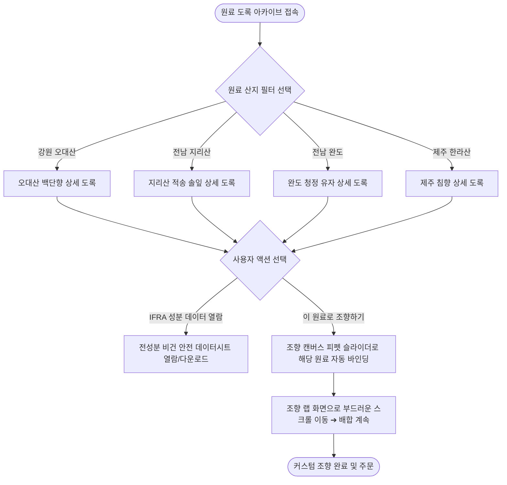

# 📌 [사단(士團)] 민서준 서비스 흐름도 시안 3 (서비스_흐름도_시안3_민서준.md)

## 1. 흐름 개요 및 기획 의도: 24종 자생 원료 도록 탐색 ➔ 조향대 연동 플로우
* **특징:** 고객이 24종 자생 천연 원료 도록과 산지 지도를 탐색하다가 특정 원료(지리산 솔잎 등)의 '조향대로 바인딩' 버튼을 클릭하면 조향 캔버스로 원료가 자동 세팅되는 콘텐츠 연계 플로우.
* **주요 분기점:** 산지 필터링 분기(오대산/지리산/완도/제주), 원료 바인딩 분기, IFRA 성분표 다운로드 분기.

## 2. 상세 서비스 흐름도 (Mermaid 분기 차트)

## 3. 예외 및 실패 복구 시나리오 (Exception Scenarios)
1. **[원료 시즌 오프 시]:** 특정 자생 원료 채취 기간 종료 시 "다음 채취 시즌 예약 알림톡 신청" 모달 연동.
