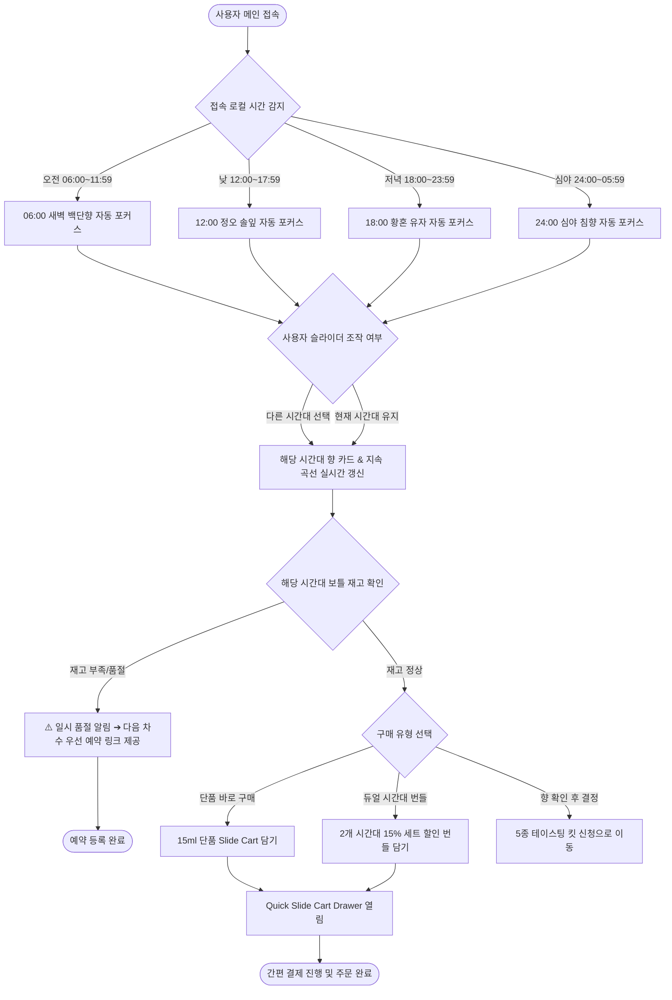

# 📌 [사단(士團)] 임채원 서비스 흐름도 시안 1 (서비스_흐름도_시안1_임채원.md)

## 1. 흐름 개요 및 기획 의도: 24H 가로 시간축 슬라이더 탐색 & 구매 분기 플로우
* **특징:** 사용자가 06:00~24:00 시간 슬라이더를 조작하여 시간대별 추천 향을 확인하고, 단품 구매, 듀얼 번들 할인, 또는 시향 킷으로 분기되는 실전 인터랙션 플로우.
* **주요 분기점:** 접속 로컬 시간 자동 감지 분기, 구매 옵션 분기(단품 vs 번들), 재고 유무에 따른 리필 예약 루프.

## 2. 상세 서비스 흐름도 (Mermaid 분기 차트)

## 3. 예외 및 실패 복구 시나리오 (Exception Scenarios)
1. **[시간대 로딩 지연]:** 네트워크 지연 시 기본 12:00 정오 향으로 즉시 렌더링 후 비동기 데이터 갱신.
2. **[품절 시 이탈 방지]:** 재고 소진 시 단순 '품절' 문구 대신 3개월 정기 리필 우선 배정 링크로 유도.
