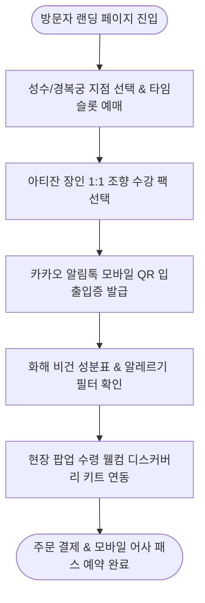

# [사단(士團)] 박지안 클라이언트 서비스 흐름도 병합 분석 보고서 (5개 시안 최적 병합)

---

## 1. 5개 서비스 흐름 시안 기획 및 최적 병합 개요

본 보고서는 박지안 PM의 비즈니스 모델인 **조향 수강 클래스 팩**과 **팝업 타임슬롯 사전 예약**, **모바일 QR 입출입증**을 5개 시안(Ver 1 ~ Ver 5) 중 최적의 유저 플로우(User Flow)로 도출한 병합 보고서입니다.

