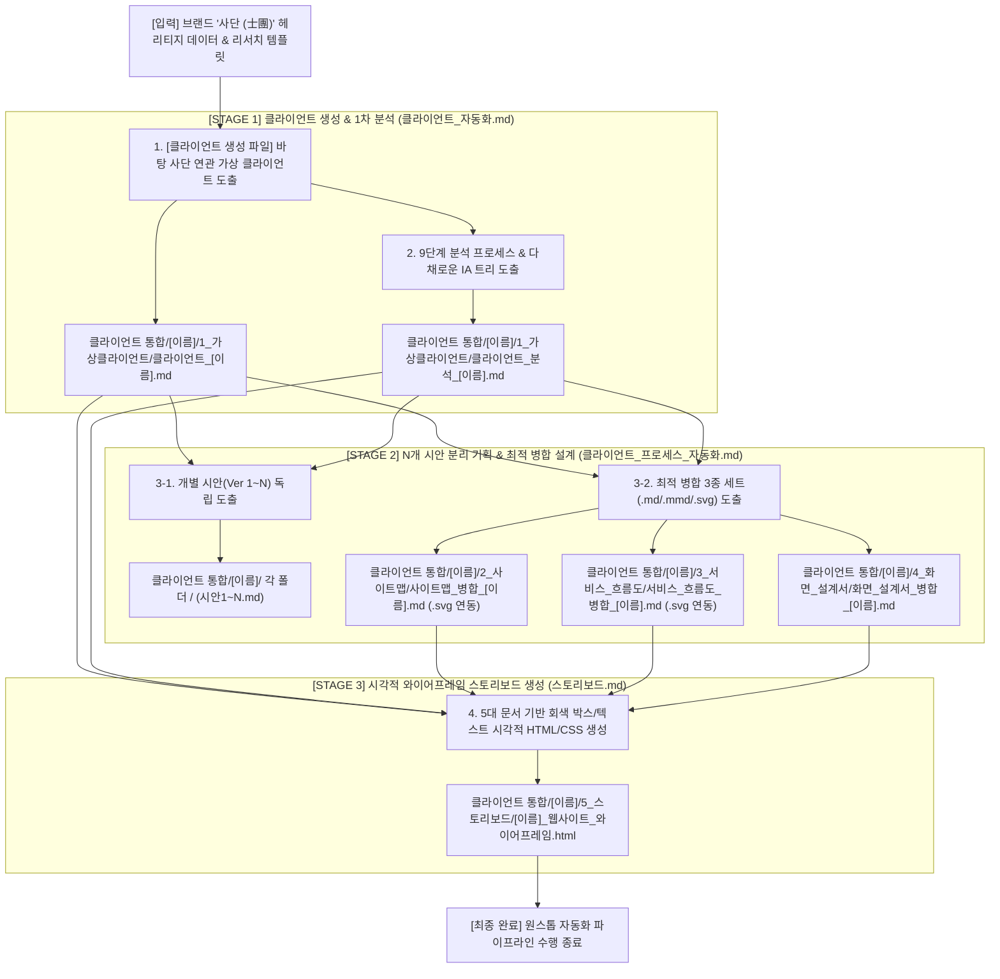

# 📌 클라이언트 자동화 & 프로세스 설계 & 스토리보드 전체 통합 마스터 명세서 (클라이언트_전체_통합본.md)

본 문서는 사단(士團) 브랜드 가상 클라이언트 생성, N개 시안 기획 및 최적 병합 웹사이트 설계, 그리고 순수 HTML/CSS 시각적 와이어프레임 스토리보드 자동 도출까지의 **앤드투앤드(End-to-End) 3단계 원스톱 자동화 파이프라인**을 일원화하여 정의한 마스터 통합 명세서입니다.

---

## 🧭 파이프라인 전체 워크플로우 (End-to-End Pipeline)



---

## 📢 핵심 마스터 공통 원칙 (Master Operating Principles)

> [!IMPORTANT]
> **원칙 0: 리서치와 분류 기반 분석 정의**
> - 분석(Analysis)은 기본적으로 **리서치(자료 수집)와 분류(그룹화 및 패턴 도출)**의 결합으로 이루어집니다.
> 
> **원칙 1: 내 브랜드 '사단 (士團)' 맥락 고정 (Brand Context Alignment)**
> - 모든 분석 및 클라이언트 생성의 최우선 기준은 **내 브랜드인 '사단 (士團)'**(조선 암행어사 마패 헤리티지, 커스텀 1·2·3마패 향수, 포터블 오브제 자사몰)입니다. 엉뚱한 타 업종 브랜드가 아닌 사단 프로젝트와 직접 관련된 가상 클라이언트(담당자/기획자)를 도출합니다.
> 
> **원칙 2: 1 클라이언트 = 1 독립 파이프라인 (Single File Per Stage)**
> - 가상 클라이언트 1명당 모든 단계의 결과물은 독자적인 전용 독립 파일로 생성·관리됩니다.
> 
> **원칙 3: 파일명 뒤 클라이언트 사람 이름 명시 (Client Person Name Tagging)**
> - 파일명 뒤에는 브랜드명이 아니라 **사단 브랜드 클라이언트 담당자의 사람 이름(예: 윤서진, 송민호, 최하은 등)**을 명확히 부착합니다.
> 
> **원칙 4: 풍부하고 입체적인 3대 요소 분해 (Menu, Content, Feature)**
> - 단조로운 구성을 지양하고, **메뉴(7~9개 상위, 2~3단계 하위), 콘텐츠(10개 이상), 기능(10개 이상)** 요소를 다채롭고 풍부하게 확장하여 작성합니다.
> 
> **원칙 5: `클라이언트 통합/[이름]/` 전용 폴더 통합 일원화 저장 규칙 (Master Folder Structure)**
> - 모든 결과물은 루트의 `클라이언트 통합/` 하위에 클라이언트 사람 이름 폴더(`클라이언트 통합/[클라이언트이름]/`)를 신설하여 5대 서브 폴더로 일원화 저장합니다:
>   - `1_가상클라이언트/`: `클라이언트_[이름].md`, `클라이언트_분석_[이름].md`
>   - `2_사이트맵/`: `사이트맵_시안1~3_[이름].md`, `사이트맵_병합_[이름].md` / `.mmd` / `.svg`
>   - `3_서비스_흐름도/`: `서비스_흐름도_시안1~3_[이름].md`, `서비스_흐름도_병합_[이름].md` / `.mmd` / `.svg`
>   - `4_화면_설계서/`: `화면_설계서_시안1~3_[이름].md`, `화면_설계서_병합_[이름].md`
>   - `5_스토리보드/`: `[이름]_웹사이트_와이어프레임.html`
> 
> **원칙 6: 클라이언트별 특성화 콘셉트 차별화 원칙 (Concept Differentiation)**
> - 단순 템플릿 복사를 전면 금지하며, 클라이언트의 롤(Role)과 비즈니스 목적에 따라 **GNB 메뉴 순서, 3대 설계 문서 내용, HTML 와이어프레임 UI 노출 비중을 100% 독립되게 특화 작성**해야 합니다.
> 
> **원칙 7: 개별 시안 분리 & 단일 이미지 연동 규칙 (Single Image Embedding Rule)**
> - 개별 시안 파일(`시안1~N.md`)과 최적 병합 파일(`병합_[이름].md`)을 분리 도출하며, SVG 시각화 차트 이미지 태그는 **오직 최적 병합 파일(`병합_[이름].md`) 단 1곳에만 필수 연결**합니다.
> 
> **원칙 8: 클라이언트 기반 전용 제품 전시 구간 필수 정의 (Product Showcase Section)**
> - 모든 화면 설계서(`화면_설계서_병합_[이름].md`) 및 스토리보드(`[이름]_웹사이트_와이어프레임.html`)에는 각 클라이언트의 고유 콘셉트(팝업 굿즈 쇼케이스 / AI 맞춤 향수 킷 / 3D 각인 마패 용기 세트)에 맞춘 **독립된 제품 전시 UI 구간(Product Showcase Section)**을 메인 상단 핵심 영역(SEC-03 위치)으로 필수 배치하여 시각적으로 100% 차별화합니다.
> 
> **원칙 9: 5대 다이내믹 레이아웃 아키텍처 타입 시스템 적용 (Dynamic Layout Architecture System)**
> - 클라이언트별 획일화된 레이아웃을 전면 해제하고, 비즈니스 아키타입에 따라 **5가지 독자적 레이아웃 구도(Type A 벤토 그리드 / Type B 스텝 위저드 / Type C 50:50 분할 스크롤 / Type D 에디토리얼 매거진 / Type E 하단 시트 앱)** 중 최적 타입을 지정하여 화면 구조와 컴포넌트 배치를 100% 차별화합니다.
> 
> **원칙 10: 스토리보드 8개 섹션 분량 참고 & 대형 구도(Layout Architecture) 차별화 원칙**
> - 스토리보드 도출 시 8개 이상의 섹션 기준은 풍부한 콘텐츠 분량을 보장하기 위한 참고 규격이며, 획일적인 상하 세로 블록(헤더-GNB-히어로-카드-푸터) 나열 구조를 전면 금지합니다.
> - 화면 설계서에 지정된 클라이언트 비즈니스 아키타입(Type A 비대칭 벤토 그리드 / Type B 스텝 위저드 / Type C 50:50 듀얼 스플릿 / Type D 좌측 세로 고정 사이드바 매거진 / Type E 티켓팅 대시보드 뷰포트)에 따라 **화면 전체 대형 구도(Grid Shell)를 100% 다르게 작성**해야 합니다.

---

## 🛠️ [STAGE 1] 사단 가상 클라이언트 생성 및 1차 사이트 분석 명세

### 1. 입력 참조 자료
- **참조 폴더:** `가상 클라이언트/클라이언트 생성 파일/`
  - `브랜드_정체성.md` / `브랜드_정체성_skill.md`
  - `인터뷰.md` / `인터뷰_skill.md`
  - `클라이언트_예시.md` / `클라이언트_예시_skill.md`

### 2. 실행 지침
1. **신규 클라이언트 도출:**
   - 조선 암행어사 마패 헤리티지(1·2·3마패 모듈, 어사 비밀 첩보 레시피, 디스커버리 키트)를 바탕으로 기존 클라이언트를 재사용하지 않는 **일회성 생성 원칙**을 준수합니다.
   - 100% 신규 요구사항 브리프를 도출하여 `클라이언트 통합/[클라이언트이름]/1_가상클라이언트/클라이언트_[클라이언트이름].md`에 저장합니다.
2. **가상 클라이언트 기반 1차 사이트 분석:**
   - `리서치, 분석, 분류/가상 클라이언트 기반 분석 결과 작성 양식.md` 구조에 맞춰 9단계 분석 프로세스를 적용합니다.
   - 메뉴 7~9개, 콘텐츠 10개 이상, 기능 10개 이상을 세분화하여 `클라이언트 통합/[클라이언트이름]/1_가상클라이언트/클라이언트_분석_[클라이언트이름].md`에 저장합니다.

---

## 🎨 [STAGE 2] 웹사이트 3대 설계 문서 N개 시안 분리 기획 & 최적 병합 명세

### 1. 입력 참조 자료
- Stage 1 도출 파일 (`클라이언트_[이름].md`, `클라이언트_분석_[이름].md`)

### 2. 실행 지침 (N Variations & Optimal Merge)
1. **개별 시안(Ver 1~N) 독립 도출:**
   - 클라이언트의 특성화 콘셉트에 맞춰 N가지 개별 시안 파일(`시안1.md`, `시안2.md`, `시안3.md`)을 작성합니다. 개별 시안 파일에는 이미지를 연동하지 않습니다.
2. **최적 병합 파일 3종 세트 도출:**
   - N개 시안의 장점을 대조·분석하여 **최적의 병합 결과물(`병합_[이름].md`, `.mmd`, `.svg`) 3종 세트**를 도출합니다.
   - **`병합_[이름].md` 문서 상단 단 1곳에만** `` 태그를 필수로 연동합니다.
3. **`클라이언트 통합/[이름]/` 전용 서브 폴더 저장:**
   - **사이트맵:** `클라이언트 통합/[클라이언트이름]/2_사이트맵/` (`사이트맵_시안1~3_[이름].md`, `사이트맵_병합_[이름].md`, `.mmd`, `.svg`)
   - **서비스 흐름도:** `클라이언트 통합/[클라이언트이름]/3_서비스_흐름도/` (`서비스_흐름도_시안1~3_[이름].md`, `서비스_흐름도_병합_[이름].md`, `.mmd`, `.svg`)
   - **화면 설계서:** `클라이언트 통합/[클라이언트이름]/4_화면_설계서/` (`화면_설계서_시안1~3_[이름].md`, `화면_설계서_병합_[이름].md`)

---

## 💻 [STAGE 3] 순수 HTML/CSS 시각적 와이어프레임 스토리보드 자동 생성 명세

### 1. 입력 참조 자료 (5대 마스터 문서 자동 로드)
1. `클라이언트 통합/[클라이언트이름]/1_가상클라이언트/클라이언트_[클라이언트이름].md`
2. `클라이언트 통합/[클라이언트이름]/1_가상클라이언트/클라이언트_분석_[클라이언트이름].md`
3. `클라이언트 통합/[클라이언트이름]/2_사이트맵/사이트맵_병합_[클라이언트이름].md`
4. `클라이언트 통합/[클라이언트이름]/3_서비스_흐름도/서비스_흐름도_병합_[클라이언트이름].md`
5. `클라이언트 통합/[클라이언트이름]/4_화면_설계서/화면_설계서_병합_[클라이언트이름].md`

### 2. 핵심 디자인 & 롱 스크롤 레이아웃 생성 규칙
1. **8대 풀 섹션 롱 스크롤 (Full Long-Scroll) 필수 구현:** 단일 화면 저장을 금지하며 GNB(SEC-01), Hero(SEC-02), **[필수] 메인 제품 전시 쇼케이스(SEC-03)**, 3D 각인 스튜디오(SEC-04), 노트 믹서(SEC-05), 비건 성분(SEC-06), 구독 시트(SEC-07), 푸터(SEC-08) 8개 전체 섹션을 세로 롱 스크롤로 작성합니다.
2. **★ [필수] 메인 제품 전시 쇼케이스(Product Showcase Section) 배치:** SEC-03 위치에 각 클라이언트 대표 실물 키트/용기/보증서를 3열 대형 카드 그리드 회색 박스로 전면 배치합니다.
3. **자바스크립트(JS) 전면 제외:** 순수 **HTML5 + Vanilla CSS3 (Flexbox & CSS Grid)**로만 작성합니다.
4. **#금지 디자인 엄격 배제:** 보라색 다크폰트/네온 글로우, CSS 그래디언트 Fill, 무분별한 벤토 박스, 3중 카드 중첩 배제.
5. **#출력형태 (Grey-box & Text Only Wireframe):** 무채색 회색 톤 팔레트 적용.
6. **저장 위치:** `스토리보드 결과/[클라이언트이름]_웹사이트_와이어프레임.html` 및 `클라이언트 통합/[클라이언트이름]/5_스토리보드/[클라이언트이름]_웹사이트_와이어프레임.html`

---

## 📂 종합 입출력 파일 & 폴더 매핑 마스터 테이블

| 단 계 | 분류 명칭 | 입력 참조 자료 | 주요 작업 및 독립 도출 파일 | 최종 저장 전용 폴더 경로 (`클라이언트 통합/`) | 이미지 연동 규칙 |
| :--- | :--- | :--- | :--- | :--- | :--- |
| **STAGE 1** | 가상 클라이언트 도출 | `가상 클라이언트/클라이언트 생성 파일/` | 사단 브랜드 연관 가상 클라이언트 생산<br>➔ `클라이언트_[이름].md` | `클라이언트 통합/[이름]/1_가상클라이언트/` | 이미지 없음 |
| **STAGE 1** | 1차 사이트 분석 | `클라이언트_[이름].md` | 9단계 분석 & 메뉴/콘텐츠/기능 확장<br>➔ `클라이언트_분석_[이름].md` | `클라이언트 통합/[이름]/1_가상클라이언트/` | 이미지 없음 |
| **STAGE 2** | 사이트맵 개별 시안 | STAGE 1 도출 2개 파일 | 개별 시안 1~3 기획 작성<br>➔ `사이트맵_시안1~3_[이름].md` | `클라이언트 통합/[이름]/2_사이트맵/` | 이미지 없음 |
| **STAGE 2** | 사이트맵 최적 병합 | STAGE 1 도출 2개 파일 | 최적 병합 3종 세트 도출<br>➔ `사이트맵_병합_[이름].md` / `.mmd` / `.svg` | `클라이언트 통합/[이름]/2_사이트맵/` | **[단일 이미지 연동]**<br>`사이트맵_병합_[이름].md` 상단에 `.svg` 태그 연결 |
| **STAGE 2** | 서비스 흐름도 개별 | STAGE 1 도출 2개 파일 | 개별 시안 1~3 플로우 작성<br>➔ `서비스_흐름도_시안1~3_[이름].md` | `클라이언트 통합/[이름]/3_서비스_흐름도/` | 이미지 없음 |
| **STAGE 2** | 서비스 흐름도 병합 | STAGE 1 도출 2개 파일 | 최적 병합 3종 세트 도출<br>➔ `서비스_흐름도_병합_[이름].md` / `.mmd` / `.svg` | `클라이언트 통합/[이름]/3_서비스_흐름도/` | **[단일 이미지 연동]**<br>`서비스_흐름도_병합_[이름].md` 상단에 `.svg` 태그 연결 |
| **STAGE 2** | 화면 설계서 개별 | STAGE 1 도출 2개 파일 | 개별 시안 1~3 레이아웃 작성<br>➔ `화면_설계서_시안1~3_[이름].md` | `클라이언트 통합/[이름]/4_화면_설계서/` | 이미지 없음 |
| **STAGE 2** | 화면 설계서 병합 | STAGE 1 도출 2개 파일 | 5대 영역 & 10+ 콘텐츠/기능 병합<br>➔ `화면_설계서_병합_[이름].md` | `클라이언트 통합/[이름]/4_화면_설계서/` | 이미지 없음 |
| **STAGE 3** | HTML/CSS 스토리보드 | 앞선 5개 참조 문서 전체 | 8대 풀 섹션 롱 스크롤 & 제품 쇼케이스 포함 grey-box 시각 와이어프레임<br>➔ `[이름]_웹사이트_와이어프레임.html` | `클라이언트 통합/[이름]/5_스토리보드/` 및 `스토리보드 결과/` | HTML 시각 컴포넌트 렌더링 |

---

## ⚡ 앤드투앤드(E2E) 원스톱 통합 수행 프롬프트 템플릿

```markdown
[사단 브랜드 클라이언트 웹사이트 자동화 & 스토리보드 풀 파이프라인 실행 프롬프트]

대상 클라이언트 이름: [클라이언트이름] (예: 윤서진, 송민호, 최하은)
시안 분석 개수(N): 3개 분석

아래 3개 단계를 순차적으로 자동 실행해줘:

1. [STAGE 1] 사단 브랜드 연관 [클라이언트이름] 가상 클라이언트 도출 및 1차 사이트 분석
   - 클라이언트 통합/[클라이언트이름]/1_가상클라이언트/클라이언트_[클라이언트이름].md
   - 클라이언트 통합/[클라이언트이름]/1_가상클라이언트/클라이언트_분석_[클라이언트이름].md

2. [STAGE 2] 개별 시안 1~3 및 최적 병합 3종 세트(.md/.mmd/.svg) 도출
   - 클라이언트 통합/[클라이언트이름]/2_사이트맵/사이트맵_시안1~3_[이름].md & 사이트맵_병합_[이름].md (.svg 연동)
   - 클라이언트 통합/[클라이언트이름]/3_서비스_흐름도/서비스_흐름도_시안1~3_[이름].md & 서비스_흐름도_병합_[이름].md (.svg 연동)
   - 클라이언트 통합/[클라이언트이름]/4_화면_설계서/화면_설계서_시안1~3_[이름].md & 화면_설계서_병합_[이름].md

3. [STAGE 3] 8대 풀 섹션 롱 스크롤 & 메인 제품 쇼케이스 포함 회색 박스 시각적 HTML 와이어프레임 생성
   - 스토리보드 결과/[클라이언트이름]_웹사이트_와이어프레임.html
   - 클라이언트 통합/[클라이언트이름]/5_스토리보드/[클라이언트이름]_웹사이트_와이어프레임.html
```

---

## ✅ 마스터 검증 체크리스트 (Validation Checklist)

- [x] **[사단 브랜드 고정]:** 모든 요구사항과 와이어프레임이 조선 암행어사 마패, 1·2·3마패 향수, 커스텀 믹싱 브랜드 정체성을 유지하는가?
- [x] **[클라이언트 이름 부착]:** 모든 도출 파일명 뒤에 클라이언트 담당자 사람 이름이 붙어 있는가?
- [x] **[개별 시안 & 병합 분리]:** 각 영역별 개별 시안 파일(`시안1~3`)과 최적 병합 파일(`병합`)이 분리 작성되었는가?
- [x] **[단일 SVG 이미지 연동]:** SVG 시각화 이미지가 개별 시안에는 연결되지 않고, 오직 **최종 병합 결과물 파일(`병합_[이름].md`) 1곳에만** 정상 연동되었는가?
- [x] **[`클라이언트 통합/[이름]/` 저장 준수]:** `클라이언트 통합/` 폴더 내 클라이언트별 전용 폴더 및 5개 서브 폴더 지정을 준수하였는가?
- [x] **[8대 풀 섹션 롱 스크롤 스토리보드]:** `[클라이언트이름]_웹사이트_와이어프레임.html` 파일이 단편 화면이 아닌 8대 풀 섹션 세로 롱 스크롤 구조로 렌더링되는가?
- [x] **[메인 제품 전시 쇼케이스 배치]:** 스토리보드 HTML에 Hero 직후(`SEC-03`) 대형 제품 전시 쇼케이스 섹션이 필수 렌더링되는가?
- [x] **[순수 HTML/CSS 스토리보드]:** JS 없이 브라우저에서 무채색 시각 레이아웃으로 올바르게 렌더링되는가?


---

## 📊 윤서진 클라이언트 통합 실행 완료 기록 (Execution Log)

본 `클라이언트_전체_통합본.md` 명세에 맞춰 **윤서진 클라이언트**의 앤드투앤드 실행 결과물이 아래 `클라이언트 통합/윤서진/` 전용 폴더에 완전히 정리되어 저장되었습니다:

- **1_가상클라이언트:** [`클라이언트 통합/윤서진/1_가상클라이언트/`](file:///C:/uiux_les/antygravity/%ED%81%B4%EB%9D%BC%EC%9D%B4%EC%96%B8%ED%8A%B8%20%ED%86%B5%ED%95%A9/%EC%9C%A4%EC%84%9C%EC%A7%84/1_%EA%B0%80%EC%83%81%ED%81%B4%EB%9D%BC%EC%9D%B4%EC%96%B8%ED%8A%B8/)
- **2_사이트맵:** [`클라이언트 통합/윤서진/2_사이트맵/`](file:///C:/uiux_les/antygravity/%ED%81%B4%EB%9D%BC%EC%9D%B4%EC%96%B8%ED%8A%B8%20%ED%86%B5%ED%95%A9/%EC%9C%A4%EC%84%9C%EC%A7%84/2_%EC%82%AC%EC%9D%B4%ED%8A%B8%EB%A7%B5/)
- **3_서비스_흐름도:** [`클라이언트 통합/윤서진/3_서비스_흐름도/`](file:///C:/uiux_les/antygravity/%ED%81%B4%EB%9D%BC%EC%9D%B4%EC%96%B8%ED%8A%B8%20%ED%86%B5%ED%95%A9/%EC%9C%A4%EC%84%9C%EC%A7%84/3_%EC%84%9C%EB%B9%84%EC%8A%A4_%ED%9D%90%EB%A6%84%EB%8F%84/)
- **4_화면_설계서:** [`클라이언트 통합/윤서진/4_화면_설계서/`](file:///C:/uiux_les/antygravity/%ED%81%B4%EB%9D%BC%EC%9D%B4%EC%96%B8%ED%8A%B8%20%ED%86%B5%ED%95%A9/%EC%9C%A4%EC%84%9C%EC%A7%84/4_%ED%99%94%EB%A9%B4_%EC%84%A4%EA%B3%84%EC%84%9C/)
- **5_스토리보드:** [`클라이언트 통합/윤서진/5_스토리보드/`](file:///C:/uiux_les/antygravity/%ED%81%B4%EB%9D%BC%EC%9D%B4%EC%96%B8%ED%8A%B8%20%ED%86%B5%ED%95%A9/%EC%9C%A4%EC%84%9C%EC%A7%84/5_%EC%8A%A4%ED%86%A0%EB%A6%AC%EB%B3%B4%EB%93%9C/)
