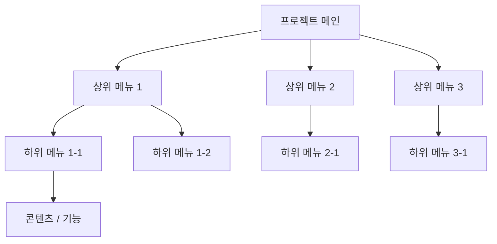

# 📋 가상클라이언트 기반 분석 결과 보고서 (양식)

> **프로젝트명**: [프로젝트 명칭 입력]  
> **작성자**: [작성자 이름 / 직책]  
> **작성일자**: YYYY-MM-DD  
> **버전**: v1.0  

---

## 1. 가상 클라이언트 개요 & 기본 정보

### 1.1 기본 정의
- **프로젝트 중심 주제**: 
- **제작 목적**: 
- **적용 매체 (Target Medium)**: [ ] 웹 (Web) / [ ] 모바일 (App/Mobile Web) / [ ] 스마트워치 / [ ] 기타 (   )

### 1.2 클라이언트 제공 자료 (Pre-provided Assets)
- **사전 자료 / 기획안**: 
- **참고 자료 / 벤치마크**: 
- **데이터셋 / 콘텐츠 라이브러리**: 

---

## 2. 클라이언트 요구사항 수집 및 분석 (Requirements Gathering)

| 번호 | 클라이언트 요청 내용 | 관련 자료 | 중요도 (우선순위) | 신뢰성 / 검토 의견 |
| :---: | :--- | :--- | :---: | :--- |
| **REQ-01** | *예: 메인 화면에 신제품 롤링 배너 및 이벤트 노출* | 사전 자료 p.3 | 🔴 높음 | 신제품 고화질 이미지 보유 확인 |
| **REQ-02** | *예: 카테고리별 다중 필터링 검색 기능* | 참고 자료 A | 🟡 보통 | 데이터셋 속성 분류 정리 필요 |
| **REQ-03** | *예: 소셜 로그인 및 간편 결제 연동* | 기획안 p.12 | 🟢 낮음 | PG사 연동 가이드 확인 필요 |
| **REQ-04** | | | | |

---

## 3. 요구사항 정보 단위 변환 및 분해 (Information Taxonomy)

| 요청 ID | 요청 원문 | 정보 유형 | 주제 | 부주제 | 메뉴 계층 | 핵심 콘텐츠 및 기능 |
| :---: | :--- | :---: | :--- | :--- | :--- | :--- |
| **REQ-01** | 신제품 배너 노출 | 이미지/링크 | 프로모션 | 신제품 소식 | 메인 > 배너 | 롤링 배너 Carousel, 상세 이벤트 페이지 링크 |
| **REQ-02** | 카테고리 필터링 검색 | 기능/데이터 | 상품 목록 | 카테고리 검색 | 상품목록 > 필터 | 가격, 색상, 사이즈 다중 선택 필터 |
| **REQ-03** | | | | | | |

> 💡 **참고 (정보 유형)**: 사실(Fact), 개념(Concept), 절차(Procedure), 과정(Process)

---

## 4. 정보 그룹화 및 분류 (Affinity Diagram & Filtering)

- [ ] **그룹화/통합**: 동일 목적의 기능 및 정보 묶음 처리
- [ ] **중복 제거**: 중복 요청 항목 통합 관리
- [ ] **우선순위 결정**: 중요도 및 사용성 기준 노출 순서 정의
- [ ] **자료 유형 구분**: 이미지 / 영상 / 텍스트 / 데이터셋 구분

```
[그룹 1: 사용자 계정 및 인증] -> 회원가입, 로그인, 마이페이지, 프로필 수정
[그룹 2: 상품 탐색 및 검색]   -> 통합검색, 카테고리 필터, 상세페이지, 추천상품
[그룹 3: 주문 및 결제]       -> 장바구니, 주문서 작성, 결제수단 선택, 배송조회
```

---

## 5. 정보 구조 및 계층 설계 (Information Architecture - IA)

### 5.1 IA 구조 트리 (Mermaid Diagram 예시)



### 5.2 메뉴 계층 준수 사항 체크
- [ ] **메뉴 폭 (Width)**: 한 단계 당 5~9개 이내 준수 여부
- [ ] **메뉴 깊이 (Depth)**: 최대 5단계 이내 준수 여부 (권장 3~4단계)

---

## 6. 레이블링 시스템 (Labeling System)

| 기존/임시 레이블 | 최종 적용 레이블 | 검토 항목 (의미 명확성 / 일관성 / 위치 직관성) |
| :--- | :--- | :--- |
| *마이* | **마이페이지** | 직관적인 명칭으로 변경하여 이해도 향상 |
| *쇼핑하기* | **상품 목록** | 타 상위 메뉴와의 품사 및 명명 규칙 일관성 확보 |
| | | |

---

## 7. 내비게이션 구조 설계 (Navigation Design)

- **글로벌 내비게이션 (GNB)**: 
- **로컬 내비게이션 (LNB)**: 
- **브레드크럼 (Breadcrumb)**: 
- **검색 및 보조 요소**: 
- **유저 저니 / 핵심 경로 (User Flow)**:  
  `[시작 화면]` ➔ `[메인]` ➔ `[카테고리]` ➔ `[상세 페이지]` ➔ `[결제/목표 달성]`

---

## 8. 와이어프레임 & 화면 영역 배치 (Wireframe Layout)

| 화면 영역 | 배치 요소 및 콘텐츠 | 비고 / 주요 반응형 동작 |
| :--- | :--- | :--- |
| **Header** | 로고, GNB, 검색창, 로그인/회원가입, 장바구니 | 상단 고정 (Sticky Header) |
| **Navigation** | 1차/2차 카테고리 드롭다운, 브레드크럼 | Mobile 시 햄버거 메뉴 전환 |
| **Body (Main)** | 메인 롤링 배너, 추천 상품 Grid, 핵심 기능 섹션 | Dynamic Layout (Flex/Grid) |
| **Aside** | 최근 본 상품, 퀵 메뉴, Top 버튼 | 화면 우측 레이어 고정 |
| **Footer** | 기업 정보, 이용약관, 개인정보처리방침, 저작권 표시 | 하단 영역 |

---

## 9. 최종 검토 및 검증 (Quality Check & Audit)

### Checklist
- [ ] **요청사항 반영률**: 클라이언트 요구사항 100% 반영 여부
- [ ] **중복/누락 검증**: 정보 분류 과정에서 빠지거나 중복된 요소가 없는가?
- [ ] **이해도 & 직관성**: 사용자가 원하는 정보/기능을 3클릭 이내에 쉽게 찾을 수 있는가?
- [ ] **구조 적절성**: 메뉴 깊이가 지나치게 깊거나 퍼져있지 않은가?
- [ ] **일관성**: 레이블명과 UI 컴포넌트의 스타일 및 명칭이 통일되었는가?
- [ ] **반응형/다중 매체 대응**: 웹, 모바일 등 다양한 화면 환경에서도 내비게이션 및 정보 접근이 유효한가?

### 검토 결과 요약
- **누락/추가 필요 항목**: 
- **중복/통합 조치 사항**: 
- **UX 개선 포인트**: 
- **최종 수정 및 반영 내용**: 
