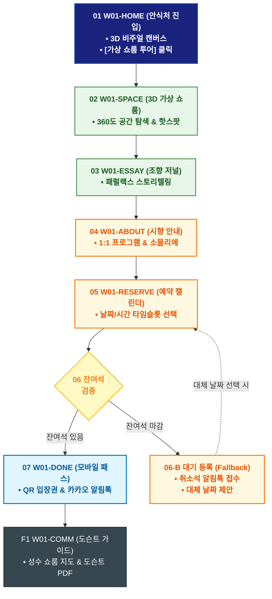

# 🔄 WICKETA 차은채 서비스 흐름도 [목적 1: 3D 가상 아포테케리 공간 투어 & 프라이빗 시향 세션 예약]

> **프로젝트명**: WICKETA D2C 안식처 플랫폼 (브랜딩 공간 & 시향 예약 프로세스)  
> **분석 대상 클라이언트**: [`[가상클라이언트_01] 차은채_WICKETA총괄디렉터_D2C안식처.txt`](file:///C:/Users/user/Desktop/이지희%20에이전트/설계%20마저%20해오기/자동화/03_클라이언트/01_가상_클라이언트/[가상클라이언트_01]%20차은채_WICKETA총괄디렉터_D2C안식처.txt)  
> **기준 사이트맵 문서**: [`C:\Users\SBS\Desktop\0819 이지희\한명씩 화면 설계도 진행\자동화\04_설계_및_스토리보드\03_사이트맵\01_차은채\사이트맵_목적1_브랜딩공간.md`](file:///C:/Users/SBS/Desktop/0819%20%EC%9D%B4%EC%A7%80%ED%9D%AC/%ED%95%9C%EB%AA%85%EC%94%A9%20%ED%99%94%EB%A9%B4%20%EC%84%A4%EA%B3%84%EB%8F%84%20%EC%A7%84%ED%96%89/%EC%9E%90%EB%8F%99%ED%99%94/04_%EC%84%A4%EA%B3%84_%EB%B0%8F_%EC%8A%A4%ED%86%A0%EB%A6%AC%EB%B3%B4%EB%93%9C/03_%EC%82%AC%EC%9D%B4%ED%8A%B8%EB%A7%B5/01_%EC%B0%A8%EC%9D%80%EC%B1%84/사이트맵_목적1_브랜딩공간.md)  
> **접속 목적**: 3D 가상 아포테케리 쇼룸 탐색 및 성수동 오프라인 1:1 시향 세션 예약  
> **목적별 고유 킬러 기능**: **3D 가상 아포테케리 쇼룸 (`3D-SPACE-01`) & 프라이빗 시향 예약 캘린더 (`RESERVATION-CALENDAR-01`)**  
> **작성일자**: 2026년 8월 19일  
> **작성자**: Antigravity UI/UX 설계팀  
> **문서 인코딩**: UTF-8 (유니코드)  

---

## 1. 목적별 핵심 서비스 흐름 개요

브랜드 세계관과 3D 가상 쇼룸을 탐색하고, 성수 쇼룸 1:1 시향 세션을 실시간 예약하여 모바일 시향 패스를 발급받는 무결제 예약 프로세스

---

## 2. 목적 맞춤형 가변 여정 스테이지 (Dynamic Journey Stages)

### 🏛️ Stage 1: 가상 아포테케리 공간 탐색
- **01 안식처 메인 진입 (`W01-HOME`)**: 1200x380 시네마틱 3D 비주얼 확인 ➔ 3초 앰비언트 사운드 재생 ➔ [가상 쇼룸 투어하기] 클릭
- **02 3D 가상 쇼룸 투어 (`W01-SPACE`)**: 360도 공간 회전 ➔ 주요 원료 인터랙티브 핫스팟(Hotspot) 탭 ➔ 공간 앰비언트 몰입

### 📖 Stage 2: 조향 철학 에세이 & 프로그램 안내
- **03 디렉터 조향 철학 저널 (`W01-ESSAY`)**: 디렉터 차은채의 조향 철학 및 희귀 원료(심야 침향, 백차) 패럴랙스 저널 감상
- **04 프라이빗 시향 프로그램 확인 (`W01-ABOUT`)**: 1:1 티 페어링 세션 프로그램 소개 및 전담 티 소믈리에 프로필 검토

### 📅 Stage 3: 실시간 캘린더 예약 & 잔여석 검증 분기
- **05 날짜/시간 타임슬롯 지정 (`W01-RESERVE`)**: 실시간 예약 캘린더 로딩 ➔ 방문 일자 및 시간대 선택 ➔ 인원(1~2인) 지정
- **06 잔여석 검증 및 예외 처리 분기 (`W01-RESERVE`)**: 
  - `[조건: 잔여석 있음]` ➔ 카카오 연락처 자동 인증 ➔ 예약 접수 완료
  - `[조건: 잔여석 마감(Fallback)]` ➔ [취소석 발생 시 실시간 알림 받기] 대기 등록 ➔ 대체 날짜 추천

### 🎫 Stage 4: 모바일 시향 패스 발급 & 도슨트 가이드
- **07 모바일 시향 패스 발급 (`W01-DONE`)**: 고유 예약 번호 및 QR 모바일 입장권 발급 ➔ 카카오 알림톡 즉시 전송
- **F1 쇼룸 방문 가이드 & 도슨트 (`W01-COMM`)**: 성수 쇼룸 오시는 길 인터랙티브 맵 확인 ➔ VIP 도슨트 안내서 PDF 다운로드

---

## 3. 단계별 명세표 (Flow Matrix Table)

| 단계 ID | 단계 명칭 | 사용자 행동 (User Action) | 화면 접점 (Screen ID) | 서비스/시스템 반응 (System Response) | 매핑 요구사항 | 다음 진입 조건 |
| :---: | :--- | :--- | :--- | :--- | :--- | :--- |
| **01** | 안식처 진입 | 메인 비주얼 감상 및 [쇼룸 투어] 클릭 | `W01-HOME` | 3초 앰비언트 사운드 재생, 쇼룸 캔버스 로딩 | `REQ-01 세계관 전달` | 02 쇼룸 투어 |
| **02** | 3D 공간 투어 | 360도 가상 공간 회전 및 핫스팟 탭 | `W01-SPACE` | 원료별 테이스팅 노트 팝업 및 공간 음향 전환 | `REQ-05 가상 쇼룸` | 03 철학 탐색 |
| **03** | 조향 철학 탐색 | 디렉터 에세이 저널 스크롤 | `W01-ESSAY` | 패럴랙스 스토리텔링 인터랙션 노출 | `REQ-01 에디토리얼 저널` | 04 시향 안내 |
| **04** | 시향 안내 확인 | 1:1 시향 프로그램 및 소믈리에 확인 | `W01-ABOUT` | 세션 커리큘럼 및 성수 쇼룸 소개 렌더링 | `REQ-05 시향 프로그램` | 05 캘린더 예약 |
| **05** | 타임슬롯 지정 | 예약 일자 및 시간대 선택 | `W01-RESERVE` | 실시간 잔여석 데이터 쿼리 및 좌석 검증 | `REQ-06 간편 예약` | 06 검증 분기 |
| **06-A** | [성공] 예약 확정 | 카카오 연락처 확인 후 [예약 확정] | `W01-RESERVE` | 예약 데이터 DB 등록 및 QR 입장권 생성 | `REQ-06 카카오 연동` | 07 패스 발급 |
| **06-B** | [예외] 마감 대기 | 취소석 알림 신청 클릭 (Fallback) | `W01-RESERVE` | 카카오 알림톡 대기 큐 등록 및 대체일 안내 | `예외 처리 복구` | 대체일 선택 |
| **07** | 모바일 패스 | 발급된 QR 시향 패스 확인 | `W01-DONE` | 모바일 입장권 렌더링 및 알림톡 발송 | `REQ-06 모바일 패스` | F1 도슨트 가이드 |
| **F1** | 도슨트 가이드 | 성수 쇼룸 오시는 길 및 PDF 확인 | `W01-COMM` | 지도 뷰어 및 도슨트 가이드북 다운로드 | `브랜드 충성도 지속` | 여정 완료 |

---

## 4. 목적별 서비스 흐름도 다이어그램 (Mermaid)

---

## 5. 최종 품질 검토 및 연계 설계 문서

- [x] **고정 템플릿 탈피**: 목적별 특성에 맞춘 독자적 가변 스테이지 및 분기 조건 반영
- [x] **예외 상황(Fallback) 및 루프 완비**: 마감, 결제 실패, 글자수 오류, 연속 출석 등의 분기/복구 파이프라인 수록
- [x] **연계 사이트맵**: [`사이트맵_목적1_브랜딩공간.md`](file:///C:/Users/SBS/Desktop/0819%20%EC%9D%B4%EC%A7%80%ED%9D%AC/%ED%95%9C%EB%AA%85%EC%94%A9%20%ED%99%94%EB%A9%B4%20%EC%84%A4%EA%B3%84%EB%8F%84%20%EC%A7%84%ED%96%89/%EC%9E%90%EB%8F%99%ED%99%94/04_%EC%84%A4%EA%B3%84_%EB%B0%8F_%EC%8A%A4%ED%86%A0%EB%A6%AC%EB%B3%B4%EB%93%9C/03_%EC%82%AC%EC%9D%B4%ED%8A%B8%EB%A7%B5/01_%EC%B0%A8%EC%9D%80%EC%B1%84/사이트맵_목적1_브랜딩공간.md)
