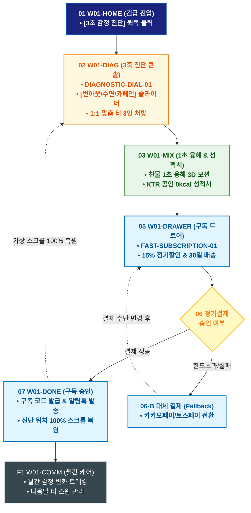

# 🔄 WICKETA 차은채 서비스 흐름도 [목적 2: 긴급 번아웃 3축 감정 진단 & 초고속 D2C 정기구독]

> **프로젝트명**: WICKETA D2C 안식처 플랫폼 (감정 처방 & 초고속 정기구독 프로세스)  
> **분석 대상 클라이언트**: [`[가상클라이언트_01] 차은채_WICKETA총괄디렉터_D2C안식처.txt`](file:///C:/Users/user/Desktop/이지희%20에이전트/설계%20마저%20해오기/자동화/03_클라이언트/01_가상_클라이언트/[가상클라이언트_01]%20차은채_WICKETA총괄디렉터_D2C안식처.txt)  
> **기준 사이트맵 문서**: [`C:\Users\SBS\Desktop\0819 이지희\한명씩 화면 설계도 진행\자동화\04_설계_및_스토리보드\03_사이트맵\01_차은채\사이트맵_목적2_감정구독.md`](file:///C:/Users/SBS/Desktop/0819%20%EC%9D%B4%EC%A7%80%ED%9D%AC/%ED%95%9C%EB%AA%85%EC%94%A9%20%ED%99%94%EB%A9%B4%20%EC%84%A4%EA%B3%84%EB%8F%84%20%EC%A7%84%ED%96%89/%EC%9E%90%EB%8F%99%ED%99%94/04_%EC%84%A4%EA%B3%84_%EB%B0%8F_%EC%8A%A4%ED%86%A0%EB%A6%AC%EB%B3%B4%EB%93%9C/03_%EC%82%AC%EC%9D%B4%ED%8A%B8%EB%A7%B5/01_%EC%B0%A8%EC%9D%80%EC%B1%84/사이트맵_목적2_감정구독.md)  
> **접속 목적**: 긴급 번아웃 3축 감정 진단 및 15% D2C 정기구독 1초 완료  
> **목적별 고유 킬러 기능**: **3축 감정 다이얼 진단기 (`DIAGNOSTIC-DIAL-01`) & 15% 정기구독 Slide-out Cart (`FAST-SUBSCRIPTION-01`)**  
> **작성일자**: 2026년 8월 19일  
> **작성자**: Antigravity UI/UX 설계팀  
> **문서 인코딩**: UTF-8 (유니코드)  

---

## 1. 목적별 핵심 서비스 흐름 개요

퇴근 후 번아웃 상태에서 복잡한 탐색 없이 3축 다이얼로 안식 티를 처방받고, 1초 융해 확인 후 페이지 무이탈 1-Click 정기구독을 완료하는 초고속 파이프라인

---

## 2. 목적 맞춤형 가변 여정 스테이지 (Dynamic Journey Stages)

### ⚡ Stage 1: 3축 감정 상태 긴급 진단
- **01 긴급 처방 메인 진입 (`W01-HOME`)**: 히어로 배너 [지금 내 감정 3초 진단하기] 퀵독 클릭 ➔ `W01-DIAG` 즉시 호출
- **02 3축 감정 다이얼 조작 (`W01-DIAG`)**: [번아웃 / 수면부족 / 카페인 민감도] 3개의 원형 슬라이더 조작 ➔ 1:1 맞춤 안식 티 3안 처방 산출

### 🔬 Stage 2: 클린 포뮬러 & 1초 융해 3D 검증
- **03 찬물 1초 융해 검증 (`W01-MIX`)**: 찬물/탄산수 투입 시 1초 만에 분자 단위로 녹아드는 3D 수색 모션 확인
- **04 KTR 공인 성적서 확인 (`W01-MIX`)**: 0kcal, 0.00mg 무카페인 공인 시험성적서 원클릭 열람

### 🛒 Stage 3: Slide-out Cart Drawer 무이탈 1초 정기결제
- **05 슬라이드아웃 Cart 오픈 (`W01-DRAWER`)**: 페이지 이동 없이 우측 오버레이 Cart Drawer 호출 ➔ 30일 배송 플랜 & 15% 자동할인 적용
- **06 1초 간편결제 및 승인 검증 (`W01-DRAWER`)**:
  - `[조건: 결제 승인]` ➔ 정기구독 멤버십 즉시 발급 ➔ 1회차 즉시 출고 큐 등록
  - `[조건: 한도초과/실패(Fallback)]` ➔ 카카오페이/Apple Pay 원클릭 대체 결제창 전환

### 🌿 Stage 4: 구독 승인 & 월간 감정 리포트 케어
- **07 정기구독 승인 & 스크롤 복원 (`W01-DONE`)**: 구독 코드 발급 ➔ **보고 있던 진단 화면 위치로 100% 가상 스크롤 복원**
- **F1 월간 감정 리포트 연동 (`W01-COMM`)**: 월간 감정 변화 그래프 트래킹 ➔ 다음 달 원료 스왑(Swap) 및 배송 주기 변경 설정

---

## 3. 단계별 명세표 (Flow Matrix Table)

| 단계 ID | 단계 명칭 | 사용자 행동 (User Action) | 화면 접점 (Screen ID) | 서비스/시스템 반응 (System Response) | 매핑 요구사항 | 다음 진입 조건 |
| :---: | :--- | :--- | :--- | :--- | :--- | :--- |
| **01** | 긴급 진입 | [3초 감정 진단] 퀵독 클릭 | `W01-HOME` | 화면 전환 없이 진단 콘솔 즉시 오버레이 로딩 | `REQ-02 신속 진입` | 02 3축 진단 |
| **02** | 3축 감정 진단 | 번아웃/수면/카페인 다이얼 조작 | `W01-DIAG` | 실시간 파라미터 계산, 맞춤 티 3안 처방 렌더링 | `REQ-02 감정 진단기` | 03 1초 융해 |
| **03** | 1초 융해 검증 | 찬물 1초 융해 3D 모션 재생 | `W01-MIX` | 3D 수색 변화 시뮬레이션 및 성분표 로딩 | `REQ-04 클린 포뮬러` | 04 성적서 확인 |
| **04** | 성적서 확인 | KTR 공인 시험성적서 탭 | `W01-MIX` | 0kcal/무카페인 성적서 모달 오버레이 | `REQ-04 공인 성적서` | 05 구독 호출 |
| **05** | 구독 Cart 호출 | [15% 정기구독 신청] 클릭 | `W01-DRAWER` | Slide-out Drawer 오픈, 15% 할인 및 30일 배송 설정 | `REQ-06 Cart Drawer` | 06 1초 결제 |
| **06-A** | [성공] 1초 정기결제 | 간편결제 1-Click 승인 | `W01-DRAWER` | 정기결제 키 발급 및 물류센터 출고 지시 | `REQ-06 1초 결제` | 07 구독 승인 |
| **06-B** | [예외] 결제 실패 | 대체 결제수단 선택 (Fallback) | `W01-DRAWER` | 카카오페이/토스페이 원클릭 간편결제 전환 | `결제 복구` | 결제 재시도 |
| **07** | 구독 승인 & 복원 | 구독 완료 확인 및 스크롤 복원 | `W01-DONE` | 카카오 알림톡 발송 & **진단 위치로 100% 스크롤 복원** | `REQ-06 스크롤 복원` | F1 월간 케어 |
| **F1** | 월간 케어 연동 | 감정 리포트 및 스왑 옵션 확인 | `W01-COMM` | 월간 감정 트래커 갱신, 다음달 티 변경 큐 활성화 | `구독 지속성 유지` | 정기 순환 루프 |

---

## 4. 목적별 서비스 흐름도 다이어그램 (Mermaid)

---

## 5. 최종 품질 검토 및 연계 설계 문서

- [x] **고정 템플릿 탈피**: 목적별 특성에 맞춘 독자적 가변 스테이지 및 분기 조건 반영
- [x] **예외 상황(Fallback) 및 루프 완비**: 마감, 결제 실패, 글자수 오류, 연속 출석 등의 분기/복구 파이프라인 수록
- [x] **연계 사이트맵**: [`사이트맵_목적2_감정구독.md`](file:///C:/Users/SBS/Desktop/0819%20%EC%9D%B4%EC%A7%80%ED%9D%AC/%ED%95%9C%EB%AA%85%EC%94%A9%20%ED%99%94%EB%A9%B4%20%EC%84%A4%EA%B3%84%EB%8F%84%20%EC%A7%84%ED%96%89/%EC%9E%90%EB%8F%99%ED%99%94/04_%EC%84%A4%EA%B3%84_%EB%B0%8F_%EC%8A%A4%ED%86%A0%EB%A6%AC%EB%B3%B4%EB%93%9C/03_%EC%82%AC%EC%9D%B4%ED%8A%B8%EB%A7%B5/01_%EC%B0%A8%EC%9D%80%EC%B1%84/사이트맵_목적2_감정구독.md)
