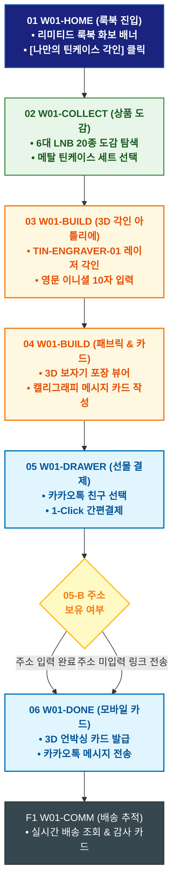

# 🔄 WICKETA 차은채 서비스 흐름도 [목적 3: 디렉터스 룩북 & 3D 틴케이스 이니셜 각인 선물 제작]

> **프로젝트명**: WICKETA D2C 안식처 플랫폼 (비스포크 각인 & 패브릭 선물 프로세스)  
> **분석 대상 클라이언트**: [`[가상클라이언트_01] 차은채_WICKETA총괄디렉터_D2C안식처.txt`](file:///C:/Users/user/Desktop/이지희%20에이전트/설계%20마저%20해오기/자동화/03_클라이언트/01_가상_클라이언트/[가상클라이언트_01]%20차은채_WICKETA총괄디렉터_D2C안식처.txt)  
> **기준 사이트맵 문서**: [`C:\Users\SBS\Desktop\0819 이지희\한명씩 화면 설계도 진행\자동화\04_설계_및_스토리보드\03_사이트맵\01_차은채\사이트맵_목적3_틴케이스선물.md`](file:///C:/Users/SBS/Desktop/0819%20%EC%9D%B4%EC%A7%80%ED%9D%AC/%ED%95%9C%EB%AA%85%EC%94%A9%20%ED%99%94%EB%A9%B4%20%EC%84%A4%EA%B3%84%EB%8F%84%20%EC%A7%84%ED%96%89/%EC%9E%90%EB%8F%99%ED%99%94/04_%EC%84%A4%EA%B3%84_%EB%B0%8F_%EC%8A%A4%ED%86%A0%EB%A6%AC%EB%B3%B4%EB%93%9C/03_%EC%82%AC%EC%9D%B4%ED%8A%B8%EB%A7%B5/01_%EC%B0%A8%EC%9D%80%EC%B1%84/사이트맵_목적3_틴케이스선물.md)  
> **접속 목적**: 디렉터스 컬렉션 룩북 감상 및 메탈 틴 3D 레이저 각인 선물 발송  
> **목적별 고유 킬러 기능**: **3D 라이브 레이저 버닝 각인기 (`TIN-ENGRAVER-01`) & 패브릭 보자기 포장 시뮬레이터 (`FABRIC-VIEWER-01`)**  
> **작성일자**: 2026년 8월 19일  
> **작성자**: Antigravity UI/UX 설계팀  
> **문서 인코딩**: UTF-8 (유니코드)  

---

## 1. 목적별 핵심 서비스 흐름 개요

디렉터스 룩북을 감상하고 한정판 메탈 틴케이스에 레이저로 영문 이니셜을 3D 각인하며 패브릭 보자기 포장을 더해 카카오톡 선물하기로 발송하는 비스포크 선물 여정

---

## 2. 목적 맞춤형 가변 여정 스테이지 (Dynamic Journey Stages)

### 🎨 Stage 1: 디렉터스 컬렉션 룩북 화보 감상
- **01 룩북 화보 진입 (`W01-HOME`)**: 디렉터스 리미티드 룩북 배너 확인 ➔ [나만의 틴케이스 각인하기] 클릭
- **02 20종 상품 도감 탐색 (`W01-COLLECT`)**: 6대 LNB 카테고리별 조향 노트 확인 ➔ 리미티드 메탈 틴케이스 세트 선택

### 🔨 Stage 2: 3D 비스포크 레이저 각인 & 패브릭 포장
- **03 3D 실시간 레이저 각인 (`W01-BUILD`)**: 
  - 영문 이니셜(최대 10자) 입력 ➔ `{글자수/금칙어 검증}` ➔ 메탈 표면 레이저 버닝 3D WebGL 실시간 시뮬레이션
- **04 패브릭 보자기 & 캘리그래피 카드 작성 (`W01-BUILD`)**:
  - 친환경 린넨/세이지 그린 보자기 매듭 360도 회전 뷰어 확인 ➔ 감성 손글씨 메시지 카드 작성

### 🎁 Stage 3: 카카오톡 선물하기 슬라이드아웃 결제
- **05 카카오 선물 Drawer 호출 (`W01-DRAWER`)**: 
  - 카카오톡 친구 선택 ➔ `{친구 주소 보유 여부?}`
  - `[주소 있음]` ➔ 즉시 출고 배송 지정
  - `[주소 없음]` ➔ 카카오톡 선물 링크 자동 생성 ➔ 1-Click 간편결제 승인

### 📦 Stage 4: 3D 언박싱 모바일 카드 발급 & 배송 추적
- **06 모바일 기프트 카드 발송 (`W01-DONE`)**: 받는 사람이 3D로 열어보는 언박싱 모바일 카드 생성 ➔ 카카오톡 즉시 전송
- **F1 실시간 배송 추적 & 감사 루프 (`W01-COMM`)**: 친구 배송지 입력 상태 확인 ➔ 실시간 배송 추적 ➔ 감사 메시지 교환

---

## 3. 단계별 명세표 (Flow Matrix Table)

| 단계 ID | 단계 명칭 | 사용자 행동 (User Action) | 화면 접점 (Screen ID) | 서비스/시스템 반응 (System Response) | 매핑 요구사항 | 다음 진입 조건 |
| :---: | :--- | :--- | :--- | :--- | :--- | :--- |
| **01** | 룩북 진입 | 리미티드 화보 감상 및 [각인 제작] 클릭 | `W01-HOME` | 고해상도 매거진 룩북 및 틴케이스 쇼케이스 로딩 | `REQ-01 에디토리얼 룩북` | 02 도감 선택 |
| **02** | 도감 선택 | 20종 상품 도감 탐색 및 틴세트 선택 | `W01-COLLECT` | 제품 조향 스펙 노출 및 3D 아틀리에 파이프라인 연결 | `REQ-05 디렉터스 컬렉션` | 03 레이저 각인 |
| **03** | 3D 레이저 각인 | 영문 이니셜 입력 및 각인 위치 조정 | `W01-BUILD` | TIN-ENGRAVER-01 실시간 3D 레이저 버닝 시뮬레이션 | `REQ-05 3D 각인기` | 04 보자기 포장 |
| **04** | 보자기 & 카드 | 보자기 매듭 선택 및 축하 문구 작성 | `W01-BUILD` | 360도 포장 회전 렌더링, 캘리그래피 카드 프리뷰 | `REQ-05 감성 메시지` | 05 선물 결제 |
| **05** | 카카오 선물 결제 | 카카오 친구 선택 및 1초 결제 | `W01-DRAWER` | 시스템 결제 승인, 선물 고유 링크 및 바우처 생성 | `REQ-06 카카오 선물하기` | 06 모바일 카드 |
| **06** | 모바일 카드 발급 | 3D 언박싱 모바일 기프트 카드 확인 | `W01-DONE` | 카카오톡 메시지 즉시 전송, 주문 영수증 발급 | `REQ-06 모바일 카드` | F1 배송 추적 |
| **F1** | 배송 추적 루프 | 친구 배송지 입력 현황 및 배송 조회 | `W01-COMM` | 실시간 배송 대시보드 갱신, 감사 카드 교환 | `선물 사후 관리` | 여정 완료 |

---

## 4. 목적별 서비스 흐름도 다이어그램 (Mermaid)

---

## 5. 최종 품질 검토 및 연계 설계 문서

- [x] **고정 템플릿 탈피**: 목적별 특성에 맞춘 독자적 가변 스테이지 및 분기 조건 반영
- [x] **예외 상황(Fallback) 및 루프 완비**: 마감, 결제 실패, 글자수 오류, 연속 출석 등의 분기/복구 파이프라인 수록
- [x] **연계 사이트맵**: [`사이트맵_목적3_틴케이스선물.md`](file:///C:/Users/SBS/Desktop/0819%20%EC%9D%B4%EC%A7%80%ED%9D%AC/%ED%95%9C%EB%AA%85%EC%94%A9%20%ED%99%94%EB%A9%B4%20%EC%84%A4%EA%B3%84%EB%8F%84%20%EC%A7%84%ED%96%89/%EC%9E%90%EB%8F%99%ED%99%94/04_%EC%84%A4%EA%B3%84_%EB%B0%8F_%EC%8A%A4%ED%86%A0%EB%A6%AC%EB%B3%B4%EB%93%9C/03_%EC%82%AC%EC%9D%B4%ED%8A%B8%EB%A7%B5/01_%EC%B0%A8%EC%9D%80%EC%B1%84/사이트맵_목적3_틴케이스선물.md)
