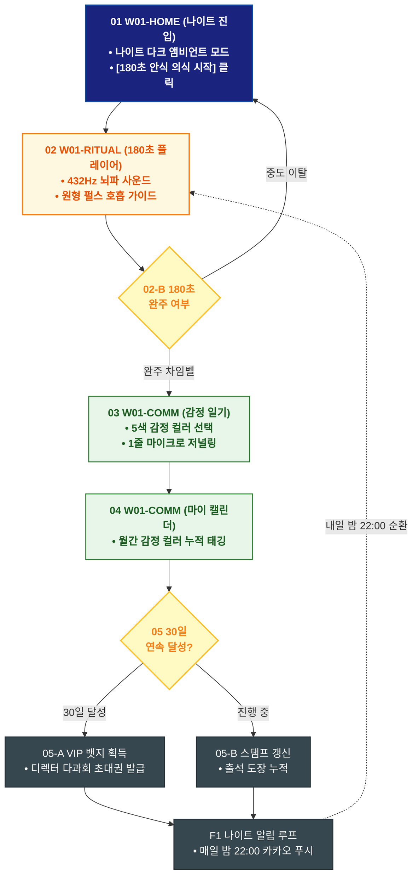

# 🔄 WICKETA 차은채 서비스 흐름도 [목적 4: 180초 안식 의식 실행 & 데일리 감정 일기 아카이빙]

> **프로젝트명**: WICKETA D2C 안식처 플랫폼 (리추얼 플레이어 & 마인드 아카이빙 프로세스)  
> **분석 대상 클라이언트**: [`[가상클라이언트_01] 차은채_WICKETA총괄디렉터_D2C안식처.txt`](file:///C:/Users/user/Desktop/이지희%20에이전트/설계%20마저%20해오기/자동화/03_클라이언트/01_가상_클라이언트/[가상클라이언트_01]%20차은채_WICKETA총괄디렉터_D2C안식처.txt)  
> **기준 사이트맵 문서**: [`C:\Users\SBS\Desktop\0819 이지희\한명씩 화면 설계도 진행\자동화\04_설계_및_스토리보드\03_사이트맵\01_차은채\사이트맵_목적4_리추얼기록.md`](file:///C:/Users/SBS/Desktop/0819%20%EC%9D%B4%EC%A7%80%ED%9D%AC/%ED%95%9C%EB%AA%85%EC%94%A9%20%ED%99%94%EB%A9%B4%20%EC%84%A4%EA%B3%84%EB%8F%84%20%EC%A7%84%ED%96%89/%EC%9E%90%EB%8F%99%ED%99%94/04_%EC%84%A4%EA%B3%84_%EB%B0%8F_%EC%8A%A4%ED%86%A0%EB%A6%AC%EB%B3%B4%EB%93%9C/03_%EC%82%AC%EC%9D%B4%ED%8A%B8%EB%A7%B5/01_%EC%B0%A8%EC%9D%80%EC%B1%84/사이트맵_목적4_리추얼기록.md)  
> **접속 목적**: 180초 안식 의식 실행 및 데일리 감정 일기 30일 챌린지  
> **목적별 고유 킬러 기능**: **432Hz 사운드 & 180초 호흡 타이머 (`RITUAL-PLAYER-01`) & 마이 감정 캘린더 (`EMOTION-CALENDAR-01`)**  
> **작성일자**: 2026년 8월 19일  
> **작성자**: Antigravity UI/UX 설계팀  
> **문서 인코딩**: UTF-8 (유니코드)  

---

## 1. 목적별 핵심 서비스 흐름 개요

매일 밤 432Hz 뇌파 음향과 180초 브루잉 호흡 타이머로 명상을 즐기고, 데일리 1줄 감정 일기를 작성하여 30일 챌린지 뱃지를 획득하는 무결제 웰니스 습관 루프

---

## 2. 목적 맞춤형 가변 여정 스테이지 (Dynamic Journey Stages)

### 🌙 Stage 1: 나이트 안식 환경 세팅
- **01 나이트 안식처 진입 (`W01-HOME`)**: 매일 밤 22:00 접속 ➔ 나이트 다크 앰비언트 모드 자동 활성화 ➔ [180초 안식 의식 시작] 원클릭 실행

### 🧘 Stage 2: 180초 리추얼 플레이어 & 432Hz 명상
- **02 180초 플레이어 실행 (`W01-RITUAL`)**:
  - 화면 조도 50% 딤드(Dimmed) ➔ 432Hz 뇌파 동조 음향(비 소리/숲/싱잉볼) 선택 ➔ 원형 펄스 180초 호흡 가이드
  - `{180초 완주 검증}` ➔ 완주 시 싱잉볼 완료 차임벨 울림 (중도 이탈 시 진행 시간 저장)

### 📝 Stage 3: 데일리 1줄 감정 일기 작성
- **03 1줄 감정 저널링 (`W01-COMM / 일기 모달`)**:
  - 오늘 하루 감정 컬러(5종: 평온/불안/지침/충만/치유) 선택 ➔ 1줄 마이크로 일기 작성 및 저장

### 🏆 Stage 4: 30일 챌린지 뱃지 갱신 & 순환 루프
- **04 마이 감정 캘린더 & 스탬프 갱신 (`W01-COMM`)**:
  - 월간 감정 컬러 캘린더에 오늘의 컬러 스탬프 자동 태깅 ➔ 30일 리추얼 챌린지 출석 도장 갱신
  - `{30일 연속 달성?}` ➔ YES: VIP 다과회 초대 뱃지 획득 ➔ 내일 밤 22:00 카카오 푸시 리마인더 예약

---

## 3. 단계별 명세표 (Flow Matrix Table)

| 단계 ID | 단계 명칭 | 사용자 행동 (User Action) | 화면 접점 (Screen ID) | 서비스/시스템 반응 (System Response) | 매핑 요구사항 | 다음 진입 조건 |
| :---: | :--- | :--- | :--- | :--- | :--- | :--- |
| **01** | 나이트 진입 | [180초 안식 의식 시작] 클릭 | `W01-HOME` | 화면 조도 50% 딤드, 리추얼 플레이어 전면 로딩 | `REQ-01 신속 리추얼` | 02 플레이어 실행 |
| **02** | 180초 명상 | 432Hz 사운드 선택 및 180초 호흡 | `W01-RITUAL` | RITUAL-PLAYER-01 원형 펄스 타이머 작동, 차임벨 울림 | `REQ-03 180초 타이머` | 03 일기 작성 |
| **03** | 1줄 감정 일기 | 5색 감정 컬러 선택 및 1줄 소감 입력 | `W01-COMM` | EMOTION-DIARY-01 감정 데이터 암호화 저장 | `REQ-03 감정 아카이빙` | 04 캘린더 태깅 |
| **04** | 캘린더 태깅 | 마이 감정 캘린더 컬러 누적 확인 | `W01-COMM` | 월간 감정 컬러 캘린더 대시보드 실시간 갱신 | `정서적 추적` | 05 챌린지 갱신 |
| **05** | 30일 챌린지 | 30일 연속 출석 스탬프 확인 | `W01-COMM` | STAMP-BOARD-01 뱃지 획득 검증 및 리워드 지급 | `리텐션 극대화` | F1 알림 루프 |
| **F1** | 나이트 알림 루프| 내일 밤 22:00 알림 리마인더 설정 | `W01-COMM` | 카카오 알림톡 스케줄러 등록, 매일 밤 순환 | `순환 루프 연결` | 다음날 리추얼 |

---

## 4. 목적별 서비스 흐름도 다이어그램 (Mermaid)

---

## 5. 최종 품질 검토 및 연계 설계 문서

- [x] **고정 템플릿 탈피**: 목적별 특성에 맞춘 독자적 가변 스테이지 및 분기 조건 반영
- [x] **예외 상황(Fallback) 및 루프 완비**: 마감, 결제 실패, 글자수 오류, 연속 출석 등의 분기/복구 파이프라인 수록
- [x] **연계 사이트맵**: [`사이트맵_목적4_리추얼기록.md`](file:///C:/Users/SBS/Desktop/0819%20%EC%9D%B4%EC%A7%80%ED%9D%AC/%ED%95%9C%EB%AA%85%EC%94%A9%20%ED%99%94%EB%A9%B4%20%EC%84%A4%EA%B3%84%EB%8F%84%20%EC%A7%84%ED%96%89/%EC%9E%90%EB%8F%99%ED%99%94/04_%EC%84%A4%EA%B3%84_%EB%B0%8F_%EC%8A%A4%ED%86%A0%EB%A6%AC%EB%B3%B4%EB%93%9C/03_%EC%82%AC%EC%9D%B4%ED%8A%B8%EB%A7%B5/01_%EC%B0%A8%EC%9D%80%EC%B1%84/사이트맵_목적4_리추얼기록.md)
