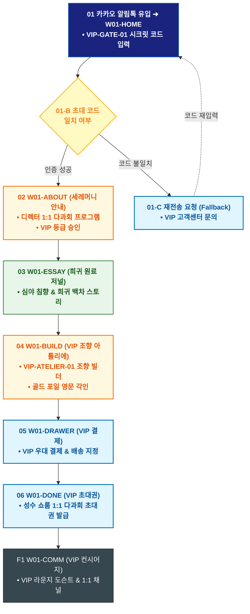

# 🔄 WICKETA 차은채 서비스 흐름도 [목적 5: VIP 멤버십 초청 & 프라이빗 티 세레머니 시즌 오더메이드]

> **프로젝트명**: WICKETA D2C 안식처 플랫폼 (VIP 전용 오더메이드 & 세레머니 프로세스)  
> **분석 대상 클라이언트**: [`[가상클라이언트_01] 차은채_WICKETA총괄디렉터_D2C안식처.txt`](file:///C:/Users/user/Desktop/이지희%20에이전트/설계%20마저%20해오기/자동화/03_클라이언트/01_가상_클라이언트/[가상클라이언트_01]%20차은채_WICKETA총괄디렉터_D2C안식처.txt)  
> **기준 사이트맵 문서**: [`C:\Users\SBS\Desktop\0819 이지희\한명씩 화면 설계도 진행\자동화\04_설계_및_스토리보드\03_사이트맵\01_차은채\사이트맵_목적5_VIP오더메이드.md`](file:///C:/Users/SBS/Desktop/0819%20%EC%9D%B4%EC%A7%80%ED%9D%AC/%ED%95%9C%EB%AA%85%EC%94%A9%20%ED%99%94%EB%A9%B4%20%EC%84%A4%EA%B3%84%EB%8F%84%20%EC%A7%84%ED%96%89/%EC%9E%90%EB%8F%99%ED%99%94/04_%EC%84%A4%EA%B3%84_%EB%B0%8F_%EC%8A%A4%ED%86%A0%EB%A6%AC%EB%B3%B4%EB%93%9C/03_%EC%82%AC%EC%9D%B4%ED%8A%B8%EB%A7%B5/01_%EC%B0%A8%EC%9D%80%EC%B1%84/사이트맵_목적5_VIP오더메이드.md)  
> **접속 목적**: VIP 초대 코드 인증 및 시즌 희귀 원료 맞춤 조향/다과회 초대  
> **목적별 고유 킬러 기능**: **VIP 프라이빗 세레머니 캘린더 & 시즌 맞춤 조향 빌더 (`VIP-ATELIER-01`)**  
> **작성일자**: 2026년 8월 19일  
> **작성자**: Antigravity UI/UX 설계팀  
> **문서 인코딩**: UTF-8 (유니코드)  

---

## 1. 목적별 핵심 서비스 흐름 개요

카카오 VIP 프라이빗 초청 알림을 통해 VIP 아틀리에에 접속하여, 차은채 디렉터와의 1:1 티 세레머니 프로그램을 확인하고 시즌 한정 맞춤 조향 티를 오더메이드하여 쇼룸 VIP 초대권을 발급받는 럭셔리 여정

---

## 2. 목적 맞춤형 가변 여정 스테이지 (Dynamic Journey Stages)

### 🗝️ Stage 1: VIP 시크릿 게이트 코드 인증
- **01 VIP 게이트 진입 (`W01-HOME / VIP 게이트`)**: 카카오톡 VIP 전용 링크 유입 ➔ 시크릿 초대 코드 입력 ➔ `{코드 일치 검증}` (일치 시 다크 골드 VIP 테마 해금, 불일치 시 재전송)

### ☕ Stage 2: VIP 세레머니 프로그램 안내 & 희귀 원료 탐색
- **02 1:1 티 세레머니 안내 (`W01-ABOUT`)**: 차은채 디렉터와 함께하는 성수 쇼룸 VIP 라운지 1:1 다과회 및 티 페어링 프로그램 확인
- **03 시즌 한정 희귀 원료 저널 (`W01-ESSAY`)**: 심야 침향, 희귀 백차 추출액 등 연간 한정 공급되는 희귀 원료 스펙 검토

### ✨ Stage 3: 시즌 오더메이드 비스포크 조향 & 골드 각인
- **04 VIP 맞춤 조향 빌더 (`W01-BUILD`)**: 
  - 희귀 원료 블렌딩 비율(0.1g 정밀도) 설정 ➔ 최고급 매트 블랙 틴에 골드 포일(Gold Foil) 영문 각인 ➔ 전통 비단 보자기 포장 선택

### 🎫 Stage 4: VIP 우대 결제 & 다과회 초대권 발급
- **05 VIP 슬라이드아웃 결제 (`W01-DRAWER`)**: VIP 멤버십 우대 혜택 적용 ➔ 전담 안심 배송지 확인 ➔ 1초 간편결제
- **06 VIP 모바일 초대권 발급 (`W01-DONE`)**: 성수 쇼룸 1:1 다과회 VIP 모바일 초대권 발급 ➔ 카카오 알림톡 전송
- **F1 VIP 라운지 컨시어지 (`W01-COMM`)**: 쇼룸 VIP 라운지 도슨트 안내서 다운로드 ➔ 1:1 전담 컨시어지 채널 연결

---

## 3. 단계별 명세표 (Flow Matrix Table)

| 단계 ID | 단계 명칭 | 사용자 행동 (User Action) | 화면 접점 (Screen ID) | 서비스/시스템 반응 (System Response) | 매핑 요구사항 | 다음 진입 조건 |
| :---: | :--- | :--- | :--- | :--- | :--- | :--- |
| **01** | VIP 게이트 | VIP 초대 코드 입력 및 [인증] 클릭 | `W01-HOME` | VIP-GATE-01 코드 검증, 다크 골드 VIP 테마 로딩 | `REQ-05 VIP 게이트` | 02 세레머니 안내 |
| **02** | 세레머니 안내 | 1:1 디렉터 다과회 프로그램 검토 | `W01-ABOUT` | VIP-PROGRAM-01 세션 소개 및 VIP 멤버십 혜택 노출 | `REQ-05 VIP 다과회` | 03 희귀 원료 |
| **03** | 희귀 원료 탐색 | 심야 침향 & 백차 추출액 스펙 확인 | `W01-ESSAY` | 희귀 원료 조향 노트 및 한정 수량 데이터 렌더링 | `REQ-01 희귀 원료` | 04 맞춤 조향 |
| **04** | 맞춤 조향 & 각인| 희귀 원료 배합 및 골드 각인 입력 | `W01-BUILD` | VIP-ATELIER-01 골드 포일 영문 각인 3D 프리뷰 | `REQ-05 오더메이드` | 05 VIP 결제 |
| **05** | VIP 결제 | VIP 멤버십 우대 결제 승인 | `W01-DRAWER` | VIP 전담 출고 큐 등록, 다과회 타임슬롯 자동 예약 | `REQ-06 VIP 결제` | 06 초대권 발급 |
| **06** | VIP 초대권 발급 | 모바일 VIP 다과회 초대권 확인 | `W01-DONE` | 성수 쇼룸 VIP 세레머니 모바일 초대권 발급 | `REQ-06 모바일 초대권` | F1 컨시어지 |
| **F1** | VIP 컨시어지 | VIP 도슨트 확인 및 1:1 채널 연결 | `W01-COMM` | VIP 전담 컨시어지 안내 및 라운지 길안내 가이드 | `VIP 락인 강화` | 여정 완료 |

---

## 4. 목적별 서비스 흐름도 다이어그램 (Mermaid)

---

## 5. 최종 품질 검토 및 연계 설계 문서

- [x] **고정 템플릿 탈피**: 목적별 특성에 맞춘 독자적 가변 스테이지 및 분기 조건 반영
- [x] **예외 상황(Fallback) 및 루프 완비**: 마감, 결제 실패, 글자수 오류, 연속 출석 등의 분기/복구 파이프라인 수록
- [x] **연계 사이트맵**: [`사이트맵_목적5_VIP오더메이드.md`](file:///C:/Users/SBS/Desktop/0819%20%EC%9D%B4%EC%A7%80%ED%9D%AC/%ED%95%9C%EB%AA%85%EC%94%A9%20%ED%99%94%EB%A9%B4%20%EC%84%A4%EA%B3%84%EB%8F%84%20%EC%A7%84%ED%96%89/%EC%9E%90%EB%8F%99%ED%99%94/04_%EC%84%A4%EA%B3%84_%EB%B0%8F_%EC%8A%A4%ED%86%A0%EB%A6%AC%EB%B3%B4%EB%93%9C/03_%EC%82%AC%EC%9D%B4%ED%8A%B8%EB%A7%B5/01_%EC%B0%A8%EC%9D%80%EC%B1%84/사이트맵_목적5_VIP오더메이드.md)
