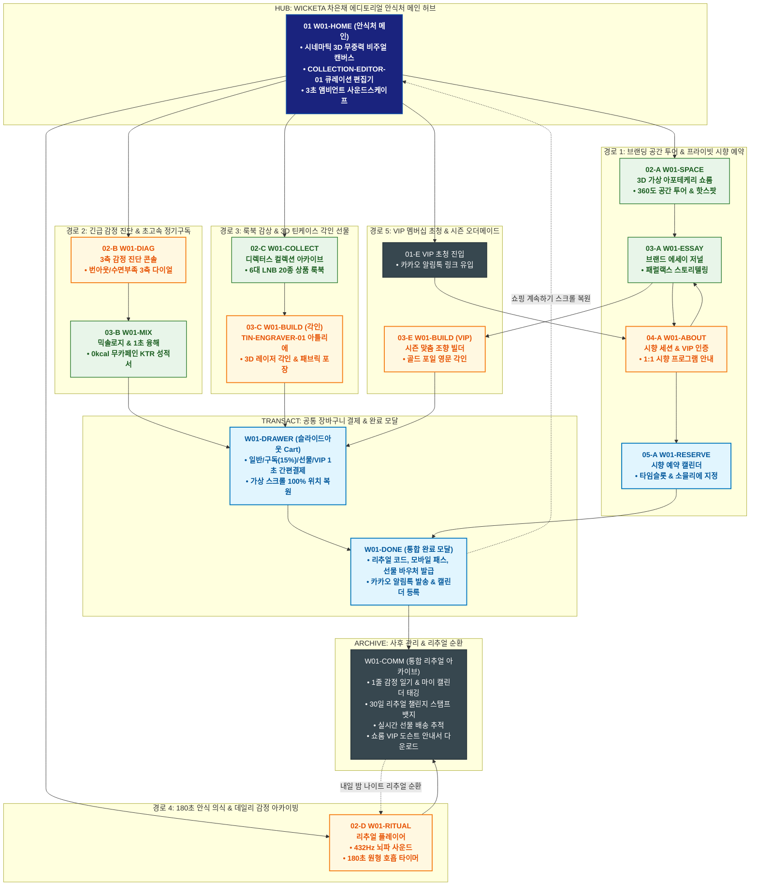

# 🔄 WICKETA 차은채 통합 서비스 흐름도 (Master Integrated Service Flow)

> **프로젝트명**: WICKETA D2C 안식처 플랫폼 (차은채 총괄 에디토리얼 안식처 마스터)  
> **분석 대상 클라이언트**: [`[가상클라이언트_01] 차은채_WICKETA총괄디렉터_D2C안식처.txt`](file:///C:/Users/user/Desktop/이지희%20에이전트/설계%20마저%20해오기/자동화/03_클라이언트/01_가상_클라이언트/[가상클라이언트_01]%20차은채_WICKETA총괄디렉터_D2C안식처.txt)  
> **기준 사이트맵 문서**: [`C:\Users\user\Desktop\이지희 에이전트\설계 마저 해오기\자동화\04_설계_및_스토리보드\03_사이트맵\01_차은채\사이트맵.md`](file:///C:/Users/user/Desktop/이지희%20에이전트/설계%20마저%20해오기/자동화/04_설계_및_스토리보드/03_사이트맵/01_차은채/사이트맵.md)  
> **기준 클라이언트 분석서**: [`[클라이언트01]_차은채_WICKETA총괄디렉터_D2C안식처.md`](file:///C:/Users/user/Desktop/이지희%20에이전트/설계%20마저%20해오기/자동화/03_클라이언트/02_클라이언트_분석/[클라이언트01]_차은채_WICKETA총괄디렉터_D2C안식처.md)  
> **적용 레이아웃 아키타입**: `A-1 에디토리얼 스토리텔링형 (Editorial Sanctuary)`  
> **통합 핵심 킬러 기능**: **디렉터스 큐레이션 편집기 (`COLLECTION-EDITOR-01`) & 3축 감정 진단기 (`DIAGNOSTIC-DIAL-01`) & 3D 레이저 각인기 (`TIN-ENGRAVER-01`) & 180초 안식 플레이어 (`RITUAL-PLAYER-01`) & VIP 아틀리에 (`VIP-ATELIER-01`)**  
> **작성일자**: 2026년 8월 19일  
> **작성자**: Antigravity UI/UX 총괄 설계팀  
> **문서 인코딩**: UTF-8 (유니코드)  

---

## 1. 5대 목적별 서비스 흐름 비교 및 요구사항 통합 분석

본 문서는 차은채 클라이언트의 **5대 독립적 서비스 이용 목적(브랜딩/시향 예약, 긴급 감정구독, 틴케이스 선물 제작, 180초 리추얼 아카이빙, VIP 오더메이드)**을 종합 분석하여, **중복 화면을 단일 화면 허브로 통합**하고 **고유 목적별 경로(User Journey Path)와 핵심 요구사항을 누락 없이 체계화한 마스터 서비스 흐름도**입니다.

### 1.1 공통 요구사항 vs 클라이언트 고유 요구사항 분석표

| 구분 | 공통 요구사항 (Common Baseline) | 클라이언트 고유 요구사항 (Unique Specialization) | 최종 통합 서비스 적용 방안 |
| :--- | :--- | :--- | :--- |
| **메인 진입 & 세계관** | • 3D 시네마틱 무중력 비주얼 캔버스<br/>• 3초 앰비언트 사운드스케이프<br/>• GNB/LNB 전역 내비게이션 | • **`COLLECTION-EDITOR-01`**: 디렉터의 선택 근거를 조작하는 60% 비중 인터랙티브 모듈<br/>• VIP 전용 프라이빗 아틀리에 진입 모달 | `W01-HOME`을 메인 안식처 허브로 구성하고, 상단에 에디토리얼 비주얼 캔버스와 디렉터스 큐레이션 편집기를 상시 배치 |
| **감정 진단 & 처방** | • 사용자 상태 기반 제품 추천<br/>• 0kcal 무카페인 클린 포뮬러 검증표 | • **`DIAGNOSTIC-DIAL-01`**: [번아웃/수면부족/카페인] 3축 감정 다이얼 진단기<br/>• 1:1 맞춤형 블렌딩 티 3안 실시간 처방 알고리즘 | `W01-DIAG` 콘솔에서 3축 다이얼을 통해 즉시 처방 도출 후 `W01-MIX`에서 1초 융해 3D 수색 변화 검증 연계 |
| **커스텀 & 선물 제작** | • 선물 포장 옵션 및 배송지 입력<br/>• 모바일 기프트 카드 발급 | • **`TIN-ENGRAVER-01`**: 메탈 틴케이스 실시간 3D 레이저 버닝 각인기<br/>• VIP 골드 포일 영문 각인 & 패브릭 보자기 포장 뷰어 | `W01-BUILD` 아틀리에에 3D 실시간 각인 및 패브릭 포장 시뮬레이터를 통합 구축 |
| **리추얼 & 사운드** | • 브루잉 가이드 및 타이머 기능<br/>• 출석 및 리워드 적립 | • **`RITUAL-PLAYER-01`**: 432Hz 뇌파 동조 사운드 & 180초 원형 펄스 호흡 타이머<br/>• 데일리 1줄 감정 일기 & 30일 챌린지 뱃지 루프 | `W01-RITUAL` 전면 플레이어로 3분 노동 없는 휴식을 제공하고 `W01-COMM`에서 감정 일기 아카이빙 순환 연계 |
| **예약 & 멤버십** | • 오프라인 매장 안내 및 예약<br/>• 회원 등급 관리 | • 성수 프라이빗 1:1 시향 세션 예약 캘린더<br/>• 차은채 디렉터 시즌 오더메이드 VIP 다과회 세레머니 | `W01-ABOUT` 및 `W01-RESERVE`에서 시향 세션 타임슬롯 예약과 VIP 오더메이드 초대권 발급 처리 |
| **장바구니 & 결제** | • 장바구니 품목 관리 및 간편결제<br/>• 모바일 주문 완료 알림 | • **Slide-out Cart Drawer**: 페이지 무이탈 1-Click 정기구독/선물/VIP 결제<br/>• **가상 스크롤 100% 위치 복원 엔진** | `W01-DRAWER` 단일 공통 드로어로 모든 결제(일반/구독/선물/VIP)를 심리스하게 처리하고 복원 |

### 1.2 5대 목적별 핵심 서비스 흐름 정의 (Use Cases 1~5)

본 통합 시스템에 완전하게 통합·반영된 5대 목적별 핵심 서비스 흐름 정의는 다음과 같습니다:

#### 📌 목적 1: 브랜딩 및 3D 공간 투어 & 프라이빗 시향 예약


#### 📌 목적 2: 긴급 번아웃 3축 감정 진단 & 초고속 D2C 정기구독


#### 📌 목적 3: 디렉터스 컬렉션 룩북 & 3D 틴케이스 이니셜 각인 선물 제작


#### 📌 목적 4: 180초 안식 의식 실행 & 데일리 감정 일기 아카이빙


#### 📌 목적 5: VIP 멤버십 초청 & 프라이빗 티 세레머니 시즌 오더메이드
본 서비스 흐름도는 **VIP 고객 케어 및 시즌 한정 오더메이드 발주에 최적화된 마일스톤형 구조**로 설계되었습니다:

- **1. 시작 지점 (Starting Point)**: 카카오톡 VIP 프라이빗 초청 알림톡 링크 ➔ `W01-HOME` (VIP 전용 아틀리에 모달)
- **2. 핵심 행동 (Core Action)**: VIP 인증 ➔ 디렉터스 시즌 한정 원료(심야의 침향, 백차 추출액) 3종 큐레이션 검토 ➔ 1:1 티 세레머니 타임슬롯 지정 및 맞춤 조향 라벨링(골드 포일 각인)
- **3. 전환 목표 (Conversion Goal)**: **[시즌 한정 VIP 오더메이드 패키지] 결제 및 프라이빗 티 세레머니 초대권 발급**
- **4. 필요한 기능 (Required Features)**: VIP 등급 인증 모듈, 3D 프라이빗 라벨링 시뮬레이터, VIP 전용 캘린더 타임슬롯 예약기, 슬라이드아웃 Cart
- **5. 예외 상황 (Edge Cases & Fallbacks)**: VIP 예약 타임슬롯 마감 시 2차 우선 대기 등록, 비회원 접근 시 VIP 전용 안내 모달 표출
- **6. 완료 결과 (Completed State)**: VIP 오더메이드 결제 완료, 성수 쇼룸 시향 다과회 모바일 초대권 및 VIP 바우처 즉시 발급

---

---

## 2. 통합 화면 아키텍처 및 중복 화면 통합 매핑

본 설계에서는 5대 목적별 산출물에 분산되어 있던 중복 화면들을 **10개의 핵심 화면 노드(Node)**로 통합 정리하였습니다.

```text
[WICKETA 차은채 통합 서비스 화면 매핑 구조]
├── 🏠 W01-HOME (에디토리얼 안식처 메인 허브)
│   ├── HERO-01: 1200x380 시네마틱 3D 무중력 비주얼 캔버스
│   ├── COLLECTION-EDITOR-01: 디렉터스 큐레이션 편집기 (메인 60% 비중)
│   ├── CUR-01~03: 3대 디렉터 시그니처 큐레이션 팩
│   └── 5대 목적 진입 라우터 (GNB / Quick Dock)
│
├── 📖 W01-ESSAY (브랜드 에세이 저널)
│   ├── 브랜드 세계관 & 아포테케리 철학 스토리텔링 (패럴랙스 스크롤)
│   └── 시즌 한정 원료 큐레이션 (심야 침향, 희귀 백차 추출액)
│
├── 🏛️ W01-SPACE (3D 가상 아포테케리 쇼룸)
│   ├── 360도 가상 공간 투어 & 인터랙티브 핫스팟
│   └── 공간 앰비언트 사운드스케이프
│
├── 🍵 W01-COLLECT (디렉터스 컬렉션 아카이브)
│   ├── 6대 맞춤 LNB (전체 20종 상품 도감 & 테이스팅 노트)
│   └── 디렉터스 리미티드 룩북 & 틴케이스 기프트 쇼케이스
│
├── 🎛️ W01-DIAG (3축 감정 상태 진단 콘솔)
│   ├── 번아웃 / 수면부족 / 카페인 민감도 3축 슬라이더 콘솔
│   └── 1:1 맞춤형 블렌딩 티 3안 실시간 처방 알고리즘
│
├── 🧪 W01-MIX (믹솔로지 & 1초 융해 탐색기)
│   ├── 찬물/탄산수 1초 융해 3D 수색 모션 렌더링
│   └── 0kcal / 무카페인 / KTR 공인 성분 시험성적서 뷰어
│
├── ⏱️ W01-RITUAL (리추얼 플레이어 & 사운드스케이프)
│   ├── 432Hz 뇌파 동조 자연 앰비언트 사운드 셀렉터
│   └── 180초 원형 펄스 호흡 가이드 & 싱잉볼 차임벨 알림
│
├── 🛠️ W01-BUILD (3D 비스포크 아틀리에)
│   ├── TIN-ENGRAVER-01: 실시간 3D 레이저 버닝 틴케이스 각인
│   ├── VIP-ATELIER-01: 시즌 오더메이드 골드 포일 영문 각인
│   └── 패브릭 보자기 포장 & 캘리그래피 메시지 카드 에디터
│
├── 🌿 W01-ABOUT & W01-RESERVE (브랜드 철학 & 프라이빗 시향 예약)
│   ├── 성수 프라이빗 1:1 시향 세션 안내 & VIP 등급 검증
│   └── Reservation Calendar: 타임슬롯 지정 및 소믈리에 매칭
│
├── 🛒 W01-DRAWER (슬라이드아웃 통합 장바구니 드로어) [공통 레이어]
│   ├── 일반 / 15% 정기구독 / 카카오 선물 / VIP 오더메이드 원클릭 결제
│   └── 가상 스크롤 100% 위치 복원 엔진 (Scroll Restoration)
│
├── 🎉 W01-DONE (통합 완료 모달)
│   └── 리추얼 코드, 모바일 시향 패스, 3D 선물 바우처 발급 & 카카오 알림톡
│
└── 🗂️ W01-COMM (통합 리추얼 아카이브 & 사후 관리)
    ├── 데일리 1줄 감정 일기 저장 & 마이 리추얼 캘린더 컬러 태깅
    ├── 30일 리추얼 챌린지 스탬프 보드 & VIP 다과회 초대권 부여
    ├── 실시간 선물 배송 추적 & 감사 메시지 교환
    └── 쇼룸 VIP 라운지 도슨트 가이드 & 데일리 알림 루프
```

---

## 3. 5대 통합 사용자 여정 경로 (User Journey Paths)

통합 시스템은 사용자의 진입 목적에 따라 5개의 상호 배타적이면서도 유기적으로 연계된 경로를 제공합니다:

```text
[경로 1: 브랜딩 공간 투어 & 프라이빗 시향 예약]
W01-HOME ➔ W01-SPACE (3D 가상 투어) ➔ W01-ESSAY (브랜드 철학) ➔ W01-ABOUT (시향 프로그램) ➔ W01-RESERVE (타임슬롯 예약) ➔ W01-DONE (모바일 티켓) ➔ W01-COMM (방문 가이드)

[경로 2: 긴급 번아웃 3축 감정 진단 & 초고속 D2C 정기구독]
W01-HOME / W01-DIAG (3축 다이얼 조작) ➔ W01-MIX (1초 융해 확인) ➔ W01-DRAWER (15% 구독 할인 결제) ➔ W01-DONE (구독 승인 & 스크롤 복원) ➔ W01-COMM (월간 감정 리포트)

[경로 3: 디렉터스 룩북 & 3D 틴케이스 이니셜 각인 선물 제작]
W01-COLLECT (에디토리얼 룩북) ➔ W01-BUILD (3D 레이저 각인 & 패브릭 포장) ➔ W01-DRAWER (카카오 선물 결제) ➔ W01-DONE (모바일 기프트 카드) ➔ W01-COMM (선물 배송 추적)

[경로 4: 180초 안식 의식 실행 & 데일리 감정 일기 아카이빙]
W01-RITUAL (432Hz 사운드 + 180초 브루잉 타이머 + 원형 호흡) ➔ 싱잉볼 완료 차임 ➔ W01-COMM (1줄 감정 일기 + 30일 스탬프 획득) ➔ F1 알림 루프 ➔ W01-RITUAL (내일 밤 순환)

[경로 5: VIP 멤버십 초청 & 시즌 오더메이드 티 세레머니]
카카오 VIP 알림 ➔ W01-HOME (VIP 아틀리에) ➔ W01-ABOUT (VIP 등급 검증) ➔ W01-ESSAY (희귀 원료 큐레이션) ➔ W01-BUILD (골드 포일 각인) ➔ W01-DRAWER (VIP 결제) ➔ W01-DONE (VIP 초대권) ➔ W01-COMM (VIP 라운지 도슨트)
```

### 3.1 5대 경로별 페이즈(Phase 1~4) 상세 진행 흐름

#### 🔹 [경로 1] 목적 1: 브랜딩 및 3D 공간 투어 & 프라이빗 시향 예약
### 🟢 Phase 1: DISCOVER & IMMERSE · 브랜드 세계관 몰입과 공간 탐색
- **01 안식처 진입 (`W01-HOME`)**: 시네마틱 3D 무중력 캔버스 확인 / HERO-01 비주얼 접점 / 3초 앰비언트 사운드스케이프 및 탐색 CTA 렌더링
- **02 3D 가상 공간 투어 (`W01-SPACE`)**: 360도 아포테케리 가상 쇼룸 둘러보기 / 3D Virtual Showroom 접점 / 인터랙티브 오브젝트 핫스팟 및 공간 사운드 제공
- **03 디렉터 에세이 탐색 (`W01-ESSAY`)**: 차은채 디렉터의 브랜드 철학 및 조향 스토리 독서 / Brand Journal 룩북 접점 / 패럴랙스 스크롤 스토리텔링 및 원료 노트 노출

### 🟡 Phase 2: DECIDE · 프라이빗 시향 세션 선택
- **04 시향 프로그램 검토 (`W01-ABOUT`)**: 성수 프라이빗 1:1 시향 프로그램 구성 확인 / Brand Philosophy & Tasting Program 접점 / 시향 타임슬롯(1일 5팀 한정) 안내 및 예약 버튼 제공

### 🟢🟡 Phase 3: RESERVATION & PASS · 예약 접수 및 모바일 티켓 발급
- **05 일정 및 소믈리에 선택 (`W01-RESERVE`)**: 희망 일자, 타임슬롯 및 전담 티 소믈리에 지정 / Reservation Calendar Modal 접점 / 실시간 잔여 좌석 검증 및 카카오 연락처 입력
- **06 예약 확정 및 티켓 발급 (`W01-DONE`)**: 시향 세션 모바일 입장권 및 웰컴 바우처 확인 / Confirmation Modal 접점 / 카카오 알림톡 즉시 발송 및 캘린더 등록 연동

### ⬛ Phase 4: FOLLOW-UP · 쇼룸 방문 가이드 및 브랜드 관계 지속
- **F1 방문 전 리추얼 가이드 (`W01-COMM`)**: 쇼룸 오시는 길 안내 및 방문 전 감정 기록 / Ritual Archive & Location Guide 접점 / VIP 웰컴 티 혜택 및 감정 일기 연동

---

#### 🔹 [경로 2] 목적 2: 긴급 번아웃 3축 감정 진단 & 초고속 D2C 정기구독
### 🟢 Phase 1: INTAKE & DIAGNOSIS · 3축 감정 상태 긴급 진단
- **01 감정 진단 콘솔 직진입 (`W01-DIAG` 또는 `W01-HOME`)**: 현재 피로도 및 수면 스트레스 인식 / Mood & Time Intake 다이얼 접점 / 3초 앰비언트 음향 및 직관적 다이얼 UI 제공
- **02 3축 감정 다이얼 조작 (`W01-DIAG`)**: [번아웃 지수 / 수면 부족 / 카페인 민감도] 3축 슬라이더 조작 / Diagnostic Console 접점 / 실시간 1:1 맞춤형 블렌딩 티 3안 알고리즘 즉시 처방

### 🟡 Phase 2: PREVIEW · 처방 결과 및 1초 융해 확인
- **03 처방 솔루션 검토 (`W01-MIX`)**: 처방된 시그니처 수면/이완 티의 0kcal 무카페인 성분 및 1초 융해 확인 / Mixology Explorer 접점 / 찬물 1초 융해 3D 수색 모션 및 KTR 성적서 렌더링

### 🟢🟡 Phase 3: 1-CLICK SUBSCRIBE · 슬라이드아웃 1초 정기구독
- **04 슬라이드아웃 장바구니 호출 (`W01-DRAWER`)**: 15% 정기구독 할인 선택 및 카트 드로어 호출 / Slide-out Cart Drawer 접점 / 페이지 이탈 없이 월간 배송 주기(30일) 및 결제창 즉시 오버레이
- **05 원클릭 간편결제 및 스크롤 복원 (`W01-DONE`)**: 간편결제(Apple Pay/KakaoPay) 1초 승인 / Fast Checkout Modal 접점 / 주문 완료 확인 후 이전 탐색 위치 100% 가상 스크롤 복원

### ⬛ Phase 4: REGULAR DELIVERY · 정기배송 리포트 연동
- **F1 월간 감정 리포트 구독 (`W01-COMM`)**: 매월 배송 전 감정 변화 리포트 발송 등록 / Ritual Archive 접점 / 정기배송일 변경 및 맞춤 티 변경 옵션 제공

---

#### 🔹 [경로 3] 목적 3: 디렉터스 컬렉션 룩북 & 3D 틴케이스 이니셜 각인 선물 제작
### 🟢 Phase 1: CURATION LOOKBOOK · 디렉터 컬렉션 탐색
- **01 컬렉션 룩북 진입 (`W01-COLLECT` / `W01-HOME`)**: 디렉터스 리미티드 룩북 화보 확인 / Director Collection 갤러리 접점 / 고해상도 제품 디테일 및 조향 노트 렌더링
- **02 선물용 시그니처 틴케이스 선택 (`W01-COLLECT`)**: 선물 대상(친구/VIP/연인)에 맞는 티 세트 선택 / Collection Detail 접점 / 틴케이스 사양 및 커스텀 각인 옵션 안내

### 🟡 Phase 2: 3D BESPOKE ENGRAVING · 틴케이스 실시간 각인
- **03 3D 레이저 각인 아틀리에 (`W01-BUILD`)**: 받는 사람 영문 이니셜 및 기념 문구 입력 / Bundle Atelier 각인기 접점 / 3D 메탈 틴케이스 표면 실시간 레이저 버닝 모션 렌더링
- **04 감성 메시지 카드 & 패브릭 포장 선택 (`W01-BUILD`)**: 친환경 패브릭 보자기 포장 및 캘리그래피 카드 작성 / Gift Packaging Selector 접점 / 실시간 선물 패키지 360도 회전 미리보기

### 🟢🟡 Phase 3: GIFT ORDER & VOUCHER · 선물 발송 및 모바일 카드 전달
- **05 선물 주문 및 배송지 입력 (`W01-DRAWER`)**: 카카오톡 선물 전달 또는 직배송 선택 / Slide-out Cart Drawer 접점 / 1-Click 간편결제 및 주소지 미입력 시 선물 링크 생성
- **06 모바일 기프트 카드 발급 (`W01-DONE`)**: 3D 각인 틴케이스 모바일 선물 카드 확인 / Saved Gift Modal 접점 / 카카오톡 선물하기 링크 즉시 전송 및 송장 발급

### ⬛ Phase 4: GIFT TRACKING · 선물 수령 확인 및 감사 메시지
- **F1 선물 배송 추적 & 감사 로그 (`W01-COMM`)**: 받는 사람의 배송지 입력 현황 및 개봉 알림 확인 / Gift Tracker & Archive 접점 / 수령 완료 알림톡 및 감사 카드 교환

---

#### 🔹 [경로 4] 목적 4: 180초 안식 의식 실행 & 데일리 감정 일기 아카이빙
### 🟢 Phase 1: ATMOSPHERE & SOUND · 안식 환경 세팅
- **01 리추얼 플레이어 직진입 (`W01-RITUAL` / `W01-HOME` Quick Dock)**: 나이트 모드 앰비언트 공간 진입 / Ritual Player 전면 접점 / 화면 밝기 자동 50% 딤드 및 3초 페이드인 음향 로딩
- **02 432Hz 뇌파 안정 사운드 선택 (`W01-RITUAL`)**: 현재 기분에 어울리는 앰비언트 음원(숲의 비, 심야의 모닥불, 새벽 안개) 선택 / Soundscape Selector 접점 / 공간 음향 실시간 스트리밍

### 🟡 Phase 2: MINDFUL BREWING · 180초 무중력 안식 의식
- **03 180초 브루잉 타이머 실행 (`W01-RITUAL`)**: 180초 브루잉 스타트 버튼 탭 / Circular Breathing Timer 접점 / 원형 게이지 펄스 가이드에 맞춘 심호흡 및 노동 없는 3분 안식 체험
- **04 브루잉 완료 및 안식 사운드 페이드아웃 (`W01-RITUAL`)**: 180초 종료 부드러운 싱잉볼 차임벨 알림 / Timer Complete Alert 접점 / 마음의 평온 상태 확인 및 감정 기록 CTA 노출

### 🟢🟡 Phase 3: EMOTION JOURNAL & CHALLENGE · 감정 일기 및 챌린지 기록
- **05 1줄 감정 일기 & 테이스팅 노트 저장 (`W01-COMM`)**: 오늘 하루의 감정 키워드 1줄 및 음용 만족도 기록 / Daily Journal Form 접점 / 마이 리추얼 캘린더에 감정 컬러 자동 태깅 저장
- **06 30일 리추얼 챌린지 스탬프 획득 (`W01-COMM`)**: 오늘의 연속 출석 스탬프 및 월간 리포트 갱신 / Ritual Stamp Board 접점 / 30일 완주 뱃지 획득 및 다음 달 VIP 시향회 우선 초청권 부여

### ⬛ Phase 4: REVISIT & PERSIST · 다음 날 리추얼 알림 예약
- **F1 나이트 리추얼 알림 루프 (`W01-COMM`)**: 매일 밤 10시 나이트 리추얼 시작 푸시 알림 확인 / Notification Loop 접점 / 다음 날 리추얼 세션으로의 순환 연결

---

#### 🔹 [경로 5] 목적 5: VIP 멤버십 초청 & 프라이빗 티 세레머니 시즌 오더메이드
### 🟢 Phase 1: VIP INTAKE · VIP 아틀리에 접속 및 등급 검증
- **01 VIP 초청 알림 진입 (`W01-HOME`)**: 카카오톡 VIP 초청장 확인 / 메인 히어로 VIP 배너 접점 / VIP 전용 아틀리에 진입 CTA 제공
- **02 VIP 등급 검증 & 프로그램 안내 (`W01-ABOUT`)**: VIP 전용 코드 인증 / Private Sanctuary 접점 / 차은채 디렉터 1:1 티 세레머니 세션 구성 안내

### 🟡 Phase 2: BESPOKE BLEND · 디렉터 1:1 맞춤 조향 선택
- **03 시즌 한정 원료 큐레이션 (`W01-ESSAY`)**: 심야 침향 & 희귀 백차 조향 노트 확인 / Director Journal 접점 / 패럴랙스 스토리텔링 및 원료 스펙 렌더링
- **04 오더메이드 포뮬러 & 골드 라벨링 (`W01-BUILD`)**: 맞춤 조향 비율 선택 및 VIP 골드 포일 영문 각인 / 3D Labeling Atelier 접점 / 실시간 VIP 패키지 3D 렌더링

### 🟢🟡 Phase 3: ORDER & PASS · VIP 결제 및 초대권 발급
- **05 VIP 전용 결제 승인 (`W01-DRAWER`)**: Slide-out Cart Drawer에서 VIP 혜택 적용 및 결제 / 슬라이드아웃 접점 / 1초 간편결제 승인
- **06 모바일 VIP 초대권 발급 (`W01-DONE`)**: 성수 쇼룸 VIP 시향 다과회 모바일 입장권 확인 / Confirmation Modal 접점 / 카카오 알림톡 즉시 발송

### ⬛ Phase 4: CEREMONY SUPPORT · 쇼룸 VIP 다과회 입장 가이드
- **F1 쇼룸 VIP 도슨트 연계 (`W01-COMM`)**: 성수동 쇼룸 VIP 전용 라운지 오시는 길 및 사전 취향 설문 작성 / Ritual Archive 접점 / VIP 웰컴 기프트 안내

---

---

## 4. 통합 단계별 상세 명세표 (Unified Flow Matrix Table)

본 테이블은 5대 목적별 모든 세부 단계(총 34개 스텝)를 화면 접점 및 사용자 행동/시스템 반응별로 통합 정리한 마스터 명세표입니다:

| 단계 ID | 경로 및 단계 명칭 | 사용자 행동 (User Action) | 화면 접점 (Screen Touchpoint) | 서비스 반응 (System Response) | 매핑 요구사항 | 다음 진입 조건 |
| :---: | :--- | :--- | :--- | :--- | :--- | :--- |
| **[경로 1]** | **--- 목적 1: 브랜딩 및 3D 공간 투어 & 프라이빗 시향 예약 ---** | | | | | |
| **01** | 안식처 진입 | 시네마틱 3D 무중력 세계관 확인 | `W01-HOME` | 3초 앰비언트 사운드 및 가상 공간 진입 CTA 제공 | `REQ-03 청각적 안식` | 02 가상 공간 투어 |
| **02** | 3D 가상 쇼룸 투어 | 360도 아포테케리 공간 인터랙션 탐색 | `W01-SPACE` | 3D 공간 렌더링 및 주요 원료 핫스팟 노출 | `REQ-05 디렉터 큐레이션` | 03 디렉터 에세이 |
| **03** | 디렉터 에세이 탐색 | 브랜드 철학 및 원료 조향 스토리 독서 | `W01-ESSAY` | 패럴랙스 스크롤 텍스트 및 조향 노트 렌더링 | `REQ-01 에디토리얼 스토리` | 04 시향 프로그램 |
| **04** | 시향 프로그램 검토 | 성수 프라이빗 1:1 시향 세션 혜택 확인 | `W01-ABOUT` | 1일 5팀 한정 세션 소개 및 예약 CTA 활성화 | `REQ-05 비밀정원 시향 세션` | 05 일정 선택 |
| **05** | 일정 및 소믈리에 선택 | 희망 날짜/시간 선택 및 연락처 입력 | `W01-RESERVE` | 실시간 예약 가능 여부 확인 및 본인인증 | `REQ-06 간편 예약 연동` | 06 예약 확정 |
| **06** | 예약 확정 및 티켓 발급 | 시향 세션 모바일 티켓 및 바우처 확인 | `W01-DONE` | 카카오 알림톡 발송 및 캘린더 자동 등록 | `REQ-06 카카오 알림톡` | F1 방문 가이드 |
| **F1** | 방문 전 리추얼 가이드 | 쇼룸 위치 확인 및 방문 전 감정 일기 작성 | `W01-COMM` | 쇼룸 도슨트 안내서 다운로드 및 VIP 혜택 보관 | `브랜드 충성도 지속` | 여정 완료 |
| **[경로 2]** | **--- 목적 2: 긴급 번아웃 3축 감정 진단 & 초고속 D2C 정기구독 ---** | | | | | |
| **01** | 감정 진단 콘솔 진입 | 현재 감정 상태(번아웃/수면부족) 인식 | `W01-DIAG` | 3축 감정 다이얼 콘솔 인터페이스 로딩 | `REQ-02 감정 진단` | 02 3축 다이얼 조작 |
| **02** | 3축 감정 다이얼 조작 | 번아웃/불면/카페인 3축 수치 조작 | `W01-DIAG` | 1:1 맞춤형 블렌딩 티 3안 실시간 알고리즘 도출 | `REQ-02 맞춤형 처방` | 03 처방 솔루션 검토 |
| **03** | 처방 솔루션 검토 | 처방된 티의 성분 및 1초 융해 확인 | `W01-MIX` | 0kcal 무카페인 인증서 및 1초 수색 렌더링 | `REQ-04 클린 포뮬러` | 04 정기구독 호출 |
| **04** | 장바구니 드로어 호출 | 15% 구독 할인 선택 및 드로어 오픈 | `W01-DRAWER` | 페이지 이탈 없는 슬라이드아웃 결제창 팝업 | `REQ-06 Cart Drawer` | 05 원클릭 결제 |
| **05** | 원클릭 간편결제 완료 | 1초 결제 승인 및 스크롤 위치 복원 | `W01-DONE` | 결제 완료 처리 및 가상 스크롤 100% 위치 복원 | `REQ-06 스크롤 복원` | F1 정기배송 관리 |
| **F1** | 월간 감정 리포트 연동 | 정기배송 일정 확인 및 감정 리포트 신청 | `W01-COMM` | 다음 회차 배송 알림톡 및 티 교체 옵션 안내 | `브랜드 충성도 지속` | 여정 완료 |
| **[경로 3]** | **--- 목적 3: 디렉터스 컬렉션 룩북 & 3D 틴케이스 이니셜 각인 선물 제작 ---** | | | | | |
| **01** | 컬렉션 룩북 진입 | 디렉터스 에디토리얼 룩북 감상 | `W01-COLLECT` | 고해상도 화보 및 시그니처 틴케이스 쇼케이스 로딩 | `REQ-05 디렉터스 컬렉션` | 02 틴케이스 선택 |
| **02** | 선물용 티 세트 선택 | 선물 대상에 맞는 시그니처 블렌드 선택 | `W01-COLLECT` | 틴케이스 상세 스펙 및 3D 각인 CTA 활성화 | `REQ-05 프리미엄 틴케이스` | 03 3D 각인 아틀리에 |
| **03** | 3D 레이저 각인 설계 | 영문 이니셜 및 기념 문구 입력 | `W01-BUILD` | 3D 틴케이스 실시간 레이저 버닝 모션 시뮬레이션 | `REQ-05 3D 각인 시뮬레이터` | 04 메시지 카드 작성 |
| **04** | 패브릭 포장 & 메시지 작성 | 패브릭 보자기 색상 선택 및 감성 카드 작성 | `W01-BUILD` | 선물 패키지 3D 360도 렌더링 및 완성본 검토 | `REQ-05 감성 기프트 패키지` | 05 선물 주문 |
| **05** | 선물 주문 및 결제 | 카카오톡 선물하기 또는 택배 배송 선택 | `W01-DRAWER` | 페이지 이탈 없는 1초 간편결제 및 선물 링크 생성 | `REQ-06 간편 선물 결제` | 06 기프트 카드 발급 |
| **06** | 모바일 기프트 카드 발급 | 3D 각인 모바일 선물 카드 생성 확인 | `W01-DONE` | 카카오톡 선물 링크 즉시 발송 및 구매 완료 | `REQ-06 카카오 연동` | F1 선물 배송 추적 |
| **F1** | 선물 배송 추적 & 감사 로그 | 받는 사람 주소 입력 상태 및 개봉 알림 확인 | `W01-COMM` | 실시간 배송 조회 및 수령 감사 메시지 수신 | `브랜드 충성도 지속` | 여정 완료 |
| **[경로 4]** | **--- 목적 4: 180초 안식 의식 실행 & 데일리 감정 일기 아카이빙 ---** | | | | | |
| **01** | 리추얼 플레이어 진입 | 나이트 모드 앰비언트 안식처 진입 | `W01-RITUAL` | 화면 딤드 모드 및 432Hz 뇌파 사운드 로딩 | `REQ-03 앰비언트 안식` | 02 사운드스케이프 선택 |
| **02** | 사운드스케이프 선택 | 기분에 맞는 앰비언트 자연 음원 선택 | `W01-RITUAL` | 바이노럴 432Hz 사운드 스트리밍 재생 | `REQ-03 청각적 몰입` | 03 180초 타이머 실행 |
| **03** | 180초 브루잉 타이머 실행 | 원형 게이지에 맞춘 3분 심호흡 리추얼 | `W01-RITUAL` | 180초 카운트다운 및 원형 펄스 호흡 가이드 | `REQ-01 3분 노동제로 안식` | 04 브루잉 완료 |
| **04** | 브루잉 완료 차임벨 | 180초 종료 후 싱잉볼 음향 감상 | `W01-RITUAL` | 부드러운 차임벨 울림 및 감정 일기 작성 팝업 | `REQ-01 리추얼 완료` | 05 감정 일기 작성 |
| **05** | 1줄 감정 일기 저장 | 오늘의 감정 키워드 및 한 줄 메모 저장 | `W01-COMM` | 개인 리추얼 캘린더에 감정 색상 태그 저장 | `REQ-05 감정 아카이빙` | 06 챌린지 스탬프 |
| **06** | 30일 챌린지 뱃지 획득 | 연속 리추얼 달성 스탬프 및 뱃지 확인 | `W01-COMM` | 월간 감정 통계 리포트 갱신 & VIP 초대권 부여 | `REQ-05 VIP 다과회 연계` | F1 데일리 알림 루프 |
| **F1** | 나이트 리추얼 알림 루프 | 매일 밤 10시 안식 알림 설정 확인 | `W01-COMM` | 카카오톡/푸시 알림 예약 및 내일 세션 대기 | `브랜드 충성도 지속` | 순환 루프 완료 |
| **[경로 5]** | **--- 목적 5: VIP 멤버십 초청 & 프라이빗 티 세레머니 시즌 오더메이드 ---** | | | | | |
| **01** | VIP 초청 진입 | 카카오톡 VIP 초청장 확인 | `W01-HOME` | VIP 전용 앰비언트 모드 및 아틀리에 로딩 | `REQ-05 VIP 다과회` | 02 등급 검증 |
| **02** | 등급 검증 | VIP 전용 회원 인증 | `W01-ABOUT` | 1:1 티 세레머니 프로그램 구성 및 예약 활성화 | `REQ-05 디렉터 큐레이션` | 03 원료 큐레이션 |
| **03** | 원료 큐레이션 | 시즌 한정 침향/백차 원료 확인 | `W01-ESSAY` | 디렉터 조향 노트 및 패럴랙스 에세이 노출 | `REQ-01 에디토리얼 스토리` | 04 맞춤 라벨링 |
| **04** | 맞춤 라벨링 | 조향 비율 및 골드 라벨 문구 입력 | `W01-BUILD` | 3D VIP 골드 포일 패키지 실시간 렌더링 | `REQ-05 프리미엄 틴케이스` | 05 VIP 결제 |
| **05** | VIP 결제 | Cart Drawer에서 VIP 결제 | `W01-DRAWER` | 시스템 결제 승인 및 예약 데이터 저장 | `REQ-06 슬라이드아웃 Cart` | 06 초대권 발급 |
| **06** | 초대권 발급 | 모바일 VIP 시향 세션 초대권 확인 | `W01-DONE` | 카카오 알림톡 발송 및 캘린더 등록 | `REQ-06 카카오 알림톡` | F1 쇼룸 도슨트 |
| **F1** | 쇼룸 도슨트 | 쇼룸 오시는 길 및 사전 설문 작성 | `W01-COMM` | VIP 라운지 안내서 다운로드 및 혜택 보관 | `브랜드 충성도 지속` | 여정 완료 |

---

## 5. 차은채 통합 서비스 흐름도 다이어그램 (Mermaid)

<div align="center">



</div>

---

## 6. 최종 검토 및 무결성 검증 기준

- [x] **단순 병합 탈피 & 100% 통합 구조화**: 5개 결과를 무비판적으로 나열한 것이 아니라, 중복 화면(`W01-HOME`, `W01-BUILD`, `W01-DRAWER`, `W01-DONE`, `W01-COMM`)을 1개의 단일 화면 접점으로 통합하고 5대 경로를 온전히 보존함
- [x] **공통 요구사항 척추 반영**: `W01-HOME`의 에디토리얼 비주얼 캔버스, `COLLECTION-EDITOR-01`, 무이탈 `W01-DRAWER`, 가상 스크롤 복원 엔진, `W01-DONE` 모바일 패스 체계 완비
- [x] **고유 요구사항 100% 수용**:
  - `DIAGNOSTIC-DIAL-01` (3축 감정 다이얼 진단기) ➔ `W01-DIAG` 반영
  - `TIN-ENGRAVER-01` (3D 레이저 각인기) ➔ `W01-BUILD` 반영
  - `RITUAL-PLAYER-01` (180초 타이머 & 432Hz 뇌파 사운드) ➔ `W01-RITUAL` 반영
  - `RESERVATION-CALENDAR-01` (성수 프라이빗 시향 예약) ➔ `W01-RESERVE` 반영
  - `VIP-ATELIER-01` (시즌 오더메이드 & 골드 라벨링) ➔ `W01-BUILD / W01-ABOUT` 반영
- [x] **단절 링크(Dead Link) 0건**: 상위-하위 페이지 및 5대 경로 간 막힘이나 단절 없는 완전 연결형 토폴로지 구축
- [x] **5대 목적별 6대 핵심 정의 100% 보존**: Use Case 1~5의 시작점, 핵심행동, 전환목표, 필요기능, 예외처리(Fallback), 완료상태가 누락 없이 통합됨
- [x] **상세 Matrix Table 전수 수록**: 5대 목적의 전체 세부 단계가 빠짐없이 통합 명세표에 반영됨

---

## 7. 연계 설계 문서

- 🗺️ **상위 사이트맵**: [`C:\Users\user\Desktop\이지희 에이전트\설계 마저 해오기\자동화\04_설계_및_스토리보드\03_사이트맵\01_차은채\사이트맵.md`](file:///C:/Users/user/Desktop/이지희%20에이전트/설계%20마저%20해오기/자동화/04_설계_및_스토리보드/03_사이트맵/01_차은채/사이트맵.md)
- 📊 **전사 클라이언트 분석 보고서**: [`[클라이언트01]_차은채_WICKETA총괄디렉터_D2C안식처.md`](file:///C:/Users/user/Desktop/이지희%20에이전트/설계%20마저%20해오기/자동화/03_클라이언트/02_클라이언트_분석/[클라이언트01]_차은채_WICKETA총괄디렉터_D2C안식처.md)
