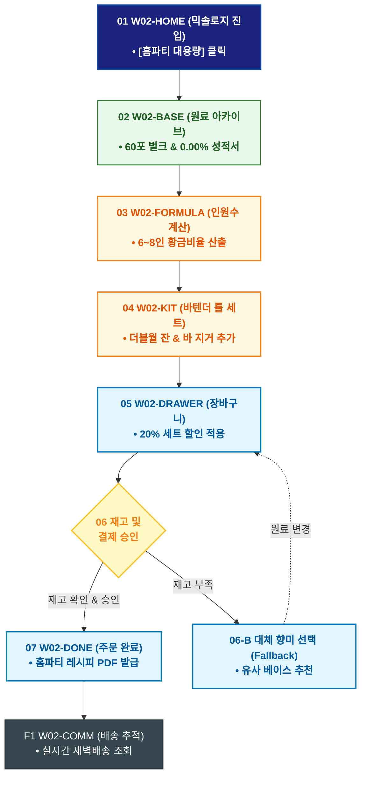

# 🔄 WICKETA 신유진 서비스 흐름도 [홈파티 대용량 원료 & 바텐더 툴 번들 발주]

> **프로젝트명**: WICKETA R&D 믹솔로지 랩 & 올팩토리 아카이브 (Mixology Lab)  
> **분석 대상 클라이언트**: [`[가상클라이언트_02] 신유진_WICKETA_조향사_DIY믹솔로지.txt`](file:///C:/Users/user/Desktop/이지희%20에이전트/설계%20마저%20해오기/자동화/03_클라이언트/01_가상_클라이언트/[가상클라이언트_02] 신유진_WICKETA_조향사_DIY믹솔로지.txt)  
> **기준 사이트맵 문서**: [`C:\Users\SBS\Desktop\0819 이지희\한명씩 화면 설계도 진행\자동화\04_설계_및_스토리보드\03_사이트맵\02_신유진\사이트맵_목적1_홈파티대용량.md`](file:///C:/Users/SBS/Desktop/0819%20%EC%9D%B4%EC%A7%80%ED%9D%AC/%ED%95%9C%EB%AA%85%EC%94%A9%20%ED%99%94%EB%A9%B4%20%EC%84%A4%EA%B3%84%EB%8F%84%20%EC%A7%84%ED%96%89/%EC%9E%90%EB%8F%99%ED%99%94/04_%EC%84%A4%EA%B3%84_%EB%B0%8F_%EC%8A%A4%ED%86%A0%EB%A6%AC%EB%B3%B4%EB%93%9C/03_%EC%82%AC%EC%9D%B4%ED%8A%B8%EB%A7%B5/02_신유진/사이트맵_목적1_홈파티대용량.md)  
> **접속 목적**: 주말 홈파티 0.00% 무알콜 하이볼 대량 조제 및 바텐더 글래스/지거 세트 발주  
> **목적별 고유 킬러 기능**: **0.00% 무알콜/무카페인 성적서 뷰어 (`KTR-CERT-01`) & 대용량 번들 계산기 (`BULK-CALCULATOR-01`)**  
> **작성일자**: 2026년 8월 19일  
> **작성자**: Antigravity UI/UX 설계팀  
> **문서 인코딩**: UTF-8 (유니코드)  

---

## 1. 목적별 핵심 서비스 흐름 개요

주말 홈파티를 위해 0.00% 무알콜 성적서를 확인하고 6~8인분 원료를 자동 계산하여 바텐더 툴 세트와 함께 대용량 번들로 발주하는 파티 프로세스

---

## 2. 목적 맞춤형 가변 여정 스테이지 (Dynamic Journey Stages)

### 🍸 Stage 1: 홈파티 대용량 원료 탐색
- **01 믹솔로지 메인 진입 (`W02-HOME`)**: 3D 플라스크 캔버스 감상 ➔ [홈파티 대용량 번들] 퀵독 클릭
- **02 원료 아카이브 탐색 (`W02-BASE`)**: 스모키 오크(SEC-03) 및 60포 대용량 벌크(SEC-18) 스펙 확인 ➔ 0.00% 무알콜 시험성적서 원클릭 열람

### 🧮 Stage 2: 인원수 기반 황금비율 계산 & 툴 번들 조합
- **03 대용량 인원수 계산 (`W02-FORMULA`)**: 파티 인원(6~8인) 입력 ➔ 베이스 스틱 및 탄산 믹서 소요량 실시간 자동 산출
- **04 바텐더 툴 세트 선택 (`W02-KIT`)**: 더블월 잔(SEC-11) 및 바 지거/머들러(SEC-12) 20% 세트 할인 패키지 추가

### 🛒 Stage 3: 대용량 재고 검증 & 간편결제
- **05 플라스크 장바구니 오픈 (`W02-DRAWER`)**: 홈파티 번들 품목 및 할인 적용 내역 확인
- **06 재고 검증 및 결제 승인 (`W02-DRAWER`)**:
  - `[조건: 재고 보유]` ➔ 카카오페이 1-Click 간편결제 ➔ 결제 승인
  - `[조건: 품절(Fallback)]` ➔ 대체 향미 베이스 스틱 자동 매칭 안내

### 🚚 Stage 4: 주문 완료 & 홈파티 레시피 가이드
- **07 주문 승인 & 레시피 발급 (`W02-DONE`)**: 주문 번호 발급 ➔ 홈파티 칵테일 제조 가이드 PDF 다운로드 링크 생성
- **F1 배송 대시보드 & 셰어링 (`W02-COMM`)**: 실시간 새벽배송 추적 ➔ 파티 후기 셰어링 랩 연동

---

## 3. 단계별 명세표 (Flow Matrix Table)

| 단계 ID | 단계 명칭 | 사용자 행동 | 화면 접점 | 서비스/시스템 반응 | 매핑 요구사항 | 다음 진입 조건 |
| :---: | :--- | :--- | :--- | :--- | :--- | :--- |
| **01** | 메인 진입 | [홈파티 대용량 번들] 클릭 | `W02-HOME` | 3D 플라스크 애니메이션 로딩 | `REQ-01 홈파티 기획` | 02 원료 탐색 |
| **02** | 원료 탐색 | 60포 벌크 및 성적서 확인 | `W02-BASE` | 0.00% 무알콜 시험성적서 렌더링 | `REQ-04 클린 포뮬러` | 03 인원수 계산 |
| **03** | 인원수 계산 | 인원수(6~8인) 슬라이더 조작 | `W02-FORMULA` | 황금비율 원료 수량 자동 계산 | `REQ-02 정밀 조합` | 04 툴 세트 선택 |
| **04** | 툴 세트 선택 | 바텐더 지거/더블월 잔 추가 | `W02-KIT` | 20% 세트 할인 자동 적용 | `REQ-05 바텐더 툴` | 05 장바구니 |
| **05** | 장바구니 | [주문하기] 클릭 | `W02-DRAWER` | Slide-out Drawer 오픈 | `REQ-06 간편 주문` | 06 재고/결제 |
| **06-A** | [성공] 결제 승인 | 간편결제 1-Click 승인 | `W02-DRAWER` | 물류센터 새벽배송 출고 큐 등록 | `REQ-06 결제 승인` | 07 주문 완료 |
| **06-B** | [예외] 재고 부족 | 대체 베이스 선택 (Fallback) | `W02-DRAWER` | 유사 향미 베이스 자동 제안 | `예외 복구` | 재결제 시도 |
| **07** | 주문 완료 | 주문 번호 및 레시피 확인 | `W02-DONE` | 홈파티 레시피 PDF 발급 | `REQ-06 레시피 발급` | F1 배송 추적 |
| **F1** | 배송 추적 | 실시간 배송 현황 조회 | `W02-COMM` | 택배사 API 연동 대시보드 | `사후 관리` | 여정 완료 |

---

## 4. 목적별 서비스 흐름도 다이어그램 (Mermaid)

---

## 5. 최종 품질 검토 및 연계 설계 문서

- [x] **고정 템플릿 탈피**: 목적별 특성에 맞춘 독자적 가변 스테이지 및 분기 조건 반영
- [x] **예외 상황(Fallback) 및 루프 완비**: 재고 부족, 결제 실패, 글자수 오류, 연속 출석 등의 분기/복구 파이프라인 수록
- [x] **연계 사이트맵**: [`사이트맵_목적1_홈파티대용량.md`](file:///C:/Users/SBS/Desktop/0819%20%EC%9D%B4%EC%A7%80%ED%9D%AC/%ED%95%9C%EB%AA%85%EC%94%A9%20%ED%99%94%EB%A9%B4%20%EC%84%A4%EA%B3%84%EB%8F%84%20%EC%A7%84%ED%96%89/%EC%9E%90%EB%8F%99%ED%99%94/04_%EC%84%A4%EA%B3%84_%EB%B0%8F_%EC%8A%A4%ED%86%A0%EB%A6%AC%EB%B3%B4%EB%93%9C/03_%EC%82%AC%EC%9D%B4%ED%8A%B8%EB%A7%B5/02_신유진/사이트맵_목적1_홈파티대용량.md)
