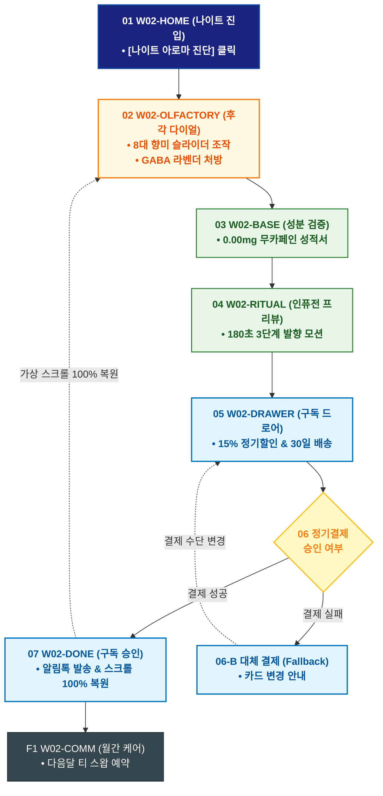

# 🔄 WICKETA 신유진 서비스 흐름도 [무카페인 나이트 아로마 티 성분 비교 & 30일 정기구독]

> **프로젝트명**: WICKETA R&D 믹솔로지 랩 & 올팩토리 아카이브 (Mixology Lab)  
> **분석 대상 클라이언트**: [`[가상클라이언트_02] 신유진_WICKETA_조향사_DIY믹솔로지.txt`](file:///C:/Users/user/Desktop/이지희%20에이전트/설계%20마저%20해오기/자동화/03_클라이언트/01_가상_클라이언트/[가상클라이언트_02] 신유진_WICKETA_조향사_DIY믹솔로지.txt)  
> **기준 사이트맵 문서**: [`C:\Users\SBS\Desktop\0819 이지희\한명씩 화면 설계도 진행\자동화\04_설계_및_스토리보드\03_사이트맵\02_신유진\사이트맵_목적2_나이트아로마구독.md`](file:///C:/Users/SBS/Desktop/0819%20%EC%9D%B4%EC%A7%80%ED%9D%AC/%ED%95%9C%EB%AA%85%EC%94%A9%20%ED%99%94%EB%A9%B4%20%EC%84%A4%EA%B3%84%EB%8F%84%20%EC%A7%84%ED%96%89/%EC%9E%90%EB%8F%99%ED%99%94/04_%EC%84%A4%EA%B3%84_%EB%B0%8F_%EC%8A%A4%ED%86%A0%EB%A6%AC%EB%B3%B4%EB%93%9C/03_%EC%82%AC%EC%9D%B4%ED%8A%B8%EB%A7%B5/02_신유진/사이트맵_목적2_나이트아로마구독.md)  
> **접속 목적**: 저녁 불면 해소를 위한 8대 후각 다이얼 진단 및 30일 맞춤 정기구독 1초 완료  
> **목적별 고유 킬러 기능**: **8대 향미 후각 프로파일러 (`OLFACTORY-DIAL-01`) & 15% 정기구독 슬라이드아웃 Cart (`FLASK-SUB-01`)**  
> **작성일자**: 2026년 8월 19일  
> **작성자**: Antigravity UI/UX 설계팀  
> **문서 인코딩**: UTF-8 (유니코드)  

---

## 1. 목적별 핵심 서비스 흐름 개요

8대 후각 다이얼로 수면 장애와 긴장도를 진단받고, GABA 라벤더 티의 무카페인 성적서를 검증한 후 30일 정기구독을 1초 만에 신청하는 웰니스 케어 여정

---

## 2. 목적 맞춤형 가변 여정 스테이지 (Dynamic Journey Stages)

### 🌙 Stage 1: 8대 후각 다이얼 진단
- **01 야간 안식 모드 진입 (`W02-HOME`)**: [나이트 아로마 진단하기] 클릭 ➔ 후각 콘솔 로딩
- **02 8대 후각 다이얼 조작 (`W02-OLFACTORY`)**: 긴장도/수면 밸런스 다이얼 조작 ➔ GABA 라벤더(SEC-02) 맞춤 처방 도출

### 🔬 Stage 2: 무카페인 성분 & 3D 발향 시뮬레이션
- **03 무카페인 성적서 확인 (`W02-BASE`)**: KTR 공인 0.00mg 무카페인 성적서 및 라벤더 테르펜 성분표 열람
- **04 180초 인퓨전 사운드 확인 (`W02-RITUAL`)**: 온수 인퓨전 시 3단계 발향 아로마 모션 및 ASMR 음향 프리뷰

### 🛒 Stage 3: Slide-out Cart 15% 정기구독 결제
- **05 정기구독 드로어 호출 (`W02-DRAWER`)**: 30일 주기 설정 & 15% 정기할인 자동 적용
- **06 1초 간편결제 승인 (`W02-DRAWER`)**:
  - `[조건: 결제 성공]` ➔ 웰니스 멤버십 발급 ➔ 1회차 즉시 출고
  - `[조건: 결제 오류(Fallback)]` ➔ 카드 재입력 및 결제수단 변경 안내

### 🌿 Stage 4: 구독 승인 & 월간 스왑 케어
- **07 구독 승인 및 스크롤 복원 (`W02-DONE`)**: 구독 코드 발급 ➔ 진단 화면 위치 100% 가상 스크롤 복원
- **F1 월간 블렌드 스왑 콘솔 (`W02-COMM`)**: 다음 달 향미 변경(블루 캐모마일 등) 예약 관리

---

## 3. 단계별 명세표 (Flow Matrix Table)

| 단계 ID | 단계 명칭 | 사용자 행동 | 화면 접점 | 서비스/시스템 반응 | 매핑 요구사항 | 다음 진입 조건 |
| :---: | :--- | :--- | :--- | :--- | :--- | :--- |
| **01** | 메인 진입 | [나이트 아로마 진단] 클릭 | `W02-HOME` | 화면 조도 딤드, 진단 콘솔 활성화 | `REQ-02 후각 진단` | 02 다이얼 진단 |
| **02** | 다이얼 진단 | 8대 후각 다이얼 조작 | `W02-OLFACTORY` | 레이더 차트 갱신, GABA 라벤더 처방 | `REQ-02 처방 알고리즘` | 03 성분 확인 |
| **03** | 성분 확인 | KTR 무카페인 성적서 탭 | `W02-BASE` | 0.00mg 무카페인 성적서 뷰어 노출 | `REQ-04 성분 검증` | 04 인퓨전 확인 |
| **04** | 인퓨전 확인 | 180초 발향 모션 프리뷰 | `W02-RITUAL` | 3단계 발향 아로마 시뮬레이션 | `REQ-03 아로마 타이머` | 05 구독 호출 |
| **05** | 구독 호출 | [30일 정기구독 신청] 클릭 | `W02-DRAWER` | Slide-out Drawer 오픈, 15% 할인 적용 | `REQ-06 1초 구독` | 06 결제 승인 |
| **06-A** | [성공] 결제 승인 | 간편결제 1-Click 승인 | `W02-DRAWER` | 정기결제 키 발급 및 배송 큐 등록 | `REQ-06 정기결제` | 07 구독 승인 |
| **06-B** | [예외] 결제 실패 | 카드 정보 재입력 (Fallback) | `W02-DRAWER` | 대체 결제 수단 안내창 노출 | `결제 복구` | 재결제 시도 |
| **07** | 구독 승인 | 구독 완료 확인 및 스크롤 복원 | `W02-DONE` | 알림톡 발송 & 가상 스크롤 100% 복원 | `REQ-06 스크롤 복원` | F1 월간 케어 |
| **F1** | 월간 케어 | 다음달 향미 스왑 예약 | `W02-COMM` | 월간 향미 변경 캘린더 갱신 | `구독 지속성` | 순환 루프 |

---

## 4. 목적별 서비스 흐름도 다이어그램 (Mermaid)

---

## 5. 최종 품질 검토 및 연계 설계 문서

- [x] **고정 템플릿 탈피**: 목적별 특성에 맞춘 독자적 가변 스테이지 및 분기 조건 반영
- [x] **예외 상황(Fallback) 및 루프 완비**: 재고 부족, 결제 실패, 글자수 오류, 연속 출석 등의 분기/복구 파이프라인 수록
- [x] **연계 사이트맵**: [`사이트맵_목적2_나이트아로마구독.md`](file:///C:/Users/SBS/Desktop/0819%20%EC%9D%B4%EC%A7%80%ED%9D%AC/%ED%95%9C%EB%AA%85%EC%94%A9%20%ED%99%94%EB%A9%B4%20%EC%84%A4%EA%B3%84%EB%8F%84%20%EC%A7%84%ED%96%89/%EC%9E%90%EB%8F%99%ED%99%94/04_%EC%84%A4%EA%B3%84_%EB%B0%8F_%EC%8A%A4%ED%86%A0%EB%A6%AC%EB%B3%B4%EB%93%9C/03_%EC%82%AC%EC%9D%B4%ED%8A%B8%EB%A7%B5/02_신유진/사이트맵_목적2_나이트아로마구독.md)
