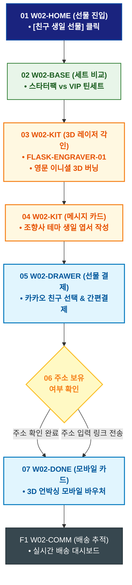

# 🔄 WICKETA 신유진 서비스 흐름도 [친구 생일 선물용 스타터 키트 & VIP 패키지 비교 구매]

> **프로젝트명**: WICKETA R&D 믹솔로지 랩 & 올팩토리 아카이브 (Mixology Lab)  
> **분석 대상 클라이언트**: [`[가상클라이언트_02] 신유진_WICKETA_조향사_DIY믹솔로지.txt`](file:///C:/Users/user/Desktop/이지희%20에이전트/설계%20마저%20해오기/자동화/03_클라이언트/01_가상_클라이언트/[가상클라이언트_02] 신유진_WICKETA_조향사_DIY믹솔로지.txt)  
> **기준 사이트맵 문서**: [`C:\Users\SBS\Desktop\0819 이지희\한명씩 화면 설계도 진행\자동화\04_설계_및_스토리보드\03_사이트맵\02_신유진\사이트맵_목적3_스타터선물세트.md`](file:///C:/Users/SBS/Desktop/0819%20%EC%9D%B4%EC%A7%80%ED%9D%AC/%ED%95%9C%EB%AA%85%EC%94%A9%20%ED%99%94%EB%A9%B4%20%EC%84%A4%EA%B3%84%EB%8F%84%20%EC%A7%84%ED%96%89/%EC%9E%90%EB%8F%99%ED%99%94/04_%EC%84%A4%EA%B3%84_%EB%B0%8F_%EC%8A%A4%ED%86%A0%EB%A6%AC%EB%B3%B4%EB%93%9C/03_%EC%82%AC%EC%9D%B4%ED%8A%B8%EB%A7%B5/02_신유진/사이트맵_목적3_스타터선물세트.md)  
> **접속 목적**: 홈카페 입문 친구를 위한 스타터 키트 비교 및 3D 각인 선물 발송  
> **목적별 고유 킬러 기능**: **플라스크 3D 레이저 각인기 (`FLASK-ENGRAVER-01`) & 카카오 선물 드로어 (`GIFT-DRAWER-01`)**  
> **작성일자**: 2026년 8월 19일  
> **작성자**: Antigravity UI/UX 설계팀  
> **문서 인코딩**: UTF-8 (유니코드)  

---

## 1. 목적별 핵심 서비스 흐름 개요

4+2 스타터팩과 VIP 아로마 틴세트를 비교하고, 전용 글래스에 친구 이름을 3D 레이저 각인하여 카카오톡 선물하기로 발송하는 커스텀 선물 여정

---

## 2. 목적 맞춤형 가변 여정 스테이지 (Dynamic Journey Stages)

### 🎁 Stage 1: 기프트 세트 스펙 비교
- **01 선물하기 홈 진입 (`W02-HOME`)**: [친구 생일 선물하기] 배너 클릭 ➔ 기프트 쇼케이스 로딩
- **02 스타터 팩 vs VIP 틴 비교 (`W02-BASE`)**: [4+2 스타터](SEC-10)와 VIP 아로마 틴세트(SEC-13) 구성품 및 언박싱 리뷰 비교

### 🔨 Stage 2: 3D 플라스크 레이저 각인 & 카드 작성
- **03 3D 실시간 레이저 각인 (`W02-KIT`)**:
  - 영문 이니셜 입력 ➔ `{글자수/금칙어 검증}` ➔ 더블월 글래스 표면 레이저 버닝 3D WebGL 시뮬레이션
- **04 감성 엽서 메시지 작성 (`W02-KIT`)**: 조향 연구원 테마의 생일 축하 메시지 카드 작성

### 🛒 Stage 3: 카카오톡 선물하기 슬라이드아웃 결제
- **05 선물 드로어 오픈 (`W02-DRAWER`)**: 카카오톡 친구 선택 ➔ 1-Click 간편결제
- **06 배송 정보 검증 (`W02-DRAWER`)**:
  - `[주소 있음]` ➔ 즉시 출고 배송 지정
  - `[주소 미입력]` ➔ 친구에게 카카오톡 주소입력 링크 즉시 전송

### 📦 Stage 4: 3D 언박싱 모바일 카드 발급 & 배송 추적
- **07 3D 언박싱 모바일 카드 발송 (`W02-DONE`)**: 받는 사람이 스마트폰으로 플라스크를 여는 3D 모바일 카드 전송
- **F1 배송 대시보드 & 감사 교환 (`W02-COMM`)**: 실시간 배송 추적 ➔ 감사 답장 수신함 연동

---

## 3. 단계별 명세표 (Flow Matrix Table)

| 단계 ID | 단계 명칭 | 사용자 행동 | 화면 접점 | 서비스/시스템 반응 | 매핑 요구사항 | 다음 진입 조건 |
| :---: | :--- | :--- | :--- | :--- | :--- | :--- |
| **01** | 선물 진입 | [생일 선물하기] 클릭 | `W02-HOME` | 선물 큐레이션 쇼케이스 로딩 | `REQ-05 선물 기획` | 02 세트 비교 |
| **02** | 세트 비교 | 스타터팩 vs VIP 틴세트 비교 | `W02-BASE` | 구성품 스펙 및 언박싱 리뷰 노출 | `REQ-05 상품 비교` | 03 레이저 각인 |
| **03** | 3D 각인 | 영문 이니셜 입력 및 위치 조정 | `W02-KIT` | FLASK-ENGRAVER-01 3D 실시간 버닝 렌더링 | `REQ-05 3D 각인기` | 04 메시지 카드 |
| **04** | 메시지 카드 | 축하 메시지 작성 | `W02-KIT` | 조향사 테마 엽서 프리뷰 생성 | `REQ-05 감성 카드` | 05 선물 결제 |
| **05** | 선물 결제 | 카카오 친구 선택 및 결제 | `W02-DRAWER` | 카카오페이 1초 승인, 고유 바우처 생성 | `REQ-06 선물 결제` | 06 주소 확인 |
| **06-A** | [성공] 주소 완료 | 친구 주소 즉시 확인 | `W02-DRAWER` | 물류 출고 지시 완료 | `배송 지정` | 07 카드 발송 |
| **06-B** | [대기] 링크 전송 | 주소 미입력 링크 전송 | `W02-DRAWER` | 카카오 알림톡 배송지 입력 폼 발송 | `예외 처리` | 07 카드 발송 |
| **07** | 모바일 카드 | 3D 언박싱 모바일 카드 확인 | `W02-DONE` | 받는 사람 카카오톡 메시지 전송 | `REQ-06 모바일 카드` | F1 배송 추적 |
| **F1** | 배송 추적 | 친구 배송지 입력 현황 조회 | `W02-COMM` | 실시간 배송 대시보드 갱신 | `사후 관리` | 여정 완료 |

---

## 4. 목적별 서비스 흐름도 다이어그램 (Mermaid)

---

## 5. 최종 품질 검토 및 연계 설계 문서

- [x] **고정 템플릿 탈피**: 목적별 특성에 맞춘 독자적 가변 스테이지 및 분기 조건 반영
- [x] **예외 상황(Fallback) 및 루프 완비**: 재고 부족, 결제 실패, 글자수 오류, 연속 출석 등의 분기/복구 파이프라인 수록
- [x] **연계 사이트맵**: [`사이트맵_목적3_스타터선물세트.md`](file:///C:/Users/SBS/Desktop/0819%20%EC%9D%B4%EC%A7%80%ED%9D%AC/%ED%95%9C%EB%AA%85%EC%94%A9%20%ED%99%94%EB%A9%B4%20%EC%84%A4%EA%B3%84%EB%8F%84%20%EC%A7%84%ED%96%89/%EC%9E%90%EB%8F%99%ED%99%94/04_%EC%84%A4%EA%B3%84_%EB%B0%8F_%EC%8A%A4%ED%86%A0%EB%A6%AC%EB%B3%B4%EB%93%9C/03_%EC%82%AC%EC%9D%B4%ED%8A%B8%EB%A7%B5/02_신유진/사이트맵_목적3_스타터선물세트.md)
