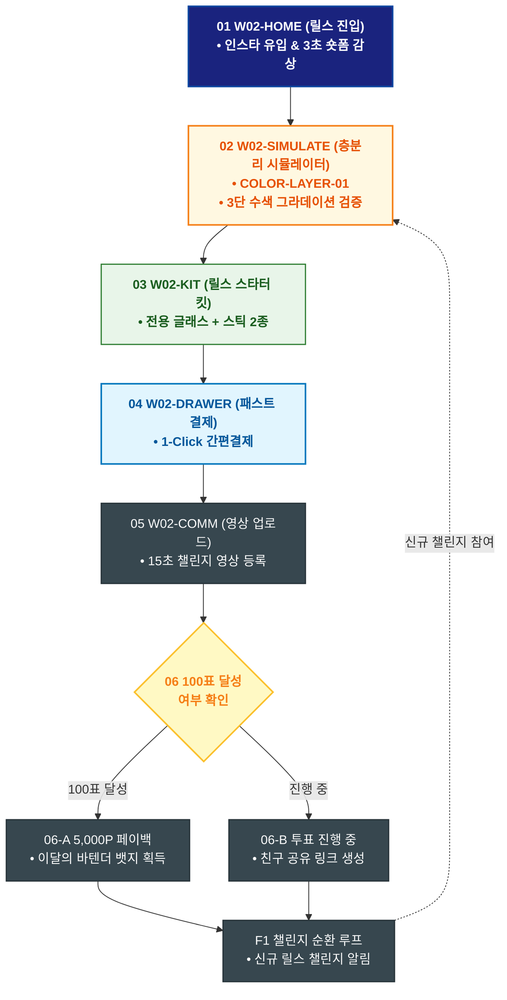

# 🔄 WICKETA 신유진 서비스 흐름도 [인스타 릴스 '오로라 층분리 칵테일' 탐색 & 즉시 구매]

> **프로젝트명**: WICKETA R&D 믹솔로지 랩 & 올팩토리 아카이브 (Mixology Lab)  
> **분석 대상 클라이언트**: [`[가상클라이언트_02] 신유진_WICKETA_조향사_DIY믹솔로지.txt`](file:///C:/Users/user/Desktop/이지희%20에이전트/설계%20마저%20해오기/자동화/03_클라이언트/01_가상_클라이언트/[가상클라이언트_02] 신유진_WICKETA_조향사_DIY믹솔로지.txt)  
> **기준 사이트맵 문서**: [`C:\Users\SBS\Desktop\0819 이지희\한명씩 화면 설계도 진행\자동화\04_설계_및_스토리보드\03_사이트맵\02_신유진\사이트맵_목적4_SNS바이럴레시피.md`](file:///C:/Users/SBS/Desktop/0819%20%EC%9D%B4%EC%A7%80%ED%9D%AC/%ED%95%9C%EB%AA%85%EC%94%A9%20%ED%99%94%EB%A9%B4%20%EC%84%A4%EA%B3%84%EB%8F%84%20%EC%A7%84%ED%96%89/%EC%9E%90%EB%8F%99%ED%99%94/04_%EC%84%A4%EA%B3%84_%EB%B0%8F_%EC%8A%A4%ED%86%A0%EB%A6%AC%EB%B3%B4%EB%93%9C/03_%EC%82%AC%EC%9D%B4%ED%8A%B8%EB%A7%B5/02_신유진/사이트맵_목적4_SNS바이럴레시피.md)  
> **접속 목적**: SNS 화제의 3단 수색 층분리 칵테일 검증 및 릴스 스타터 킷 3초 구매  
> **목적별 고유 킬러 기능**: **3D 찬물 융해 & 수색 층분리 시뮬레이터 (`COLOR-LAYER-01`) & 릴스 챌린지 킷 (`REELS-KIT-01`)**  
> **작성일자**: 2026년 8월 19일  
> **작성자**: Antigravity UI/UX 설계팀  
> **문서 인코딩**: UTF-8 (유니코드)  

---

## 1. 목적별 핵심 서비스 흐름 개요

인스타그램 릴스에서 유입되어 오로라 3단 층분리 수색 변화를 3D 시뮬레이터로 검증하고, 릴스 스타터 킷을 3초 만에 구매한 뒤 챌린지 영상 업로드에 참여하는 순환 루프

---

## 2. 목적 맞춤형 가변 여정 스테이지 (Dynamic Journey Stages)

### 📱 Stage 1: SNS 릴스 유입 & 3D 층분리 검증
- **01 릴스 전용 랜딩 진입 (`W02-HOME`)**: 인스타그램 태그 링크 유입 ➔ '오로라 층분리 칵테일' 3초 영상 감상
- **02 3D 수색 층분리 시뮬레이터 실행 (`W02-SIMULATE`)**: 오로라 블루(SEC-01) + 루비 탄산(SEC-08) 투입 시 실시간 3단 수색 그라데이션 모션 검증

### 🛒 Stage 2: 릴스 스타터 킷 3초 패스트 결제
- **03 릴스 스타터 킷 원클릭 담기 (`W02-KIT`)**: 전용 그라데이션 글래스 + 스틱 2종 세트 자동 선택
- **04 Slide-out 1초 간편결제 (`W02-DRAWER`)**:
  - `[조건: 결제 승인]` ➔ 당일 특급 출고 큐 등록 ➔ 챌린지 음원 링크 발급
  - `[조건: 결제 오류(Fallback)]` ➔ 원클릭 결제 수단 변경창 전환

### 🎬 Stage 3: 챌린지 영상 촬영 & 셰어링 랩 업로드
- **05 챌린지 영상 업로드 (`W02-COMM`)**: 킷 수령 후 15초 숏폼 영상 촬영 ➔ #위케타믹솔로지 해시태그 태깅 ➔ 업로드
- **06 실시간 랭킹 투표 및 페이백 검증 (`W02-COMM`)**:
  - `{투표수 100표 달성?}` ➔ YES: 5,000P 페이백 & 이달의 바텐더 뱃지 부여 ➔ 다음 신메뉴 챌린지 순환 루프

---

## 3. 단계별 명세표 (Flow Matrix Table)

| 단계 ID | 단계 명칭 | 사용자 행동 | 화면 접점 | 서비스/시스템 반응 | 매핑 요구사항 | 다음 진입 조건 |
| :---: | :--- | :--- | :--- | :--- | :--- | :--- |
| **01** | 릴스 진입 | 인스타 링크 클릭 | `W02-HOME` | 9:16 숏폼 레시피 영상 전면 노출 | `REQ-01 바이럴 유입` | 02 층분리 검증 |
| **02** | 층분리 검증 | 3D 시뮬레이터 탭 | `W02-SIMULATE` | COLOR-LAYER-01 실시간 3단 수색 모션 재생 | `REQ-04 수색 층분리` | 03 킷 선택 |
| **03** | 킷 선택 | [릴스 스타터 킷 구매] 클릭 | `W02-KIT` | REELS-KIT-01 번들 자동 장바구니 담기 | `REQ-05 크리에이터 킷` | 04 1초 결제 |
| **04** | 1초 결제 | 카카오페이 승인 | `W02-DRAWER` | 특급 배송 지시 & 챌린지 전용 음원 발급 | `REQ-06 패스트 결제` | 05 영상 업로드 |
| **05** | 영상 업로드 | 15초 챌린지 영상 등록 | `W02-COMM` | 셰어링 랩 피드 실시간 게시 | `REQ-03 커뮤니티` | 06 투표/페이백 |
| **06-A** | [성공] 100표 달성 | 실시간 랭킹 100표 획득 | `W02-COMM` | 5,000P 적립 & 이달의 바텐더 뱃지 | `리워드 지급` | F1 챌린지 순환 |
| **06-B** | [진행] 투표 진행 중 | 실시간 투표 현황 확인 | `W02-COMM` | 친구 공유 링크 생성 | `바이럴 확산` | F1 챌린지 순환 |
| **F1** | 챌린지 순환 루프 | 다음 신규 레시피 챌린지 확인 | `W02-COMM` | 신규 시즌 릴스 챌린지 알림 등록 | `순환 루프 연결` | 다음 릴스 참여 |

---

## 4. 목적별 서비스 흐름도 다이어그램 (Mermaid)

---

## 5. 최종 품질 검토 및 연계 설계 문서

- [x] **고정 템플릿 탈피**: 목적별 특성에 맞춘 독자적 가변 스테이지 및 분기 조건 반영
- [x] **예외 상황(Fallback) 및 루프 완비**: 재고 부족, 결제 실패, 글자수 오류, 연속 출석 등의 분기/복구 파이프라인 수록
- [x] **연계 사이트맵**: [`사이트맵_목적4_SNS바이럴레시피.md`](file:///C:/Users/SBS/Desktop/0819%20%EC%9D%B4%EC%A7%80%ED%9D%AC/%ED%95%9C%EB%AA%85%EC%94%A9%20%ED%99%94%EB%A9%B4%20%EC%84%A4%EA%B3%84%EB%8F%84%20%EC%A7%84%ED%96%89/%EC%9E%90%EB%8F%99%ED%99%94/04_%EC%84%A4%EA%B3%84_%EB%B0%8F_%EC%8A%A4%ED%86%A0%EB%A6%AC%EB%B3%B4%EB%93%9C/03_%EC%82%AC%EC%9D%B4%ED%8A%B8%EB%A7%B5/02_신유진/사이트맵_목적4_SNS바이럴레시피.md)
