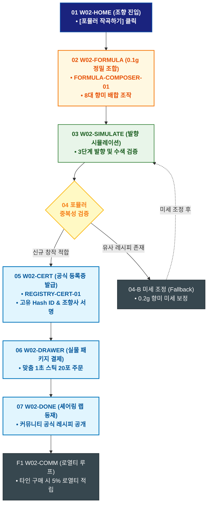

# 🔄 WICKETA 신유진 서비스 흐름도 [나만의 0.1g 포뮬러 공식 등록증 발급 & 랭킹 등록]

> **프로젝트명**: WICKETA R&D 믹솔로지 랩 & 올팩토리 아카이브 (Mixology Lab)  
> **분석 대상 클라이언트**: [`[가상클라이언트_02] 신유진_WICKETA_조향사_DIY믹솔로지.txt`](file:///C:/Users/user/Desktop/이지희%20에이전트/설계%20마저%20해오기/자동화/03_클라이언트/01_가상_클라이언트/[가상클라이언트_02] 신유진_WICKETA_조향사_DIY믹솔로지.txt)  
> **기준 사이트맵 문서**: [`C:\Users\SBS\Desktop\0819 이지희\한명씩 화면 설계도 진행\자동화\04_설계_및_스토리보드\03_사이트맵\02_신유진\사이트맵_목적5_포뮬러공식등록.md`](file:///C:/Users/SBS/Desktop/0819%20%EC%9D%B4%EC%A7%80%ED%9D%AC/%ED%95%9C%EB%AA%85%EC%94%A9%20%ED%99%94%EB%A9%B4%20%EC%84%A4%EA%B3%84%EB%8F%84%20%EC%A7%84%ED%96%89/%EC%9E%90%EB%8F%99%ED%99%94/04_%EC%84%A4%EA%B3%84_%EB%B0%8F_%EC%8A%A4%ED%86%A0%EB%A6%AC%EB%B3%B4%EB%93%9C/03_%EC%82%AC%EC%9D%B4%ED%8A%B8%EB%A7%B5/02_신유진/사이트맵_목적5_포뮬러공식등록.md)  
> **접속 목적**: 0.1g 단위 정밀 블렌딩을 통한 나만의 시그니처 조향 포뮬러 공식 라이선스 등록  
> **목적별 고유 킬러 기능**: **3D 믹솔로지 조합기 (`FORMULA-COMPOSER-01`) & 공식 포뮬러 등록증 발급기 (`REGISTRY-CERT-01`)**  
> **작성일자**: 2026년 8월 19일  
> **작성자**: Antigravity UI/UX 설계팀  
> **문서 인코딩**: UTF-8 (유니코드)  

---

## 1. 목적별 핵심 서비스 흐름 개요

8대 향미 노트를 0.1g 단위로 직접 작곡하고 3D 발향 시뮬레이션 후 공식 블록체인 Hash ID 등록증을 발급받아 커뮤니티 셰어링 랩에 등재하는 전문가 창작 여정

---

## 2. 목적 맞춤형 가변 여정 스테이지 (Dynamic Journey Stages)

### 🧪 Stage 1: 0.1g 정밀 포뮬러 작곡
- **01 조향 아틀리에 진입 (`W02-HOME`)**: [나만의 포뮬러 작곡하기] 클릭 ➔ 3D 조합기 로딩
- **02 8대 향미 정밀 블렌딩 (`W02-FORMULA`)**:
  - FORMULA-COMPOSER-01 0.1g 단위 슬라이더 조작 (탑/미들/베이스 향미 배합) ➔ 실시간 향미 밸런스 점수 산출

### 🔬 Stage 2: 3D 수색 발향 시뮬레이션 & 포뮬러 검증
- **03 발향 및 층분리 시뮬레이션 (`W02-SIMULATE`)**: 온수 투입 시 3단계 발향 궤적 및 3D 수색 그라데이션 검증
- **04 포뮬러 중복성 검증 (`W02-CERT`)**:
  - `{기존 공식 포뮬러와 중복 여부?}`
  - `[중복 없음 (신규 창작)]` ➔ 고유 레시피 특허 적합 판정
  - `[유사 포뮬러 존재(Fallback)]` ➔ 미세 향미(0.2g) 조정 제안

### 📜 Stage 3: 공식 포뮬러 등록증 발급 & 패키지 발주
- **05 공식 라이선스 인증서 발급 (`W02-CERT`)**: 고유 Hash ID 및 조향사 서명이 담긴 모바일 공식 인증서 생성
- **06 맞춤 포뮬러 실물 패키지 결제 (`W02-DRAWER`)**: 내 레시피가 담긴 1초 스틱 20포 실물 세트 1-Click 주문

### 🏆 Stage 4: 셰어링 랩 등록 & 로열티 루프
- **07 셰어링 랩 등재 (`W02-DONE`)**: 커뮤니티 레시피 셰어링 랩에 내 포뮬러 공식 공개
- **F1 로열티 적립 루프 (`W02-COMM`)**: 타 사용자가 내 레시피 구매 시 5% 로열티 자동 적립

---

## 3. 단계별 명세표 (Flow Matrix Table)

| 단계 ID | 단계 명칭 | 사용자 행동 | 화면 접점 | 서비스/시스템 반응 | 매핑 요구사항 | 다음 진입 조건 |
| :---: | :--- | :--- | :--- | :--- | :--- | :--- |
| **01** | 작곡 진입 | [포뮬러 작곡하기] 클릭 | `W02-HOME` | 3D 조합기 캔버스 활성화 | `REQ-02 조향 작곡` | 02 0.1g 블렌딩 |
| **02** | 0.1g 블렌딩 | 8대 향미 슬라이더 조작 | `W02-FORMULA` | FORMULA-COMPOSER-01 향미 밸런스 실시간 계산 | `REQ-02 0.1g 정밀 조작` | 03 시뮬레이션 |
| **03** | 시뮬레이션 | 3D 발향 모션 확인 | `W02-SIMULATE` | 3단계 수색 변화 및 발향 궤적 렌더링 | `REQ-04 발향 시뮬레이션` | 04 중복성 검증 |
| **04-A** | [성공] 신규 창작 | 레시피 검증 요청 | `W02-CERT` | 고유 특허 적합 판정 | `REQ-05 라이선스` | 05 등록증 발급 |
| **04-B** | [예외] 유사 레시피 | 미세 향미 조정 (Fallback) | `W02-FORMULA` | 0.2g 미세 조정 가이드 노출 | `조향 복구` | 재검증 시도 |
| **05** | 등록증 발급 | 조향사 서명 입력 | `W02-CERT` | REGISTRY-CERT-01 고유 Hash ID 등록증 발급 | `REQ-05 공식 인증서` | 06 패키지 결제 |
| **06** | 패키지 결제 | 맞춤 실물 스틱 주문 | `W02-DRAWER` | 실물 커스텀 라벨 인쇄 및 출고 큐 등록 | `REQ-06 커스텀 주문` | 07 셰어링 랩 |
| **07** | 셰어링 랩 | [레시피 공개] 클릭 | `W02-DONE` | 셰어링 랩 명예의 전당 등재 | `REQ-03 커뮤니티` | F1 로열티 루프 |
| **F1** | 로열티 루프 | 타인 구매 로열티 확인 | `W02-COMM` | 5% 로열티 포인트 자동 정산 | `창작자 락인` | 순환 루프 |

---

## 4. 목적별 서비스 흐름도 다이어그램 (Mermaid)

---

## 5. 최종 품질 검토 및 연계 설계 문서

- [x] **고정 템플릿 탈피**: 목적별 특성에 맞춘 독자적 가변 스테이지 및 분기 조건 반영
- [x] **예외 상황(Fallback) 및 루프 완비**: 재고 부족, 결제 실패, 글자수 오류, 연속 출석 등의 분기/복구 파이프라인 수록
- [x] **연계 사이트맵**: [`사이트맵_목적5_포뮬러공식등록.md`](file:///C:/Users/SBS/Desktop/0819%20%EC%9D%B4%EC%A7%80%ED%9D%AC/%ED%95%9C%EB%AA%85%EC%94%A9%20%ED%99%94%EB%A9%B4%20%EC%84%A4%EA%B3%84%EB%8F%84%20%EC%A7%84%ED%96%89/%EC%9E%90%EB%8F%99%ED%99%94/04_%EC%84%A4%EA%B3%84_%EB%B0%8F_%EC%8A%A4%ED%86%A0%EB%A6%AC%EB%B3%B4%EB%93%9C/03_%EC%82%AC%EC%9D%B4%ED%8A%B8%EB%A7%B5/02_신유진/사이트맵_목적5_포뮬러공식등록.md)
