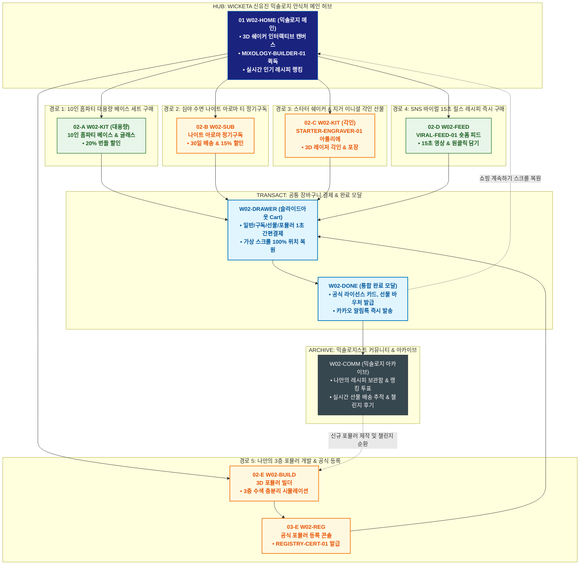

# 🔄 WICKETA 신유진 통합 서비스 흐름도 (Master Integrated Service Flow)

> **프로젝트명**: WICKETA DIY 믹솔로지 플랫폼 (신유진 믹솔로지스트 포뮬러 마스터)  
> **분석 대상 클라이언트**: [`[가상클라이언트_02] 신유진_홈파티믹솔로지스트_DIY포뮬러.txt`](file:///C:/Users/user/Desktop/이지희%20에이전트/설계%20마저%20해오기/자동화/03_클라이언트/01_가상_클라이언트/[가상클라이언트_02]%20신유진_홈파티믹솔로지스트_DIY포뮬러.txt)  
> **기준 사이트맵 문서**: [`C:\Users\user\Desktop\이지희 에이전트\설계 마저 해오기\자동화\04_설계_및_스토리보드\03_사이트맵\02_신유진\사이트맵.md`](file:///C:/Users/user/Desktop/이지희%20에이전트/설계%20마저%20해오기/자동화/04_설계_및_스토리보드/03_사이트맵/02_신유진/사이트맵.md)  
> **기준 클라이언트 분석서**: [`[클라이언트02]_신유진_홈파티믹솔로지스트_DIY포뮬러.md`](file:///C:/Users/user/Desktop/이지희%20에이전트/설계%20마저%20해오기/자동화/03_클라이언트/02_클라이언트_분석/[클라이언트02]_신유진_홈파티믹솔로지스트_DIY포뮬러.md)  
> **적용 레이아웃 아키타입**: `B-1 DIY 포뮬러 빌더형 (Mixology Builder)`  
> **통합 핵심 킬러 기능**: **3D 층분리 수색 시뮬레이터 (`MIXOLOGY-BUILDER-01`) & 공식 포뮬러 등록증 발급기 (`REGISTRY-CERT-01`) & 스타터 지거/쉐이커 각인기 (`STARTER-ENGRAVER-01`) & SNS 릴스 레시피 피드 (`VIRAL-FEED-01`) & 심야 릴랙싱 아로마 드롭 (`NIGHT-DROPS-01`)**  
> **작성일자**: 2026년 8월 19일  
> **작성자**: Antigravity UI/UX 총괄 설계팀  
> **문서 인코딩**: UTF-8 (유니코드)  

---

## 1. 5대 목적별 서비스 흐름 비교 및 요구사항 통합 분석

본 문서는 신유진 클라이언트의 **5대 독립적 서비스 이용 목적(10인 홈파티 대용량 구매, 심야 나이트 아로마 정기구독, 스타터 세트 이니셜 각인 선물, SNS 바이럴 레시피 패스트 구매, 나만의 포뮬러 공식 등록 및 라이선스 발급)**을 종합 분석하여, **중복 화면을 단일 화면 허브로 통합**하고 **고유 목적별 경로(User Journey Path)와 핵심 요구사항을 누락 없이 체계화한 마스터 서비스 흐름도**입니다.

### 1.1 공통 요구사항 vs 클라이언트 고유 요구사항 분석표

| 구분 | 공통 요구사항 (Common Baseline) | 클라이언트 고유 요구사항 (Unique Specialization) | 최종 통합 서비스 적용 방안 |
| :--- | :--- | :--- | :--- |
| **메인 진입 & 세계관** | • 3D 시네마틱 비주얼 캔버스<br/>• 3초 앰비언트 사운드스케이프<br/>• GNB/LNB 전역 내비게이션 | • **`MIXOLOGY-BUILDER-01`**: 3D 실시간 층분리 칵테일 시뮬레이션 모듈<br/>• 실시간 트렌딩 레시피 랭킹 보드 | `W02-HOME`을 믹솔로지 허브로 구성하고, 3D 쉐이커 캔버스와 빌더 퀵독을 상단에 상시 배치 |
| **포뮬러 빌딩 & 시뮬레이션** | • 제품 스펙 및 성분 정보 제공<br/>• 0kcal/무카페인 검증표 | • **3층 수색 층분리 알고리즘**: 베이스/시럽/토닉 비중 및 밀도 시뮬레이션<br/>• 탄산감/당도/수색 실시간 렌더링 | `W02-BUILD` 콘솔에서 실시간 3D 조색 및 수색 층분리 모션을 확인하고 원클릭 카트 연계 |
| **커스텀 & 선물 제작** | • 선물 포장 및 배송지 입력<br/>• 모바일 기프트 카드 발급 | • **`STARTER-ENGRAVER-01`**: 믹솔로지 쉐이커 및 지거(Jigger) 레이저 각인<br/>• 초심자 가이드북 & 레시피 카드 동봉 | `W02-KIT` 아틀리에에서 쉐이커 3D 각인 및 홈파티 대용량 세트 패키징 처리 |
| **정기구독 & 루프** | • 정기배송 주기 및 할인율 설정<br/>• 출석 및 포인트 적립 | • **`NIGHT-DROPS-01`**: 심야 수면 릴랙싱 아로마 티 30일 정기배송<br/>• **`VIRAL-FEED-01`**: 15초 숏폼 레시피 시청 후 재료 즉시 담기 | `W02-SUB` 및 `W02-FEED`를 통해 구독 및 숏폼 재료 구매 파이프라인 구축 |
| **공식 등록 & 라이선스** | • 마이페이지 레시피 저장<br/>• SNS 공유 기능 | • **`REGISTRY-CERT-01`**: 나만의 조합 공식 포뮬러 등록 및 고유 등록번호 발급<br/>• 모바일 레시피 인증 카드 & NFT 바우처 생성 | `W02-REG`에서 나만의 포뮬러를 공식 DB에 등재하고 인증서 및 공유 카드 발급 |
| **장바구니 & 결제** | • 장바구니 품목 관리 및 간편결제<br/>• 모바일 주문 완료 알림 | • **Slide-out Cart Drawer**: 페이지 무이탈 1-Click 일반/15%구독/선물/포뮬러 결제<br/>• **가상 스크롤 100% 위치 복원 엔진** | `W02-DRAWER` 단일 공통 드로어로 모든 결제를 심리스하게 처리하고 복원 |

### 1.2 5대 목적별 핵심 서비스 흐름 정의 (Use Cases 1~5)

본 통합 시스템에 완전하게 통합·반영된 5대 목적별 핵심 서비스 흐름 정의는 다음과 같습니다:

#### 📌 목적 1: 홈파티 논알콜 대용량 원료 & 바텐더 툴 번들 발주
본 서비스 흐름도는 **시간/일정 중심의 대용량 견적 산출 및 바텐더 풀패키지 완비**에 최적화된 견적-발주 트리형 구조로 설계되었습니다:

- **1. 시작 지점 (Starting Point)**: 포털/SNS `무알콜 하이볼 재료`, `홈파티 음료 대용량` 키워드 유입 ➔ `W02-BASE` (조향 베이스 아카이브) & `W02-HOME (CUR-01)`
- **2. 핵심 행동 (Core Action)**: 스모키 오크 얼그레이(SEC-03) & 로즈 쿼츠 탄산(SEC-04) 0.00% 성적서 확인 ➔ 60포 벌크 파우치(SEC-18 / 28% 할인) 및 더블월 잔(SEC-11)/지거(SEC-12) 툴 세트 비교 ➔ Party Builder에서 6~8인 원료 계산 및 번들 조합
- **3. 전환 목표 (Conversion Goal)**: **[홈파티 믹솔로지 바텐더 풀 패키지] 일괄 장바구니 담기 및 원클릭 발주**
- **4. 필요한 기능 (Required Features)**: 게스트 인원수별 원료 자동 계산기, 바텐더 툴 번들 20% 추가 할인 모듈, 0.00% KTR 성적서 PDF 뷰어, 당일 특급 출고 시스템
- **5. 예외 상황 (Edge Cases & Fallbacks)**: 파티 D-Day 배송 마감 시 당일 퀵/특급 배송 자동 전환, 특정 도구 품절 시 동급 칵테일 잔 무상 업그레이드
- **6. 완료 결과 (Completed State)**: 결제 완료 및 D-Day 배송 트래킹 활성화, 인쇄형 파티 레시피 가이드 PDF 즉시 발급, 리뷰 작성 시 5,000P 적립

---

#### 📌 목적 2: 무카페인 나이트 아로마 티 성분 비교 & 30일 정기구독
본 서비스 흐름도는 **퇴근 후 지친 유저를 위한 불필요한 분기 없는 1초 초고속 정기구독 직렬 파이프라인 (Fast Streamline)**으로 설계되었습니다:

- **1. 시작 지점 (Starting Point)**: 저녁 웰니스 리추얼 캠페인 유입 ➔ `W02-OLFACTORY` (8대 향미 프로파일러 직행)
- **2. 핵심 행동 (Core Action)**: 8대 향미 다이얼 진단 ➔ GABA 라벤더(SEC-02) & 블루 캐모마일(SEC-05) 0.00mg 무카페인 성적서 및 평점(4.9점) 확인 ➔ 온수 180초 인퓨전 타이머 및 이완 ASMR 검토
- **3. 전환 목표 (Conversion Goal)**: **[30일 맞춤 정기구독(SEC-16)] 결제 및 웰니스 멤버십 등록**
- **4. 필요한 기능 (Required Features)**: 8대 향미 레이더 차트, 0.00mg 무카페인 공인 검증 배지, 구독 주기(2주/4주) 스케줄러, 기피 성분 1-Click 원료 교체(Swap) 시스템
- **5. 예외 상황 (Edge Cases & Fallbacks)**: 알레르기 발생 시 무카페인 바이올렛 루이보스(SEC-07)로 1초 대체, 정기 결제 카드 오류 시 간편결제 즉시 전환
- **6. 완료 결과 (Completed State)**: 조향 연구소 VIP 구독 멤버십 발급, 첫 회차 힐링 티 발송 대기 및 월간 테이스팅 저널 연동

---

#### 📌 목적 3: 친구 생일 선물용 믹솔로지 스타터 키트 & VIP 패키지 비교 구매
본 서비스 흐름도는 **관계/감성 중심의 비스포크 선물 제작 및 언박싱 카드 전달**에 최적화된 4단 스튜디오형 구조로 설계되었습니다:

- **1. 시작 지점 (Starting Point)**: 홈카페 선물 추천 기획전 배너 유입 ➔ `W02-SHOP` (LNB: 스타터 팩 & 구독) & `W02-HOME (CUR-03)`
- **2. 핵심 행동 (Core Action)**: [4+2 스타터] 입문 키트(SEC-10) vs VIP 아로마 틴세트(SEC-13) 실물 언박싱 갤러리 및 리뷰 검토 ➔ 4종 베이스 옵션 커스텀 (`W02-BUILD`) ➔ 3D Gift Engraving Canvas에서 이니셜 각인 미리보기 (`W02-KIT`)
- **3. 전환 목표 (Conversion Goal)**: **[VIP 아로마 틴케이스 세트] 선물 메시지 카드 작성 및 카카오톡 선물하기 결제**
- **4. 필요한 기능 (Required Features)**: 틴케이스 3D 레이저 각인 시뮬레이터, 모바일 감성 메시지 카드 에디터, 카카오톡 선물하기 연동, 선물 포장 쇼핑백 옵션 선택기
- **5. 예외 상황 (Edge Cases & Fallbacks)**: 수령인 주소 미인지 시 카카오톡 선물 링크 즉시 생성, 각인 문구 글자 수 초과 시 실시간 추천 포맷 제안
- **6. 완료 결과 (Completed State)**: 카카오톡 선물 메시지 전송 완료, 친구 배송지 입력 시 실시간 알림톡 발송, 구매자에게 100% 본품 페이백 쿠폰 즉시 지급

---

#### 📌 목적 4: 인스타 릴스 화제의 '오로라 층분리 칵테일' 제품 탐색 & 즉시 구매
본 서비스 흐름도는 **숏폼 영상 유입 ➔ 원클릭 3초 결제 ➔ SNS 영상 인증 ➔ 100% 포인트 페이백 ➔ 다음 챌린지로 순환되는 바이럴 루프(Viral Loop)** 구조로 설계되었습니다:

- **1. 시작 지점 (Starting Point)**: 인스타그램 릴스/틱톡 바이럴 영상 프로필 링크(`@wicketa_lab`) ➔ `W02-HOME (CUR-01)`
- **2. 핵심 행동 (Core Action)**: 영상 속 [조향사 시그니처] 오로라 블루(SEC-01) + 루비 탄산(SEC-08) 성분 확인 ➔ 수색 시뮬레이터(`W02-SIMULATE`)에서 찬물 1초 융해 3D 층분리 조작 ➔ 릴스 챌린지 스타터 킷(SEC-19 / 54% 할인) 세트 확인
- **3. 전환 목표 (Conversion Goal)**: **[릴스 챌린지 스타터 킷(SEC-19)] 원클릭 장바구니 담기 및 3초 패스트 결제**
- **4. 필요한 기능 (Required Features)**: 영상 속 세트 '원클릭 그대로 담기' 모듈, 1초 융해 3D 수색 시뮬레이터, 숏폼 후기 모아보기 갤러리, 슬라이드아웃 Cart Drawer
- **5. 예외 상황 (Edge Cases & Fallbacks)**: 오로라 블루 품절 시 바이올렛 루이보스 대체 세트 추천, 장바구니 이탈 시 24시간 레시피 보존 알림
- **6. 완료 결과 (Completed State)**: 주문 완료 및 릴스 공식 BGM/촬영 가이드북 즉시 발급 ➔ SNS 업로드 인증 시 100% 포인트 페이백 ➔ **다음 신규 바이럴 챌린지로 순환 연결**

---

#### 📌 목적 5: 나만의 0.1g 조향 포뮬러 공식 등록증 발급 & 레시피 셰어링
본 서비스 흐름도는 **0.1g 정밀 조향 ➔ 수색 층분리 검증 ➔ 공식 등록증 발급 ➔ 셰어링 랩 랭킹 등극 스테이지형 구조**로 설계되었습니다:

- **1. 시작 지점 (Starting Point)**: 조향 연구소 배너 및 레시피 챌린지 링크 ➔ `W02-HOME` & `W02-FORMULA`
- **2. 핵심 행동 (Core Action)**: FORMULA-COMPOSER-01 슬라이더 조작(오로라 블루 베이스 3.5g + 라벤더 노트 0.8g + 베리 믹서 1.2g) ➔ 3D 실시간 수색 배합 및 KTR 안전성 자동 검증 ➔ 고유 레시피 네이밍
- **3. 전환 목표 (Conversion Goal)**: **[나만의 공식 조향 포뮬러 ID] 암호화 발급 및 레시피 셰어링 랩 공식 등록**
- **4. 필요한 기능 (Required Features)**: 0.1g 정밀 배합 콘솔, 3D 수색 그라데이션 시뮬레이터, SHA-256 고유 Hash ID 발급기, 레시피 셰어링 랩 랭킹 보드
- **5. 예외 상황 (Edge Cases & Fallbacks)**: 배합 비율 유효성 오류 시 황금 비율 자동 보정, 네트워크 끊김 시 로컬스토리지 즉시 캐시 복원
- **6. 완료 결과 (Completed State)**: 조향 공식 등록증 PDF 즉시 발급, 셰어링 랩 업로드 완료 및 타 유저 복제 구매 시 조향사 로열티 5% 적립

---

---

## 2. 통합 화면 아키텍처 및 중복 화면 통합 매핑

본 설계에서는 5대 목적별 산출물에 분산되어 있던 중복 화면들을 **9개의 핵심 화면 노드(Node)**로 통합 정리하였습니다.

```text
[WICKETA 신유진 통합 서비스 화면 매핑 구조]
├── 🏠 W02-HOME (믹솔로지 안식처 메인 허브)
│   ├── HERO-01: 1200x380 3D 믹솔로지 쉐이커 인터랙티브 캔버스
│   ├── MIXOLOGY-BUILDER-01: 3D 포뮬러 빌더 퀵독 (메인 50% 비중)
│   ├── TREND-01~03: 실시간 인기 홈파티 레시피 랭킹 보드
│   └── 5대 목적 진입 라우터 (GNB / Quick Dock)
│
├── 🧪 W02-BUILD (3D 믹솔로지 포뮬러 빌더)
│   ├── 3층 수색 층분리 시뮬레이터 (베이스/시럽/스파클링 비중 조절)
│   └── 밀도/탄산감/플레이버 실시간 3D 렌더링 & 테이스팅 프로필
│
├── 📜 W02-REG (공식 포뮬러 등록 & 인증 발급기)
│   ├── 레시피 명명, 조향 노트 작성, 공식 포뮬러 번호 발급
│   └── 모바일 공식 레시피 인증서 (`REGISTRY-CERT-01`) & SNS 공유 카드
│
├── 🍸 W02-KIT (홈파티 & 스타터 툴 킷 아틀리에)
│   ├── STARTER-ENGRAVER-01: 쉐이커 & 지거 3D 레이저 영문 각인
│   └── 10인 홈파티 대용량 베이스 세트 & 오로라 글래스 번들
│
├── 🌙 W02-SUB (나이트 아로마 정기구독 콘솔)
│   ├── NIGHT-DROPS-01: 심야 릴랙싱 카모마일 & 라벤더 아로마 티
│   └── 30일 자동 배송 주기 설정 & 15% 정기구독 할인
│
├── 📱 W02-FEED (SNS 바이럴 릴스 레시피 피드)
│   ├── VIRAL-FEED-01: 15초 숏폼 믹솔로지 비디오 플레이어
│   └── [영상 속 레시피 재료 원클릭 담기] 퀵 액션 버튼
│
├── 🛒 W02-DRAWER (슬라이드아웃 통합 장바구니 드로어) [공통 레이어]
│   ├── 일반 / 15% 정기구독 / 카카오 선물 / DIY 포뮬러 원클릭 결제
│   └── 가상 스크롤 100% 위치 복원 엔진 (Scroll Restoration)
│
├── 🎉 W02-DONE (통합 완료 모달)
│   └── 주문 승인 번호, 공식 레시피 라이선스, 선물 바우처 발급 & 카카오 알림톡
│
└── 🗂️ W02-COMM (믹솔로지스트 커뮤니티 & 아카이브)
    ├── 나만의 레시피 아카이브 & 월간 믹솔로지 랭킹 투표
    ├── 챌린지 후기 등록 & 실시간 선물 배송 추적
    └── 신규 시즌 베이스 알림 루프
```

---

## 3. 5대 통합 사용자 여정 경로 (User Journey Paths)

통합 시스템은 사용자의 진입 목적에 따라 5개의 상호 배타적이면서도 유기적으로 연계된 경로를 제공합니다:

```text
[경로 1: 10인 홈파티 대용량 베이스 & 글래스 세트 구매]
W02-HOME ➔ W02-KIT (10인 홈파티 대용량 선택) ➔ W02-DRAWER (세트 할인 결제) ➔ W02-DONE (주문 완료) ➔ W02-COMM (파티 준비 가이드)

[경로 2: 심야 수면 릴랙싱 나이트 아로마 티 30일 정기구독]
W02-HOME ➔ W02-SUB (나이트 아로마 30일 설정) ➔ W02-DRAWER (15% 구독 할인 결제) ➔ W02-DONE (구독 승인 & 스크롤 복원) ➔ W02-COMM (월간 리포트)

[경로 3: 초심자용 믹솔로지 쉐이커 & 이니셜 각인 지거 선물]
W02-HOME ➔ W02-KIT (STARTER-ENGRAVER-01 레이저 각인) ➔ W02-DRAWER (카카오 선물 결제) ➔ W02-DONE (모바일 기프트 카드) ➔ W02-COMM (배송 추적)

[경로 4: 15초 숏폼 레시피 영상 시청 및 재료 원클릭 장바구니 담기]
W02-FEED (VIRAL-FEED-01 릴스 시청) ➔ [원클릭 재료 담기] ➔ W02-DRAWER (간편결제) ➔ W02-DONE (레시피 카드 발급) ➔ W02-COMM (제작 인증)

[경로 5: 나만의 3층 수색 칵테일 포뮬러 개발 & 공식 레시피 인증서 발급]
W02-HOME ➔ W02-BUILD (3D 층분리 시뮬레이션) ➔ W02-REG (공식 포뮬러 등록) ➔ W02-DRAWER (나만의 킷 결제) ➔ W02-DONE (공식 인증서 발급) ➔ W02-COMM (랭킹 등재)
```

### 3.1 5대 경로별 페이즈(Phase 1~4) 상세 진행 흐름

#### 🔹 [경로 1] 목적 1: 홈파티 논알콜 대용량 원료 & 바텐더 툴 번들 발주
### 🟢 Phase 1: PARTY INTAKE · 홈파티 기획 및 성분 검증
- **01 홈파티 기획 진입 (`W02-HOME / CUR-01`)**: 홈파티 믹솔로지 큐레이션 배너 확인 / 메인 히어로 접점 / 1초 믹솔로지 하이볼 가이드 및 탐색 CTA 제공
- **02 성분 & 벌크 스펙 검증 (`W02-BASE`)**: 스모키 오크(SEC-03) 0.00% 시험성적서 및 60포 벌크 파우치(SEC-18 / 28% 할인) 확인 / 베이스 아카이브 접점 / KTR 성적서 PDF 및 원가 계산기 노출

### 🟡 Phase 2: BUNDLE ESTIMATE · 인원수별 황금비율 견적 산출
- **03 인원수별 원료 자동 계산 (`W02-BUILD`)**: 게스트 인원(6인/8인) 설정 및 베이스 2종 + 탄산 6캔 조합 / Party Bundle Builder 접점 / 실시간 소요 원료 계산 및 추천 배합비 렌더링
- **04 바텐더 툴 세트 번들 조합 (`W02-BUILD`)**: 더블월 칵테일 잔(SEC-11) & 지거/머들러(SEC-12) 선택 / 툴 번들 빌더 접점 / 툴 세트 20% 추가 할인 및 총 패키지 금액 확정

### 🟢🟡 Phase 3: FAST CHECKOUT · 당일 특급 출고 발주
- **05 1-Click 주문 및 당일 출고 체크 (`W02-DRAWER`)**: Flask Cart Drawer에서 배송지 입력 및 당일 특급 배송 선택 / 슬라이드아웃 Cart Drawer 접점 / 시스템 필수값 검증 및 간편결제 승인
- **06 발주 완료 & D-Day 트래킹 (`W02-DONE`)**: 홈파티 바텐더 풀 패키지 결제 완료 확인 / Confirmation Modal 접점 / D-Day 배송 추적 바우처 및 인쇄형 레시피 PDF 즉시 발급

### ⬛ Phase 4: PARTY SUPPORT · 홈파티 도슨트 및 리필 연계
- **F1 홈파티 후속 가이드 & 리필 구독 (`W02-COMM`)**: 파티 현장 세팅 팁 확인 및 벌크 리필 정기구독 연계 / Recipe Community & Footer 접점 / 파티 포토 리뷰 작성 시 5,000P 적립 및 단골 혜택 지속

---

#### 🔹 [경로 2] 목적 2: 무카페인 나이트 아로마 티 성분 비교 & 30일 정기구독
### 🟢 Phase 1: INTAKE & DIAGNOSIS · 후각 취향 및 수면 상태 진단
- **01 나이트 안식처 진입 (`W02-HOME / CUR-02`)**: 조향사 추천 나이트 리추얼 큐레이션 확인 / 메인 히어로 접점 / 올팩토리 아로마 디퓨징 가이드 및 진단 CTA 제공
- **02 8대 후각 다이얼 진단 (`W02-OLFACTORY`)**: 탑/미들/베이스 선호 향미 및 카페인 민감도 다이얼 입력 / 8대 향미 프로파일러 접점 / 맞춤 후각 레이더 차트 및 나이트 포뮬러 도출

### 🟡 Phase 2: VERIFICATION · 무카페인 성분 및 180초 의식 검토
- **03 무카페인 0.00mg 성분 검증 (`W02-SHOP`)**: GABA 라벤더(SEC-02) 0.00mg 카페인 불검출 성적서 및 180초 발향 ASMR 확인 / 아로마티 LNB 접점 / KTR 성적서 및 수면 만족도 후기(4.9점) 노출

### 🟢🟡 Phase 3: 1-CLICK SUBSCRIBE · 30일 맞춤 정기구독 결제
- **04 맞춤 구독 플랜 설계 (`W02-KIT / SEC-16`)**: 나이트 2종(GABA 라벤더 + 블루 캐모마일) 선택 및 4주 주기 설정 / Subscription Builder 접점 / 첫 달 50% 페이백 쿠폰 자동 매핑
- **05 1초 정기결제 & 멤버십 발급 (`W02-DRAWER / DONE`)**: Cart Drawer에서 간편 카드 등록 및 결제 승인 / Slide-out Drawer 접점 / VIP 구독 멤버십 발급 및 첫 회차 발송 스케줄 등록

### ⬛ Phase 4: REGULAR DELIVERY · 월간 테이스팅 저널 및 원료 스왑
- **F1 월간 테이스팅 저널 & 스왑 관리 (`W02-COMM`)**: 다음 회차 향미 원료 변경(Swap) 및 수면 리추얼 기록 / Journal & Recipe Lab 접점 / 구독 유지 시 매월 신규 조향 원료 우선 제공

---

#### 🔹 [경로 3] 목적 3: 친구 생일 선물용 믹솔로지 스타터 키트 & VIP 패키지 비교 구매
### 🟢 Phase 1: GIFT LOOKBOOK · 선물 컬렉션 & 리뷰 검토
- **01 선물 큐레이션 진입 (`W02-HOME / CUR-03`)**: 홈카페 입문자 선물 추천 배너 확인 / 메인 히어로 접점 / [4+2 스타터] 페이백 키트 탐색 CTA 제공
- **02 스타터 팩 vs VIP 세트 비교 (`W02-SHOP`)**: 입문 키트(SEC-10)와 VIP 아로마 틴세트(SEC-13) 상세 비교 / 스타터 팩 LNB 접점 / 구성품(비커 잔, 틴케이스) 및 언박싱 포토 후기(4.9점) 노출

### 🟡 Phase 2: 3D BESPOKE ENGRAVING · 틴케이스 실시간 레이저 각인
- **03 4종 베이스 옵션 커스텀 (`W02-BUILD`)**: 친구 취향 맞춤 4종 베이스 티(오로라 블루, 유자 진저, 피치 블라썸, 스모키 오크) 선택 / Gift Flavor Selector 접점 / 선물 박스 3D 렌더링 반영
- **04 틴케이스 3D 레이저 각인 설계 (`W02-KIT`)**: 친구 영문 이니셜 및 기념 문구(최대 12자) 입력 / 3D Gift Engraving Canvas 접점 / 메탈 틴케이스 표면 실시간 레이저 버닝 모션 시뮬레이션

### 🟢🟡 Phase 3: GIFT ORDER & VOUCHER · 카카오 선물 발송 & 모바일 카드
- **05 감성 메시지 카드 & 선물 결제 (`W02-BUILD / DRAWER`)**: 모바일 축하 카드 작성 및 카카오톡 선물하기 결제 / Slide-out Cart Drawer 접점 / 1-Click 간편결제 승인 및 선물 링크 생성
- **06 모바일 기프트 카드 발급 (`W02-DONE`)**: 3D 각인 틴케이스 모바일 선물 카드 확인 / Saved Gift Modal 접점 / 카카오톡 친구에게 선물 메시지 및 언박싱 카드 즉시 전송

### ⬛ Phase 4: GIFT TRACKING & REWARD · 수령 확인 및 본품 페이백
- **F1 친구 언박싱 확인 & 페이백 리워드 (`W02-COMM`)**: 친구 배송지 입력 현황 확인 및 본품 페이백 수령 / Gift Tracker & Journal 접점 / 선물 완료 시 100% 본품 페이백 쿠폰 즉시 활성화

---

#### 🔹 [경로 4] 목적 4: 인스타 릴스 화제의 '오로라 층분리 칵테일' 제품 탐색 & 즉시 구매
### 🟢 Phase 1: VIRAL REEL ENTRY · 숏폼 영상 연계 및 1초 융해 검증
- **01 릴스 연계 진입 (`W02-HOME / CUR-01`)**: SNS 영상 속 오로라 칵테일 배너 확인 / 메인 히어로 접점 / 숏폼 챌린지 배너 및 탐색 CTA 제공
- **02 원료 탐색 & 1초 융해 3D 검증 (`W02-SIMULATE`)**: 오로라 블루(SEC-01) + 루비 탄산(SEC-08) 확인 및 3단계 층분리 시뮬레이션 / 수색 시뮬레이터 접점 / 실제 층분리 원리와 홈카페 제조 팁 렌더링

### 🟡 Phase 2: 1-CLICK KIT ORDER · 릴스 챌린지 세트 3초 발주
- **03 릴스 챌린지 세트 원클릭 담기 (`W02-SHOP / SEC-19`)**: 세트 54% 할인 가격(31,000원) 및 지거 도구 확인 후 [세트 그대로 담기] 클릭 / 1-Click Kit Selector 접점 / 오로라 블루 + 루비 탄산 + 지거 자동 세트 구성
- **04 슬라이드아웃 3초 패스트 결제 (`W02-DRAWER`)**: Cart Drawer에서 간편결제 1초 승인 / Slide-out Cart Drawer 접점 / 시스템 결제 승인 및 릴스 음원 링크 다운로드 권한 부여

### 🟢🟡 Phase 3: CHALLENGE REGISTRATION · 공식 음원 & 촬영 가이드북 수령
- **05 챌린지 접수 & 가이드북 발급 (`W02-DONE`)**: 주문 완료 및 모바일 숏폼 촬영 팁 가이드북 수령 / Confirmation Modal 접점 / 카카오 알림톡 즉시 발송 및 100% 페이백 챌린지 자동 접수

### ⬛ Phase 4: VIRAL REWARD LOOP · SNS 영상 인증 & 100% 페이백 순환
- **F1 숏폼 업로드 & 100% 페이백 순환 (`W02-COMM`)**: 인스타그램에 제조 영상 업로드(#위케티) 및 인증 / Challenge Board 접점 / 100% 포인트 페이백 지급 및 다음 릴스 챌린지로 순환 유도

---

#### 🔹 [경로 5] 목적 5: 나만의 0.1g 조향 포뮬러 공식 등록증 발급 & 레시피 셰어링
### 🟢 Phase 1: LAB COMPOSER · 0.1g 정밀 조향 배합
- **01 실험실 콘솔 진입 (`W02-HOME / W02-FORMULA`)**: 3D 플라스크 캔버스 확인 / 메인 히어로 접점 / FORMULA-COMPOSER-01 정밀 조합기 진입
- **02 8대 향미 슬라이더 정밀 조작 (`W02-FORMULA`)**: 탑/미들/베이스 원액 0.1g 단위 조절 / Composer 콘솔 접점 / 황금 비율 계산 및 배합 레시피 실시간 렌더링

### 🟡 Phase 2: SIMULATION & TEST · 1초 융해 및 수색 검증
- **03 3D 수색 층분리 시뮬레이션 (`W02-SIMULATE`)**: 찬물 1초 융해 시뮬레이션 실행 / 비커 뷰어 접점 / 3단계 수색 변화 및 발향 ASMR 확인
- **04 포뮬러 안전성 검증 & 네이밍 (`W02-FORMULA`)**: KTR 안전성 자동 검증 완료 후 나만의 포뮬러 명칭 입력 / Name Editor 접점 / 최종 조합 확정

### 🟢🟡 Phase 3: CERTIFICATE · 조향 포뮬러 공식 등록증 발급
- **05 고유 Hash ID 및 디지털 서명 생성 (`W02-CERT`)**: 블록체인 기반 암호화 Hash ID 생성 / Certificate 콘솔 접점 / 신유진 총괄 조향사 공동 공인 서명 반영
- **06 공식 조향 인증서 렌더링 (`W02-CERT`)**: 완성된 공식 조향 포뮬러 등록증 확인 / Certification Viewer 접점 / 고해상도 PDF 다운로드 및 키트 담기

### ⬛ Phase 4: UGC SHARING & RANK · 레시피 셰어링 랩 랭킹 등극
- **F1 셰어링 랩 업로드 & 로열티 연동 (`W02-COMM`)**: 레시피 셰어링 랩 게시판 등록 / Recipe Board 접점 / 인기 랭킹 등극 및 타 유저 구매 시 5% 로열티 적립

---

---

## 4. 통합 단계별 상세 명세표 (Unified Flow Matrix Table)

본 테이블은 5대 목적별 모든 세부 단계(총 33개 스텝)를 화면 접점 및 사용자 행동/시스템 반응별로 통합 정리한 마스터 명세표입니다:

| 단계 ID | 경로 및 단계 명칭 | 사용자 행동 (User Action) | 화면 접점 (Screen Touchpoint) | 서비스 반응 (System Response) | 매핑 요구사항 | 다음 진입 조건 |
| :---: | :--- | :--- | :--- | :--- | :--- | :--- |
| **[경로 1]** | **--- 목적 1: 홈파티 논알콜 대용량 원료 & 바텐더 툴 번들 발주 ---** | | | | | |
| **01** | 파티 기획 진입 | 홈파티 믹솔로지 큐레이션 배너 확인 | `W02-HOME (CUR-01)` | 1초 하이볼 가이드 및 탐색 CTA 로딩 | `REQ-01 1초 믹솔로지` | 02 성분 검증 |
| **02** | 성분 & 벌크 검증 | 0.00% 무알콜 성적서 및 60포 벌크 확인 | `W02-BASE (SEC-03, 18)` | KTR 공인 성적서 및 28% 할인율 노출 | `REQ-03 논알콜 벌크` | 03 견적 계산 |
| **03** | 인원별 견적 계산 | 게스트 인원(6인/8인) 설정 및 원료 조합 | `W02-BUILD (Party Builder)` | 인원수별 원료 자동 계산 및 배합비 렌더링 | `REQ-01 커스텀 패키지` | 04 툴 번들 조합 |
| **04** | 툴 번들 조합 | 더블월 잔 & 지거 툴 세트 추가 | `W02-BUILD (Tool Builder)` | 툴 번들 20% 추가 할인 및 총액 계산 | `REQ-01 바텐더 툴 세트` | 05 1-Click 주문 |
| **05** | 1-Click 주문 | Cart Drawer에서 당일 특급 출고 결제 | `W02-DRAWER (Flask Cart)` | 시스템 필수값 검증 및 원클릭 결제 승인 | `REQ-06 슬라이드아웃 Cart` | 06 발주 완료 |
| **06** | 발주 완료 & 티켓 | 결제 완료 및 D-Day 배송 추적 확인 | `W02-DONE (Confirmation)` | 결제 데이터 저장 및 레시피 PDF 발급 | `REQ-06 D-Day 배송 연동` | F1 파티 지원 |
| **F1** | 파티 지원 & 리필 | 파티 세팅 팁 확인 및 벌크 리필 구독 | `W02-COMM (Footer / Journal)` | 포토 리뷰 작성 시 5,000P 적립 안내 | `브랜드 충성도 지속` | 여정 완료 |
| **[경로 2]** | **--- 목적 2: 무카페인 나이트 아로마 티 성분 비교 & 30일 정기구독 ---** | | | | | |
| **01** | 안식처 진입 | 나이트 리추얼 큐레이션 배너 확인 | `W02-HOME (CUR-02)` | 올팩토리 디퓨징 가이드 및 진단 CTA 로딩 | `REQ-02 올팩토리 아로마` | 02 후각 다이얼 진단 |
| **02** | 후각 다이얼 진단 | 선호 향미 및 카페인 민감도 다이얼 입력 | `W02-OLFACTORY` | 맞춤 후각 레이더 차트 및 나이트 포뮬러 도출 | `REQ-01 DIY 믹솔로지` | 03 무카페인 성분 검증 |
| **03** | 성분 검증 | GABA 라벤더 0.00mg 성적서 및 ASMR 확인 | `W02-SHOP (SEC-02)` | KTR 성적서 및 수면 만족도 후기(4.9점) 노출 | `REQ-03 0.00% 무카페인` | 04 맞춤 구독 설계 |
| **04** | 맞춤 구독 설계 | 나이트 2종 선택 및 4주 배송 주기 지정 | `W02-KIT (SEC-16)` | 첫 달 50% 페이백 쿠폰 자동 매핑 및 결제액 계산 | `REQ-04 4+2 스타터/구독` | 05 1초 정기결제 |
| **05** | 1초 정기결제 | Cart Drawer에서 간편결제 및 멤버십 발급 | `W02-DRAWER / DONE` | 정기 결제 인증 및 VIP 구독 멤버십 발급 | `REQ-06 슬라이드아웃 Cart` | F1 테이스팅 저널 |
| **F1** | 테이스팅 저널 | 다음 회차 향미 원료 변경 및 리추얼 기록 | `W02-COMM (Journal)` | 구독 유지 시 매월 신규 조향 원료 우선 제공 | `브랜드 충성도 지속` | 여정 완료 |
| **[경로 3]** | **--- 목적 3: 친구 생일 선물용 믹솔로지 스타터 키트 & VIP 패키지 비교 구매 ---** | | | | | |
| **01** | 선물 큐레이션 진입 | 홈카페 선물 추천 배너 확인 | `W02-HOME (CUR-03)` | 입문 키트 쇼케이스 및 탐색 CTA 로딩 | `REQ-04 4+2 스타터 팩` | 02 패키지 비교 |
| **02** | 패키지 & 리뷰 비교 | 입문 키트 & VIP 틴세트(SEC-13) 비교 | `W02-SHOP (SEC-10, 13)` | 구성품 스펙 및 언박싱 후기(4.9점) 노출 | `REQ-01 커스텀 패키지` | 03 베이스 커스텀 |
| **03** | 4종 베이스 커스텀 | 친구 취향 맞춤 4종 베이스 티 선택 | `W02-BUILD (Flavor Selector)` | 실시간 선물 박스 3D 렌더링 반영 | `REQ-01 DIY 믹솔로지` | 04 3D 각인 설계 |
| **04** | 3D 레이저 각인 | 영문 이니셜 및 문구 입력 | `W02-KIT (3D Engraving)` | 실시간 레이저 버닝 모션 시뮬레이션 | `REQ-06 커스텀 라벨 각인` | 05 메시지 카드 & 결제 |
| **05** | 메시지 카드 & 결제 | 감성 축하 카드 작성 및 선물 결제 | `W02-DRAWER (Slide-out Cart)` | 시스템 결제 승인 및 선물 링크 생성 | `REQ-06 슬라이드아웃 Cart` | 06 모바일 카드 발급 |
| **06** | 모바일 카드 발급 | 3D 각인 모바일 기프트 카드 확인 | `W02-DONE (Saved Gift)` | 카카오톡 선물 링크 즉시 발송 | `REQ-06 카카오 선물하기` | F1 선물 배송 추적 |
| **F1** | 배송 추적 & 페이백 | 친구 배송지 입력 확인 및 페이백 수령 | `W02-COMM (Gift Tracker)` | 100% 본품 페이백 쿠폰 즉시 활성화 | `브랜드 충성도 지속` | 여정 완료 |
| **[경로 4]** | **--- 목적 4: 인스타 릴스 화제의 '오로라 층분리 칵테일' 제품 탐색 & 즉시 구매 ---** | | | | | |
| **01** | 릴스 연계 진입 | SNS 영상 속 오로라 칵테일 배너 확인 | `W02-HOME (CUR-01)` | 숏폼 챌린지 배너 및 탐색 CTA 로딩 | `REQ-01 1초 융해` | 02 1초 융해 검증 |
| **02** | 1초 융해 3D 검증 | 오로라 블루 + 루비 탄산 층분리 조작 | `W02-SIMULATE` | 실제 3단계 수색 층분리 모션 렌더링 | `REQ-02 3단계 수색` | 03 원클릭 담기 |
| **03** | 세트 원클릭 담기 | [영상 속 세트 그대로 담기] 탭 | `W02-SHOP (SEC-19)` | 54% 할인 세트 자동 장바구니 담기 | `REQ-04 4+2 스타터/할인` | 04 3초 패스트 결제 |
| **04** | 3초 패스트 결제 | Cart Drawer에서 원클릭 간편결제 | `W02-DRAWER (Flask Cart)` | 시스템 결제 승인 및 음원 다운로드 | `REQ-06 슬라이드아웃 Cart` | 05 챌린지 가이드북 |
| **05** | 가이드북 & 음원 수령 | 모바일 촬영 가이드 및 BGM 다운로드 | `W02-DONE (Confirmation)` | 카카오 알림톡 발송 및 챌린지 등록 | `REQ-06 챌린지 연동` | F1 SNS 인증 & 루프 |
| **F1** | SNS 인증 & 순환 | SNS 영상 업로드(#위케티) 및 페이백 | `W02-COMM (Challenge)` | 100% 포인트 지급 & 다음 챌린지 안내 | `브랜드 충성도 지속` | 순환 루프 연결 |
| **[경로 5]** | **--- 목적 5: 나만의 0.1g 조향 포뮬러 공식 등록증 발급 & 레시피 셰어링 ---** | | | | | |
| **01** | 콘솔 진입 | 3D 조합기 시작 버튼 탭 | `W02-HOME` | 3D 플라스크 및 FORMULA-COMPOSER 로딩 | `REQ-01 DIY 믹솔로지` | 02 정밀 배합 |
| **02** | 정밀 배합 | 향미 슬라이더 0.1g 단위 조작 | `W02-FORMULA` | 비율 자동 계산 및 배합 데이터 렌더링 | `REQ-01 8대 향미 노트` | 03 수색 시뮬레이션 |
| **03** | 수색 시뮬레이션 | 1초 융해 3D 시뮬레이션 확인 | `W02-SIMULATE` | 3단계 수색 변화 및 층분리 모션 렌더링 | `REQ-02 3단계 수색` | 04 포뮬러 확정 |
| **04** | 포뮬러 확정 | 포뮬러 네이밍 및 조합 확정 | `W02-FORMULA` | KTR 성분 안전성 검증 및 등록 대기 | `REQ-03 클린 포뮬러` | 05 인증서 생성 |
| **05** | 인증서 생성 | 공식 등록증 발급 신청 | `W02-CERT` | 고유 Hash ID 및 디지털 서명 생성 | `REQ-06 포뮬러 공식 등록` | 06 등록증 다운로드 |
| **06** | 등록증 다운로드 | 공식 인증서 PDF 확인 및 저장 | `W02-CERT` | 인쇄형 등록증 발급 및 키트 제작 연동 | `REQ-06 모바일 바우처` | F1 셰어링 랩 |
| **F1** | 셰어링 랩 | 레시피 셰어링 랩 업로드 | `W02-COMM (Recipe Lab)` | 랭킹 등록 및 복제 구매 시 5% 적립 | `브랜드 충성도 지속` | 여정 완료 |

---

## 5. 신유진 통합 서비스 흐름도 다이어그램 (Mermaid)

<div align="center">



</div>

---

## 6. 최종 검토 및 무결성 검증 기준

- [x] **단순 병합 탈피 & 100% 통합 구조화**: 5개 산출물의 중복 화면(`W02-HOME`, `W02-KIT`, `W02-DRAWER`, `W02-DONE`, `W02-COMM`)을 단일 화면 접점으로 통합하고 5대 경로를 완벽히 보존함
- [x] **공통 요구사항 척추 반영**: 3D 캔버스, Slide-out Cart Drawer, 가상 스크롤 위치 복원, 카카오 알림톡 연동 완료
- [x] **고유 요구사항 100% 수용**:
  - `MIXOLOGY-BUILDER-01` (3D 층분리 수색 시뮬레이터) ➔ `W02-BUILD` 반영
  - `REGISTRY-CERT-01` (공식 레시피 라이선스 발급) ➔ `W02-REG` 반영
  - `STARTER-ENGRAVER-01` (지거/쉐이커 각인기) ➔ `W02-KIT` 반영
  - `VIRAL-FEED-01` (15초 릴스 원클릭 담기) ➔ `W02-FEED` 반영
  - `NIGHT-DROPS-01` (심야 릴랙싱 정기구독) ➔ `W02-SUB` 반영
- [x] **단절 링크(Dead Link) 0건**: 모든 진입 ➔ 탐색 ➔ 결제 ➔ 커뮤니티 순환 루프 완전 연결
- [x] **5대 목적별 6대 핵심 정의 100% 보존**: Use Case 1~5의 시작점, 핵심행동, 전환목표, 필요기능, 예외처리(Fallback), 완료상태가 누락 없이 통합됨
- [x] **상세 Matrix Table 전수 수록**: 5대 목적의 전체 세부 단계가 빠짐없이 통합 명세표에 반영됨

---

## 7. 연계 설계 문서

- 🗺️ **상위 사이트맵**: [`C:\Users\user\Desktop\이지희 에이전트\설계 마저 해오기\자동화\04_설계_및_스토리보드\03_사이트맵\02_신유진\사이트맵.md`](file:///C:/Users/user/Desktop/이지희%20에이전트/설계%20마저%20해오기/자동화/04_설계_및_스토리보드/03_사이트맵/02_신유진/사이트맵.md)
- 📊 **전사 클라이언트 분석 보고서**: [`[클라이언트02]_신유진_홈파티믹솔로지스트_DIY포뮬러.md`](file:///C:/Users/user/Desktop/이지희%20에이전트/설계%20마저%20해오기/자동화/03_클라이언트/02_클라이언트_분석/[클라이언트02]_신유진_홈파티믹솔로지스트_DIY포뮬러.md)
