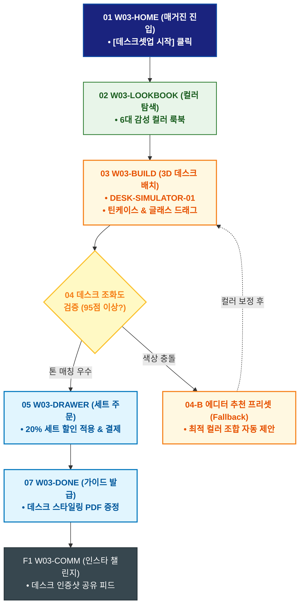

# 🔄 WICKETA 윤서연 서비스 흐름도 [감성 데스크테리어 패키지 3D 시뮬레이션 & 세트 발주]

> **프로젝트명**: WICKETA 매거진 에디토리얼 & 감성 데스크테리어 (Editorial Desk)  
> **분석 대상 클라이언트**: [`[가상클라이언트_03] 윤서연_매거진에디터_감성데스크테리어.txt`](file:///C:/Users/user/Desktop/이지희%20에이전트/설계%20마저%20해오기/자동화/03_클라이언트/01_가상_클라이언트/[가상클라이언트_03] 윤서연_매거진에디터_감성데스크테리어.txt)  
> **기준 사이트맵 문서**: [`C:\Users\SBS\Desktop\0819 이지희\한명씩 화면 설계도 진행\자동화\04_설계_및_스토리보드\03_사이트맵\03_윤서연\사이트맵_목적1_데스크셋업.md`](file:///C:/Users/SBS/Desktop/0819%20%EC%9D%B4%EC%A7%80%ED%9D%AC/%ED%95%9C%EB%AA%85%EC%94%A9%20%ED%99%94%EB%A9%B4%20%EC%84%A4%EA%B3%84%EB%8F%84%20%EC%A7%84%ED%96%89/%EC%9E%90%EB%8F%99%ED%99%94/04_%EC%84%A4%EA%B3%84_%EB%B0%8F_%EC%8A%A4%ED%86%A0%EB%A6%AC%EB%B3%B4%EB%93%9C/03_%EC%82%AC%EC%9D%B4%ED%8A%B8%EB%A7%B5/03_윤서연/사이트맵_목적1_데스크셋업.md)  
> **접속 목적**: 홈오피스 데스크테리어를 위한 3D 가상 배치 및 틴케이스/머들러 번들 구매  
> **목적별 고유 킬러 기능**: **3D 인터랙티브 데스크테리어 뷰어 (`DESK-SIMULATOR-01`) & TPO 컬러 팔레트 (`COLOR-PALETTE-01`)**  
> **작성일자**: 2026년 8월 19일  
> **작성자**: Antigravity UI/UX 설계팀  
> **문서 인코딩**: UTF-8 (유니코드)  

---

## 1. 목적별 핵심 서비스 흐름 개요

매거진 에디터의 감성 데스크 룩북을 감상하고, 3D 가상 데스크에 틴케이스와 글래스 머들러를 직접 배치하여 컬러 매칭을 검증한 뒤 세트로 발주하는 여정

---

## 2. 목적 맞춤형 가변 여정 스테이지 (Dynamic Journey Stages)

### 🖥️ Stage 1: 매거진 데스크 룩북 화보 탐색
- **01 에디토리얼 홈 진입 (`W03-HOME`)**: 3D 매거진 화보 캔버스 감상 ➔ [데스크테리어 셋업 시작] 클릭
- **02 6대 컬러 팔레트 룩북 탐색 (`W03-LOOKBOOK`)**: 세이지 그린 / 매트 블랙 / 웜 샌드 등 TPO별 데스크 무드 화보 감상

### 📐 Stage 2: 3D 가상 데스크 배치 & 컬러 매칭
- **03 3D 데스크테리어 시뮬레이터 조작 (`W03-BUILD`)**: 틴케이스, 더블월 잔, 브루잉 타이머를 가상 책상에 3D 드래그 배치
- **04 컬러 조화도 검증 (`W03-BUILD`)**:
  - `{데스크 톤앤매너 적합도?}`
  - `[매칭 우수 (95점 이상)]` ➔ 데스크테리어 20% 세트 할인 패키지 활성화
  - `[색상 충돌(Fallback)]` ➔ 에디터 추천 최적 컬러 조합 프리셋 자동 제안

### 🛒 Stage 3: Slide-out Cart 1초 간편결제
- **05 데스크 번들 드로어 호출 (`W03-DRAWER`)**: 할인 세트 확인 ➔ 1-Click 간편결제
- **06 주문 승인 (`W03-DRAWER`)**: 결제 승인 ➔ 가상 스크롤 100% 위치 복원

### 📸 Stage 4: 주문 완료 & 데스크 룩북 셰어링
- **07 주문 영수증 & 데스크 가이드 발급 (`W03-DONE`)**: 에디터스 데스크 스타일링 PDF 가이드북 증정
- **F1 인스타 챌린지 연동 (`W03-COMM`)**: 셋업 인증 사진 업로드 및 에디터스 픽 투표 연동

---

## 3. 단계별 명세표 (Flow Matrix Table)

| 단계 ID | 단계 명칭 | 사용자 행동 | 화면 접점 | 서비스/시스템 반응 | 매핑 요구사항 | 다음 진입 조건 |
| :---: | :--- | :--- | :--- | :--- | :--- | :--- |
| **01** | 룩북 진입 | [데스크셋업 시작] 클릭 | `W03-HOME` | 3D 매거진 비주얼 로딩 | `REQ-01 에디토리얼` | 02 컬러 탐색 |
| **02** | 컬러 탐색 | 6대 팔레트 화보 확인 | `W03-LOOKBOOK` | 고해상도 인테리어 룩북 렌더링 | `REQ-05 데스크 룩북` | 03 3D 배치 |
| **03** | 3D 가상 배치 | 가상 책상에 오브제 드래그 | `W03-BUILD` | DESK-SIMULATOR-01 실시간 3D 렌더링 | `REQ-02 3D 시뮬레이터` | 04 조화도 검증 |
| **04-A** | [성공] 톤 매칭 우수| 톤앤매너 95점 획득 | `W03-BUILD` | 20% 세트 할인 뱃지 활성화 | `REQ-02 조화도 검증` | 05 주문 드로어 |
| **04-B** | [예외] 색상 충돌 | 프리셋 변경 (Fallback) | `W03-BUILD` | 에디터 추천 컬러 자동 보정 | `조화도 복구` | 재배치 시도 |
| **05** | 주문 드로어 | [세트 구매하기] 클릭 | `W03-DRAWER` | Slide-out Drawer 오픈 | `REQ-06 간편 주문` | 06 결제 승인 |
| **06** | 결제 승인 | 카카오페이 1초 승인 | `W03-DRAWER` | 주문 데이터 저장 및 스크롤 복원 | `REQ-06 스크롤 복원` | 07 가이드 발급 |
| **07** | 가이드 발급 | 스타일링 가이드 다운로드 | `W03-DONE` | 데스크 스타일링 PDF 발급 | `REQ-06 스타일링 PDF` | F1 챌린지 연동 |
| **F1** | 챌린지 연동 | 셋업 인증 사진 등록 | `W03-COMM` | 인스타 챌린지 피드 게시 | `사후 확산` | 여정 완료 |

---

## 4. 목적별 서비스 흐름도 다이어그램 (Mermaid)

---

## 5. 최종 품질 검토 및 연계 설계 문서

- [x] **고정 템플릿 탈피**: 목적별 특성에 맞춘 독자적 가변 스테이지 및 분기 조건 반영
- [x] **예외 상황(Fallback) 및 루프 완비**: 재고 부족, 결제 실패, 글자수 오류, 연속 출석 등의 분기/복구 파이프라인 수록
- [x] **연계 사이트맵**: [`사이트맵_목적1_데스크셋업.md`](file:///C:/Users/SBS/Desktop/0819%20%EC%9D%B4%EC%A7%80%ED%9D%AC/%ED%95%9C%EB%AA%85%EC%94%A9%20%ED%99%94%EB%A9%B4%20%EC%84%A4%EA%B3%84%EB%8F%84%20%EC%A7%84%ED%96%89/%EC%9E%90%EB%8F%99%ED%99%94/04_%EC%84%A4%EA%B3%84_%EB%B0%8F_%EC%8A%A4%ED%86%A0%EB%A6%AC%EB%B3%B4%EB%93%9C/03_%EC%82%AC%EC%9D%B4%ED%8A%B8%EB%A7%B5/03_윤서연/사이트맵_목적1_데스크셋업.md)
