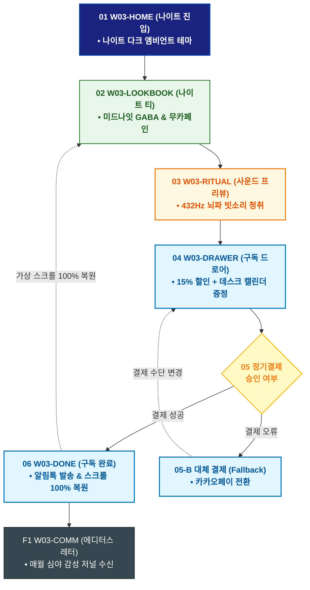

# 🔄 WICKETA 윤서연 서비스 흐름도 [야근 힐링 나이트 안식 티 30일 새벽 정기구독]

> **프로젝트명**: WICKETA 매거진 에디토리얼 & 감성 데스크테리어 (Editorial Desk)  
> **분석 대상 클라이언트**: [`[가상클라이언트_03] 윤서연_매거진에디터_감성데스크테리어.txt`](file:///C:/Users/user/Desktop/이지희%20에이전트/설계%20마저%20해오기/자동화/03_클라이언트/01_가상_클라이언트/[가상클라이언트_03] 윤서연_매거진에디터_감성데스크테리어.txt)  
> **기준 사이트맵 문서**: [`C:\Users\SBS\Desktop\0819 이지희\한명씩 화면 설계도 진행\자동화\04_설계_및_스토리보드\03_사이트맵\03_윤서연\사이트맵_목적2_나이트구독.md`](file:///C:/Users/SBS/Desktop/0819%20%EC%9D%B4%EC%A7%80%ED%9D%AC/%ED%95%9C%EB%AA%85%EC%94%A9%20%ED%99%94%EB%A9%B4%20%EC%84%A4%EA%B3%84%EB%8F%84%20%EC%A7%84%ED%96%89/%EC%9E%90%EB%8F%99%ED%99%94/04_%EC%84%A4%EA%B3%84_%EB%B0%8F_%EC%8A%A4%ED%86%A0%EB%A6%AC%EB%B3%B4%EB%93%9C/03_%EC%82%AC%EC%9D%B4%ED%8A%B8%EB%A7%B5/03_윤서연/사이트맵_목적2_나이트구독.md)  
> **접속 목적**: 야근 후 블루라이트 차단 및 심야 안식을 위한 30일 새벽 정기구독  
> **목적별 고유 킬러 기능**: **나이트 다크 앰비언트 모드 & 15% 정기구독 Slide-out Cart (`DESK-SUB-01`)**  
> **작성일자**: 2026년 8월 19일  
> **작성자**: Antigravity UI/UX 설계팀  
> **문서 인코딩**: UTF-8 (유니코드)  

---

## 1. 목적별 핵심 서비스 흐름 개요

야근 후 심야 안식 저널을 확인하고 미드나잇 GABA 티를 선택하여 매월 1일 데스크테리어 캘린더와 함께 받아보는 30일 정기구독 프로세스

---

## 2. 목적 맞춤형 가변 여정 스테이지 (Dynamic Journey Stages)

### 🌙 Stage 1: 심야 안식 저널 진입
- **01 나이트 모드 진입 (`W03-HOME`)**: 밤 22:00 다크 모드 자동 전환 ➔ [심야 안식 저널] 퀵독 클릭
- **02 무카페인 나이트 티 탐색 (`W03-LOOKBOOK`)**: 미드나잇 GABA(SEC-02) 및 사파이어 캐모마일(SEC-05) 스펙 검토

### ☕ Stage 2: 180초 캄테크 사운드 프리뷰
- **03 432Hz 뇌파 음향 확인 (`W03-RITUAL`)**: 비 소리와 함께하는 180초 안식 브루잉 사운드스케이프 청취

### 🛒 Stage 3: 30일 새벽배송 정기결제
- **04 구독 드로어 호출 (`W03-DRAWER`)**: 15% 할인 + '이달의 에디터스 데스크 캘린더' 무료 증정 옵션 선택
- **05 1초 정기결제 승인 (`W03-DRAWER`)**:
  - `[조건: 결제 성공]` ➔ 웰니스 멤버십 발급 ➔ 익일 새벽 문 앞 배송 지시
  - `[조건: 한도 초과(Fallback)]` ➔ 카카오페이 정기결제 대체창 노출

### 🌿 Stage 4: 구독 완료 & 데스크 캘린더 아카이빙
- **06 구독 승인 확인 (`W03-DONE`)**: 구독 코드 발급 ➔ 보고 있던 저널 위치로 100% 스크롤 복원
- **F1 월간 에디터스 레터 수신 (`W03-COMM`)**: 매월 발행되는 심야 에디터스 에세이 구독 연동

---

## 3. 단계별 명세표 (Flow Matrix Table)

| 단계 ID | 단계 명칭 | 사용자 행동 | 화면 접점 | 서비스/시스템 반응 | 매핑 요구사항 | 다음 진입 조건 |
| :---: | :--- | :--- | :--- | :--- | :--- | :--- |
| **01** | 나이트 진입 | [심야 안식 저널] 클릭 | `W03-HOME` | 나이트 다크 앰비언트 모드 활성화 | `REQ-01 심야 모드` | 02 나이트 티 탐색 |
| **02** | 나이트 티 탐색 | 미드나잇 GABA 티 확인 | `W03-LOOKBOOK` | 0.00mg 무카페인 성적서 렌더링 | `REQ-04 성분 검증` | 03 사운드 프리뷰 |
| **03** | 사운드 프리뷰 | 432Hz 뇌파 사운드 청취 | `W03-RITUAL` | 바이노럴 앰비언트 음향 재생 | `REQ-03 뇌파 음향` | 04 구독 호출 |
| **04** | 구독 호출 | [30일 새벽구독] 클릭 | `W03-DRAWER` | Slide-out Drawer 오픈, 캘린더 증정 | `REQ-06 정기구독` | 05 1초 결제 |
| **05-A** | [성공] 결제 승인 | 1-Click 간편결제 승인 | `W03-DRAWER` | 매월 정기 출고 큐 등록 | `REQ-06 결제 승인` | 06 구독 완료 |
| **05-B** | [예외] 결제 오류 | 카카오페이 전환 (Fallback) | `W03-DRAWER` | 대체 결제창 오버레이 | `결제 복구` | 결제 재시도 |
| **06** | 구독 완료 | 구독 승인 확인 | `W03-DONE` | 알림톡 전송 & 가상 스크롤 복원 | `REQ-06 스크롤 복원` | F1 에디터스 레터 |
| **F1** | 에디터스 레터 | 월간 에디터 칼럼 확인 | `W03-COMM` | 심야 감성 저널 아카이브 연동 | `구독 락인` | 순환 루프 |

---

## 4. 목적별 서비스 흐름도 다이어그램 (Mermaid)

---

## 5. 최종 품질 검토 및 연계 설계 문서

- [x] **고정 템플릿 탈피**: 목적별 특성에 맞춘 독자적 가변 스테이지 및 분기 조건 반영
- [x] **예외 상황(Fallback) 및 루프 완비**: 재고 부족, 결제 실패, 글자수 오류, 연속 출석 등의 분기/복구 파이프라인 수록
- [x] **연계 사이트맵**: [`사이트맵_목적2_나이트구독.md`](file:///C:/Users/SBS/Desktop/0819%20%EC%9D%B4%EC%A7%80%ED%9D%AC/%ED%95%9C%EB%AA%85%EC%94%A9%20%ED%99%94%EB%A9%B4%20%EC%84%A4%EA%B3%84%EB%8F%84%20%EC%A7%84%ED%96%89/%EC%9E%90%EB%8F%99%ED%99%94/04_%EC%84%A4%EA%B3%84_%EB%B0%8F_%EC%8A%A4%ED%86%A0%EB%A6%AC%EB%B3%B4%EB%93%9C/03_%EC%82%AC%EC%9D%B4%ED%8A%B8%EB%A7%B5/03_윤서연/사이트맵_목적2_나이트구독.md)
