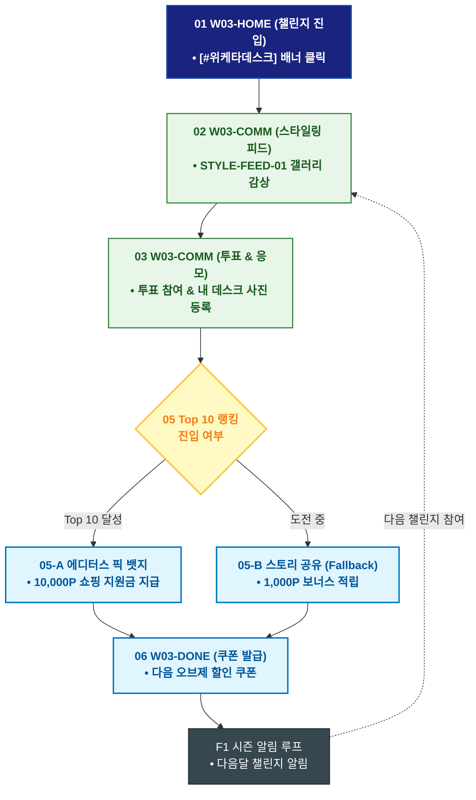

# 🔄 WICKETA 윤서연 서비스 흐름도 [인스타 감성 데스크테리어 챌린지 사진 응모 & 투표]

> **프로젝트명**: WICKETA 매거진 에디토리얼 & 감성 데스크테리어 (Editorial Desk)  
> **분석 대상 클라이언트**: [`[가상클라이언트_03] 윤서연_매거진에디터_감성데스크테리어.txt`](file:///C:/Users/user/Desktop/이지희%20에이전트/설계%20마저%20해오기/자동화/03_클라이언트/01_가상_클라이언트/[가상클라이언트_03] 윤서연_매거진에디터_감성데스크테리어.txt)  
> **기준 사이트맵 문서**: [`C:\Users\SBS\Desktop\0819 이지희\한명씩 화면 설계도 진행\자동화\04_설계_및_스토리보드\03_사이트맵\03_윤서연\사이트맵_목적4_데스크챌린지.md`](file:///C:/Users/SBS/Desktop/0819%20%EC%9D%B4%EC%A7%80%ED%9D%AC/%ED%95%9C%EB%AA%85%EC%94%A9%20%ED%99%94%EB%A9%B4%20%EC%84%A4%EA%B3%84%EB%8F%84%20%EC%A7%84%ED%96%89/%EC%9E%90%EB%8F%99%ED%99%94/04_%EC%84%A4%EA%B3%84_%EB%B0%8F_%EC%8A%A4%ED%86%A0%EB%A6%AC%EB%B3%B4%EB%93%9C/03_%EC%82%AC%EC%9D%B4%ED%8A%B8%EB%A7%B5/03_윤서연/사이트맵_목적4_데스크챌린지.md)  
> **접속 목적**: 나만의 감성 데스크 셋업 사진 업로드 및 에디터스 픽 투표 참여  
> **목적별 고유 킬러 기능**: **데스크 스타일링 피드 (`STYLE-FEED-01`) & 에디터스 픽 랭킹 투표기 (`VOTE-BOARD-01`)**  
> **작성일자**: 2026년 8월 19일  
> **작성자**: Antigravity UI/UX 설계팀  
> **문서 인코딩**: UTF-8 (유니코드)  

---

## 1. 목적별 핵심 서비스 흐름 개요

인스타그램 데스크테리어 챌린지에 참여하여 내 책상 사진을 업로드하고 실시간 투표를 통해 에디터스 픽 뱃지와 리워드를 획득하는 소셜 루프

---

## 2. 목적 맞춤형 가변 여정 스테이지 (Dynamic Journey Stages)

### 📸 Stage 1: 데스크테리어 챌린지 피드 탐색
- **01 챌린지 홈 진입 (`W03-HOME`)**: [#위케타데스크 챌린지] 배너 클릭 ➔ 스타일링 피드 로딩
- **02 실시간 데스크 갤러리 감상 (`W03-COMM`)**: 에디터 및 타 사용자들의 고해상도 데스크테리어 셋업 사진 탐색

### 🗳️ Stage 2: 투표 참여 및 내 데스크 사진 응모
- **03 실시간 투표 참여 (`W03-COMM`)**: 마음에 드는 데스크 셋업에 투표(1일 3표)
- **04 내 데스크 사진 업로드 (`W03-COMM`)**:
  - 사진 업로드 & 사용된 위케타 티 제품 태깅 ➔ `{사진 규격/해상도 검증}` (통과 시 피드 즉시 게시)

### 🏆 Stage 3: 실시간 랭킹 산출 & 에디터스 픽 심사
- **05 랭킹 검증 및 리워드 판정 (`W03-COMM`)**:
  - `{Top 10 랭크 진입?}`
  - `[Top 10 달성]` ➔ 에디터스 픽 골드 뱃지 + 10,000P 쇼핑 지원금 지급
  - `[도전 중(Fallback)]` ➔ 인스타그램 스토리 공유 시 1,000P 보너스

### 🔄 Stage 4: 리워드 사용 & 다음 시즌 챌린지 순환
- **06 리워드 쿠폰 발급 (`W03-DONE`)**: 다음 데스크 오브제 구매 시 사용 가능한 쿠폰 발급
- **F1 시즌 챌린지 알림 루프 (`W03-COMM`)**: 다음 달 신규 데스크 챌린지 알림 스케줄러 등록

---

## 3. 단계별 명세표 (Flow Matrix Table)

| 단계 ID | 단계 명칭 | 사용자 행동 | 화면 접점 | 서비스/시스템 반응 | 매핑 요구사항 | 다음 진입 조건 |
| :---: | :--- | :--- | :--- | :--- | :--- | :--- |
| **01** | 챌린지 진입 | [데스크 챌린지] 클릭 | `W03-HOME` | 챌린지 메인 쇼케이스 노출 | `REQ-03 소셜 챌린지` | 02 피드 감상 |
| **02** | 피드 감상 | 데스크 갤러리 스크롤 | `W03-COMM` | STYLE-FEED-01 인스타그램 연동 피드 렌더링 | `REQ-03 스타일링 피드` | 03 투표/응모 |
| **03** | 투표 참여 | 마음에 드는 셋업에 투표 | `W03-COMM` | VOTE-BOARD-01 실시간 투표 집계 | `REQ-03 실시간 투표` | 04 사진 업로드 |
| **04** | 사진 업로드 | 내 데스크 사진 등록 | `W03-COMM` | 해시태그 검증 및 피드 즉시 게시 | `REQ-03 사진 업로드` | 05 랭킹 판정 |
| **05-A** | [성공] Top 10 달성| Top 10 진입 확인 | `W03-COMM` | 에디터스 픽 뱃지 및 10,000P 지급 | `리워드 지급` | 06 쿠폰 발급 |
| **05-B** | [진행] 스토리 공유 | 인스타 스토리 공유 (Fallback) | `W03-COMM` | 1,000P 보너스 포인트 즉시 적립 | `바이럴 확산` | 06 쿠폰 발급 |
| **06** | 쿠폰 발급 | 쇼핑 지원금 쿠폰 확인 | `W03-DONE` | 장바구니 적용 가능한 쿠폰 발급 | `REQ-06 리워드 쿠폰` | F1 알림 루프 |
| **F1** | 챌린지 순환 | 다음 시즌 챌린지 확인 | `W03-COMM` | 다음달 챌린지 카카오 푸시 예약 | `순환 루프` | 다음 챌린지 |

---

## 4. 목적별 서비스 흐름도 다이어그램 (Mermaid)

---

## 5. 최종 품질 검토 및 연계 설계 문서

- [x] **고정 템플릿 탈피**: 목적별 특성에 맞춘 독자적 가변 스테이지 및 분기 조건 반영
- [x] **예외 상황(Fallback) 및 루프 완비**: 재고 부족, 결제 실패, 글자수 오류, 연속 출석 등의 분기/복구 파이프라인 수록
- [x] **연계 사이트맵**: [`사이트맵_목적4_데스크챌린지.md`](file:///C:/Users/SBS/Desktop/0819%20%EC%9D%B4%EC%A7%80%ED%9D%AC/%ED%95%9C%EB%AA%85%EC%94%A9%20%ED%99%94%EB%A9%B4%20%EC%84%A4%EA%B3%84%EB%8F%84%20%EC%A7%84%ED%96%89/%EC%9E%90%EB%8F%99%ED%99%94/04_%EC%84%A4%EA%B3%84_%EB%B0%8F_%EC%8A%A4%ED%86%A0%EB%A6%AC%EB%B3%B4%EB%93%9C/03_%EC%82%AC%EC%9D%B4%ED%8A%B8%EB%A7%B5/03_윤서연/사이트맵_목적4_데스크챌린지.md)
