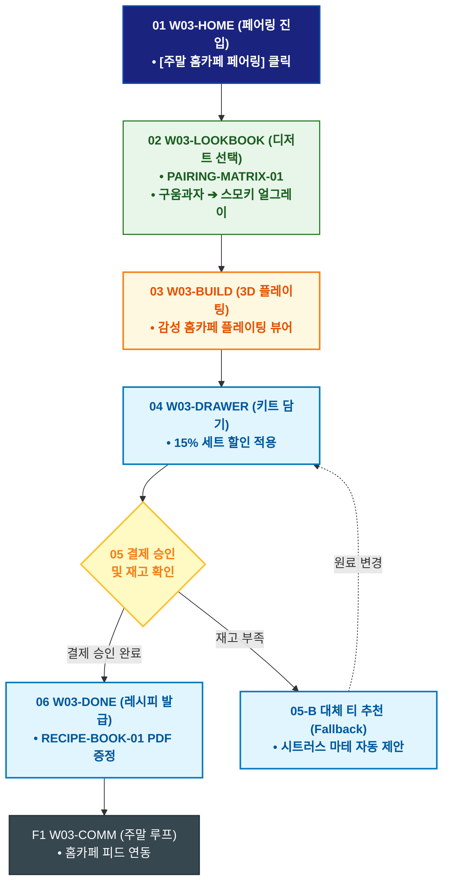

# 🔄 WICKETA 윤서연 서비스 흐름도 [주말 홈카페 티 & 디저트 에디토리얼 페어링 키트 구매]

> **프로젝트명**: WICKETA 매거진 에디토리얼 & 감성 데스크테리어 (Editorial Desk)  
> **분석 대상 클라이언트**: [`[가상클라이언트_03] 윤서연_매거진에디터_감성데스크테리어.txt`](file:///C:/Users/user/Desktop/이지희%20에이전트/설계%20마저%20해오기/자동화/03_클라이언트/01_가상_클라이언트/[가상클라이언트_03] 윤서연_매거진에디터_감성데스크테리어.txt)  
> **기준 사이트맵 문서**: [`C:\Users\SBS\Desktop\0819 이지희\한명씩 화면 설계도 진행\자동화\04_설계_및_스토리보드\03_사이트맵\03_윤서연\사이트맵_목적5_디저트페어링.md`](file:///C:/Users/SBS/Desktop/0819%20%EC%9D%B4%EC%A7%80%ED%9D%AC/%ED%95%9C%EB%AA%85%EC%94%A9%20%ED%99%94%EB%A9%B4%20%EC%84%A4%EA%B3%84%EB%8F%84%20%EC%A7%84%ED%96%89/%EC%9E%90%EB%8F%99%ED%99%94/04_%EC%84%A4%EA%B3%84_%EB%B0%8F_%EC%8A%A4%ED%86%A0%EB%A6%AC%EB%B3%B4%EB%93%9C/03_%EC%82%AC%EC%9D%B4%ED%8A%B8%EB%A7%B5/03_윤서연/사이트맵_목적5_디저트페어링.md)  
> **접속 목적**: 주말 홈카페를 위한 베이커리 디저트 매칭 티 큐레이션 및 페어링 키트 구매  
> **목적별 고유 킬러 기능**: **디저트 페어링 매트릭스 (`PAIRING-MATRIX-01`) & 홈카페 레시피 북 (`RECIPE-BOOK-01`)**  
> **작성일자**: 2026년 8월 19일  
> **작성자**: Antigravity UI/UX 설계팀  
> **문서 인코딩**: UTF-8 (유니코드)  

---

## 1. 목적별 핵심 서비스 흐름 개요

구움과자/크루아상 등 디저트 유형별 최적의 티 페어링 매트릭스를 탐색하고, 에디터가 엄선한 홈카페 페어링 키트를 간편 주문하는 미식 큐레이션 여정

---

## 2. 목적 맞춤형 가변 여정 스테이지 (Dynamic Journey Stages)

### 🥐 Stage 1: 디저트 페어링 매트릭스 탐색
- **01 홈카페 페어링 진입 (`W03-HOME`)**: [주말 홈카페 페어링] 클릭 ➔ 페어링 매트릭스 콘솔 로딩
- **02 디저트 유형 선택 (`W03-LOOKBOOK`)**: 버터 풍미 구움과자 / 다크 초콜릿 / 과일 타르트 중 내 디저트 선택 ➔ 스모키 얼그레이(SEC-03) 추천

### ☕ Stage 2: 3D 브루잉 & 플레이팅 시뮬레이션
- **03 3D 페어링 플레이팅 확인 (`W03-BUILD`)**: 더블월 잔과 디저트 접시의 감성 플레이팅 레이아웃 3D 뷰어 확인
- **04 페어링 가이드 검증 (`W03-BUILD`)**: 최적의 추출 온도(85℃) 및 페어링 팁 열람

### 🛒 Stage 3: 페어링 키트 결제
- **05 페어링 키트 장바구니 담기 (`W03-DRAWER`)**: 전용 티 2종 + 글래스 머들러 세트 15% 할인 적용 ➔ 1초 결제
- **06 결제 승인 (`W03-DRAWER`)**: 주문 완료 및 출고 큐 등록

### 📖 Stage 4: 홈카페 페어링 레시피 북 발급
- **07 레시피 북 다운로드 (`W03-DONE`)**: 에디터스 홈카페 페어링 가이드북 PDF 발급
- **F1 주말 홈카페 루프 (`W03-COMM`)**: 주말 브런치 사진 공유 피드 연동

---

## 3. 단계별 명세표 (Flow Matrix Table)

| 단계 ID | 단계 명칭 | 사용자 행동 | 화면 접점 | 서비스/시스템 반응 | 매핑 요구사항 | 다음 진입 조건 |
| :---: | :--- | :--- | :--- | :--- | :--- | :--- |
| **01** | 페어링 진입 | [홈카페 페어링] 클릭 | `W03-HOME` | 페어링 매트릭스 콘솔 로딩 | `REQ-01 페어링 기획` | 02 디저트 선택 |
| **02** | 디저트 선택 | 버터 구움과자 선택 | `W03-LOOKBOOK` | PAIRING-MATRIX-01 스모키 얼그레이 매칭 | `REQ-05 페어링 차트` | 03 플레이팅 확인 |
| **03** | 플레이팅 확인 | 3D 플레이팅 뷰어 확인 | `W03-BUILD` | 감성 홈카페 플레이팅 3D 렌더링 | `REQ-02 플레이팅 뷰어` | 04 키트 담기 |
| **04** | 키트 담기 | [페어링 키트 구매] 클릭 | `W03-DRAWER` | Slide-out Drawer 오픈, 15% 세트 할인 | `REQ-06 키트 주문` | 05 1초 결제 |
| **05-A** | [성공] 결제 승인 | 간편결제 1-Click 승인 | `W03-DRAWER` | 당일 특급 출고 지시 완료 | `REQ-06 결제 승인` | 06 레시피 발급 |
| **05-B** | [예외] 재고 부족 | 대체 페어링 티 제안 | `W03-DRAWER` | 시트러스 마테 대체 추천 | `예외 복구` | 결제 재시도 |
| **06** | 레시피 발급 | 홈카페 레시피북 확인 | `W03-DONE` | RECIPE-BOOK-01 PDF 다운로드 링크 생성 | `REQ-06 레시피북` | F1 주말 루프 |
| **F1** | 주말 루프 | 주말 홈카페 피드 확인 | `W03-COMM` | 홈카페 레시피 커뮤니티 연동 | `고객 락인` | 여정 완료 |

---

## 4. 목적별 서비스 흐름도 다이어그램 (Mermaid)

---

## 5. 최종 품질 검토 및 연계 설계 문서

- [x] **고정 템플릿 탈피**: 목적별 특성에 맞춘 독자적 가변 스테이지 및 분기 조건 반영
- [x] **예외 상황(Fallback) 및 루프 완비**: 재고 부족, 결제 실패, 글자수 오류, 연속 출석 등의 분기/복구 파이프라인 수록
- [x] **연계 사이트맵**: [`사이트맵_목적5_디저트페어링.md`](file:///C:/Users/SBS/Desktop/0819%20%EC%9D%B4%EC%A7%80%ED%9D%AC/%ED%95%9C%EB%AA%85%EC%94%A9%20%ED%99%94%EB%A9%B4%20%EC%84%A4%EA%B3%84%EB%8F%84%20%EC%A7%84%ED%96%89/%EC%9E%90%EB%8F%99%ED%99%94/04_%EC%84%A4%EA%B3%84_%EB%B0%8F_%EC%8A%A4%ED%86%A0%EB%A6%AC%EB%B3%B4%EB%93%9C/03_%EC%82%AC%EC%9D%B4%ED%8A%B8%EB%A7%B5/03_윤서연/사이트맵_목적5_디저트페어링.md)
