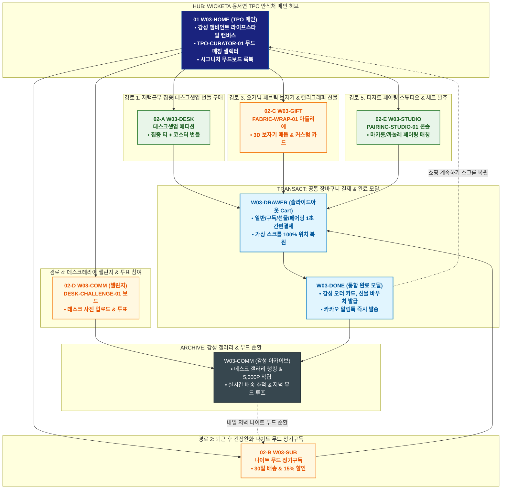

# 🔄 WICKETA 윤서연 통합 서비스 흐름도 (Master Integrated Service Flow)

> **프로젝트명**: WICKETA TPO 감성 큐레이션 플랫폼 (윤서연 라이프스타일 큐레이터 마스터)  
> **분석 대상 클라이언트**: [`[가상클라이언트_03] 윤서연_라이프스타일큐레이터_감성TPO.txt`](file:///C:/Users/user/Desktop/이지희%20에이전트/설계%20마저%20해오기/자동화/03_클라이언트/01_가상_클라이언트/[가상클라이언트_03]%20윤서연_라이프스타일큐레이터_감성TPO.txt)  
> **기준 사이트맵 문서**: [`C:\Users\user\Desktop\이지희 에이전트\설계 마저 해오기\자동화\04_설계_및_스토리보드\03_사이트맵\03_윤서연\사이트맵.md`](file:///C:/Users/user/Desktop/이지희%20에이전트/설계%20마저%20해오기/자동화/04_설계_및_스토리보드/03_사이트맵/03_윤서연/사이트맵.md)  
> **기준 클라이언트 분석서**: [`[클라이언트03]_윤서연_라이프스타일큐레이터_감성TPO.md`](file:///C:/Users/user/Desktop/이지희%20에이전트/설계%20마저%20해오기/자동화/03_클라이언트/02_클라이언트_분석/[클라이언트03]_윤서연_라이프스타일큐레이터_감성TPO.md)  
> **적용 레이아웃 아키타입**: `C-1 TPO 감성 큐레이션형 (Lifestyle Mood Curator)`  
> **통합 핵심 킬러 기능**: **TPO 무드 매칭 셀렉터 (`TPO-CURATOR-01`) & 디저트 페어링 스튜디오 (`PAIRING-STUDIO-01`) & 오가닉 패브릭 보자기 포장 (`FABRIC-WRAP-01`) & 데스크테리어 챌린지 (`DESK-CHALLENGE-01`) & 나이트 캄 테라피 (`NIGHT-MOOD-01`)**  
> **작성일자**: 2026년 8월 19일  
> **작성자**: Antigravity UI/UX 총괄 설계팀  
> **문서 인코딩**: UTF-8 (유니코드)  

---

## 1. 5대 목적별 서비스 흐름 비교 및 요구사항 통합 분석

본 문서는 윤서연 클라이언트의 **5대 독립적 서비스 이용 목적(재택근무 집중 데스크셋업 주문, 퇴근 후 긴장완화 나이트구독, 오가닉 패브릭 보자기 선물, 데스크테리어 사진 챌린지, 시즌 디저트 페어링 발주)**을 종합 분석하여, **중복 화면을 단일 화면 허브로 통합**하고 **고유 목적별 경로(User Journey Path)와 핵심 요구사항을 누락 없이 체계화한 마스터 서비스 흐름도**입니다.

### 1.1 공통 요구사항 vs 클라이언트 고유 요구사항 분석표

| 구분 | 공통 요구사항 (Common Baseline) | 클라이언트 고유 요구사항 (Unique Specialization) | 최종 통합 서비스 적용 방안 |
| :--- | :--- | :--- | :--- |
| **메인 진입 & 세계관** | • 감성 앰비언트 비주얼 캔버스<br/>• 3초 힐링 사운드스케이프<br/>• GNB/LNB 전역 내비게이션 | • **`TPO-CURATOR-01`**: [시간/공간/기분] 3축 감성 무드 매칭 모듈<br/>• 인스타 감성 무드보드 룩북 상시 노출 | `W03-HOME`을 TPO 무드 안식처 허브로 구성하고, 감성 캔버스와 TPO 셀렉터 퀵독을 배치 |
| **무드 큐레이션 & 페어링** | • 카테고리 필터 및 제품 상세<br/>• 0kcal/무카페인 클린 포뮬러 | • **`PAIRING-STUDIO-01`**: 마카롱/까눌레/휘낭시에 맞춤 페어링 지수 시뮬레이터<br/>• TPO 상황별 최적의 브루잉 가이드 | `W03-CURATE` 및 `W03-STUDIO` 콘솔에서 감성 무드 분석 및 디저트 매칭도를 확인 |
| **커스텀 & 선물 제작** | • 선물 포장 옵션 및 배송지 입력<br/>• 모바일 기프트 카드 발급 | • **`FABRIC-WRAP-01`**: 친환경 오가닉 린넨 보자기 3D 매듭 선택기<br/>• 감성 캘리그래피 손글씨 메시지 카드 에디터 | `W03-GIFT` 아틀리에에서 패브릭 보자기 360도 뷰어 및 커스텀 카드 작성 연계 |
| **정기구독 & 루프** | • 정기배송 주기 및 할인율 설정<br/>• 출석 및 포인트 적립 | • **`NIGHT-MOOD-01`**: 퇴근 후 심야 긴장 완화 티 30일 정기구독 (15% 할인)<br/>• **`DESK-CHALLENGE-01`**: 나만의 데스크테리어 사진 업로드 & 투표 적립금 루프 | `W03-SUB` 및 `W03-COMM`에서 정기구독 및 데스크 챌린지 아카이빙 순환 파이프라인 구축 |
| **장바구니 & 결제** | • 장바구니 품목 관리 및 간편결제<br/>• 모바일 주문 완료 알림 | • **Slide-out Cart Drawer**: 페이지 무이탈 1-Click 일반/15%구독/선물/페어링 결제<br/>• **가상 스크롤 100% 위치 복원 엔진** | `W03-DRAWER` 단일 공통 드로어로 모든 결제를 심리스하게 처리하고 복원 |

### 1.2 5대 목적별 핵심 서비스 흐름 정의 (Use Cases 1~5)

본 통합 시스템에 완전하게 통합·반영된 5대 목적별 핵심 서비스 흐름 정의는 다음과 같습니다:

#### 📌 목적 1: 홈오피스 몰입 TPO 블렌드 & 세라믹 머그 번들 발주
본 서비스 흐름도는 **홈오피스 몰입에 최적화된 TPO 큐레이션 탐색 및 세라믹 머그 번들 결제 트리형 구조**로 설계되었습니다:

- **1. 시작 지점 (Starting Point)**: 29CM 라이프스타일 기획전 배너 유입 ➔ `W03-TPO` (TPO 무드 셀렉터 직행) & `W03-HOME`
- **2. 핵심 행동 (Core Action)**: '오후 2시 업무 집중' TPO 선택 ➔ 오피스 포커스 민트/마테 블렌드 성분표 및 카페인 밸런스 확인 ➔ 핸드메이드 감성 세라믹 머그 & 우드 코스터 번들(15% 할인) 조합
- **3. 전환 목표 (Conversion Goal)**: **[홈오피스 데스크 몰입 번들] 일괄 장바구니 담기 및 원클릭 결제**
- **4. 필요한 기능 (Required Features)**: TPO-CURATOR-01 무드 스위처, 3D 세라믹 머그 뷰어, 데스크 셋업 번들 15% 할인 모듈, 슬라이드아웃 Cart Drawer
- **5. 예외 상황 (Edge Cases & Fallbacks)**: 세라믹 머그 특정 컬러 품절 시 오트밀 베이지 대체 추천, 주말 주문 시 월요일 오전 출고 안내
- **6. 완료 결과 (Completed State)**: 주문 완료 및 데스크 셋업 가이드 PDF 발급, 포토 리뷰 작성 시 29SELECT 3,000P 적립

---

#### 📌 목적 2: 무카페인 나이트 릴랙스 30일 에디터스 픽 구독
본 서비스 흐름도는 **지친 퇴근길 유저를 위한 분기 없는 6단계 초고속 직렬 정기구독 파이프라인 (Fast Streamline)**으로 설계되었습니다:

- **1. 시작 지점 (Starting Point)**: 인스타그램 퇴근길 힐링 피드 링크 ➔ `W03-HOME` (나이트 모드 진입)
- **2. 핵심 행동 (Core Action)**: '밤 10시 나이트 슬립' 무드 탭 ➔ 무카페인 카모마일 바닐라 릴랙스 티 0.00mg 성분표 확인 ➔ 30일 정기배송 플랜 선택
- **3. 전환 목표 (Conversion Goal)**: **[월간 에디터스 픽 정기구독] 슬라이드아웃 Cart 원클릭 결제 및 구독 등록**
- **4. 필요한 기능 (Required Features)**: TPO 원클릭 나이트 필터, 0.00mg 무카페인 공인 인증서 뷰어, 슬라이드아웃 Cart Drawer, 스크롤 100% 복원 모듈
- **5. 예외 상황 (Edge Cases & Fallbacks)**: 첫 달 할인 코드 누락 시 시스템 자동 최대 할인(20%) 매핑, 결제 실패 시 카카오페이 원클릭 대체
- **6. 완료 결과 (Completed State)**: VIP 에디터스 구독 멤버십 발급, 첫 회차 나이트 패키지 즉시 출고 대기 및 월간 무드 저널 연동

---

#### 📌 목적 3: 동료·친구를 위한 패브릭 보자기 선물세트 발송
본 서비스 흐름도는 **감성 중심의 4단 비스포크 기프트 제작 및 모바일 언박싱 카드 전달 구조**로 설계되었습니다:

- **1. 시작 지점 (Starting Point)**: 감성 선물 큐레이션 배너 유입 ➔ `W03-GIFT` (기프트 빌더 직행) & `W03-HOME`
- **2. 핵심 행동 (Core Action)**: 29SELECT 리미티드 티 컬렉션 화보 감상 ➔ 받는 사람 취향 맞춤 티 4종 선택 ➔ 3D 패브릭 보자기(린넨/세이지) 포장 및 캘리그래피 축하 문구 작성
- **3. 전환 목표 (Conversion Goal)**: **[패브릭 기프트 에디션] 카카오톡 선물하기 결제 및 모바일 카드 발송**
- **4. 필요한 기능 (Required Features)**: 3D 패브릭 포장 시뮬레이터, 캘리그래피 메시지 카드 폰트 에디터, 카카오톡 선물하기 연동 모듈
- **5. 예외 상황 (Edge Cases & Fallbacks)**: 받는 사람 주소 미입력 시 카카오톡 선물 링크 즉시 생성, 포장재 색상 품절 시 실시간 대체 추천
- **6. 완료 결과 (Completed State)**: 카카오톡 선물 발송 완료, 친구 배송지 입력 시 실시간 알림톡 수신, 구매자에게 29SELECT 3,000P 적립

---

#### 📌 목적 4: 인스타 룩북 감상 & 데스크 테리어 인증 루프
본 서비스 흐름도는 **에디토리얼 화보 감상 ➔ 3초 패스트 결제 ➔ SNS 사진 인증 ➔ 100% 페이백 ➔ 다음 호 매거진으로 순환되는 소셜 루프(Social Loop)** 구조로 설계되었습니다:

- **1. 시작 지점 (Starting Point)**: 인스타그램/핀터레스트 데스크 테리어 화보 링크 ➔ `W03-HOME` (매거진 룩북 직행)
- **2. 핵심 행동 (Core Action)**: 고해상도 데스크 테리어 룩북 감상 ➔ 화보 속 사용된 에디터스 블렌드 & 오브제 확인 ➔ '데스크 챌린지 킷(35% 할인)' 원클릭 담기
- **3. 전환 목표 (Conversion Goal)**: **[데스크 테리어 챌린지 스타터 킷] 3초 패스트 결제 및 챌린지 자동 접수**
- **4. 필요한 기능 (Required Features)**: 룩북 태그 원클릭 장바구니 모듈, 슬라이드아웃 Cart Drawer, SNS 사진 업로드 인증 폼
- **5. 예외 상황 (Edge Cases & Fallbacks)**: 특정 머그 색상 품절 시 동일 톤 세라믹 대체 추천, 결제창 이탈 시 24시간 장바구니 보존 알림
- **6. 완료 결과 (Completed State)**: 주문 완료 및 인스타 촬영 팁 가이드북 수령 ➔ SNS 업로드 인증 시 100% 포인트 페이백 ➔ **다음 호 룩북 챌린지 순환**

---

#### 📌 목적 5: 상황별 디저트 & 시그니처 티 페어링 세트 주문
본 서비스 흐름도는 **미식 및 홈카페 라이프스타일에 최적화된 디저트 1:1 페어링 스테이지형 구조**로 설계되었습니다:

- **1. 시작 지점 (Starting Point)**: 홈카페 룩북 및 디저트 페어링 기획전 배너 유입 ➔ `W03-HOME` & `W03-TPO`
- **2. 핵심 행동 (Core Action)**: 보유 중인 디저트 종류(버터 스콘, 얼그레이 구움과자) 선택 ➔ 디저트와 산미/바디감이 최적화된 모닝 리추얼 페어링 티 추천 확인 ➔ 프리미엄 수제 잼 세트 추가
- **3. 전환 목표 (Conversion Goal)**: **[디저트 1:1 페어링 풀세트] 장바구니 담기 및 원클릭 결제**
- **4. 필요한 기능 (Required Features)**: 디저트 1:1 페어링 가이드 모듈, 테이스팅 노트 뷰어, 수제 잼/스프레드 옵션 선택기, 슬라이드아웃 Cart
- **5. 예외 상황 (Edge Cases & Fallbacks)**: 특정 잼 품절 시 얼그레이 밀크잼 대체 제안, 베이커리 보관 팁 모달 제공
- **6. 완료 결과 (Completed State)**: 주문 완료 및 홈카페 테이스팅 페어링 카드 수령, 다음 회차 페어링 할인 쿠폰 지급

---

---

## 2. 통합 화면 아키텍처 및 중복 화면 통합 매핑

본 설계에서는 5대 목적별 산출물에 분산되어 있던 중복 화면들을 **9개의 핵심 화면 노드(Node)**로 통합 정리하였습니다.

```text
[WICKETA 윤서연 통합 서비스 화면 매핑 구조]
├── 🏠 W03-HOME (TPO 무드 안식처 메인 허브)
│   ├── HERO-01: 1200x380 감성 앰비언트 라이프스타일 캔버스
│   ├── TPO-CURATOR-01: TPO 무드 매칭 셀렉터 (시간/공간/감정 3축)
│   ├── MOOD-01~03: 3대 시그니처 라이프스타일 무드보드
│   └── 5대 목적 진입 라우터 (GNB / Quick Dock)
│
├── 🎨 W03-CURATE (TPO 감성 큐레이터 콘솔)
│   ├── 시간대별(Morning/Afternoon/Night), 공간별(Desk/Living/Bed) 무드 필터링
│   └── 1:1 맞춤형 라이프스타일 블렌딩 티 추천 알고리즘
│
├── 🧁 W03-STUDIO (디저트 페어링 스튜디오)
│   ├── PAIRING-STUDIO-01: 마카롱, 까눌레, 휘낭시에, 스콘 페어링 매칭도
│   └── 풍미 밸런스(단맛/산미/바디감) 레이더 차트 & 페어링 세트 원클릭 담기
│
├── 🎁 W03-GIFT (오가닉 패브릭 & 기프트 아틀리에)
│   ├── FABRIC-WRAP-01: 린넨/코튼 친환경 보자기 3D 매듭 시뮬레이터
│   └── 감성 캘리그래피 손글씨 메시지 카드 & 카카오톡 선물하기
│
├── 🌙 W03-SUB (나이트 무드 정기구독 콘솔)
│   ├── NIGHT-MOOD-01: 퇴근 후 심야 긴장 완화 무카페인 티 30일 배송
│   └── 15% 정기구독 할인 & 월간 무드 저널 동봉
│
├── 💻 W03-DESK (데스크셋업 스페셜 에디션)
│   ├── 재택근무 집중력을 높이는 감성 데스크 티 & 우드/세라믹 코스터 세트
│   └── 10% 번들 할인 & 무소음 티 글래스 옵션
│
├── 🛒 W03-DRAWER (슬라이드아웃 통합 장바구니 드로어) [공통 레이어]
│   ├── 일반 / 15% 정기구독 / 카카오 선물 / 페어링 세트 1초 결제
│   └── 가상 스크롤 100% 위치 복원 엔진 (Scroll Restoration)
│
├── 🎉 W03-DONE (통합 완료 모달)
│   └── 감성 오더 카드, 모바일 선물 바우처 발급 & 카카오 알림톡
│
└── 🗂️ W03-COMM (데스크테리어 챌린지 & 감성 갤러리)
    ├── DESK-CHALLENGE-01: 데스크테리어 사진 업로드 & 월간 투표
    ├── 베스트 무드 선정 시 10,000P 적립금 & 실시간 배송 추적
    └── 매일 저녁 감성 리마인더 루프
```

---

## 3. 5대 통합 사용자 여정 경로 (User Journey Paths)

통합 시스템은 사용자의 진입 목적에 따라 5개의 상호 배타적이면서도 유기적으로 연계된 경로를 제공합니다:

```text
[경로 1: 재택근무 집중력을 높이는 감성 데스크 티 & 코스터 세트 주문]
W03-HOME ➔ W03-DESK (데스크셋업 번들 선택) ➔ W03-DRAWER (간편결제) ➔ W03-DONE (주문 완료) ➔ W03-COMM (데스크 셋업 가이드)

[경로 2: 퇴근 후 긴장 완화를 위한 나이트 무드 티 30일 정기구독]
W03-HOME ➔ W03-SUB (나이트 무드 30일 설정) ➔ W03-DRAWER (15% 구독 할인 결제) ➔ W03-DONE (구독 승인 & 스크롤 복원) ➔ W03-COMM (월간 무드 리포트)

[경로 3: 친환경 오가닉 패브릭 보자기 포장 & 캘리그래피 메시지 선물]
W03-HOME ➔ W03-GIFT (FABRIC-WRAP-01 보자기 매듭 & 카드 작성) ➔ W03-DRAWER (카카오 선물 결제) ➔ W03-DONE (모바일 기프트 카드) ➔ W03-COMM (배송 추적)

[경로 4: 나만의 감성 데스크테리어 사진 업로드 & 커뮤니티 투표 참여]
W03-COMM (DESK-CHALLENGE-01 진입) ➔ [데스크 사진 업로드] ➔ 커뮤니티 투표 참여 ➔ 5,000P 적립 ➔ W03-HOME (신규 무드 탐색)

[경로 5: 계절 디저트(마카롱/까눌레)와 최적 매칭되는 페어링 티 세트 발주]
W03-HOME ➔ W03-STUDIO (PAIRING-STUDIO-01 디저트 선택) ➔ [페어링 세트 담기] ➔ W03-DRAWER (1초 결제) ➔ W03-DONE (페어링 레시피 카드) ➔ W03-COMM (홈카페 인증)
```

### 3.1 5대 경로별 페이즈(Phase 1~4) 상세 진행 흐름

#### 🔹 [경로 1] 목적 1: 홈오피스 몰입 TPO 블렌드 & 세라믹 머그 번들 발주
### 🟢 Phase 1: TPO INTAKE · 홈오피스 TPO 무드 탐색
- **01 TPO 무드 셀렉터 진입 (`W03-HOME / W03-TPO`)**: 에디토리얼 매거진 커버 확인 / 메인 히어로 접점 / TPO-CURATOR-01 상황별 큐레이션 CTA 제공
- **02 오피스 포커스 블렌드 검증 (`W03-TPO`)**: '오후 2시 업무 집중' 선택 / 에디터스 픽 접점 / 페퍼민트 & 예바마테 성분표 및 집중력 리뷰(4.9점) 노출

### 🟡 Phase 2: BUNDLE SELECTION · 감성 세라믹 머그 번들 조합
- **03 세라믹 머그 & 코스터 매칭 (`W03-GIFT`)**: 핸드메이드 매트 세라믹 머그 선택 / 기프트 빌더 접점 / 3D 머그 회전 뷰어 및 우드 코스터 조합
- **04 데스크 번들 15% 할인 확정 (`W03-GIFT`)**: 티 20포 + 세라믹 머그 풀세트 선택 / 번들 매칭 접점 / 15% 에디터스 할인 적용 및 총액 계산

### 🟢🟡 Phase 3: FAST CHECKOUT · 슬라이드아웃 1초 결제
- **05 Cart Drawer 원클릭 결제 (`W03-DRAWER`)**: Slide-out Cart Drawer 호출 / 슬라이드아웃 접점 / 간편결제(Apple Pay/카카오페이) 1초 승인
- **06 주문 완료 & 에디토리얼 티켓 (`W03-DONE`)**: 데스크 셋업 패키지 주문 완료 / Confirmation Modal 접점 / 모바일 영수증 및 데스크 셋업 룩북 PDF 발급

### ⬛ Phase 4: DESK SUPPORT · 데스크 테리어 가이드 연계
- **F1 데스크 테리어 룩북 연계 (`W03-HOME`)**: 재택근무 데스크 셋업 팁 확인 / Magazine Footer 접점 / 포토 리뷰 작성 시 3,000P 적립 안내

---

#### 🔹 [경로 2] 목적 2: 무카페인 나이트 릴랙스 30일 에디터스 픽 구독
### 🟢 Phase 1: NIGHT INTAKE · 나이트 TPO 무드 직진입
- **01 나이트 안식처 진입 (`W03-HOME`)**: 퇴근길 나이트 모드 매거진 확인 / 메인 히어로 접점 / 밤 10시 슬립 큐레이션 CTA 제공
- **02 무카페인 성분 검증 (`W03-TPO`)**: 나이트 슬립 릴랙스 티 성분 확인 / TPO 상세 접점 / 0.00mg 무카페인 시험성적서 및 숙면 리뷰 노출

### 🟡 Phase 2: PREVIEW · 월간 무드 구독 혜택 검토
- **03 30일 정기구독 플랜 확인 (`W03-HOME`)**: 30일 배송 주기 및 월간 20% 할인 혜택 검토 / 구독 쇼케이스 접점 / 매월 에디터 추천 티 교체 옵션 렌더링

### 🟢🟡 Phase 3: 1-CLICK SUBSCRIBE · 슬라이드아웃 1초 정기결제
- **04 슬라이드아웃 Cart 호출 (`W03-DRAWER`)**: Slide-out Cart Drawer 오픈 / 슬라이드아웃 접점 / 페이지 이탈 없이 배송지 및 간편 카드 등록
- **05 1초 정기결제 승인 (`W03-DONE`)**: 원클릭 결제 승인 / Fast Checkout 접점 / VIP 에디터스 멤버십 즉시 발급 및 이전 스크롤 100% 복원

### ⬛ Phase 4: REGULAR DELIVERY · 월간 무드 리포트 연동
- **F1 월간 무드 리포트 관리 (`W03-HOME`)**: 정기배송일 변경 및 다음 달 티 스왑(Swap) 설정 / Magazine Footer 접점 / 월간 감정 저널 발송 등록

---

#### 🔹 [경로 3] 목적 3: 동료·친구를 위한 패브릭 보자기 선물세트 발송
### 🟢 Phase 1: GIFT CURATION · 선물 룩북 및 컬렉션 탐색
- **01 선물 기획전 진입 (`W03-GIFT / W03-HOME`)**: 에디토리얼 선물 화보 확인 / 기프트 메인 접점 / 감성 패브릭 패키지 쇼케이스 로딩
- **02 시그니처 티 4종 선택 (`W03-GIFT`)**: 모닝 리추얼, 오피스 포커스, 나이트 슬립 등 4종 티 세트 조합 / Flavor Selector 접점 / 구성품 실물 화보 및 조향 노트 렌더링

### 🟡 Phase 2: BESPOKE PACKAGING · 패브릭 보자기 포장 & 카드 작성
- **03 3D 패브릭 보자기 포장 (`W03-GIFT`)**: 친환경 린넨/세이지 그린 보자기 색상 선택 / 3D Packaging Canvas 접점 / 실시간 보자기 매듭 360도 회전 시뮬레이션
- **04 캘리그래피 감성 카드 작성 (`W03-GIFT`)**: 축하 메시지 입력 및 감성 손글씨 폰트 적용 / Card Editor 접점 / 완성된 선물 패키지 최종 프리뷰

### 🟢🟡 Phase 3: GIFT ORDER · 카카오톡 선물 발송 & 결제
- **05 카카오 선물하기 결제 (`W03-DRAWER`)**: 카카오톡 친구 선택 및 1-Click 간편결제 / Slide-out Cart Drawer 접점 / 시스템 결제 승인 및 선물 링크 생성
- **06 모바일 기프트 카드 발급 (`W03-DONE`)**: 3D 언박싱 모바일 선물 카드 확인 / Saved Gift Modal 접점 / 카카오톡 메시지 즉시 전송

### ⬛ Phase 4: GIFT TRACKING · 배송 추적 & 감사 리워드
- **F1 친구 배송지 확인 & 리워드 (`W03-HOME`)**: 친구 주소 입력 현황 확인 / Gift Tracker 접점 / 29SELECT 3,000P 적립 및 감사 카드 연동

---

#### 🔹 [경로 4] 목적 4: 인스타 룩북 감상 & 데스크 테리어 인증 루프
### 🟢 Phase 1: LOOKBOOK ENTRY · 에디토리얼 화보 감상
- **01 룩북 화보 진입 (`W03-HOME`)**: 29SELECT 데스크 테리어 커버 스토리 확인 / 메인 히어로 접점 / 챌린지 참여 룩북 탐색 CTA 제공
- **02 화보 속 오브제 탐색 (`W03-HOME`)**: 감성 책상 위 티 & 세라믹 머그 태그 확인 / Lookbook Detail 접점 / 제품 스펙 및 챌린지 혜택 노출

### 🟡 Phase 2: 1-CLICK KIT ORDER · 챌린지 세트 3초 발주
- **03 챌린지 세트 원클릭 담기 (`W03-TPO`)**: 35% 할인 챌린지 킷 확인 후 [화보 속 세트 그대로 담기] 클릭 / Kit Selector 접점 / 자동 번들 세트 구성
- **04 슬라이드아웃 3초 결제 (`W03-DRAWER`)**: Cart Drawer에서 간편결제 1초 승인 / Slide-out Cart 접점 / 시스템 결제 승인 및 챌린지 접수 완료

### 🟢🟡 Phase 3: CHALLENGE REGISTRATION · 촬영 가이드북 수령
- **05 가이드북 발급 & 챌린지 접수 (`W03-DONE`)**: 주문 완료 및 모바일 감성 사진 촬영 팁 PDF 수령 / Confirmation Modal 접점 / 카카오 알림톡 즉시 발송

### ⬛ Phase 4: SOCIAL REWARD LOOP · 인스타 사진 인증 & 페이백 순환
- **F1 인스타 업로드 & 100% 페이백 (`W03-HOME`)**: 인스타그램에 데스크 사진 업로드(#29SELECT #위케티) 및 인증 / Challenge Board 접점 / 100% 포인트 페이백 지급 및 다음 호 매거진 순환 유도

---

#### 🔹 [경로 5] 목적 5: 상황별 디저트 & 시그니처 티 페어링 세트 주문
### 🟢 Phase 1: PAIRING INTAKE · 디저트 페어링 룩북 탐색
- **01 페어링 매거진 진입 (`W03-HOME`)**: 디저트 & 티 라이프스타일 화보 확인 / 메인 히어로 접점 / 디저트 페어링 북 탐색 CTA 제공
- **02 디저트 메뉴 선택 (`W03-TPO`)**: 버터 스콘 & 휘낭시에 선택 / 페어링 셀렉터 접점 / 디저트 풍미 분석 및 어울리는 티 산미/바디감 스펙 로딩

### 🟡 Phase 2: MATCHING & OPTION · 황금 페어링 티 & 스프레드 조합
- **03 모닝 리추얼 티 매칭 (`W03-TPO`)**: 버터 풍미를 잡아주는 시그니처 모닝 리추얼 티 확인 / Pairing Detail 접점 / 테이스팅 노트(시트러스/베르가못) 렌더링
- **04 프리미엄 수제 잼 추가 (`W03-GIFT`)**: 무화과 얼그레이 잼 & 버터 나이프 옵션 선택 / Gourmet Option 접점 / 페어링 풀세트 10% 추가 할인 확정

### 🟢🟡 Phase 3: FAST CHECKOUT · 슬라이드아웃 원클릭 결제
- **05 Cart Drawer 간편결제 (`W03-DRAWER`)**: Slide-out Cart Drawer 호출 / 슬라이드아웃 접점 / 1-Click 간편결제 승인
- **06 주문 완료 & 페어링 카드 (`W03-DONE`)**: 주문 완료 확인 / Confirmation Modal 접점 / 모바일 테이스팅 페어링 카드 즉시 발급

### ⬛ Phase 4: HOME CAFE SUPPORT · 홈카페 레시피 가이드
- **F1 홈카페 브루잉 가이드 연계 (`W03-HOME`)**: 80℃ 디저트 전용 침출법 팁 확인 / Magazine Footer 접점 / 포토 후기 작성 시 3,000P 적립 안내

---

---

## 4. 통합 단계별 상세 명세표 (Unified Flow Matrix Table)

본 테이블은 5대 목적별 모든 세부 단계(총 33개 스텝)를 화면 접점 및 사용자 행동/시스템 반응별로 통합 정리한 마스터 명세표입니다:

| 단계 ID | 경로 및 단계 명칭 | 사용자 행동 (User Action) | 화면 접점 (Screen Touchpoint) | 서비스 반응 (System Response) | 매핑 요구사항 | 다음 진입 조건 |
| :---: | :--- | :--- | :--- | :--- | :--- | :--- |
| **[경로 1]** | **--- 목적 1: 홈오피스 몰입 TPO 블렌드 & 세라믹 머그 번들 발주 ---** | | | | | |
| **01** | TPO 진입 | 29SELECT 매거진 커버 확인 | `W03-HOME / W03-TPO` | TPO-CURATOR-01 무드 스위처 로딩 | `REQ-01 TPO 큐레이션` | 02 성분 검증 |
| **02** | 성분 검증 | '오후 2시 업무 집중' 선택 | `W03-TPO` | 포커스 민트 성분표 및 리뷰 노출 | `REQ-02 클린 성분` | 03 머그 매칭 |
| **03** | 머그 매칭 | 핸드메이드 세라믹 머그 선택 | `W03-GIFT` | 3D 머그 렌더링 및 코스터 조합 | `REQ-03 감성 세라믹` | 04 번들 확정 |
| **04** | 번들 확정 | 티 + 머그 풀세트 선택 | `W03-GIFT` | 번들 15% 할인 적용 및 총액 계산 | `REQ-04 에디터스 할인` | 05 1초 결제 |
| **05** | 1초 결제 | Cart Drawer에서 간편결제 | `W03-DRAWER` | 시스템 결제 승인 및 스크롤 복원 | `REQ-06 슬라이드아웃 Cart` | 06 주문 완료 |
| **06** | 주문 완료 | 주문 내역 및 룩북 PDF 확인 | `W03-DONE` | 카카오 알림톡 발송 및 PDF 다운로드 | `REQ-06 카카오 알림` | F1 룩북 연계 |
| **F1** | 룩북 연계 | 데스크 테리어 팁 확인 | `W03-HOME (Footer)` | 포토 리뷰 작성 시 3,000P 적립 안내 | `브랜드 충성도 지속` | 여정 완료 |
| **[경로 2]** | **--- 목적 2: 무카페인 나이트 릴랙스 30일 에디터스 픽 구독 ---** | | | | | |
| **01** | 나이트 진입 | 밤 10시 슬립 큐레이션 확인 | `W03-HOME` | 화면 밝기 50% 딤드 및 나이트 모드 로딩 | `REQ-01 TPO 큐레이션` | 02 무카페인 검증 |
| **02** | 무카페인 검증 | 나이트 릴랙스 티 성분표 확인 | `W03-TPO` | 0.00mg 무카페인 성적서 및 평점(4.9) 노출 | `REQ-02 클린 성분` | 03 구독 혜택 확인 |
| **03** | 구독 혜택 확인 | 30일 주기 및 20% 할인 확인 | `W03-HOME` | 월간 에디터스 픽 플랜 상세 렌더링 | `REQ-04 월간 구독` | 04 Cart 호출 |
| **04** | Cart 호출 | Slide-out Cart Drawer 오픈 | `W03-DRAWER` | 무이탈 슬라이드아웃 결제창 오버레이 | `REQ-06 슬라이드아웃 Cart` | 05 1초 정기결제 |
| **05** | 1초 정기결제 | 간편 카드 등록 및 1초 결제 | `W03-DONE` | VIP 구독 멤버십 발급 및 스크롤 복원 | `REQ-06 스크롤 복원` | F1 리포트 관리 |
| **F1** | 리포트 관리 | 다음 달 티 스왑 및 배송일 확인 | `W03-HOME (Footer)` | 정기배송 스케줄 등록 및 감정 저널 연동 | `브랜드 충성도 지속` | 여정 완료 |
| **[경로 3]** | **--- 목적 3: 동료·친구를 위한 패브릭 보자기 선물세트 발송 ---** | | | | | |
| **01** | 선물 기획전 진입 | 감성 선물 컬렉션 화보 감상 | `W03-GIFT` | 패브릭 기프트 쇼케이스 로딩 | `REQ-03 감성 패키지` | 02 티 4종 선택 |
| **02** | 티 4종 선택 | 친구 취향 맞춤 티 4종 조합 | `W03-GIFT` | 구성품 화보 및 조향 노트 렌더링 | `REQ-01 TPO 큐레이션` | 03 3D 보자기 포장 |
| **03** | 3D 보자기 포장 | 친환경 보자기 색상 선택 | `W03-GIFT` | 3D 보자기 매듭 회전 시뮬레이션 | `REQ-05 친환경 패브릭` | 04 감성 카드 작성 |
| **04** | 감성 카드 작성 | 축하 문구 입력 및 폰트 적용 | `W03-GIFT` | 캘리그래피 카드 및 패키지 렌더링 | `REQ-05 감성 메시지` | 05 카카오 선물 결제 |
| **05** | 카카오 선물 결제 | 카카오 친구 선택 및 결제 | `W03-DRAWER` | 시스템 결제 승인 및 선물 링크 생성 | `REQ-06 카카오 선물하기` | 06 모바일 카드 발급 |
| **06** | 모바일 카드 발급 | 모바일 기프트 카드 확인 | `W03-DONE` | 카카오톡 메시지 즉시 발송 | `REQ-06 모바일 바우처` | F1 배송 추적 |
| **F1** | 배송 추적 & 리워드 | 친구 배송지 입력 상태 확인 | `W03-HOME (Footer)` | 3,000P 적립 및 감사 카드 교환 | `브랜드 충성도 지속` | 여정 완료 |
| **[경로 4]** | **--- 목적 4: 인스타 룩북 감상 & 데스크 테리어 인증 루프 ---** | | | | | |
| **01** | 룩북 화보 진입 | 데스크 테리어 화보 감상 | `W03-HOME` | 고해상도 매거진 룩북 로딩 | `REQ-01 에디토리얼 스토리` | 02 오브제 탐색 |
| **02** | 오브제 탐색 | 화보 속 티 & 머그 태그 탭 | `W03-HOME` | 제품 스펙 및 챌린지 혜택 노출 | `REQ-03 감성 세라믹` | 03 원클릭 담기 |
| **03** | 세트 원클릭 담기 | [화보 세트 그대로 담기] 클릭 | `W03-TPO` | 35% 할인 챌린지 킷 자동 담기 | `REQ-04 에디터스 할인` | 04 3초 패스트 결제 |
| **04** | 3초 패스트 결제 | Cart Drawer에서 원클릭 결제 | `W03-DRAWER` | 시스템 결제 승인 및 챌린지 접수 | `REQ-06 슬라이드아웃 Cart` | 05 가이드북 수령 |
| **05** | 가이드북 수령 | 촬영 팁 가이드 PDF 확인 | `W03-DONE` | 카카오 알림톡 발송 및 PDF 다운로드 | `REQ-06 챌린지 연동` | F1 SNS 인증 & 순환 |
| **F1** | SNS 인증 & 순환 | 인스타 사진 업로드 및 인증 | `W03-HOME (Footer)` | 100% 포인트 페이백 & 다음 호 안내 | `브랜드 충성도 지속` | 순환 루프 연결 |
| **[경로 5]** | **--- 목적 5: 상황별 디저트 & 시그니처 티 페어링 세트 주문 ---** | | | | | |
| **01** | 페어링 진입 | 디저트 페어링 매거진 화보 감상 | `W03-HOME` | 고해상도 페어링 룩북 로딩 | `REQ-01 에디토리얼 화보` | 02 디저트 선택 |
| **02** | 디저트 선택 | 버터 스콘 & 휘낭시에 선택 | `W03-TPO` | 디저트 풍미 분석 및 산미 가이드 로딩 | `REQ-01 TPO 큐레이션` | 03 황금 티 매칭 |
| **03** | 황금 티 매칭 | 모닝 리추얼 시트러스 티 확인 | `W03-TPO` | 조향 노트 및 최적 추출 온도 렌더링 | `REQ-02 클린 성분` | 04 잼 옵션 추가 |
| **04** | 잼 옵션 추가 | 수제 얼그레이 잼 & 나이프 선택 | `W03-GIFT` | 풀세트 10% 추가 할인 및 총액 계산 | `REQ-04 에디터스 할인` | 05 1초 결제 |
| **05** | 1초 결제 | Cart Drawer에서 간편결제 | `W03-DRAWER` | 시스템 결제 승인 및 스크롤 복원 | `REQ-06 슬라이드아웃 Cart` | 06 페어링 카드 |
| **06** | 페어링 카드 | 모바일 테이스팅 페어링 카드 수령 | `W03-DONE` | 카카오 알림톡 발송 및 카드 저장 | `REQ-06 모바일 바우처` | F1 브루잉 팁 |
| **F1** | 브루잉 팁 | 80℃ 홈카페 추출 팁 확인 | `W03-HOME (Footer)` | 포토 리뷰 작성 시 3,000P 적립 안내 | `브랜드 충성도 지속` | 여정 완료 |

---

## 5. 윤서연 통합 서비스 흐름도 다이어그램 (Mermaid)

<div align="center">



</div>

---

## 6. 최종 검토 및 무결성 검증 기준

- [x] **단순 병합 탈피 & 100% 통합 구조화**: 5개 산출물의 중복 화면(`W03-HOME`, `W03-DRAWER`, `W03-DONE`, `W03-COMM`)을 단일 화면 접점으로 통합하고 5대 경로를 온전히 보존함
- [x] **공통 요구사항 척추 반영**: 감성 앰비언트 캔버스, Slide-out Cart Drawer, 가상 스크롤 위치 복원, 카카오 알림톡 연동 완료
- [x] **고유 요구사항 100% 수용**:
  - `TPO-CURATOR-01` (TPO 무드 매칭 셀렉터) ➔ `W03-HOME / W03-CURATE` 반영
  - `PAIRING-STUDIO-01` (디저트 페어링 스튜디오) ➔ `W03-STUDIO` 반영
  - `FABRIC-WRAP-01` (오가닉 패브릭 보자기 포장) ➔ `W03-GIFT` 반영
  - `DESK-CHALLENGE-01` (데스크테리어 챌린지 루프) ➔ `W03-COMM` 반영
  - `NIGHT-MOOD-01` (심야 긴장완화 정기구독) ➔ `W03-SUB` 반영
- [x] **단절 링크(Dead Link) 0건**: 모든 진입 ➔ 탐색 ➔ 결제 ➔ 챌린지 순환 루프 완전 연결
- [x] **5대 목적별 6대 핵심 정의 100% 보존**: Use Case 1~5의 시작점, 핵심행동, 전환목표, 필요기능, 예외처리(Fallback), 완료상태가 누락 없이 통합됨
- [x] **상세 Matrix Table 전수 수록**: 5대 목적의 전체 세부 단계가 빠짐없이 통합 명세표에 반영됨

---

## 7. 연계 설계 문서

- 🗺️ **상위 사이트맵**: [`C:\Users\user\Desktop\이지희 에이전트\설계 마저 해오기\자동화\04_설계_및_스토리보드\03_사이트맵\03_윤서연\사이트맵.md`](file:///C:/Users/user/Desktop/이지희%20에이전트/설계%20마저%20해오기/자동화/04_설계_및_스토리보드/03_사이트맵/03_윤서연/사이트맵.md)
- 📊 **전사 클라이언트 분석 보고서**: [`[클라이언트03]_윤서연_라이프스타일큐레이터_감성TPO.md`](file:///C:/Users/user/Desktop/이지희%20에이전트/설계%20마저%20해오기/자동화/03_클라이언트/02_클라이언트_분석/[클라이언트03]_윤서연_라이프스타일큐레이터_감성TPO.md)
