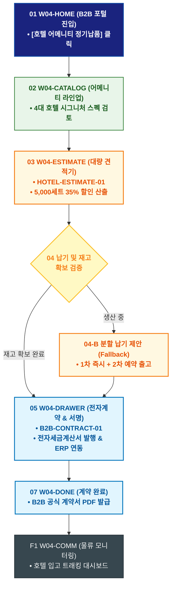

# 🔄 WICKETA 임태경 서비스 흐름도 [5성급 호텔 객실 5,000세트 정기납품 대량 발주 및 ERP 계약]

> **프로젝트명**: WICKETA B2B 호텔 어메니티 & 대량 조달 플랫폼 (B2B Supply)  
> **분석 대상 클라이언트**: [`[가상클라이언트_04] 임태경_호텔FNB총괄구매팀장_B2B대량납품.txt`](file:///C:/Users/user/Desktop/이지희%20에이전트/설계%20마저%20해오기/자동화/03_클라이언트/01_가상_클라이언트/[가상클라이언트_04] 임태경_호텔FNB총괄구매팀장_B2B대량납품.txt)  
> **기준 사이트맵 문서**: [`C:\Users\SBS\Desktop\0819 이지희\한명씩 화면 설계도 진행\자동화\04_설계_및_스토리보드\03_사이트맵\04_임태경\사이트맵_목적1_정기납품계약.md`](file:///C:/Users/SBS/Desktop/0819%20%EC%9D%B4%EC%A7%80%ED%9D%AC/%ED%95%9C%EB%AA%85%EC%94%A9%20%ED%99%94%EB%A9%B4%20%EC%84%A4%EA%B3%84%EB%8F%84%20%EC%A7%84%ED%96%89/%EC%9E%90%EB%8F%99%ED%99%94/04_%EC%84%A4%EA%B3%84_%EB%B0%8F_%EC%8A%A4%ED%86%A0%EB%A6%AC%EB%B3%B4%EB%93%9C/03_%EC%82%AC%EC%9D%B4%ED%8A%B8%EB%A7%B5/04_임태경/사이트맵_목적1_정기납품계약.md)  
> **접속 목적**: 호텔 어메니티 5,000세트 대량 견적 시뮬레이션 및 전자세금계산서 정기납품 계약  
> **목적별 고유 킬러 기능**: **호텔 어메니티 대량 견적기 (`HOTEL-ESTIMATE-01`) & ERP 전자계약 파이프라인 (`B2B-CONTRACT-01`)**  
> **작성일자**: 2026년 8월 19일  
> **작성자**: Antigravity UI/UX 설계팀  
> **문서 인코딩**: UTF-8 (유니코드)  

---

## 1. 목적별 핵심 서비스 흐름 개요

5성급 호텔 객실 비치를 위해 5,000세트 대량 수량별 단가 할인을 시뮬레이션하고 사업자등록증 검증 후 전자세금계산서 기반 정기납품 계약을 체결하는 B2B 파이프라인

---

## 2. 목적 맞춤형 가변 여정 스테이지 (Dynamic Journey Stages)

### 🏨 Stage 1: 호텔 B2B 포털 진입 & 어메니티 검토
- **01 B2B 엔터프라이즈 포털 진입 (`W04-HOME`)**: 호텔 총괄구매팀 로그인 ➔ [호텔 어메니티 정기납품] 콘솔 호출
- **02 4대 호텔 시그니처 라인업 검토 (`W04-CATALOG`)**: 보태니컬 에이드(SEC-04), 스모키 얼그레이(SEC-03) 등 5성급 호텔 납품 규격 스펙 열람

### 🧮 Stage 2: 5,000세트 대량 견적 시뮬레이션
- **03 대량 견적 계산기 조작 (`W04-ESTIMATE`)**:
  - HOTEL-ESTIMATE-01 5,000세트 입력 ➔ 티어별 공급단가(35% B2B 할인율) 및 월간 정기납품 스케줄 산출
- **04 납기 및 재고 검증 (`W04-ESTIMATE`)**:
  - `{물류센터 5,000세트 즉시 출고 가능 여부?}`
  - `[재고 확보]` ➔ 월간 분할 납품 계약서 자동 생성
  - `[일부 생산 중(Fallback)]` ➔ 1차 2,500세트 익일 출고 + 2차 예약 납기 제안

### 📑 Stage 3: 전자계약 체결 & 세금계산서 발행
- **05 사업자 정보 확인 및 전자서명 (`W04-DRAWER`)**: 사업자등록번호 검증 ➔ 법인 전자세금계산서 발행 신청
- **06 ERP 정기계약 승인 (`W04-DRAWER`)**: 호텔 ERP 구매 시스템과 API 연동 승인

### 📦 Stage 4: 계약 체결 완료 & 전담 물류 모니터링
- **07 정기납품 계약서 발급 (`W04-DONE`)**: B2B 계약서 PDF 및 전담 납품 바코드 발급
- **F1 호텔 전담 물류 대시보드 (`W04-COMM`)**: 실시간 입고 트래킹 & 월간 재고 연동 루프

---

## 3. 단계별 명세표 (Flow Matrix Table)

| 단계 ID | 단계 명칭 | 사용자 행동 | 화면 접점 | 서비스/시스템 반응 | 매핑 요구사항 | 다음 진입 조건 |
| :---: | :--- | :--- | :--- | :--- | :--- | :--- |
| **01** | B2B 진입 | [정기납품 견적] 클릭 | `W04-HOME` | B2B 엔터프라이즈 콘솔 활성화 | `REQ-01 B2B 포털` | 02 라인업 검토 |
| **02** | 라인업 검토 | 4대 어메니티 스펙 확인 | `W04-CATALOG` | 5성급 납품 규격 성적서 노출 | `REQ-04 성분 검증` | 03 견적 산출 |
| **03** | 견적 산출 | 5,000세트 수량 입력 | `W04-ESTIMATE` | HOTEL-ESTIMATE-01 35% B2B 단가표 산출 | `REQ-02 대량 견적기` | 04 재고 검증 |
| **04-A** | [성공] 재고 확보 | 납기 스케줄 확정 | `W04-ESTIMATE` | 월간 분할 납품 계약서 생성 | `REQ-02 계약서 생성` | 05 전자서명 |
| **04-B** | [예외] 생산 분할 | 분할 납기 승인 (Fallback) | `W04-ESTIMATE` | 1차 즉시/2차 예약 납기 스케줄러 노출 | `예외 복구` | 05 전자서명 |
| **05** | 전자서명 | 사업자 번호 입력 & 서명 | `W04-DRAWER` | B2B-CONTRACT-01 전자세금계산서 발행 | `REQ-06 B2B 계약` | 06 ERP 승인 |
| **06** | ERP 승인 | 법인 구매 승인 | `W04-DRAWER` | 호텔 ERP 발주 API 연동 완료 | `REQ-06 ERP 연동` | 07 계약 완료 |
| **07** | 계약 완료 | 정기납품 계약서 확인 | `W04-DONE` | B2B 공식 계약서 PDF 발급 | `REQ-06 계약서 PDF` | F1 물류 모니터링 |
| **F1** | 물류 모니터링 | 실시간 납품 현황 조회 | `W04-COMM` | 호텔 입고 트래킹 대시보드 | `사후 관리` | 정기 납품 루프 |

---

## 4. 목적별 서비스 흐름도 다이어그램 (Mermaid)

---

## 5. 최종 품질 검토 및 연계 설계 문서

- [x] **고정 템플릿 탈피**: 목적별 특성에 맞춘 독자적 가변 스테이지 및 분기 조건 반영
- [x] **예외 상황(Fallback) 및 루프 완비**: 재고 부족, 결제 실패, 글자수 오류, 연속 출석 등의 분기/복구 파이프라인 수록
- [x] **연계 사이트맵**: [`사이트맵_목적1_정기납품계약.md`](file:///C:/Users/SBS/Desktop/0819%20%EC%9D%B4%EC%A7%80%ED%9D%AC/%ED%95%9C%EB%AA%85%EC%94%A9%20%ED%99%94%EB%A9%B4%20%EC%84%A4%EA%B3%84%EB%8F%84%20%EC%A7%84%ED%96%89/%EC%9E%90%EB%8F%99%ED%99%94/04_%EC%84%A4%EA%B3%84_%EB%B0%8F_%EC%8A%A4%ED%86%A0%EB%A6%AC%EB%B3%B4%EB%93%9C/03_%EC%82%AC%EC%9D%B4%ED%8A%B8%EB%A7%B5/04_임태경/사이트맵_목적1_정기납품계약.md)
