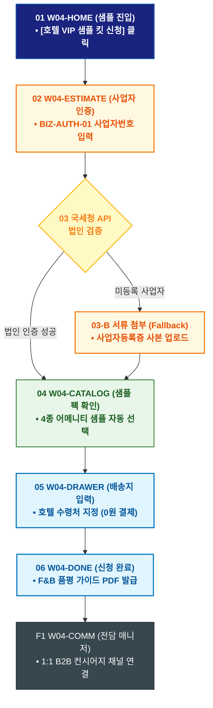

# 🔄 WICKETA 임태경 서비스 흐름도 [호텔 총괄구매팀 0원 VIP 시그니처 샘플 킷 신청]

> **프로젝트명**: WICKETA B2B 호텔 어메니티 & 대량 조달 플랫폼 (B2B Supply)  
> **분석 대상 클라이언트**: [`[가상클라이언트_04] 임태경_호텔FNB총괄구매팀장_B2B대량납품.txt`](file:///C:/Users/user/Desktop/이지희%20에이전트/설계%20마저%20해오기/자동화/03_클라이언트/01_가상_클라이언트/[가상클라이언트_04] 임태경_호텔FNB총괄구매팀장_B2B대량납품.txt)  
> **기준 사이트맵 문서**: [`C:\Users\SBS\Desktop\0819 이지희\한명씩 화면 설계도 진행\자동화\04_설계_및_스토리보드\03_사이트맵\04_임태경\사이트맵_목적2_샘플키트신청.md`](file:///C:/Users/SBS/Desktop/0819%20%EC%9D%B4%EC%A7%80%ED%9D%AC/%ED%95%9C%EB%AA%85%EC%94%A9%20%ED%99%94%EB%A9%B4%20%EC%84%A4%EA%B3%84%EB%8F%84%20%EC%A7%84%ED%96%89/%EC%9E%90%EB%8F%99%ED%99%94/04_%EC%84%A4%EA%B3%84_%EB%B0%8F_%EC%8A%A4%ED%86%A0%EB%A6%AC%EB%B3%B4%EB%93%9C/03_%EC%82%AC%EC%9D%B4%ED%8A%B8%EB%A7%B5/04_임태경/사이트맵_목적2_샘플키트신청.md)  
> **접속 목적**: 호텔 어메니티 도입 전 내부 F&B 품평회를 위한 4종 샘플 킷 0원 퀵 신청  
> **목적별 고유 킬러 기능**: **B2B 사업자 번호 실시간 검증기 (`BIZ-AUTH-01`) & 0원 샘플 발송 파이프라인 (`SAMPLE-KIT-01`)**  
> **작성일자**: 2026년 8월 19일  
> **작성자**: Antigravity UI/UX 설계팀  
> **문서 인코딩**: UTF-8 (유니코드)  

---

## 1. 목적별 핵심 서비스 흐름 개요

호텔 F&B 총괄구매팀이 사업자등록증을 1초 인증하고 4종 시그니처 어메니티 샘플 킷을 0원에 신청하여 익일 특급 퀵으로 수령하는 B2B 검증 프로세스

---

## 2. 목적 맞춤형 가변 여정 스테이지 (Dynamic Journey Stages)

### 🏢 Stage 1: B2B 샘플 신청 포털 진입
- **01 B2B 샘플 신청 진입 (`W04-HOME`)**: [호텔 VIP 샘플 킷 신청 (0원)] 배너 클릭 ➔ 샘플 신청 콘솔 로딩

### 🔍 Stage 2: 호텔 사업자등록번호 1초 실시간 검증
- **02 사업자 인증 (`W04-ESTIMATE`)**:
  - BIZ-AUTH-01 사업자등록번호 입력 ➔ 국세청 API 연동 실시간 법인 검증
  - `{법인 유효성 검증?}`
  - `[인증 성공 (호텔/리조트업)]` ➔ VIP 4종 샘플 팩(0원) 자동 활성화
  - `[미등록 사업자(Fallback)]` ➔ 사업자등록증 사본 업로드 모달 전환

### 📦 Stage 3: 샘플 구성품 선택 & 퀵 배송지 입력
- **03 어메니티 4종 샘플 선택 (`W04-CATALOG`)**: 스모키/보태니컬/루이보스/캐모마일 4종 샘플 팩 선택
- **04 특급 퀵 배송지 지정 (`W04-DRAWER`)**: 호텔 본관 수령처 입력 ➔ 배송비 0원 자동 처리

### 🚚 Stage 4: 샘플 출고 승인 & F&B 품평 가이드
- **05 샘플 주문 완료 (`W04-DONE`)**: 샘플 승인 번호 발급 ➔ 익일 오전 10시 도착 특급 퀵 지시
- **F1 전담 B2B 매니저 배정 (`W04-COMM`)**: 호텔 전담 키어카운트 매니저 1:1 상담 채널 자동 연결

---

## 3. 단계별 명세표 (Flow Matrix Table)

| 단계 ID | 단계 명칭 | 사용자 행동 | 화면 접점 | 서비스/시스템 반응 | 매핑 요구사항 | 다음 진입 조건 |
| :---: | :--- | :--- | :--- | :--- | :--- | :--- |
| **01** | 샘플 진입 | [VIP 샘플 킷 신청] 클릭 | `W04-HOME` | B2B 샘플 포털 로딩 | `REQ-01 샘플 기획` | 02 사업자 인증 |
| **02** | 사업자 인증 | 사업자등록번호 입력 | `W04-ESTIMATE` | BIZ-AUTH-01 국세청 API 검증 | `REQ-06 사업자 인증` | 03 검증 분기 |
| **03-A** | [성공] 법인 확인 | 인증 성공 확인 | `W04-ESTIMATE` | 0원 VIP 샘플 팩 자동 담기 | `REQ-06 0원 결제` | 04 샘플 선택 |
| **03-B** | [예외] 수동 확인 | 사업자등록증 첨부 (Fallback)| `W04-ESTIMATE` | 관리자 수동 승인 큐 등록 | `예외 복구` | 04 샘플 선택 |
| **04** | 샘플 선택 | 4종 어메니티 팩 확인 | `W04-CATALOG` | 호텔 납품 규격 샘플 박스 렌더링 | `REQ-05 샘플 구성` | 05 배송지 입력 |
| **05** | 배송지 입력 | 호텔 수령처 입력 후 [신청] | `W04-DRAWER` | 특급 퀵 출고 지시 (배송비 0원) | `REQ-06 퀵 발송` | 06 신청 완료 |
| **06** | 신청 완료 | 샘플 접수증 확인 | `W04-DONE` | F&B 품평 가이드 PDF 증정 | `REQ-06 품평 가이드` | F1 매니저 배정 |
| **F1** | 매니저 배정 | 전담 매니저 매칭 확인 | `W04-COMM` | 1:1 B2B 전담 상담 채널 오픈 | `B2B 리드 전환` | 정기계약 상담 |

---

## 4. 목적별 서비스 흐름도 다이어그램 (Mermaid)

---

## 5. 최종 품질 검토 및 연계 설계 문서

- [x] **고정 템플릿 탈피**: 목적별 특성에 맞춘 독자적 가변 스테이지 및 분기 조건 반영
- [x] **예외 상황(Fallback) 및 루프 완비**: 재고 부족, 결제 실패, 글자수 오류, 연속 출석 등의 분기/복구 파이프라인 수록
- [x] **연계 사이트맵**: [`사이트맵_목적2_샘플키트신청.md`](file:///C:/Users/SBS/Desktop/0819%20%EC%9D%B4%EC%A7%80%ED%9D%AC/%ED%95%9C%EB%AA%85%EC%94%A9%20%ED%99%94%EB%A9%B4%20%EC%84%A4%EA%B3%84%EB%8F%84%20%EC%A7%84%ED%96%89/%EC%9E%90%EB%8F%99%ED%99%94/04_%EC%84%A4%EA%B3%84_%EB%B0%8F_%EC%8A%A4%ED%86%A0%EB%A6%AC%EB%B3%B4%EB%93%9C/03_%EC%82%AC%EC%9D%B4%ED%8A%B8%EB%A7%B5/04_임태경/사이트맵_목적2_샘플키트신청.md)
