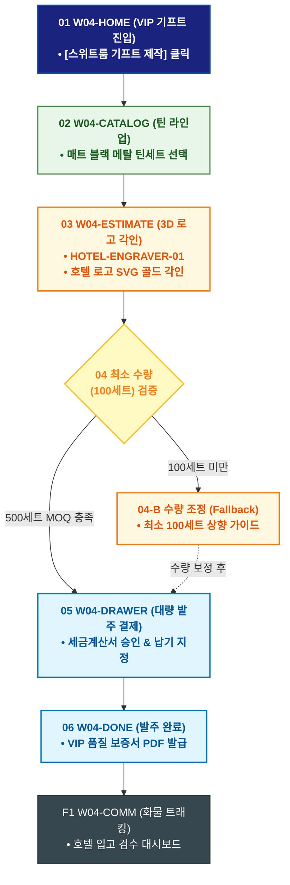

# 🔄 WICKETA 임태경 서비스 흐름도 [호텔 VIP 스위트룸 전용 로고 골드 각인 기프트 대량 발주]

> **프로젝트명**: WICKETA B2B 호텔 어메니티 & 대량 조달 플랫폼 (B2B Supply)  
> **분석 대상 클라이언트**: [`[가상클라이언트_04] 임태경_호텔FNB총괄구매팀장_B2B대량납품.txt`](file:///C:/Users/user/Desktop/이지희%20에이전트/설계%20마저%20해오기/자동화/03_클라이언트/01_가상_클라이언트/[가상클라이언트_04] 임태경_호텔FNB총괄구매팀장_B2B대량납품.txt)  
> **기준 사이트맵 문서**: [`C:\Users\SBS\Desktop\0819 이지희\한명씩 화면 설계도 진행\자동화\04_설계_및_스토리보드\03_사이트맵\04_임태경\사이트맵_목적3_VIP기프트발주.md`](file:///C:/Users/SBS/Desktop/0819%20%EC%9D%B4%EC%A7%80%ED%9D%AC/%ED%95%9C%EB%AA%85%EC%94%A9%20%ED%99%94%EB%A9%B4%20%EC%84%A4%EA%B3%84%EB%8F%84%20%EC%A7%84%ED%96%89/%EC%9E%90%EB%8F%99%ED%99%94/04_%EC%84%A4%EA%B3%84_%EB%B0%8F_%EC%8A%A4%ED%86%A0%EB%A6%AC%EB%B3%B4%EB%93%9C/03_%EC%82%AC%EC%9D%B4%ED%8A%B8%EB%A7%B5/04_임태경/사이트맵_목적3_VIP기프트발주.md)  
> **접속 목적**: 스위트룸 투숙객 증정용 호텔 로고 3D 골드 각인 메탈 틴 500세트 주문  
> **목적별 고유 킬러 기능**: **호텔 로고 3D 골드 각인 시뮬레이터 (`HOTEL-ENGRAVER-01`) & 대량 패키징 빌더 (`B2B-WRAP-01`)**  
> **작성일자**: 2026년 8월 19일  
> **작성자**: Antigravity UI/UX 설계팀  
> **문서 인코딩**: UTF-8 (유니코드)  

---

## 1. 목적별 핵심 서비스 흐름 개요

호텔 고유 로고(AI/SVG)를 업로드하여 매트 블랙 틴케이스에 골드 포일 3D 각인을 실시간 렌더링하고 비단 보자기 포장과 함께 대량 발주하는 프리미엄 B2B 여정

---

## 2. 목적 맞춤형 가변 여정 스테이지 (Dynamic Journey Stages)

### 🏨 Stage 1: VIP 스위트룸 기프트 룩북 탐색
- **01 B2B 기프트 포털 진입 (`W04-HOME`)**: [스위트룸 VIP 기프트 제작] 클릭 ➔ VIP 커스텀 콘솔 로딩
- **02 최고급 틴 & 다기 라인업 검토 (`W04-CATALOG`)**: 매트 블랙 메탈 틴 & 더블월 글래스(SEC-11) 세트 선택

### ✨ Stage 2: 3D 호텔 로고 골드 각인 & 패키징
- **03 호텔 로고 벡터 업로드 (`W04-ESTIMATE`)**:
  - AI/SVG 벡터 로고 업로드 ➔ HOTEL-ENGRAVER-01 매트 블랙 표면 골드 포일 3D WebGL 실시간 각인 렌더링
- **04 최소 수량(MOQ) 검증 (`W04-ESTIMATE`)**:
  - `{최소 주문 수량(100세트) 충족 여부?}`
  - `[500세트 입력 (MOQ 충족)]` ➔ 골드 각인비 100% 무료 지원 적용
  - `[100세트 미만(Fallback)]` ➔ 최소 발주 수량 안내 및 표준 틴 추천

### 🛒 Stage 3: B2B 대량 간편결제 & 세금계산서
- **05 B2B 주문 드로어 호출 (`W04-DRAWER`)**: 500세트 견적 확인 ➔ 전자세금계산서 승인 ➔ 법인 결제
- **06 출고 스케줄 지정 (`W04-DRAWER`)**: 호텔 오픈 일정에 맞춘 납기일 지정

### 🎁 Stage 4: VIP 패키지 발주 완료 & 품질 보증서
- **07 발주 승인 및 보증서 발급 (`W04-DONE`)**: VIP 품질 보증서 PDF 및 대량 출고 송장 발급
- **F1 호텔 전담 물류 트래킹 (`W04-COMM`)**: 특수 화물 배송 조회 및 입고 검수 지원

---

## 3. 단계별 명세표 (Flow Matrix Table)

| 단계 ID | 단계 명칭 | 사용자 행동 | 화면 접점 | 서비스/시스템 반응 | 매핑 요구사항 | 다음 진입 조건 |
| :---: | :--- | :--- | :--- | :--- | :--- | :--- |
| **01** | VIP 기프트 진입| [VIP 기프트 제작] 클릭 | `W04-HOME` | VIP 커스텀 콘솔 로딩 | `REQ-05 VIP 기프트` | 02 라인업 선택 |
| **02** | 라인업 선택 | 매트 블랙 틴세트 선택 | `W04-CATALOG` | 최고급 자재 스펙 및 사진 노출 | `REQ-05 상품 선택` | 03 로고 각인 |
| **03** | 3D 로고 각인 | 호텔 로고 SVG 파일 업로드 | `W04-ESTIMATE` | HOTEL-ENGRAVER-01 골드 포일 3D 렌더링 | `REQ-05 3D 각인기` | 04 MOQ 검증 |
| **04-A** | [성공] MOQ 충족 | 500세트 수량 입력 | `W04-ESTIMATE` | 각인비 100% 무료 지원 적용 | `REQ-02 MOQ 검증` | 05 주문 드로어 |
| **04-B** | [예외] 수량 미달 | 수량 상향 조정 (Fallback) | `W04-ESTIMATE` | 최소 수량 100세트 안내 가이드 | `예외 복구` | 05 주문 드로어 |
| **05** | 주문 드로어 | 법인 세금계산서 결제 승인 | `W04-DRAWER` | B2B 결제 승인 및 납기 스케줄 확정 | `REQ-06 B2B 결제` | 06 발주 완료 |
| **06** | 발주 완료 | 발주 번호 및 보증서 확인 | `W04-DONE` | VIP 품질 보증서 PDF 발급 | `REQ-06 품질 보증서` | F1 특수 물류 |
| **F1** | 특수 물류 | 화물 배송 현황 조회 | `W04-COMM` | 호텔 입고 검수 대시보드 연동 | `물류 지속성` | 여정 완료 |

---

## 4. 목적별 서비스 흐름도 다이어그램 (Mermaid)

---

## 5. 최종 품질 검토 및 연계 설계 문서

- [x] **고정 템플릿 탈피**: 목적별 특성에 맞춘 독자적 가변 스테이지 및 분기 조건 반영
- [x] **예외 상황(Fallback) 및 루프 완비**: 재고 부족, 결제 실패, 글자수 오류, 연속 출석 등의 분기/복구 파이프라인 수록
- [x] **연계 사이트맵**: [`사이트맵_목적3_VIP기프트발주.md`](file:///C:/Users/SBS/Desktop/0819%20%EC%9D%B4%EC%A7%80%ED%9D%AC/%ED%95%9C%EB%AA%85%EC%94%A9%20%ED%99%94%EB%A9%B4%20%EC%84%A4%EA%B3%84%EB%8F%84%20%EC%A7%84%ED%96%89/%EC%9E%90%EB%8F%99%ED%99%94/04_%EC%84%A4%EA%B3%84_%EB%B0%8F_%EC%8A%A4%ED%86%A0%EB%A6%AC%EB%B3%B4%EB%93%9C/03_%EC%82%AC%EC%9D%B4%ED%8A%B8%EB%A7%B5/04_임태경/사이트맵_목적3_VIP기프트발주.md)
