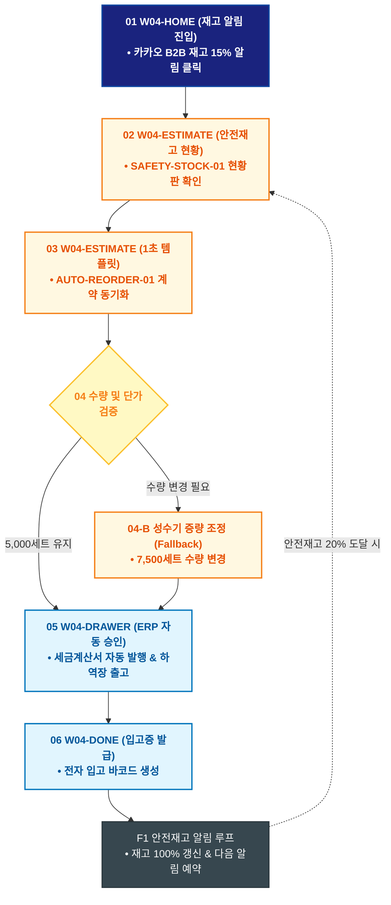

# 🔄 WICKETA 임태경 서비스 흐름도 [호텔 객실 안전재고 연동 1초 ERP 자동 재발주 루프]

> **프로젝트명**: WICKETA B2B 호텔 어메니티 & 대량 조달 플랫폼 (B2B Supply)  
> **분석 대상 클라이언트**: [`[가상클라이언트_04] 임태경_호텔FNB총괄구매팀장_B2B대량납품.txt`](file:///C:/Users/user/Desktop/이지희%20에이전트/설계%20마저%20해오기/자동화/03_클라이언트/01_가상_클라이언트/[가상클라이언트_04] 임태경_호텔FNB총괄구매팀장_B2B대량납품.txt)  
> **기준 사이트맵 문서**: [`C:\Users\SBS\Desktop\0819 이지희\한명씩 화면 설계도 진행\자동화\04_설계_및_스토리보드\03_사이트맵\04_임태경\사이트맵_목적4_정기재발주루프.md`](file:///C:/Users/SBS/Desktop/0819%20%EC%9D%B4%EC%A7%80%ED%9D%AC/%ED%95%9C%EB%AA%85%EC%94%A9%20%ED%99%94%EB%A9%B4%20%EC%84%A4%EA%B3%84%EB%8F%84%20%EC%A7%84%ED%96%89/%EC%9E%90%EB%8F%99%ED%99%94/04_%EC%84%A4%EA%B3%84_%EB%B0%8F_%EC%8A%A4%ED%86%A0%EB%A6%AC%EB%B3%B4%EB%93%9C/03_%EC%82%AC%EC%9D%B4%ED%8A%B8%EB%A7%B5/04_임태경/사이트맵_목적4_정기재발주루프.md)  
> **접속 목적**: 호텔 객실 어메니티 잔여 수량 20% 도달 시 원클릭 ERP 자동 재발주  
> **목적별 고유 킬러 기능**: **실시간 안전재고 모니터링 콘솔 (`SAFETY-STOCK-01`) & 1-Click ERP 재발주 (`AUTO-REORDER-01`)**  
> **작성일자**: 2026년 8월 19일  
> **작성자**: Antigravity UI/UX 설계팀  
> **문서 인코딩**: UTF-8 (유니코드)  

---

## 1. 목적별 핵심 서비스 흐름 개요

호텔 어메니티 재고가 안전재고 수위(20%) 이하로 떨어질 때 즉시 알림을 수신하고, 이전 계약 조건 그대로 1초 만에 ERP 재발주를 완료하는 지속 공급 루프

---

## 2. 목적 맞춤형 가변 여정 스테이지 (Dynamic Journey Stages)

### 📊 Stage 1: 잔여 재고 모니터링 알림 수신
- **01 재고 알림 유입 (`W04-HOME`)**: 호텔 객실 어메니티 잔여 15% 도달 카카오 B2B 알림 클릭 ➔ 재고 대시보드 로딩
- **02 안전재고 현황판 확인 (`W04-ESTIMATE`)**: SAFETY-STOCK-01 현재 재고(750세트) 및 소진 속도 그래프 확인

### 🔄 Stage 2: 기존 계약 조건 1초 불러오기
- **03 1-Click 재발주 템플릿 로딩 (`W04-ESTIMATE`)**: 지난 5,000세트 단가 및 세금계산서 설정 1초 동기화
- **04 안전재고 검증 분기 (`W04-ESTIMATE`)**:
  - `{재발주 수량 적합도?}`
  - `[기존 조건 5,000세트]` ➔ 1초 발주 버튼 활성화
  - `[수량 변경 필요(Fallback)]` ➔ 성수기 7,500세트 증량 슬라이더 조작

### 🛒 Stage 3: ERP 자동 결제 승인
- **05 1-Click ERP 발주 승인 (`W04-DRAWER`)**: 구매 결재선 자동 패스 ➔ 전자세금계산서 자동 승인
- **06 물류센터 즉시 출고 큐 등록 (`W04-DRAWER`)**: 익일 오전 08:00 호텔 하역장 출고 지시

### 🚚 Stage 4: 입고 확인 & 다음 주기 알림 루프
- **07 재발주 영수증 확인 (`W04-DONE`)**: 전자 입고증 발급
- **F1 안전재고 알림 루프 (`W04-COMM`)**: 실시간 입고 완료 ➔ 재고 100% 충전 ➔ 다음 잔여 20% 시점 알림 예약

---

## 3. 단계별 명세표 (Flow Matrix Table)

| 단계 ID | 단계 명칭 | 사용자 행동 | 화면 접점 | 서비스/시스템 반응 | 매핑 요구사항 | 다음 진입 조건 |
| :---: | :--- | :--- | :--- | :--- | :--- | :--- |
| **01** | 재고 알림 | B2B 알림 클릭 | `W04-HOME` | 재고 모니터링 대시보드 로딩 | `REQ-01 재고 알림` | 02 재고 확인 |
| **02** | 재고 확인 | 잔여 15% 그래프 확인 | `W04-ESTIMATE` | SAFETY-STOCK-01 실시간 소진율 렌더링 | `REQ-02 재고 트래커` | 03 템플릿 로딩 |
| **03** | 템플릿 로딩 | [기존 조건 1초 재발주] 탭 | `W04-ESTIMATE` | AUTO-REORDER-01 계약 조건 동기화 | `REQ-06 1초 재발주` | 04 수량 검증 |
| **04-A** | [성공] 조건 확인 | 5,000세트 승인 | `W04-ESTIMATE` | 1초 발주 승인 창 활성화 | `REQ-06 자동 승인` | 05 ERP 승인 |
| **04-B** | [변경] 수량 증량 | 성수기 7,500세트 조정 | `W04-ESTIMATE` | 단가 할인율 실시간 재산출 | `예외 복구` | 05 ERP 승인 |
| **05** | ERP 승인 | [재발주 확정] 클릭 | `W04-DRAWER` | 호텔 ERP 전자세금계산서 자동 발행 | `REQ-06 ERP 연동` | 06 입고증 발급 |
| **06** | 입고증 발급 | 전자 입고증 확인 | `W04-DONE` | 하역장 입고 바코드 발급 | `REQ-06 전자 입고증` | F1 알림 루프 |
| **F1** | 안전재고 루프 | 입고 완료 및 다음 주기 예약 | `W04-COMM` | 재고 100% 복원, 다음 20% 알림 큐 활성화 | `B2B 공급 지속성` | 다음 재발주 |

---

## 4. 목적별 서비스 흐름도 다이어그램 (Mermaid)

---

## 5. 최종 품질 검토 및 연계 설계 문서

- [x] **고정 템플릿 탈피**: 목적별 특성에 맞춘 독자적 가변 스테이지 및 분기 조건 반영
- [x] **예외 상황(Fallback) 및 루프 완비**: 재고 부족, 결제 실패, 글자수 오류, 연속 출석 등의 분기/복구 파이프라인 수록
- [x] **연계 사이트맵**: [`사이트맵_목적4_정기재발주루프.md`](file:///C:/Users/SBS/Desktop/0819%20%EC%9D%B4%EC%A7%80%ED%9D%AC/%ED%95%9C%EB%AA%85%EC%94%A9%20%ED%99%94%EB%A9%B4%20%EC%84%A4%EA%B3%84%EB%8F%84%20%EC%A7%84%ED%96%89/%EC%9E%90%EB%8F%99%ED%99%94/04_%EC%84%A4%EA%B3%84_%EB%B0%8F_%EC%8A%A4%ED%86%A0%EB%A6%AC%EB%B3%B4%EB%93%9C/03_%EC%82%AC%EC%9D%B4%ED%8A%B8%EB%A7%B5/04_임태경/사이트맵_목적4_정기재발주루프.md)
