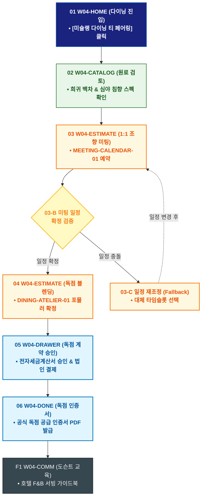

# 🔄 WICKETA 임태경 서비스 흐름도 [호텔 라운지 & 미슐랭 다이닝 협업 시즌 한정 티 페어링 발주]

> **프로젝트명**: WICKETA B2B 호텔 어메니티 & 대량 조달 플랫폼 (B2B Supply)  
> **분석 대상 클라이언트**: [`[가상클라이언트_04] 임태경_호텔FNB총괄구매팀장_B2B대량납품.txt`](file:///C:/Users/user/Desktop/이지희%20에이전트/설계%20마저%20해오기/자동화/03_클라이언트/01_가상_클라이언트/[가상클라이언트_04] 임태경_호텔FNB총괄구매팀장_B2B대량납품.txt)  
> **기준 사이트맵 문서**: [`C:\Users\SBS\Desktop\0819 이지희\한명씩 화면 설계도 진행\자동화\04_설계_및_스토리보드\03_사이트맵\04_임태경\사이트맵_목적5_시즌FNB발주.md`](file:///C:/Users/SBS/Desktop/0819%20%EC%9D%B4%EC%A7%80%ED%9D%AC/%ED%95%9C%EB%AA%85%EC%94%A9%20%ED%99%94%EB%A9%B4%20%EC%84%A4%EA%B3%84%EB%8F%84%20%EC%A7%84%ED%96%89/%EC%9E%90%EB%8F%99%ED%99%94/04_%EC%84%A4%EA%B3%84_%EB%B0%8F_%EC%8A%A4%ED%86%A0%EB%A6%AC%EB%B3%B4%EB%93%9C/03_%EC%82%AC%EC%9D%B4%ED%8A%B8%EB%A7%B5/04_임태경/사이트맵_목적5_시즌FNB발주.md)  
> **접속 목적**: 호텔 F&B 총괄 1:1 조향 미팅 신청 및 미슐랭 다이닝 전용 티 독점 발주  
> **목적별 고유 킬러 기능**: **F&B 전용 커스텀 블렌딩 아틀리에 (`DINING-ATELIER-01`) & 1:1 조향 미팅 캘린더 (`MEETING-CALENDAR-01`)**  
> **작성일자**: 2026년 8월 19일  
> **작성자**: Antigravity UI/UX 설계팀  
> **문서 인코딩**: UTF-8 (유니코드)  

---

## 1. 목적별 핵심 서비스 흐름 개요

호텔 미슐랭 다이닝 코스에 맞춘 시즌 한정 시그니처 티를 개발하기 위해 차은채 총괄 디렉터와의 1:1 B2B 조향 미팅을 예약하고 독점 공급 계약을 체결하는 여정

---

## 2. 목적 맞춤형 가변 여정 스테이지 (Dynamic Journey Stages)

### 🍽️ Stage 1: 다이닝 티 페어링 쇼케이스 검토
- **01 B2B 다이닝 포털 진입 (`W04-HOME`)**: [미슐랭 다이닝 티 페어링] 클릭 ➔ F&B 포트폴리오 로딩
- **02 시즌 한정 희귀 원료 저널 확인 (`W04-CATALOG`)**: 심야 침향 및 백차 추출액 다이닝 페어링 스펙 검토

### 📅 Stage 2: 1:1 B2B 조향 미팅 예약
- **03 디렉터 미팅 캘린더 조작 (`W04-ESTIMATE`)**:
  - MEETING-CALENDAR-01 호텔 방문 일자 및 시간 지정 ➔ `{일정 충돌 여부?}` (확정 시 미팅 예약 완료)

### 🧪 Stage 3: 다이닝 전용 독점 포뮬러 개발 & 계약
- **04 독점 조향 포뮬러 확정 (`W04-ESTIMATE`)**: DINING-ATELIER-01 호텔 전용 블렌딩 배합비 승인
- **05 독점 공급 전자계약 승인 (`W04-DRAWER`)**: 호텔 라운지 독점 공급 계약 및 법인 결제 승인

### 📜 Stage 4: 독점 공급 인증서 발급 & 론칭 지원
- **06 공식 독점 인증서 발급 (`W04-DONE`)**: 미슐랭 다이닝 전용 티 공식 라이선스 PDF 증정
- **F1 소믈리에 도슨트 교육 연동 (`W04-COMM`)**: 호텔 직원용 티 서빙 & 도슨트 가이드북 제공

---

## 3. 단계별 명세표 (Flow Matrix Table)

| 단계 ID | 단계 명칭 | 사용자 행동 | 화면 접점 | 서비스/시스템 반응 | 매핑 요구사항 | 다음 진입 조건 |
| :---: | :--- | :--- | :--- | :--- | :--- | :--- |
| **01** | 다이닝 진입 | [다이닝 페어링] 클릭 | `W04-HOME` | F&B 포트폴리오 쇼케이스 로딩 | `REQ-01 다이닝 기획` | 02 원료 검토 |
| **02** | 원료 검토 | 희귀 원료 다이닝 스펙 확인 | `W04-CATALOG` | 미슐랭 페어링 테이스팅 노트 노출 | `REQ-04 원료 스펙` | 03 미팅 예약 |
| **03** | 미팅 예약 | 디렉터 1:1 방문 일정 선택 | `W04-ESTIMATE` | MEETING-CALENDAR-01 일정 검증 및 예약 | `REQ-06 미팅 예약` | 04 포뮬러 확정 |
| **04** | 포뮬러 확정 | 호텔 전용 블렌딩 승인 | `W04-ESTIMATE` | DINING-ATELIER-01 독점 레시피 저장 | `REQ-05 독점 블렌딩` | 05 전자계약 |
| **05-A** | [성공] 계약 승인 | 법인 결제 및 전자서명 | `W04-DRAWER` | 독점 공급 계약 체결 완료 | `REQ-06 독점 계약` | 06 인증서 발급 |
| **05-B** | [예외] 일정 변경 | 미팅 일정 재조정 (Fallback)| `W04-ESTIMATE` | 대체 타임슬롯 안내 캘린더 노출 | `예외 복구` | 04 포뮬러 확정 |
| **06** | 인증서 발급 | 독점 공급 라이선스 확인 | `W04-DONE` | B2B 공식 독점 인증서 PDF 발급 | `REQ-06 독점 라이선스` | F1 도슨트 교육 |
| **F1** | 도슨트 교육 | 호텔 직원 교육 자료 확인 | `W04-COMM` | F&B 서빙 가이드 및 도슨트 PDF 연동 | `파트너십 강화` | 여정 완료 |

---

## 4. 목적별 서비스 흐름도 다이어그램 (Mermaid)

---

## 5. 최종 품질 검토 및 연계 설계 문서

- [x] **고정 템플릿 탈피**: 목적별 특성에 맞춘 독자적 가변 스테이지 및 분기 조건 반영
- [x] **예외 상황(Fallback) 및 루프 완비**: 재고 부족, 결제 실패, 글자수 오류, 연속 출석 등의 분기/복구 파이프라인 수록
- [x] **연계 사이트맵**: [`사이트맵_목적5_시즌FNB발주.md`](file:///C:/Users/SBS/Desktop/0819%20%EC%9D%B4%EC%A7%80%ED%9D%AC/%ED%95%9C%EB%AA%85%EC%94%A9%20%ED%99%94%EB%A9%B4%20%EC%84%A4%EA%B3%84%EB%8F%84%20%EC%A7%84%ED%96%89/%EC%9E%90%EB%8F%99%ED%99%94/04_%EC%84%A4%EA%B3%84_%EB%B0%8F_%EC%8A%A4%ED%86%A0%EB%A6%AC%EB%B3%B4%EB%93%9C/03_%EC%82%AC%EC%9D%B4%ED%8A%B8%EB%A7%B5/04_임태경/사이트맵_목적5_시즌FNB발주.md)
