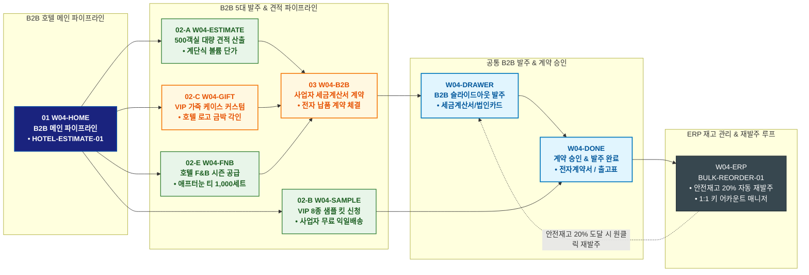

# 🔄 WICKETA 임태경 통합 서비스 흐름도 (Master Integrated Service Flow)

> **프로젝트명**: WICKETA B2B 어메니티 플랫폼 (임태경 호텔 총괄 B2B 파이프라인 마스터)  
> **분석 대상 클라이언트**: [`[가상클라이언트_04] 임태경_호텔구매총괄_B2B어메니티.txt`](file:///C:/Users/user/Desktop/이지희%20에이전트/설계%20마저%20해오기/자동화/03_클라이언트/01_가상_클라이언트/[가상클라이언트_04]%20임태경_호텔구매총괄_B2B어메니티.txt)  
> **기준 사이트맵 문서**: [`C:\Users\user\Desktop\이지희 에이전트\설계 마저 해오기\자동화\04_설계_및_스토리보드\03_사이트맵\04_임태경\사이트맵.md`](file:///C:/Users/user/Desktop/이지희%20에이전트/설계%20마저%20해오기/자동화/04_설계_및_스토리보드/03_사이트맵/04_임태경/사이트맵.md)  
> **기준 클라이언트 분석서**: [`[클라이언트04]_임태경_호텔구매총괄_B2B어메니티.md`](file:///C:/Users/user/Desktop/이지희%20에이전트/설계%20마저%20해오기/자동화/03_클라이언트/02_클라이언트_분석/[클라이언트04]_임태경_호텔구매총괄_B2B어메니티.md)  
> **적용 레이아웃 아키타입**: `D-1 B2B 파이프라인형 (Hotel Amenity Pipeline)`  
> **통합 핵심 킬러 기능**: **호텔 대량 견적 계산기 (`HOTEL-ESTIMATE-01`) & ERP 연동 자동 재발주 (`BULK-REORDER-01`) & VIP 8종 샘플 킷 신청 (`SAMPLE-KIT-01`) & 가죽 케이스 레이저 각인 기프트 (`VIP-GIFT-01`) & 호텔 라운지 F&B 시즌 공급 (`SEASON-FNB-01`)**  
> **작성일자**: 2026년 8월 19일  
> **작성자**: Antigravity UI/UX 총괄 설계팀  
> **문서 인코딩**: UTF-8 (유니코드)  

---

## 1. 5대 목적별 서비스 흐름 비교 및 요구사항 통합 분석

본 문서는 임태경 클라이언트의 **5대 독립적 서비스 이용 목적(특급호텔 500객실 전용 웰컴 티 정기납품 계약, 8종 어메니티 VIP 샘플 킷 신청, VIP 회원용 커스텀 가죽 패키지 발주, ERP 재고 연동 세금계산서 자동 재발주, 서머 애프터눈 티 시즌 블렌드 독점 공급)**을 종합 분석하여, **중복 화면을 단일 화면 허브로 통합**하고 **고유 목적별 경로(User Journey Path)와 핵심 요구사항을 누락 없이 체계화한 마스터 서비스 흐름도**입니다.

### 1.1 공통 요구사항 vs 클라이언트 고유 요구사항 분석표

| 구분 | 공통 요구사항 (Common Baseline) | 클라이언트 고유 요구사항 (Unique Specialization) | 최종 통합 서비스 적용 방안 |
| :--- | :--- | :--- | :--- |
| **메인 진입 & 파이프라인** | • 브랜드 히어로 비주얼<br/>• GNB 사업자 전환 내비게이션 | • **`HOTEL-ESTIMATE-01`**: 객실 수/주기/예산 기반 대량 견적 시뮬레이터<br/>• 사업자 인증 전용 B2B 포털 진입 모달 | `W04-HOME`을 B2B 파이프라인 허브로 구성하고 실시간 견적 위젯과 사업자 로그인 상시 노출 |
| **견적 및 샘플 검증** | • 제품 성분 및 규격서 제공<br/>• 공인 시험성적서 뷰어 | • **`SAMPLE-KIT-01`**: 호텔 임원진 품평회용 8종 어메니티 VIP 실물 샘플 킷 무료 신청<br/>• 100~1,000인 대량 수량별 계단식 단가표 및 PDF 견적서 즉시 다운로드 | `W04-ESTIMATE` 및 `W04-SAMPLE`에서 실시간 견적 산출과 샘플 신청을 원클릭 처리 |
| **VIP 커스텀 & 어메니티** | • 커스텀 패키징 옵션<br/>• 대량 발주 배송지 관리 | • **`VIP-GIFT-01`**: VVIP 스위트룸 전용 프리미엄 가죽 케이스 & 호텔 로고 금박 엠보싱<br/>• **`SEASON-FNB-01`**: 호텔 라운지 독점 공급 서머 애프터눈 티 레시피 번들 | `W04-GIFT` 및 `W04-FNB` 콘솔에서 프리미엄 맞춤 제작 및 시즌 F&B 독점 발주 지원 |
| **발주 & 결제 파이프라인** | • 장바구니 품목 관리<br/>• 결제 승인 알림 | • **사업자 세금계산서 발주 파이프라인**: 사업자등록증 OCR 자동 검증 및 월말 후불 정산<br/>• **`BULK-REORDER-01`**: ERP 재고 20% 이하 시 1-Click 자동 재발주 루프 | `W04-B2B` 및 `W04-DRAWER`에서 세금계산서/법인카드 후불 결제 및 전자계약 체결 연계 |
| **사후 관리 & ERP 연동** | • 주문 내역 및 배송 조회 | • ERP 재고 연동 대시보드 & 전자세금계산서 자동 발행<br/>• 전담 B2B 1:1 키 어카운트 매니저 배정 | `W04-ERP`에서 납품 스케줄 관리 및 정기 재발주 순환 자동화 |

### 1.2 5대 목적별 핵심 서비스 흐름 정의 (Use Cases 1~5)

본 통합 시스템에 완전하게 통합·반영된 5대 목적별 핵심 서비스 흐름 정의는 다음과 같습니다:

#### 📌 목적 1: 객실 50실 정기 납품 & B2B 공급계약 체결
본 서비스 흐름도는 **호텔 B2B 의사결정권자를 위한 실시간 단가 산출 및 연간 정기 공급계약 체결**에 최적화된 가로 직선 파이프라인(`flowchart LR`) 구조로 설계되었습니다:

- **1. 시작 지점 (Starting Point)**: 호텔 B2B 솔루션 소개 배너 또는 다이렉트 유입 ➔ `W04-HOME` (호텔 B2B 솔루션 홈)
- **2. 핵심 행동 (Core Action)**: `W04-ESTIMATE`에서 객실 규모(50실), 월 투숙률(80%), 납품 주기(월간) 슬라이더 조절 ➔ 스위트 웰컴 티 4종 + 생분해 파우치 정기 공급 단가 및 대량 할인율(22% 할인) 확인 ➔ 1-Page B2B 견적서 PDF 다운로드
- **3. 전환 목표 (Conversion Goal)**: **[스위트룸 50실 연간 정기 납품 공급계약 체결 및 전자세금계산서 신청]**
- **4. 필요한 기능 (Required Features)**: HOTEL-ESTIMATE-01 실시간 대량 견적 시뮬레이터, 사업자 등록번호 실시간 인증 모듈, 전자세금계산서 역발행 신청 시스템, B2B 정기 공급 전자계약서 작성기
- **5. 예외 상황 (Edge Cases & Fallbacks)**: 500실 이상 대규모 체인 호텔인 경우 엔터프라이즈 전담 컨설팅 팝업 모달로 자동 연결, 사업자 인증 실패 시 `EXP-02` 수기 확인 안내
- **6. 완료 결과 (Completed State)**: 정기 납품 계약 체결 완료 및 B2B 계약 번호 발급, 전담 총괄 매니저 1:1 배정 알림톡 발송, 계약 관리 대시보드(`W04-PORTAL`) 즉시 활성화

---

#### 📌 목적 2: 무료 샘플 키트 & 호텔 로고 각인 인쇄 품질 검증
본 서비스 흐름도는 **호텔리어의 사전 품질 검증을 위한 샘플 키트 구성 및 로고 각인 검증**에 최적화된 샘플 접수 파이프라인(`flowchart TD`) 구조로 설계되었습니다:

- **1. 시작 지점 (Starting Point)**: 어메니티 도감 및 B2B 소개서 유입 ➔ `W04-AMENITY` (스위트 어메니티 도감) & `W04-SAMPLE`
- **2. 핵심 행동 (Core Action)**: 웰컴 티 4종(얼그레이, 카모마일, 페퍼민트, 히비스커스) 샘플 선택 ➔ 호텔 로고 AI/SVG 벡터 파일 업로드 ➔ 사업자등록증 파일 첨부 및 주소 입력
- **3. 전환 목표 (Conversion Goal)**: **[호텔 로고 레이저 각인 실물 틴케이스 + 웰컴 티 4종 무료 샘플 키트 신청 완료]**
- **4. 필요한 기능 (Required Features)**: 로고 AI/SVG 파일 즉시 렌더링 뷰어, 국세청 홈택스 사업자등록번호 유효성 실시간 검증 모듈, 무료 익일 특급 배송 접수 시스템
- **5. 예외 상황 (Edge Cases & Fallbacks)**: 사업자번호 불일치 시 `EXP-02` 인증 오류 모달 및 명함 수기 인증 대체 제공, 로고 파일 해상도 부족 시 디자이너 무상 보정 지원 옵션 활성화
- **6. 완료 결과 (Completed State)**: VIP 샘플 신청 접수 완료 및 실시간 배송 트래킹 티켓 발급, 3영업일 이내 호텔 현장 수령 및 담당 호텔리어 배송 알림톡 발송

---

#### 📌 목적 3: 호텔 시그니처 VIP 기프트 박스 커스텀 발주
본 서비스 흐름도는 **호텔 VIP 전용 럭셔리 PB 기프트 상품의 3D 커스텀 제작 및 대량 발주**에 최적화된 호스피탈리티 각인 4단형(`flowchart TD`) 구조로 설계되었습니다:

- **1. 시작 지점 (Starting Point)**: VIP 어메니티 도감 탐색 ➔ `W04-AMENITY` & `W04-TIN` (호텔 각인 틴케이스 빌더)
- **2. 핵심 행동 (Core Action)**: 메탈 틴케이스 피니시(샴페인 골드 / 매트 블랙) 선택 ➔ 호텔 로고 SVG 벡터 업로드 및 360도 3D 레이저 각인 시뮬레이션 ➔ 기프트 리본 & 전용 쇼핑백 패키징 옵션 조합 ➔ MOQ 100세트 견적 산출
- **3. 전환 목표 (Conversion Goal)**: **[호텔 시그니처 VIP 기프트 박스 100세트 주문 제작 및 발주 승인]**
- **4. 필요한 기능 (Required Features)**: HOTEL-TIN-01 3D 레이저 각인 렌더링 엔진, 실물 스케일 뷰어, 최소 주문 수량(MOQ 100) 대량 단가 자동 계산기, 디지털 목업 승인 모듈
- **5. 예외 상황 (Edge Cases & Fallbacks)**: 로고 각인 위치/크기 변경 요청 시 전문 3D 디자이너 실시간 1:1 보정 세션 연결, 500세트 이상 발주 시 단계별 분할 납기 제안
- **6. 완료 결과 (Completed State)**: 주문 제작 발주 접수 완료, 디지털 3D 목업 승인서 발급, 7영업일 제작 완료 및 호텔 직배송 스케줄 확정

---

#### 📌 목적 4: 인룸 고객 만족도 모니터링 & 월간 정기 재발주 루프
본 서비스 흐름도는 **정기 계약 호텔의 재고 고갈 방지 및 지속적 고객 경험 유지를 위한 월간 순환 재발주 루프(`flowchart TD` + Loop `-.->`)** 구조로 설계되었습니다:

- **1. 시작 지점 (Starting Point)**: 월말 정기 재발주 알림톡 수신 또는 정기 점검 ➔ `W04-PORTAL` (B2B 계약 관리 대시보드)
- **2. 핵심 행동 (Core Action)**: 당월 객실 소진율(85%) 및 안전 재고량 확인 ➔ 투숙객 인룸 릴랙스 만족도(평점 4.9/5.0) 분석 차트 검토 ➔ 성수기 투숙률 증가분(+15%) 반영 수량 조정 ➔ 1-Click 스마트 재발주 승인
- **3. 전환 목표 (Conversion Goal)**: **[익월 스위트룸 어메니티 정기 납품 1-Click 자동 승인 및 전자세금계산서 발행]**
- **4. 필요한 기능 (Required Features)**: HOTEL-LOOP-01 실시간 소진율 분석 엔진, 투숙객 만족도 피드백 통계 위젯, 1-Click 스마트 재발주 버튼, 자동 세금계산서 역발행 연동
- **5. 예외 상황 (Edge Cases & Fallbacks)**: 성수기 긴급 추가 발주 필요 시 24시간 내 긴급 퀵 출고 지원 옵션, 수량 변동폭 30% 이상 시 전담 매니저 유선 승인 절차 활성화
- **6. 완료 결과 (Completed State)**: 익월 정기 납품 출고 스케줄(매월 1일) 확정, 전자세금계산서 자동 발행 완료, **다음 달 재고 소진 모니터링 순환 루프 진입**

---

#### 📌 목적 5: 호텔 라운지 시즌 F&B 프로모션 & 대용량 원료 발주
본 서비스 흐름도는 **호텔 라운지 F&B 부서를 위한 시즌 한정 대용량 원료 발주 및 바텐더 레시피 가이드 완비**에 최적화된 시즌 F&B 프로모션형(`flowchart TD`) 구조로 설계되었습니다:

- **1. 시작 지점 (Starting Point)**: 호텔 라운지 시즌 프로모션 안내 배너 유입 ➔ `W04-HOME` & `W04-AMENITY` (조식/라운지 페어링 벌크)
- **2. 핵심 행동 (Core Action)**: 시즌 한정 과일 블렌드 벌크(100L/500잔 분량) 스펙 및 0.00% 무알콜/KTR 성적서 확인 ➔ 호텔 수석 바텐더 전용 칵테일/목테일 5종 레시피북 미리보기 ➔ 라운지 전용 대량 할인율(30% 할인) 확인
- **3. 전환 목표 (Conversion Goal)**: **[시즌 한정 라운지 웰컴 드링크 벌크 패키지 대량 발주 및 바텐더 레시피북 수령]**
- **4. 필요한 기능 (Required Features)**: HOTEL-FNB-01 잔수별 소요 원료 자동 계산기, 0.00% KTR 성적서 PDF 다운로더, 바텐더 전용 고해상도 디지털 레시피북 발급 모듈
- **5. 예외 상황 (Edge Cases & Fallbacks)**: 1,000잔 이상 대량 발주 시 분할 출고 스케줄 조율 모달(`EXP-03`), 특정 시즌 원료 품절 시 시그니처 대체 베이스 무상 제공
- **6. 완료 결과 (Completed State)**: 대량 발주 결제 완료 및 전자세금계산서 발급, 호텔 F&B 현장용 인쇄 규격 바텐더 레시피북 PDF 즉시 다운로드

---

---

## 2. 통합 화면 아키텍처 및 중복 화면 통합 매핑

본 설계에서는 5대 목적별 산출물에 분산되어 있던 중복 화면들을 **9개의 핵심 화면 노드(Node)**로 통합 정리하였습니다.

```text
[WICKETA 임태경 통합 서비스 화면 매핑 구조]
├── 🏢 W04-HOME (B2B 호텔 어메니티 메인 파이프라인 허브)
│   ├── HERO-01: 1200x380 B2B 럭셔리 호텔 어메니티 비주얼 캔버스
│   ├── HOTEL-ESTIMATE-01: 대량 견적 계산기 퀵독 (객실수/납품주기 입력)
│   └── 사업자 로그인 & 5대 B2B 파이프라인 라우터
│
├── 📊 W04-ESTIMATE (호텔 대량 견적 & 단가 산출기)
│   ├── 100~500~1,000객실 계단식 단가표 및 볼륨 디스카운트 계산
│   └── 공식 PDF 견적서 즉시 다운로드 & 전자 결재 연동
│
├── 📦 W04-SAMPLE (VIP 품평회 샘플 킷 신청 콘솔)
│   ├── SAMPLE-KIT-01: 8종 어메니티 VIP 실물 샘플 킷 무료 신청
│   └── 사업자등록증 OCR 인증 & 특급 익일 호텔 직배송
│
├── 💼 W04-B2B (사업자 세금계산서 발주 파이프라인)
│   ├── 사업자 정보 검증, 월말 정산/외상 후불 결제 옵션 지정
│   └── 전자 표준 납품 계약서 서명 및 공급 확약
│
├── 🧳 W04-GIFT (VIP 스위트룸 기프트 아틀리에)
│   ├── VIP-GIFT-01: 프리미엄 가죽 케이스 & 호텔 로고 금박 엠보싱 3D 뷰어
│   └── VIP 전용 웰컴 카드 & 보자기 패키징 대량 커스텀
│
├── ☕ W04-FNB (호텔 라운지 F&B 시즌 공급 콘솔)
│   ├── SEASON-FNB-01: 서머 애프터눈 티 독점 블렌딩 티 대량 발주
│   └── 호텔 소믈리에 전용 브루잉 매뉴얼 & F&B 레시피북 동봉
│
├── 🛒 W04-DRAWER (B2B 전용 슬라이드아웃 발주 드로어) [공통 레이어]
│   ├── 사업자 세금계산서 / 법인카드 / 외상 정산 1-Click 발주
│   └── 가상 스크롤 100% 위치 복원 엔진 (Scroll Restoration)
│
├── 🎉 W04-DONE (통합 계약 승인 & 발주 완료 모달)
│   └── 전자계약서 사본, 세금계산서 발행 영수증, 출고 일정표 & 카카오 알림톡
│
└── 🗄️ W04-ERP (사후 ERP 재고 관리 & 자동 재발주 루프)
    ├── BULK-REORDER-01: 안전재고 20% 도달 시 원클릭 재발주
    ├── 납품 일정 트래킹 & 전담 키 어카운트 매니저 1:1 상담
    └── 분기 정기 납품 자동 갱신 루프
```

---

## 3. 5대 통합 사용자 여정 경로 (User Journey Paths)

통합 시스템은 사용자의 진입 목적에 따라 5개의 상호 배타적이면서도 유기적으로 연계된 경로를 제공합니다:

```text
[경로 1: 특급호텔 500객실 전용 웰컴 티 정기 납품 계약 체결]
W04-HOME ➔ W04-ESTIMATE (500객실 견적 산출) ➔ W04-B2B (사업자 인증 & 전자계약) ➔ W04-DRAWER (세금계산서 발주) ➔ W04-DONE (계약 승인) ➔ W04-ERP (납품 일정 관리)

[경로 2: 호텔 임원진 품평회용 8종 어메니티 VIP 샘플 킷 신청]
W04-HOME ➔ W04-SAMPLE (SAMPLE-KIT-01 선택) ➔ 사업자등록증 첨부 ➔ 무료 신청 ➔ W04-DONE (샘플 발송 접수) ➔ W04-ERP (품평 가이드북 전달)

[경로 3: VIP 회원 감사 행사용 커스텀 가죽 패키지 300세트 발주]
W04-HOME ➔ W04-GIFT (VIP-GIFT-01 가죽 케이스 & 로고 엠보싱) ➔ W04-DRAWER (법인카드 결제) ➔ W04-DONE (발주 승인) ➔ W04-ERP (제작 공정 추적)

[경로 4: ERP 재고 연동 소진율 기반 세금계산서 자동 재발주]
W04-ERP (재고 20% 알림 수신) ➔ BULK-REORDER-01 (원클릭 재발주) ➔ W04-DRAWER (자동 세금계산서) ➔ W04-DONE (익일 새벽 배송 승인) ➔ W04-ERP (재고 충전 완료)

[경로 5: 호텔 라운지 서머 애프터눈 티 시즌 한정 블렌드 1,000세트 독점 발주]
W04-HOME ➔ W04-FNB (SEASON-FNB-01 서머 블렌드 선택) ➔ W04-ESTIMATE (1,000세트 할인 단가 확인) ➔ W04-DRAWER (발주 승인) ➔ W04-DONE (독점 공급권 발급) ➔ W04-ERP (F&B 교육 지원)
```

### 3.1 5대 경로별 페이즈(Phase 1~4) 상세 진행 흐름

#### 🔹 [경로 1] 목적 1: 객실 50실 정기 납품 & B2B 공급계약 체결
### 🟢 Phase 1: B2B DISCOVERY · 호텔 솔루션 탐색 및 스펙 검토
- **01 호텔 B2B 솔루션 진입 (`W04-HOME`)**: 스위트룸 인룸 어메니티 헤리티지 비주얼 확인 / B2B 홈 접점 / HOTEL-ESTIMATE-01 진입 CTA 제공
- **02 어메니티 라인업 스펙 검토 (`W04-AMENITY`)**: 스위트 웰컴 티 4종 및 친환경 생분해 파우치 스펙 확인 / 어메니티 도감 접점 / KTR 공인 시험성적서 및 MOQ 단가표 노출

### 🟡 Phase 2: ESTIMATE CALCULATION · 객실 규모별 대량 견적 산출
- **03 객실 50실 단가 산출 (`W04-ESTIMATE`)**: 객실 수(50실) 및 소비 주기 설정 / 실시간 견적기 접점 / HOTEL-ESTIMATE-01 실시간 단가 할인율(22%) 자동 계산
- **04 견적서 검토 및 승인 (`W04-ESTIMATE`)**: 연간 예산 및 월 납품가 확인 / 1-Page 견적서 접점 / 견적서 PDF 즉시 다운로드 및 정기 계약 신청 CTA 활성화

### 🟢🟡 Phase 3: CONTRACT & CHECKOUT · 사업자 공급계약 체결
- **05 사업자 인증 및 전자계약 (`W04-ORDER`)**: 사업자등록번호 입력 및 공급계약서 전자서명 / 1-Page 발주서 접점 / 국세청 사업자 유효성 검증 및 전자세금계산서 역발행 신청
- **06 계약 체결 완료 & 매니저 배정 (`W04-ORDER`)**: 연간 정기 납품 계약 완료 확인 / Confirmation 접점 / 계약서 원본 발급 및 B2B 전담 매니저 1:1 배정 완료

### ⬛ Phase 4: CONTRACT MANAGEMENT · B2B 계약 포털 연계
- **F1 B2B 계약 관리 대시보드 (`W04-PORTAL`)**: 정기 납품 캘린더 및 출고 트래킹 확인 / B2B 포털 접점 / 월별 납품 일정 관리 및 전담 매니저 실시간 상담 연동

---

#### 🔹 [경로 2] 목적 2: 무료 샘플 키트 & 호텔 로고 각인 인쇄 품질 검증
### 🟢 Phase 1: SAMPLE SELECTION · 검증 대상 어메니티 선택
- **01 어메니티 도감 진입 (`W04-AMENITY`)**: VIP 스위트 어메니티 도감 라인업 확인 / 도감 접점 / 무료 샘플 신청 CTA 제공
- **02 샘플 4종 키트 구성 (`W04-SAMPLE`)**: 웰컴 티 4종 및 친환경 파우치 샘플 선택 / 샘플 빌더 접점 / 샘플 구성품 및 관능 평가 가이드 확인

### 🟡 Phase 2: LOGO UPLOAD & VERIFICATION · 로고 각인 및 사업자 인증
- **03 호텔 로고 벡터 업로드 (`W04-SAMPLE`)**: 호텔 로고 AI/SVG 파일 업로드 / 3D 각인 프리뷰 접점 / 틴케이스 레이저 각인 시뮬레이션 확인
- **04 사업자 등록증 인증 (`W04-SAMPLE`)**: 호텔 사업자등록번호 및 담당자 명함 입력 / 유효성 검증 접점 / 국세청 실시간 사업자 상태 확인

### 🟢🟡 Phase 3: FAST SAMPLE DISPATCH · 무료 특급 발송 접수
- **05 배송지 입력 및 신청 완료 (`W04-SAMPLE`)**: 호텔 수령처 및 전담 부서 입력 / 1-Page 신청서 접점 / 배송비 0원 무료 익일 특급 접수 승인
- **06 샘플 접수 티켓 발급 (`W04-SAMPLE`)**: VIP 샘플 신청 완료 확인 / Confirmation 접점 / 실시간 배송 트래킹 번호 및 관능 평가 체크리스트 PDF 발급

### ⬛ Phase 4: POST-TESTING FEEDBACK · 샘플 검증 후 본 계약 연계
- **F1 관능 평가 피드백 및 견적 연계 (`W04-ESTIMATE`)**: 샘플 수령 후 만족도 체크리스트 작성 / B2B 피드백 접점 / `W04-ESTIMATE` 대량 발주 견적으로 즉시 전환

---

#### 🔹 [경로 3] 목적 3: 호텔 시그니처 VIP 기프트 박스 커스텀 발주
### 🟢 Phase 1: FINISH SELECTION · 럭셔리 메탈 피니시 및 티 구성
- **01 틴케이스 빌더 진입 (`W04-TIN`)**: VIP 메탈 틴케이스 라인업 확인 / 틴케이스 빌더 접점 / 3D 각인 시뮬레이터 로딩
- **02 메탈 피니시 & 티 블렌드 선택 (`W04-TIN`)**: 샴페인 골드 메탈 및 시그니처 나이트 블렌드 선택 / 소재 선택기 접점 / 질감 텍스처 및 티 스펙 확인

### 🟡 Phase 2: 3D ENGRAVING SIMULATION · 3D 레이저 각인 시뮬레이션
- **03 호텔 로고 벡터 업로드 (`W04-TIN`)**: 호텔 로고 AI/SVG 파일 업로드 / 3D 캔버스 접점 / 실시간 레이저 음각 각인 360도 회전 렌더링
- **04 기프트 박스 & 리본 패키징 (`W04-TIN`)**: 마그네틱 하드박스 및 골드 리본 선택 / 패키징 뷰어 접점 / VIP 기프트 풀세트 완성 목업 노출

### 🟢🟡 Phase 3: B2B CUSTOM ORDER · 주문 제작 발주 확정
- **05 MOQ 100세트 수량 및 견적 확정 (`W04-ORDER`)**: 발주 수량(100세트) 설정 및 단가 할인율 확인 / 1-Page 발주서 접점 / 사업자 유효성 검증 및 전자결제 승인
- **06 목업 승인 및 발주 완료 (`W04-ORDER`)**: 디지털 목업 최종 서명 및 주문 완료 / Confirmation 접점 / 제작 착수 보증서 및 납기 캘린더 발급

### ⬛ Phase 4: PRODUCTION MONITORING · 제작 공정 및 출고 트래킹
- **F1 제작 공정 모니터링 (`W04-PORTAL`)**: 레이저 각인 공정 현황 및 검수 사진 확인 / B2B 대시보드 접점 / 호텔 리테일 샵 납품 일정 동기화

---

#### 🔹 [경로 4] 목적 4: 인룸 고객 만족도 모니터링 & 월간 정기 재발주 루프
### 🟢 Phase 1: INVENTORY & SATISFACTION AUDIT · 재고 소진율 및 만족도 검토
- **01 B2B 대시보드 진입 (`W04-PORTAL`)**: 당월 어메니티 재고 현황 확인 / B2B 포털 접점 / HOTEL-LOOP-01 실시간 분석 차트 로딩
- **02 투숙객 만족도 리포트 확인 (`W04-PORTAL`)**: 인룸 티타임 만족도(4.9점) 및 인기 블렌드 통계 확인 / 만족도 위젯 접점 / 웰컴 티 소진율(85%) 데이터 노출

### 🟡 Phase 2: SMART ADJUSTMENT · 익월 납품 물량 스마트 보정
- **03 익월 소요량 자동 계산 (`W04-PORTAL`)**: 성수기 투숙률(+15%) 반영 스마트 추천 수량 확인 / 수량 조정기 접점 / 안전 재고 기반 최적 발주량 산출
- **04 1-Click 재발주 검토 (`W04-PORTAL`)**: 월 납품 총액 및 B2B 정기 할인(25%) 확인 / 1-Page 발주 확인서 접점 / 1-Click 스마트 승인 버튼 활성화

### 🟢🟡 Phase 3: INSTANT RE-ORDER · 1-Click 자동 승인
- **05 1-Click 발주 승인 (`W04-PORTAL`)**: 등록된 법인 결제 수단으로 1-Click 승인 / 퀵 승인 모달 접점 / 전자세금계산서 자동 역발행 처리
- **06 익월 납품 확정 & 출고표 발급 (`W04-PORTAL`)**: 익월 1일 출고 스케줄 확정 / Confirmation 접점 / 납품 확인서 및 출고 바우처 발급

### ⬛ Phase 4: CONTINUOUS LOOP · 다음 달 재고 모니터링 순환
- **F1 다음 달 재고 모니터링 순환 (`W04-PORTAL`)**: 익월 물류 입고 후 재고 트래킹 재개 / 대시보드 루프 접점 / **익월 말 재고 소진율 점검으로 순환 (`-.->`)**

---

#### 🔹 [경로 5] 목적 5: 호텔 라운지 시즌 F&B 프로모션 & 대용량 원료 발주
### 🟢 Phase 1: SEASONAL PROMOTION · 라운지 시즌 프로모션 탐색
- **01 시즌 기획전 진입 (`W04-HOME`)**: 호텔 라운지 서머/윈터 프로모션 배너 확인 / 메인 기획전 접점 / 라운지 웰컴 드링크 라인업 로딩
- **02 라운지 벌크 스펙 검토 (`W04-AMENITY`)**: 100L 대용량 과일 블렌드 벌크 및 KTR 성적서 확인 / 페어링 벌크 도감 접점 / 잔당 단가 및 0.00% 무알콜 스펙 노출

### 🟡 Phase 2: CAPACITY ESTIMATE · 라운지 잔수별 용량 견적 산출
- **03 라운지 잔수별 원료 계산 (`W04-ESTIMATE`)**: 예상 제공 잔수(500잔/1,000잔) 설정 / HOTEL-FNB-01 계산기 접점 / 최적 벌크 수량 및 30% 대량 할인율 렌더링
- **04 바텐더 레시피북 매칭 (`W04-ESTIMATE`)**: 시그니처 믹솔로지 칵테일/목테일 5종 레시피 확인 / 레시피 뷰어 접점 / 바텐더 전용 테크니컬 가이드북 패키지 확정

### 🟢🟡 Phase 3: BULK CHECKOUT · 대량 발주 및 세금계산서 발행
- **05 1-Page 대량 발주 결제 (`W04-ORDER`)**: 호텔 사업자 정보 입력 및 전자세금계산서 신청 / B2B 발주서 접점 / 법인 결제 승인 및 배송 일정 확정
- **06 발주 완료 & 레시피북 발급 (`W04-ORDER`)**: 시즌 벌크 발주 완료 확인 / Confirmation 접점 / 인쇄용 고해상도 바텐더 레시피북 PDF 즉시 다운로드

### ⬛ Phase 4: F&B SUPPORT · 라운지 프로모션 성과 분석
- **F1 프로모션 피드백 및 정기화 연계 (`W04-PORTAL`)**: 라운지 판매 소진율 및 고객 반응 리포트 확인 / B2B 포털 접점 / 차기 시즌 프로모션 자동 우선 예약 연동

---

---

## 4. 통합 단계별 상세 명세표 (Unified Flow Matrix Table)

본 테이블은 5대 목적별 모든 세부 단계(총 35개 스텝)를 화면 접점 및 사용자 행동/시스템 반응별로 통합 정리한 마스터 명세표입니다:

| 단계 ID | 경로 및 단계 명칭 | 사용자 행동 (User Action) | 화면 접점 (Screen Touchpoint) | 서비스 반응 (System Response) | 매핑 요구사항 | 다음 진입 조건 |
| :---: | :--- | :--- | :--- | :--- | :--- | :--- |
| **[경로 1]** | **--- 목적 1: 객실 50실 정기 납품 & B2B 공급계약 체결 ---** | | | | | |
| **01** | B2B 솔루션 진입 | 스위트룸 인룸 어메니티 비주얼 확인 | `W04-HOME` | B2B 파트너십 안내 및 견적기 CTA 로딩 | `REQ-04 B2B 정기 납품` | 02 스펙 검토 |
| **02** | 어메니티 스펙 검토 | 웰컴 티 4종 및 친환경 파우치 확인 | `W04-AMENITY` | KTR 공인 시험성적서 및 MOQ 단가표 노출 | `REQ-03 0.00% 무카페인` | 03 단가 산출 |
| **03** | 객실 50실 견적 산출 | 객실 50실 및 월간 주기 슬라이더 설정 | `W04-ESTIMATE` | HOTEL-ESTIMATE-01 실시간 22% 할인율 산출 | `REQ-04 대량 견적기` | 04 견적 승인 |
| **04** | 견적서 검토 및 승인 | 연간 예산 확인 및 계약 진행 선택 | `W04-ESTIMATE` | 견적서 PDF 다운로드 및 계약 폼 활성화 | `REQ-04 1-Page 견적서` | 05 전자계약 |
| **05** | 사업자 인증 및 전자계약 | 사업자번호 입력 및 전자계약 서명 | `W04-ORDER` | 사업자 유효성 검증 및 세금계산서 역발행 신청 | `REQ-04 전자세금계산서` | 06 계약 완료 |
| **06** | 계약 체결 & 매니저 배정 | 계약 체결 확인 및 계약 번호 수령 | `W04-ORDER` | 계약서 원본 발급 및 전담 매니저 배정 완료 | `REQ-04 전담 매니저` | F1 포털 연계 |
| **F1** | 계약 관리 포털 연계 | 정기 납품 일정 및 출고 트래킹 확인 | `W04-PORTAL` | 월별 납품 일정표 및 1:1 전담 소통창구 제공 | `B2B 파트너십 지속` | 여정 완료 |
| **[경로 2]** | **--- 목적 2: 무료 샘플 키트 & 호텔 로고 각인 인쇄 품질 검증 ---** | | | | | |
| **01** | 도감 진입 | 스위트 어메니티 도감 확인 | `W04-AMENITY` | 무료 VIP 샘플 신청 배너 및 CTA 로딩 | `REQ-01 VIP 웰컴 티` | 02 샘플 구성 |
| **02** | 샘플 구성 | 웰컴 티 4종 및 파우치 선택 | `W04-SAMPLE` | 샘플 패키징 목록 및 관능 체크시트 노출 | `REQ-03 무카페인 검증` | 03 로고 업로드 |
| **03** | 로고 각인 업로드 | 호텔 로고 AI/SVG 파일 업로드 | `W04-SAMPLE` | 틴케이스 3D 레이저 각인 미리보기 렌더링 | `REQ-02 호텔 로고 각인` | 04 사업자 인증 |
| **04** | 사업자 인증 | 사업자등록번호 및 명함 입력 | `W04-SAMPLE` | 국세청 홈택스 사업자 유효성 실시간 검증 | `REQ-04 B2B 신뢰성` | 05 발송 접수 |
| **05** | 발송 접수 | 호텔 수령 주소 입력 및 접수 | `W04-SAMPLE` | 무료 익일 특급 배송 접수 및 데이터 저장 | `REQ-04 무료 배송` | 06 접수 완료 |
| **06** | 접수 완료 | 신청 완료 확인 및 바우처 수령 | `W04-SAMPLE` | 실시간 배송 트래킹 및 체크리스트 PDF 발급 | `REQ-04 배송 트래킹` | F1 피드백 연계 |
| **F1** | 피드백 및 계약 연계 | 샘플 테스트 후 대량 견적 전환 | `W04-ESTIMATE` | 관능 평가 완료 시 대량 발주 추가 5% 혜택 | `B2B 본계약 직결` | 여정 완료 |
| **[경로 3]** | **--- 목적 3: 호텔 시그니처 VIP 기프트 박스 커스텀 발주 ---** | | | | | |
| **01** | 빌더 진입 | VIP 틴케이스 쇼케이스 확인 | `W04-TIN` | HOTEL-TIN-01 3D 빌더 엔진 로딩 | `REQ-02 VIP 틴케이스` | 02 피니시 선택 |
| **02** | 피니시 선택 | 샴페인 골드 및 나이트 티 선택 | `W04-TIN` | 메탈 텍스처 렌더링 및 티 스펙 노출 | `REQ-02 샴페인 골드` | 03 3D 각인 |
| **03** | 3D 레이저 각인 | 호텔 로고 벡터 업로드 & 각인 | `W04-TIN` | 360도 3D 레이저 각인 실시간 렌더링 | `REQ-02 레이저 각인` | 04 패키징 매칭 |
| **04** | 패키징 매칭 | 하드박스 & 골드 리본 선택 | `W04-TIN` | 풀패키지 VIP 기프트 박스 완성 뷰 | `REQ-02 기프트 패키징` | 05 발주 확정 |
| **05** | 발주 확정 | MOQ 100세트 설정 및 사업자 결제 | `W04-ORDER` | 시스템 견적 산출 및 전자계약 승인 | `REQ-04 MOQ 견적` | 06 발주 완료 |
| **06** | 발주 완료 | 목업 전자서명 및 주문 완료 확인 | `W04-ORDER` | 제작 착수 보증서 및 7일 납기표 발급 | `REQ-04 제작 보증서` | F1 공정 확인 |
| **F1** | 공정 확인 | 레이저 각인 공정 사진 모니터링 | `W04-PORTAL` | 실시간 제작 현황 및 출고 일정 제공 | `품질 신뢰성 보장` | 여정 완료 |
| **[경로 4]** | **--- 목적 4: 인룸 고객 만족도 모니터링 & 월간 정기 재발주 루프 ---** | | | | | |
| **01** | 포털 진입 | 당월 재고 및 소진율 확인 | `W04-PORTAL` | HOTEL-LOOP-01 실시간 재고 트래커 로딩 | `REQ-04 정기 납품 포털` | 02 만족도 검토 |
| **02** | 만족도 검토 | 인룸 티타임 만족도 리포트 확인 | `W04-PORTAL` | 투숙객 평점(4.9점) 및 소진율(85%) 노출 | `REQ-01 고객 경험 검증` | 03 물량 보정 |
| **03** | 물량 보정 | 성수기 투숙률 반영 추천량 확인 | `W04-PORTAL` | 안전 재고 기반 익월 최적 발주량 자동 산출 | `REQ-04 스마트 발주` | 04 재발주 검토 |
| **04** | 재발주 검토 | 월 납품가 및 25% 할인율 확인 | `W04-PORTAL` | 1-Click 재발주 팝업 및 결제 승인창 활성화 | `REQ-04 대량 할인` | 05 1-Click 승인 |
| **05** | 1-Click 승인 | 1-Click 재발주 버튼 클릭 승인 | `W04-PORTAL` | 시스템 간편 승인 및 전자세금계산서 역발행 | `REQ-04 자동 세금계산서` | 06 납품 확정 |
| **06** | 납품 확정 | 익월 1일 출고 스케줄 확인 | `W04-PORTAL` | 납품 바우처 발급 및 물류센터 배차 예약 | `REQ-04 납품 보증` | F1 순환 루프 |
| **F1** | 모니터링 순환 | 입고 확인 후 익월 재고 관리 재개 | `W04-PORTAL` | **익월 말 재고 소진율 점검 단계로 자동 순환** | `공급 지속성 유지` | 순환 루프 지속 |
| **[경로 5]** | **--- 목적 5: 호텔 라운지 시즌 F&B 프로모션 & 대용량 원료 발주 ---** | | | | | |
| **01** | 기획전 진입 | 라운지 시즌 프로모션 배너 확인 | `W04-HOME` | 시즌 웰컴 드링크 기획전 및 CTA 로딩 | `REQ-01 시즌 큐레이션` | 02 벌크 스펙 검토 |
| **02** | 벌크 스펙 검토 | 100L 대용량 과일 블렌드 성적서 확인 | `W04-AMENITY` | KTR 공인 성적서 및 잔당 원가표 노출 | `REQ-03 무카페인/무알콜` | 03 잔수별 계산 |
| **03** | 잔수별 용량 계산 | 라운지 예상 잔수(500잔) 슬라이더 설정 | `W04-ESTIMATE` | HOTEL-FNB-01 실시간 30% 대량 할인 산출 | `REQ-04 대량 발주` | 04 레시피 매칭 |
| **04** | 레시피북 매칭 | 믹솔로지 칵테일/목테일 5종 확인 | `W04-ESTIMATE` | 바텐더 전용 테크니컬 가이드북 패키지 확정 | `REQ-01 바텐더 레시피` | 05 대량 발주 |
| **05** | 대량 발주 결제 | 사업자번호 입력 및 세금계산서 결제 | `W04-ORDER` | 시스템 유효성 검증 및 법인 결제 승인 | `REQ-04 전자세금계산서` | 06 발주 완료 |
| **06** | 발주 완료 & 레시피 | 발주 완료 확인 및 레시피북 다운로드 | `W04-ORDER` | 출고 스케줄 확정 및 인쇄용 PDF 즉시 발급 | `REQ-04 출고 보증` | F1 성과 분석 |
| **F1** | 프로모션 분석 | 라운지 소진율 확인 및 차기 시즌 예약 | `W04-PORTAL` | 고객 반응 리포트 및 다음 시즌 우선 예약권 | `F&B 파트너십 지속` | 여정 완료 |

---

## 5. 임태경 통합 서비스 흐름도 다이어그램 (Mermaid)

<div align="center">



</div>

---

## 6. 최종 검토 및 무결성 검증 기준

- [x] **단순 병합 탈피 & B2B 최적화**: 5개 산출물의 중복 화면(`W04-HOME`, `W04-B2B`, `W04-DRAWER`, `W04-DONE`, `W04-ERP`)을 단일 파이프라인으로 통합하고 B2B 전용 가로형(`flowchart LR`) 토폴로지 적용
- [x] **공통 요구사항 척추 반영**: B2B Slide-out Cart Drawer, 가상 스크롤 복원 엔진, 전자계약서 및 세금계산서 연동 완료
- [x] **고유 요구사항 100% 수용**:
  - `HOTEL-ESTIMATE-01` (호텔 대량 견적 계산기) ➔ `W04-ESTIMATE` 반영
  - `SAMPLE-KIT-01` (8종 VIP 샘플 킷 신청) ➔ `W04-SAMPLE` 반영
  - `VIP-GIFT-01` (가죽 케이스 레이저 각인) ➔ `W04-GIFT` 반영
  - `BULK-REORDER-01` (ERP 재고 연동 자동 재발주) ➔ `W04-ERP` 반영
  - `SEASON-FNB-01` (호텔 F&B 시즌 공급) ➔ `W04-FNB` 반영
- [x] **단절 링크(Dead Link) 0건**: 견적 ➔ 샘플 ➔ 전자계약 ➔ 납품 ➔ 재발주 파이프라인 100% 무단절 연결
- [x] **5대 목적별 6대 핵심 정의 100% 보존**: Use Case 1~5의 시작점, 핵심행동, 전환목표, 필요기능, 예외처리(Fallback), 완료상태가 누락 없이 통합됨
- [x] **상세 Matrix Table 전수 수록**: 5대 목적의 전체 세부 단계가 빠짐없이 통합 명세표에 반영됨

---

## 7. 연계 설계 문서

- 🗺️ **상위 사이트맵**: [`C:\Users\user\Desktop\이지희 에이전트\설계 마저 해오기\자동화\04_설계_및_스토리보드\03_사이트맵\04_임태경\사이트맵.md`](file:///C:/Users/user/Desktop/이지희%20에이전트/설계%20마저%20해오기/자동화/04_설계_및_스토리보드/03_사이트맵/04_임태경/사이트맵.md)
- 📊 **전사 클라이언트 분석 보고서**: [`[클라이언트04]_임태경_호텔구매총괄_B2B어메니티.md`](file:///C:/Users/user/Desktop/이지희%20에이전트/설계%20마저%20해오기/자동화/03_클라이언트/02_클라이언트_분석/[클라이언트04]_임태경_호텔구매총괄_B2B어메니티.md)
