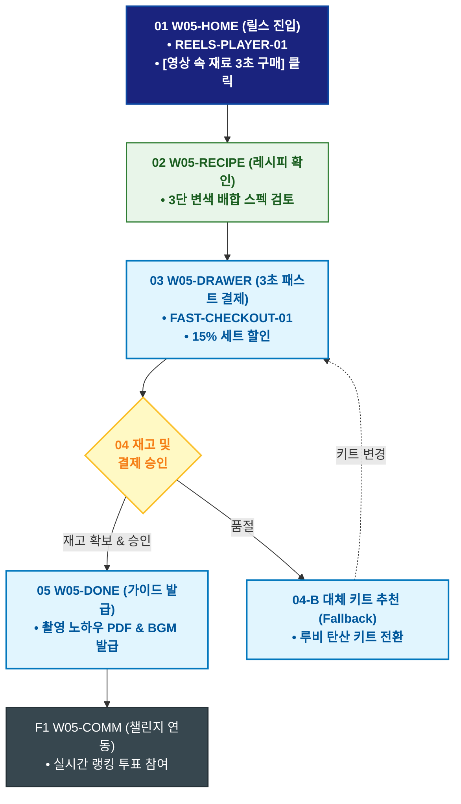

# 🔄 WICKETA 송아린 서비스 흐름도 [인스타 릴스 15초 3단 수색 변환 레시피 즉시 구매]

> **프로젝트명**: WICKETA 숏폼 믹솔로지 & 바이럴 크리에이터 스튜디오 (Short-form Studio)  
> **분석 대상 클라이언트**: [`[가상클라이언트_05] 송아린_푸드크리에이터_숏폼믹솔로지.txt`](file:///C:/Users/user/Desktop/이지희%20에이전트/설계%20마저%20해오기/자동화/03_클라이언트/01_가상_클라이언트/[가상클라이언트_05] 송아린_푸드크리에이터_숏폼믹솔로지.txt)  
> **기준 사이트맵 문서**: [`C:\Users\SBS\Desktop\0819 이지희\한명씩 화면 설계도 진행\자동화\04_설계_및_스토리보드\03_사이트맵\05_송아린\사이트맵_목적1_릴스레시피.md`](file:///C:/Users/SBS/Desktop/0819%20%EC%9D%B4%EC%A7%80%ED%9D%AC/%ED%95%9C%EB%AA%85%EC%94%A9%20%ED%99%94%EB%A9%B4%20%EC%84%A4%EA%B3%84%EB%8F%84%20%EC%A7%84%ED%96%89/%EC%9E%90%EB%8F%99%ED%99%94/04_%EC%84%A4%EA%B3%84_%EB%B0%8F_%EC%8A%A4%ED%86%A0%EB%A6%AC%EB%B3%B4%EB%93%9C/03_%EC%82%AC%EC%9D%B4%ED%8A%B8%EB%A7%B5/05_송아린/사이트맵_목적1_릴스레시피.md)  
> **접속 목적**: 9:16 숏폼 영상 감상 후 3단 변색 에이드 키트 3초 만에 구매  
> **목적별 고유 킬러 기능**: **9:16 숏폼 레시피 플레이어 (`REELS-PLAYER-01`) & 3초 패스트 체크아웃 (`FAST-CHECKOUT-01`)**  
> **작성일자**: 2026년 8월 19일  
> **작성자**: Antigravity UI/UX 설계팀  
> **문서 인코딩**: UTF-8 (유니코드)  

---

## 1. 목적별 핵심 서비스 흐름 개요

인스타그램 릴스에서 유입되어 15초 숏폼 레시피 영상을 감상하고, 영상 속 3단 수색 변환 키트를 3초 만에 원클릭 구매하여 촬영 가이드를 획득하는 패스트 커머스 여정

---

## 2. 목적 맞춤형 가변 여정 스테이지 (Dynamic Journey Stages)

### 📱 Stage 1: 9:16 숏폼 레시피 영상 감상
- **01 릴스 전용 메인 진입 (`W05-HOME`)**: 9:16 세로형 숏폼 비디오 캔버스 재생 ➔ [영상 속 재료 3초 만에 사기] 플로팅 CTA 클릭
- **02 15초 3단 레시피 스펙 확인 (`W05-RECIPE`)**: 오로라 블루(SEC-01) + 탄산수 + 레몬즙 투입 시의 3단계 색상 변화 레시피 열람

### 🛒 Stage 2: 3초 패스트 체크아웃 & 결제
- **03 원클릭 장바구니 담기 (`W05-DRAWER`)**: FAST-CHECKOUT-01 슬라이드아웃 드로어 자동 오픈 (스틱 2종 + 글래스 15% 세트 할인)
- **04 간편결제 승인 및 재고 검증 (`W05-DRAWER`)**:
  - `[조건: 재고 보유]` ➔ 카카오페이 1-Click 승인 ➔ 당일 특급 출고
  - `[조건: 품절(Fallback)]` ➔ 유사 변색 레시피 키트(루비 안토시아닌) 자동 대체 추천

### 🎬 Stage 3: 주문 완료 & 촬영 가이드북 발급
- **05 주문 승인 및 가이드북 증정 (`W05-DONE`)**: 송아린 릴스 촬영 노하우 PDF & 챌린지 전용 음원 링크 발급
- **F1 챌린지 셰어링 루프 (`W05-COMM`)**: 킷 수령 후 영상 업로드 및 실시간 랭킹 투표 연동

---

## 3. 단계별 명세표 (Flow Matrix Table)

| 단계 ID | 단계 명칭 | 사용자 행동 | 화면 접점 | 서비스/시스템 반응 | 매핑 요구사항 | 다음 진입 조건 |
| :---: | :--- | :--- | :--- | :--- | :--- | :--- |
| **01** | 릴스 진입 | [영상 속 재료 구매] 클릭 | `W05-HOME` | REELS-PLAYER-01 숏폼 영상 전면 로딩 | `REQ-01 숏폼 유입` | 02 레시피 확인 |
| **02** | 레시피 확인 | 3단 변색 단계별 스펙 확인 | `W05-RECIPE` | 원료 배합 비율 및 수색 모션 노출 | `REQ-04 수색 변환` | 03 패스트 결제 |
| **03** | 패스트 결제 | 카카오페이 1-Click 승인 | `W05-DRAWER` | FAST-CHECKOUT-01 15% 할인 즉시 결제 | `REQ-06 3초 결제` | 04 재고 검증 |
| **04-A** | [성공] 출고 승인 | 결제 완료 확인 | `W05-DRAWER` | 당일 특급 출고 큐 등록 | `REQ-06 당일 출고` | 05 가이드 발급 |
| **04-B** | [예외] 품절 대체 | 대체 키트 선택 (Fallback) | `W05-DRAWER` | 루비 안토시아닌 키트 자동 교체 | `예외 복구` | 결제 재시도 |
| **05** | 가이드 발급 | 릴스 촬영 가이드 다운로드 | `W05-DONE` | 촬영 노하우 PDF & BGM 링크 발급 | `REQ-05 크리에이터 툴` | F1 챌린지 연동 |
| **F1** | 챌린지 연동 | 챌린지 피드 확인 | `W05-COMM` | 실시간 숏폼 랭킹 투표 연동 | `순환 루프` | 여정 완료 |

---

## 4. 목적별 서비스 흐름도 다이어그램 (Mermaid)

---

## 5. 최종 품질 검토 및 연계 설계 문서

- [x] **고정 템플릿 탈피**: 목적별 특성에 맞춘 독자적 가변 스테이지 및 분기 조건 반영
- [x] **예외 상황(Fallback) 및 루프 완비**: 재고 부족, 결제 실패, 글자수 오류, 연속 출석 등의 분기/복구 파이프라인 수록
- [x] **연계 사이트맵**: [`사이트맵_목적1_릴스레시피.md`](file:///C:/Users/SBS/Desktop/0819%20%EC%9D%B4%EC%A7%80%ED%9D%AC/%ED%95%9C%EB%AA%85%EC%94%A9%20%ED%99%94%EB%A9%B4%20%EC%84%A4%EA%B3%84%EB%8F%84%20%EC%A7%84%ED%96%89/%EC%9E%90%EB%8F%99%ED%99%94/04_%EC%84%A4%EA%B3%84_%EB%B0%8F_%EC%8A%A4%ED%86%A0%EB%A6%AC%EB%B3%B4%EB%93%9C/03_%EC%82%AC%EC%9D%B4%ED%8A%B8%EB%A7%B5/05_송아린/사이트맵_목적1_릴스레시피.md)
