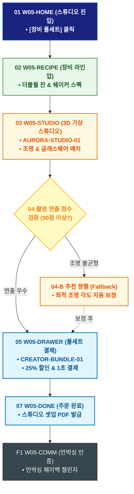

# 🔄 WICKETA 송아린 서비스 흐름도 [홈카페 숏폼 촬영 스튜디오 장비 풀세트 3D 번들 구매]

> **프로젝트명**: WICKETA 숏폼 믹솔로지 & 바이럴 크리에이터 스튜디오 (Short-form Studio)  
> **분석 대상 클라이언트**: [`[가상클라이언트_05] 송아린_푸드크리에이터_숏폼믹솔로지.txt`](file:///C:/Users/user/Desktop/이지희%20에이전트/설계%20마저%20해오기/자동화/03_클라이언트/01_가상_클라이언트/[가상클라이언트_05] 송아린_푸드크리에이터_숏폼믹솔로지.txt)  
> **기준 사이트맵 문서**: [`C:\Users\SBS\Desktop\0819 이지희\한명씩 화면 설계도 진행\자동화\04_설계_및_스토리보드\03_사이트맵\05_송아린\사이트맵_목적2_장비풀세트.md`](file:///C:/Users/SBS/Desktop/0819%20%EC%9D%B4%EC%A7%80%ED%9D%AC/%ED%95%9C%EB%AA%85%EC%94%A9%20%ED%99%94%EB%A9%B4%20%EC%84%A4%EA%B3%84%EB%8F%84%20%EC%A7%84%ED%96%89/%EC%9E%90%EB%8F%99%ED%99%94/04_%EC%84%A4%EA%B3%84_%EB%B0%8F_%EC%8A%A4%ED%86%A0%EB%A6%AC%EB%B3%B4%EB%93%9C/03_%EC%82%AC%EC%9D%B4%ED%8A%B8%EB%A7%B5/05_송아린/사이트맵_목적2_장비풀세트.md)  
> **접속 목적**: 오로라 글래스, 바텐더 쉐이커, 조명 툴 풀세트 3D 시뮬레이션 및 발주  
> **목적별 고유 킬러 기능**: **3D 스튜디오 장비 시뮬레이터 (`AURORA-STUDIO-01`) & 크리에이터 번들 할인기 (`CREATOR-BUNDLE-01`)**  
> **작성일자**: 2026년 8월 19일  
> **작성자**: Antigravity UI/UX 설계팀  
> **문서 인코딩**: UTF-8 (유니코드)  

---

## 1. 목적별 핵심 서비스 흐름 개요

홈카페 숏폼 촬영을 위한 3D 가상 스튜디오에서 더블월 글래스, 바텐더 쉐이커, 미니 조명을 가상 배치하고 25% 크리에이터 할인을 적용받아 구매하는 번들 여정

---

## 2. 목적 맞춤형 가변 여정 스테이지 (Dynamic Journey Stages)

### 💡 Stage 1: 크리에이터 스튜디오 룩북 탐색
- **01 스튜디오 홈 진입 (`W05-HOME`)**: [크리에이터 장비 풀세트] 클릭 ➔ 3D 스튜디오 캔버스 로딩
- **02 촬영 장비 라인업 확인 (`W05-RECIPE`)**: 더블월 잔(SEC-11), 바텐더 쉐이커(SEC-12), 미네랄 토핑(SEC-17) 스펙 검토

### 📸 Stage 2: 3D 가상 스튜디오 배치 & 조명 시뮬레이션
- **03 3D 장비 배치 시뮬레이터 조작 (`W05-STUDIO`)**:
  - AURORA-STUDIO-01 글래스웨어와 미니 링라이트 조명을 가상 테이블에 3D 드래그 배치
- **04 촬영 적합도 검증 (`W05-STUDIO`)**:
  - `{빛 굴절 및 수색 연출 점수?}`
  - `[우수 (90점 이상)]` ➔ CREATOR-BUNDLE-01 25% 풀세트 할인 적용
  - `[조명 불균형(Fallback)]` ➔ 크리에이터 추천 프리셋 자동 정렬

### 🛒 Stage 3: 크리에이터 번들 결제
- **05 장바구니 드로어 호출 (`W05-DRAWER`)**: 25% 풀세트 할인 내역 확인 ➔ 1초 간편결제
- **06 결제 승인 (`W05-DRAWER`)**: 특급 포장 및 익일 배송 큐 등록

### 📦 Stage 4: 주문 완료 & 언박싱 챌린지 가이드
- **07 주문 승인 확인 (`W05-DONE`)**: 스튜디오 셋업 매뉴얼 PDF 증정
- **F1 언박싱 숏폼 인증 (`W05-COMM`)**: 장비 언박싱 영상 업로드 & 페이백 이벤트 연동

---

## 3. 단계별 명세표 (Flow Matrix Table)

| 단계 ID | 단계 명칭 | 사용자 행동 | 화면 접점 | 서비스/시스템 반응 | 매핑 요구사항 | 다음 진입 조건 |
| :---: | :--- | :--- | :--- | :--- | :--- | :--- |
| **01** | 장비 진입 | [장비 풀세트] 클릭 | `W05-HOME` | 3D 스튜디오 캔버스 활성화 | `REQ-05 스튜디오 기획` | 02 라인업 확인 |
| **02** | 라인업 확인 | 글래스/쉐이커 스펙 확인 | `W05-RECIPE` | 장비별 촬영 연출 컷 노출 | `REQ-05 상품 선택` | 03 3D 배치 |
| **03** | 3D 배치 | 글래스 & 조명 드래그 배치 | `W05-STUDIO` | AURORA-STUDIO-01 3D 실시간 렌더링 | `REQ-02 3D 시뮬레이터` | 04 연출 점수 |
| **04-A** | [성공] 90점 획득 | 촬영 적합도 확인 | `W05-STUDIO` | 25% 풀세트 할인 뱃지 활성화 | `REQ-02 연출 검증` | 05 주문 드로어 |
| **04-B** | [예외] 조명 불균형 | 자동 정렬 탭 (Fallback) | `W05-STUDIO` | 송아린 추천 최적 조명각 자동 보정 | `예외 복구` | 05 주문 드로어 |
| **05** | 주문 드로어 | [풀세트 구매하기] 클릭 | `W05-DRAWER` | Slide-out Drawer 오픈, 25% 할인 | `REQ-06 번들 결제` | 06 결제 승인 |
| **06** | 결제 승인 | 카카오페이 1-Click 승인 | `W05-DRAWER` | 특급 포장 및 출고 지시 | `REQ-06 출고 지시` | 07 주문 완료 |
| **07** | 주문 완료 | 셋업 매뉴얼 확인 | `W05-DONE` | 스튜디오 셋업 매뉴얼 PDF 발급 | `REQ-06 매뉴얼 발급` | F1 언박싱 연동 |
| **F1** | 언박싱 연동 | 언박싱 영상 업로드 | `W05-COMM` | 언박싱 페이백 챌린지 연동 | `사후 확산` | 여정 완료 |

---

## 4. 목적별 서비스 흐름도 다이어그램 (Mermaid)

---

## 5. 최종 품질 검토 및 연계 설계 문서

- [x] **고정 템플릿 탈피**: 목적별 특성에 맞춘 독자적 가변 스테이지 및 분기 조건 반영
- [x] **예외 상황(Fallback) 및 루프 완비**: 재고 부족, 결제 실패, 글자수 오류, 연속 출석 등의 분기/복구 파이프라인 수록
- [x] **연계 사이트맵**: [`사이트맵_목적2_장비풀세트.md`](file:///C:/Users/SBS/Desktop/0819%20%EC%9D%B4%EC%A7%80%ED%9D%AC/%ED%95%9C%EB%AA%85%EC%94%A9%20%ED%99%94%EB%A9%B4%20%EC%84%A4%EA%B3%84%EB%8F%84%20%EC%A7%84%ED%96%89/%EC%9E%90%EB%8F%99%ED%99%94/04_%EC%84%A4%EA%B3%84_%EB%B0%8F_%EC%8A%A4%ED%86%A0%EB%A6%AC%EB%B3%B4%EB%93%9C/03_%EC%82%AC%EC%9D%B4%ED%8A%B8%EB%A7%B5/05_송아린/사이트맵_목적2_장비풀세트.md)
