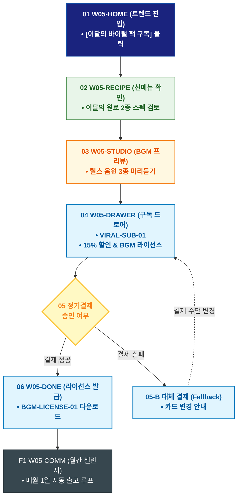

# 🔄 WICKETA 송아린 서비스 흐름도 [매월 신규 바이럴 믹솔로지 레시피 팩 30일 정기구독]

> **프로젝트명**: WICKETA 숏폼 믹솔로지 & 바이럴 크리에이터 스튜디오 (Short-form Studio)  
> **분석 대상 클라이언트**: [`[가상클라이언트_05] 송아린_푸드크리에이터_숏폼믹솔로지.txt`](file:///C:/Users/user/Desktop/이지희%20에이전트/설계%20마저%20해오기/자동화/03_클라이언트/01_가상_클라이언트/[가상클라이언트_05] 송아린_푸드크리에이터_숏폼믹솔로지.txt)  
> **기준 사이트맵 문서**: [`C:\Users\SBS\Desktop\0819 이지희\한명씩 화면 설계도 진행\자동화\04_설계_및_스토리보드\03_사이트맵\05_송아린\사이트맵_목적3_바이럴구독.md`](file:///C:/Users/SBS/Desktop/0819%20%EC%9D%B4%EC%A7%80%ED%9D%AC/%ED%95%9C%EB%AA%85%EC%94%A9%20%ED%99%94%EB%A9%B4%20%EC%84%A4%EA%B3%84%EB%8F%84%20%EC%A7%84%ED%96%89/%EC%9E%90%EB%8F%99%ED%99%94/04_%EC%84%A4%EA%B3%84_%EB%B0%8F_%EC%8A%A4%ED%86%A0%EB%A6%AC%EB%B3%B4%EB%93%9C/03_%EC%82%AC%EC%9D%B4%ED%8A%B8%EB%A7%B5/05_송아린/사이트맵_목적3_바이럴구독.md)  
> **접속 목적**: 매월 트렌딩 신메뉴 원료 2종과 릴스 전용 음원을 배송받는 크리에이터 정기구독  
> **목적별 고유 킬러 기능**: **크리에이터 트렌드 구독 콘솔 (`VIRAL-SUB-01`) & 릴스 음원 라이선스 (`BGM-LICENSE-01`)**  
> **작성일자**: 2026년 8월 19일  
> **작성자**: Antigravity UI/UX 설계팀  
> **문서 인코딩**: UTF-8 (유니코드)  

---

## 1. 목적별 핵심 서비스 흐름 개요

매월 SNS에서 가장 화제가 된 신규 믹솔로지 원료 2종과 상업적 이용 가능한 릴스 트렌딩 음원 라이선스를 정기구독으로 받아보는 크리에이터 전용 멤버십 여정

---

## 2. 목적 맞춤형 가변 여정 스테이지 (Dynamic Journey Stages)

### 🎵 Stage 1: 바이럴 믹솔로지 트렌드 탐색
- **01 트렌드 홈 진입 (`W05-HOME`)**: [이달의 바이럴 팩 구독] 배너 클릭 ➔ 트렌드 큐레이션 로딩
- **02 이달의 신메뉴 라인업 확인 (`W05-RECIPE`)**: 바이올렛 루이보스(SEC-07) + 로즈 쿼츠 탄산(SEC-04) 조합 검토

### 🎧 Stage 2: 릴스 음원 라이브러리 프리뷰
- **03 트렌딩 BGM 음원 청취 (`W05-STUDIO`)**: 저작권 걱정 없는 숏폼 전용 릴스 BGM 3종 미리듣기

### 🛒 Stage 3: Slide-out 15% 정기구독 결제
- **04 크리에이터 구독 드로어 호출 (`W05-DRAWER`)**: 15% 자동할인 + BGM 무료 라이선스 패키지 선택 ➔ 1초 결제
- **05 구독 승인 (`W05-DRAWER`)**:
  - `[조건: 결제 성공]` ➔ 크리에이터 패스 발급 ➔ 매월 1일 자동 출고 큐 등록
  - `[조건: 결제 오류(Fallback)]` ➔ 대체 결제수단 안내창 노출

### 📜 Stage 4: 음원 라이선스 발급 & 월간 챌린지 연동
- **06 구독 승인 및 라이선스 발급 (`W05-DONE`)**: BGM-LICENSE-01 음원 다운로드 코드 발급
- **F1 월간 크리에이터 챌린지 루프 (`W05-COMM`)**: 매월 신규 레시피 팩 수령 ➔ 영상 촬영 ➔ 순환 참여

---

## 3. 단계별 명세표 (Flow Matrix Table)

| 단계 ID | 단계 명칭 | 사용자 행동 | 화면 접점 | 서비스/시스템 반응 | 매핑 요구사항 | 다음 진입 조건 |
| :---: | :--- | :--- | :--- | :--- | :--- | :--- |
| **01** | 트렌드 진입 | [바이럴 팩 구독] 클릭 | `W05-HOME` | 트렌드 쇼케이스 로딩 | `REQ-01 트렌드 기획` | 02 신메뉴 확인 |
| **02** | 신메뉴 확인 | 이달의 2종 원료 스펙 검토 | `W05-RECIPE` | 신메뉴 3D 발향 컷 노출 | `REQ-04 원료 스펙` | 03 BGM 프리뷰 |
| **03** | BGM 프리뷰 | 트렌딩 BGM 음원 청취 | `W05-STUDIO` | 숏폼 BGM 3종 스트리밍 | `REQ-03 음원 제공` | 04 구독 호출 |
| **04** | 구독 호출 | [크리에이터 구독] 클릭 | `W05-DRAWER` | VIRAL-SUB-01 15% 할인 적용 | `REQ-06 정기구독` | 05 결제 승인 |
| **05-A** | [성공] 결제 승인 | 간편결제 1-Click 승인 | `W05-DRAWER` | 매월 정기 출고 지시 완료 | `REQ-06 결제 승인` | 06 라이선스 발급 |
| **05-B** | [예외] 결제 실패 | 카드 정보 변경 (Fallback) | `W05-DRAWER` | 대체 결제 수단 창 오버레이 | `결제 복구` | 결제 재시도 |
| **06** | 라이선스 발급 | BGM 라이선스 코드 확인 | `W05-DONE` | 음원 다운로드 링크 생성 | `REQ-06 라이선스 발급` | F1 월간 챌린지 |
| **F1** | 월간 챌린지 | 다음달 신메뉴 알림 확인 | `W05-COMM` | 매월 1일 신규 팩 자동 발송 루프 | `크리에이터 락인` | 순환 루프 |

---

## 4. 목적별 서비스 흐름도 다이어그램 (Mermaid)

---

## 5. 최종 품질 검토 및 연계 설계 문서

- [x] **고정 템플릿 탈피**: 목적별 특성에 맞춘 독자적 가변 스테이지 및 분기 조건 반영
- [x] **예외 상황(Fallback) 및 루프 완비**: 재고 부족, 결제 실패, 글자수 오류, 연속 출석 등의 분기/복구 파이프라인 수록
- [x] **연계 사이트맵**: [`사이트맵_목적3_바이럴구독.md`](file:///C:/Users/SBS/Desktop/0819%20%EC%9D%B4%EC%A7%80%ED%9D%AC/%ED%95%9C%EB%AA%85%EC%94%A9%20%ED%99%94%EB%A9%B4%20%EC%84%A4%EA%B3%84%EB%8F%84%20%EC%A7%84%ED%96%89/%EC%9E%90%EB%8F%99%ED%99%94/04_%EC%84%A4%EA%B3%84_%EB%B0%8F_%EC%8A%A4%ED%86%A0%EB%A6%AC%EB%B3%B4%EB%93%9C/03_%EC%82%AC%EC%9D%B4%ED%8A%B8%EB%A7%B5/05_송아린/사이트맵_목적3_바이럴구독.md)
