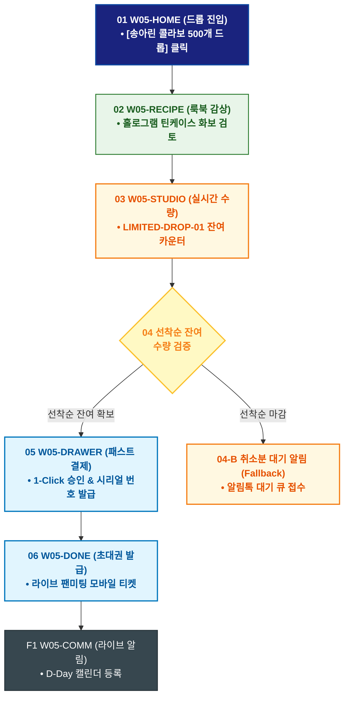

# 🔄 WICKETA 송아린 서비스 흐름도 [송아린 콜라보레이션 리미티드 에디션 한정판 키트 구매]

> **프로젝트명**: WICKETA 숏폼 믹솔로지 & 바이럴 크리에이터 스튜디오 (Short-form Studio)  
> **분석 대상 클라이언트**: [`[가상클라이언트_05] 송아린_푸드크리에이터_숏폼믹솔로지.txt`](file:///C:/Users/user/Desktop/이지희%20에이전트/설계%20마저%20해오기/자동화/03_클라이언트/01_가상_클라이언트/[가상클라이언트_05] 송아린_푸드크리에이터_숏폼믹솔로지.txt)  
> **기준 사이트맵 문서**: [`C:\Users\SBS\Desktop\0819 이지희\한명씩 화면 설계도 진행\자동화\04_설계_및_스토리보드\03_사이트맵\05_송아린\사이트맵_목적5_콜라보한정판.md`](file:///C:/Users/SBS/Desktop/0819%20%EC%9D%B4%EC%A7%80%ED%9D%AC/%ED%95%9C%EB%AA%85%EC%94%A9%20%ED%99%94%EB%A9%B4%20%EC%84%A4%EA%B3%84%EB%8F%84%20%EC%A7%84%ED%96%89/%EC%9E%90%EB%8F%99%ED%99%94/04_%EC%84%A4%EA%B3%84_%EB%B0%8F_%EC%8A%A4%ED%86%A0%EB%A6%AC%EB%B3%B4%EB%93%9C/03_%EC%82%AC%EC%9D%B4%ED%8A%B8%EB%A7%B5/05_송아린/사이트맵_목적5_콜라보한정판.md)  
> **접속 목적**: 선착순 500개 송아린 시그니처 틴케이스 구매 및 라이브 팬미팅 초대권 획득  
> **목적별 고유 킬러 기능**: **송아린 시그니처 룩북 (`CREATOR-LOOKBOOK-01`) & 선착순 한정판 결제기 (`LIMITED-DROP-01`)**  
> **작성일자**: 2026년 8월 19일  
> **작성자**: Antigravity UI/UX 설계팀  
> **문서 인코딩**: UTF-8 (유니코드)  

---

## 1. 목적별 핵심 서비스 흐름 개요

송아린 크리에이터와의 공식 콜라보레이션 룩북을 감상하고, 선착순 500개 한정판 홀로그램 틴세트를 결제하여 라이브 팬미팅 초대권을 획득하는 드롭(Drop) 여정

---

## 2. 목적 맞춤형 가변 여정 스테이지 (Dynamic Journey Stages)

### ✨ Stage 1: 콜라보레이션 리미티드 룩북 탐색
- **01 한정판 드롭 진입 (`W05-HOME`)**: [송아린 콜라보 한정판 500개 드롭] 배너 클릭 ➔ 콜라보 룩북 로딩
- **02 홀로그램 틴케이스 화보 감상 (`W05-RECIPE`)**: 시그니처 홀로그램 메탈 틴 & 전용 믹솔로지 레시피 팩 스펙 확인

### ⏰ Stage 2: 선착순 잔여 수량 검증 & 1-Click 주문
- **03 실시간 잔여 수량 검증 (`W05-STUDIO`)**:
  - LIMITED-DROP-01 선착순 500개 실시간 카운터 확인 ➔ `{잔여 수량 있음?}`
  - `[재고 보유 (잔여 42개)]` ➔ 1초 결제 버튼 즉시 활성화
  - `[품절 마감(Fallback)]` ➔ 취소분 발생 실시간 알림톡 신청 모달

### 🛒 Stage 3: 한정판 패스트 결제
- **04 Slide-out 1초 결제 (`W05-DRAWER`)**: 카카오페이 원클릭 승인 ➔ 선착순 번호표(No. 458) 발급

### 🎟️ Stage 4: 주문 완료 & 라이브 팬미팅 초대권
- **05 모바일 초대권 발급 (`W05-DONE`)**: 송아린 믹솔로지 라이브 스트리밍 프라이빗 초대장 증정
- **F1 팬미팅 라이브 알림 루프 (`W05-COMM`)**: 라이브 D-Day 캘린더 등록 & 질문 남기기 연동

---

## 3. 단계별 명세표 (Flow Matrix Table)

| 단계 ID | 단계 명칭 | 사용자 행동 | 화면 접점 | 서비스/시스템 반응 | 매핑 요구사항 | 다음 진입 조건 |
| :---: | :--- | :--- | :--- | :--- | :--- | :--- |
| **01** | 드롭 진입 | [콜라보 한정판] 클릭 | `W05-HOME` | 콜라보 룩북 쇼케이스 로딩 | `REQ-05 한정판 기획` | 02 룩북 감상 |
| **02** | 룩북 감상 | 홀로그램 틴 화보 확인 | `W05-RECIPE` | CREATOR-LOOKBOOK-01 화보 노출 | `REQ-05 상품 화보` | 03 수량 검증 |
| **03** | 수량 검증 | [선착순 구매하기] 탭 | `W05-STUDIO` | LIMITED-DROP-01 실시간 재고 쿼리 | `REQ-02 드롭 시스템` | 04 검증 분기 |
| **04-A** | [성공] 재고 확보 | 선착순 구매 버튼 활성화 | `W05-DRAWER` | Slide-out Drawer 오픈 | `REQ-06 패스트 결제` | 05 1초 결제 |
| **04-B** | [예외] 선착순 마감 | 취소분 알림 신청 (Fallback) | `W05-STUDIO` | 카카오 알림톡 대기 큐 등록 | `예외 복구` | 대기 등록 |
| **05** | 1초 결제 | 카카오페이 1-Click 승인 | `W05-DRAWER` | 결제 승인 & 고유 시리얼 넘버 발급 | `REQ-06 결제 승인` | 06 초대권 발급 |
| **06** | 초대권 발급 | 모바일 팬미팅 티켓 확인 | `W05-DONE` | 라이브 스트리밍 모바일 패스 발급 | `REQ-06 팬미팅 티켓` | F1 라이브 알림 |
| **F1** | 라이브 알림 | D-Day 캘린더 등록 | `W05-COMM` | 실시간 라이브 스트리밍 알림 예약 | `팬덤 락인` | 여정 완료 |

---

## 4. 목적별 서비스 흐름도 다이어그램 (Mermaid)

---

## 5. 최종 품질 검토 및 연계 설계 문서

- [x] **고정 템플릿 탈피**: 목적별 특성에 맞춘 독자적 가변 스테이지 및 분기 조건 반영
- [x] **예외 상황(Fallback) 및 루프 완비**: 재고 부족, 결제 실패, 글자수 오류, 연속 출석 등의 분기/복구 파이프라인 수록
- [x] **연계 사이트맵**: [`사이트맵_목적5_콜라보한정판.md`](file:///C:/Users/SBS/Desktop/0819%20%EC%9D%B4%EC%A7%80%ED%9D%AC/%ED%95%9C%EB%AA%85%EC%94%A9%20%ED%99%94%EB%A9%B4%20%EC%84%A4%EA%B3%84%EB%8F%84%20%EC%A7%84%ED%96%89/%EC%9E%90%EB%8F%99%ED%99%94/04_%EC%84%A4%EA%B3%84_%EB%B0%8F_%EC%8A%A4%ED%86%A0%EB%A6%AC%EB%B3%B4%EB%93%9C/03_%EC%82%AC%EC%9D%B4%ED%8A%B8%EB%A7%B5/05_송아린/사이트맵_목적5_콜라보한정판.md)
