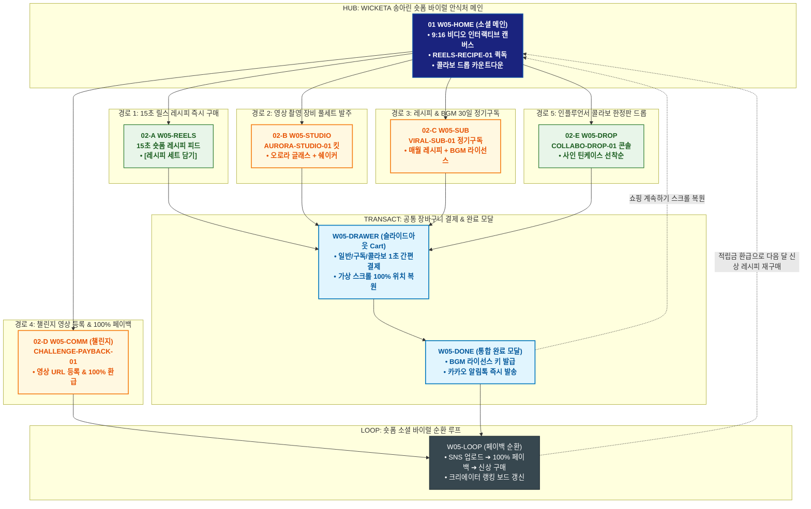

# 🔄 WICKETA 송아린 통합 서비스 흐름도 (Master Integrated Service Flow)

> **프로젝트명**: WICKETA 숏폼 바이럴 안식처 플랫폼 (송아린 크리에이터 바이럴 마스터)  
> **분석 대상 클라이언트**: [`[가상클라이언트_05] 송아린_숏폼크리에이터_바이럴안식처.txt`](file:///C:/Users/user/Desktop/이지희%20에이전트/설계%20마저%20해오기/자동화/03_클라이언트/01_가상_클라이언트/[가상클라이언트_05]%20송아린_숏폼크리에이터_바이럴안식처.txt)  
> **기준 사이트맵 문서**: [`C:\Users\user\Desktop\이지희 에이전트\설계 마저 해오기\자동화\04_설계_및_스토리보드\03_사이트맵\05_송아린\사이트맵.md`](file:///C:/Users/user/Desktop/이지희%20에이전트/설계%20마저%20해오기/자동화/04_설계_및_스토리보드/03_사이트맵/05_송아린/사이트맵.md)  
> **기준 클라이언트 분석서**: [`[클라이언트05]_송아린_숏폼크리에이터_바이럴안식처.md`](file:///C:/Users/user/Desktop/이지희%20에이전트/설계%20마저%20해오기/자동화/03_클라이언트/02_클라이언트_분석/[클라이언트05]_송아린_숏폼크리에이터_바이럴안식처.md)  
> **적용 레이아웃 아키타입**: `E-1 소셜 미디어 순환 피드형 (Short-form Viral Feed)`  
> **통합 핵심 킬러 기능**: **9:16 숏폼 레시피 피드 (`REELS-RECIPE-01`) & 영상 촬영용 오로라 장비 킷 (`AURORA-STUDIO-01`) & 바이럴 레시피/BGM 30일 정기구독 (`VIRAL-SUB-01`) & 챌린지 100% 페이백 루프 (`CHALLENGE-PAYBACK-01`) & 인플루언서 한정판 콜라보 드롭 (`COLLABO-DROP-01`)**  
> **작성일자**: 2026년 8월 19일  
> **작성자**: Antigravity UI/UX 총괄 설계팀  
> **문서 인코딩**: UTF-8 (유니코드)  

---

## 1. 5대 목적별 서비스 흐름 비교 및 요구사항 통합 분석

본 문서는 송아린 클라이언트의 **5대 독립적 서비스 이용 목적(15초 릴스 레시피 세트 즉시 구매, 영상 촬영용 오로라 글래스 & 쉐이커 풀세트 발주, 신규 레시피 & 공식 BGM 30일 정기구독, 믹솔로지 챌린지 영상 업로드 & 100% 페이백 루프, 인플루언서 콜라보 시그니처 굿즈 한정 구매)**을 종합 분석하여, **중복 화면을 단일 화면 허브로 통합**하고 **고유 목적별 경로(User Journey Path)와 핵심 요구사항을 누락 없이 체계화한 마스터 서비스 흐름도**입니다.

### 1.1 공통 요구사항 vs 클라이언트 고유 요구사항 분석표

| 구분 | 공통 요구사항 (Common Baseline) | 클라이언트 고유 요구사항 (Unique Specialization) | 최종 통합 서비스 적용 방안 |
| :--- | :--- | :--- | :--- |
| **메인 진입 & 소셜 피드** | • 고해상도 비주얼 캔버스<br/>• GNB/LNB 전역 내비게이션 | • **`REELS-RECIPE-01`**: 9:16 세로형 15초 숏폼 레시피 비디오 피드<br/>• 실시간 실시간 트렌딩 레시피 랭킹 보드 | `W05-HOME` 및 `W05-REELS`를 숏폼 중심 인터페이스로 구성하여 15초 영상과 구매 버튼을 상시 결합 |
| **촬영 장비 & 콜라보 드롭** | • 상품 상세 및 옵션 선택<br/>• 재고 상태 실시간 표시 | • **`AURORA-STUDIO-01`**: 숏폼 영상 촬영 퀄리티를 극대화하는 오로라 프리즘 글래스 & 쉐이커 킷<br/>• **`COLLABO-DROP-01`**: 100만 크리에이터 한정판 시그니처 틴케이스 실시간 드롭 카운트다운 | `W05-STUDIO` 및 `W05-DROP`에서 촬영 장비 번들 및 한정판 드롭 구매 파이프라인 제공 |
| **바이럴 구독 & BGM** | • 정기배송 설정 및 할인<br/>• 출석 포인트 적립 | • **`VIRAL-SUB-01`**: 매월 신규 레시피 팩 + 틱톡/릴스 공식 상업용 음원 라이선스 30일 구독 | `W05-SUB`에서 매월 새로운 레시피와 숏폼 배경음원을 패키지로 정기 공급 |
| **챌린지 & 페이백 순환** | • 마이페이지 후기 작성<br/>• SNS 공유 기능 | • **`CHALLENGE-PAYBACK-01`**: #위케티챌린지 영상 링크 업로드 시 조회수 달성에 따른 **100% 페이백 적립금 환급 루프** | `W05-COMM` 및 `W05-LOOP`에서 영상 검증 ➔ 적립금 환급 ➔ 다음 달 신상 구매로 이어지는 순환 구축 |
| **장바구니 & 초고속 결제** | • 장바구니 품목 관리<br/>• 모바일 주문 알림 | • **Slide-out Cart Drawer**: 영상 시청 중 페이지 무이탈 1-Click 즉시 결제<br/>• **가상 스크롤 100% 위치 복원 엔진** | `W05-DRAWER` 단일 공통 드로어로 영상 재생 상태를 유지하며 초고속 결제 지원 |

### 1.2 5대 목적별 핵심 서비스 흐름 정의 (Use Cases 1~5)

본 통합 시스템에 완전하게 통합·반영된 5대 목적별 핵심 서비스 흐름 정의는 다음과 같습니다:

#### 📌 목적 1: 화제의 15초 릴스 레시피 세트 즉시 구매
본 서비스 흐름도는 **숏폼 영상 시청 중단 없는 원클릭 재료 담기 및 초고속 간편결제**에 최적화된 숏폼 패스트 구매형(`flowchart TD`) 구조로 설계되었습니다:

- **1. 시작 지점 (Starting Point)**: 인스타그램 릴스/틱톡 바이럴 링크 또는 홈 피드 유입 ➔ `W05-HOME` (숏폼 릴스 피드 홈)
- **2. 핵심 행동 (Core Action)**: `REELS-FEED-01` 세로형 9:16 비디오 시청 ➔ 15초 수색 반전 층분리 구간 확인 ➔ [영상 속 재료 1초 담기] 퀵 태그 클릭 ➔ `W05-RECIPE` 믹솔로지 스타터 팩(네온 블루 베이스 + 스파클링 토닉 6캔) 조합 확인
- **3. 전환 목표 (Conversion Goal)**: **[15초 릴스 레시피 스타터 세트 원클릭 장바구니 담기 및 3초 간편결제]**
- **4. 필요한 기능 (Required Features)**: REELS-FEED-01 인터랙티브 영상 상품 태깅 시스템, 타임스탬프 기반 레시피 가이드, 슬라이드아웃 Cart Drawer, 원클릭 간편결제(Apple Pay/KakaoPay)
- **5. 예외 상황 (Edge Cases & Fallbacks)**: 특정 시럽 품절 시 동일 층분리 색상의 대체 플레이버 자동 제안(`EXP-03`), 통신 지연 시 저화질 스트리밍 자동 전환
- **6. 완료 결과 (Completed State)**: 결제 완료 및 D-Day 익일 특급 출고 바우처 발급, 15초 제조 가이드 영상 소장용 링크 수령, 챌린지 참여 5,000P 쿠폰 자동 지급

---

#### 📌 목적 2: 영상 촬영용 오로라 글래스 & 쉐이커 풀세트 발주
본 서비스 흐름도는 **크리에이터 하드웨어 장비 탐색 및 3D 뷰어 기반 풀세트 번들 발주**에 최적화된 크리에이터 장비 번들형(`flowchart TD`) 구조로 설계되었습니다:

- **1. 시작 지점 (Starting Point)**: 크리에이터 추천 홈바 룩북 배너 유입 ➔ `W05-CREATOR` (크리에이터 홈바 도감) & `W05-KIT`
- **2. 핵심 행동 (Core Action)**: 오로라 하이볼 잔 & 더블월 쿠페 글래스 선택 ➔ 360도 3D 글래스웨어 렌더링 뷰어 확인 ➔ 매트 블랙 쉐이커 & 네온 믹싱 지거 세트 추가 ➔ 20% 크리에이터 풀번들 할인 확인
- **3. 전환 목표 (Conversion Goal)**: **[크리에이터 하드웨어 장비 & 글래스웨어 풀세트 번들 발주 완료]**
- **4. 필요한 기능 (Required Features)**: 3D 글래스웨어 실시간 회전 뷰어, 크리에이터 툴 번들 빌더 모듈, 100% 무상 파손 보증 배지, 슬라이드아웃 Cart 결제
- **5. 예외 상황 (Edge Cases & Fallbacks)**: 특정 글래스웨어 일시 품절 시 동급 프리미엄 오로라 잔 무상 업그레이드 옵션 제공
- **6. 완료 결과 (Completed State)**: 결제 완료 및 안전 에어캡 특급 포장 바우처 발급, 무료 파손 보증서 및 영상 촬영 세팅 팁 PDF 발급

---

#### 📌 목적 3: 신규 레시피 & 공식 BGM 30일 정기구독
본 서비스 흐름도는 **크리에이터 멤버십 기반의 월간 정기구독 및 상업 음원 즉시 발급**에 최적화된 가로 초고속 구독 파이프라인(`flowchart LR`) 구조로 설계되었습니다:

- **1. 시작 지점 (Starting Point)**: 크리에이터 피드 또는 멤버십 배너 유입 ➔ `W05-HOME` & `W05-RECIPE` (월간 신상 구독)
- **2. 핵심 행동 (Core Action)**: 월간 바이럴 박스(신규 플레이버 2종 + 네온 시럽 + 공식 음원 3종) 플랜 선택 ➔ 첫 달 50% 페이백 및 VIP 크리에이터 배지 혜택 확인 ➔ 30일 배송 주기 설정
- **3. 전환 목표 (Conversion Goal)**: **[월간 바이럴 믹솔로지 박스 & 전용 BGM 음원 패스 30일 정기구독 체결]**
- **4. 필요한 기능 (Required Features)**: VIRAL-SUB-01 구독 시뮬레이터, 첫 달 50% 페이백 모듈, 상업용 BGM WAV/MP3 즉시 다운로더, 자동 정기결제 엔진
- **5. 예외 상황 (Edge Cases & Fallbacks)**: 첫 결제 실패 시 카카오 알림톡으로 24시간 결제 유예 링크 발송 및 대체 결제수단 안내
- **6. 완료 결과 (Completed State)**: 정기구독 등록 완료, 크리에이터 VIP 뱃지 프로필 적용, 이번 달 공식 BGM 3종 음원 패스 즉시 다운로드

---

#### 📌 목적 4: 믹솔로지 챌린지 영상 업로드 & 100% 페이백 루프
본 서비스 흐름도는 **영상 제작 ➔ 인증 ➔ 리워드 ➔ 다음 챌린지로 이어지는 무한 소셜 순환 루프(`flowchart TD` + Loop `-.->`)** 구조로 설계되었습니다:

- **1. 시작 지점 (Starting Point)**: 챌린지 배너 또는 랭킹 갤러리 유입 ➔ `W05-STUDIO` (챌린지 스튜디오) & `W05-RANKING`
- **2. 핵심 행동 (Core Action)**: 15초 믹솔로지 제조 영상 MP4 업로드 또는 틱톡/릴스 URL 등록 ➔ 추천 챌린지 BGM 및 해시태그(`#위케티챌린지`) 자동 매칭 ➔ 실시간 랭킹 갤러리에 영상 등록 ➔ 유저 투표 획득
- **3. 전환 목표 (Conversion Goal)**: **[챌린지 영상 등록 완료 및 구매 금액 100% 포인트 페이백 수령]**
- **4. 필요한 기능 (Required Features)**: REELS-STUDIO-01 영상 업로더 & BGM 싱크 툴, SNS 링크 실시간 유효성 검증기, 실시간 투표 집계 엔진, 100% 포인트 즉시 페이백 시스템
- **5. 예외 상황 (Edge Cases & Fallbacks)**: 영상 용량 초과(100MB 이상) 시 `EXP-02` 인앱 압축 도구 안내, 해시태그 누락 시 자동 보정 추가
- **6. 완료 결과 (Completed State)**: 챌린지 등록 번호표 발급, 실시간 랭킹 차트 진입, 구매액 100% 포인트 적립, **다음 주 신규 챌린지 순환 루프 진입**

---

#### 📌 목적 5: 인플루언서 콜라보 시그니처 굿즈 한정 구매
본 서비스 흐름도는 **한정판 굿즈 선착순 드롭 및 오프라인 팝업 VIP 패스 연계**에 최적화된 콜라보 한정 드롭형(`flowchart TD`) 구조로 설계되었습니다:

- **1. 시작 지점 (Starting Point)**: 인스타그램 라이브 방송 링크 또는 콜라보 팝업 공지 유입 ➔ `W05-EVENT` (VIP 크리에이터 패스) & `W05-HOME`
- **2. 핵심 행동 (Core Action)**: 송아린 콜라보 500세트 한정판 굿즈(네온 티 + 친필 각인 글래스 + 시리얼 카드) 스펙 확인 ➔ 실시간 잔여 수량(남은 수량 42개) 확인 ➔ 1-Click 선착순 결제 ➔ 팝업 스토어 라이브 방송 VIP 패스 신청
- **3. 전환 목표 (Conversion Goal)**: **[송아린 콜라보 한정판 굿즈 구매 및 오프라인 팝업 VIP 패스 발급 완료]**
- **4. 필요한 기능 (Required Features)**: COLLABO-DROP-01 실시간 재고 카운트다운 타이머, 고유 시리얼 넘버링 발급 엔진, 모바일 VIP 바코드 발급 모듈, 슬라이드아웃 Cart 결제
- **5. 예외 상황 (Edge Cases & Fallbacks)**: 한정 수량 완판 시 2차 프리오더 오픈 알림 신청 모달(`EXP-03`), 동시 접속 결제 충돌 시 대기열 큐 시스템 구동
- **6. 완료 결과 (Completed State)**: 한정판 결제 완료, 고유 시리얼 넘버(No. 087/500) 카드 발급, 오프라인 팝업 스토어 VIP 입장 모바일 바코드 즉시 수령

---

---

## 2. 통합 화면 아키텍처 및 중복 화면 통합 매핑

본 설계에서는 5대 목적별 산출물에 분산되어 있던 중복 화면들을 **9개의 핵심 화면 노드(Node)**로 통합 정리하였습니다.

```text
[WICKETA 송아린 통합 서비스 화면 매핑 구조]
├── 🎬 W05-HOME (숏폼 바이럴 안식처 메인 허브)
│   ├── HERO-01: 9:16 비디오 캔버스 & 실시간 트렌딩 레시피 피드
│   ├── REELS-RECIPE-01: 15초 릴스 레시피 퀵독 ([영상 속 레시피 즉시 담기])
│   ├── COLLABO-DROP-01: 인플루언서 한정판 드롭 카운트다운 타이머
│   └── 5대 목적 진입 라우터 (GNB / Quick Dock)
│
├── 📱 W05-REELS (9:16 숏폼 레시피 비디오 피드)
│   ├── 무한 스크롤 숏폼 비디오 스트리밍 & 레시피 오버레이
│   └── [레시피 세트 1초 담기] 인터랙티브 CTA 버튼
│
├── 🎥 W05-STUDIO (영상 촬영 스튜디오 장비 킷)
│   ├── AURORA-STUDIO-01: 오로라 프리즘 글래스 & 믹솔로지 쉐이커 3D 뷰어
│   └── 크리에이터 전용 링라이트 거치대 & 조명 세트 옵션
│
├── 🔥 W05-DROP (인플루언서 콜라보 한정판 드롭 콘솔)
│   ├── 한정 수량(500개) 실시간 재고 카운트다운
│   └── 크리에이터 친필 사인 각인 틴케이스 & 시크릿 레시피 카드
│
├── 📦 W05-SUB (바이럴 레시피 & BGM 정기구독 콘솔)
│   ├── VIRAL-SUB-01: 매월 1일 신규 트렌드 레시피 팩 자동 배송
│   └── 틱톡/릴스 상업용 공식 BGM 다운로드 라이선스 키 발급
│
├── 🏆 W05-COMM (믹솔로지 챌린지 스튜디오)
│   ├── CHALLENGE-PAYBACK-01: #위케티챌린지 영상 링크 등록 콘솔
│   └── 실시간 조회수 트래킹 & 1,000뷰 달성 시 100% 페이백 승인
│
├── 🛒 W05-DRAWER (슬라이드아웃 통합 장바구니 드로어) [공통 레이어]
│   ├── 일반 / 15% 정기구독 / 한정판 드롭 / 카카오 선물 1초 결제
│   └── 가상 스크롤 100% 위치 복원 엔진 (Scroll Restoration)
│
├── 🎉 W05-DONE (통합 주문 완료 모달)
│   └── 주문 승인 번호, BGM 라이선스 키, 챌린지 참가 티켓 발급 & 카카오 알림톡
│
└── 🔄 W05-LOOP (숏폼 업로드 & 페이백 순환 루프)
    ├── SNS 릴스 업로드 ➔ 100% 페이백 적립금 지급 ➔ 다음 달 신상 레시피 구매 순환
    └── 실시간 배송 추적 & 크리에이터 랭킹 보드 갱신
```

---

## 3. 5대 통합 사용자 여정 경로 (User Journey Paths)

통합 시스템은 사용자의 진입 목적에 따라 5개의 상호 배타적이면서도 유기적으로 연계된 경로를 제공합니다:

```text
[경로 1: 15초 릴스 레시피 세트 즉시 원클릭 구매]
W05-HOME / W05-REELS (15초 릴스 시청) ➔ [레시피 세트 담기] ➔ W05-DRAWER (간편결제) ➔ W05-DONE (레시피 카드 발급) ➔ W05-COMM (제작 가이드)

[경로 2: 영상 촬영용 오로라 글래스 & 쉐이커 풀세트 발주]
W05-HOME ➔ W05-STUDIO (AURORA-STUDIO-01 풀세트 선택) ➔ W05-DRAWER (번들 할인 결제) ➔ W05-DONE (주문 완료) ➔ W05-COMM (촬영 팁 가이드)

[경로 3: 신규 레시피 & 공식 BGM 30일 정기구독]
W05-HOME ➔ W05-SUB (VIRAL-SUB-01 30일 구독 선택) ➔ W05-DRAWER (15% 구독 할인 결제) ➔ W05-DONE (BGM 라이선스 발급) ➔ W05-COMM (음원 다운로드)

[경로 4: 믹솔로지 챌린지 영상 업로드 & 100% 페이백 루프]
W05-COMM (CHALLENGE-PAYBACK-01 영상 링크 등록) ➔ 조회수 검증 ➔ 100% 페이백 적립 ➔ W05-HOME (적립금으로 신상 레시피 재구매)

[경로 5: 인플루언서 콜라보 시그니처 굿즈 한정 구매]
W05-HOME ➔ W05-DROP (COLLABO-DROP-01 한정판 드롭 진입) ➔ W05-DRAWER (1초 선착순 결제) ➔ W05-DONE (한정판 바우처 발급) ➔ W05-COMM (언박싱 인증)
```

### 3.1 5대 경로별 페이즈(Phase 1~4) 상세 진행 흐름

#### 🔹 [경로 1] 목적 1: 화제의 15초 릴스 레시피 세트 즉시 구매
### 🟢 Phase 1: REEL DISCOVERY · 15초 숏폼 영상 시청
- **01 릴스 피드 진입 (`W05-HOME`)**: 세로형 9:16 풀스크린 숏폼 피드 확인 / 메인 피드 접점 / REELS-FEED-01 자동 재생 및 음원 활성화
- **02 수색 반전 레시피 확인 (`W05-HOME / W05-RECIPE`)**: 3단 층분리 시각 연출 및 타임스탬프 확인 / 영상 내 상품 태그 접점 / [영상 속 재료 1초 담기] CTA 노출

### 🟡 Phase 2: ONE-CLICK KIT MAPPING · 레시피 팩 매핑
- **03 레시피 키트 구성 확인 (`W05-RECIPE`)**: 네온 베이스 + 탄산 믹서 + 전용 지거 세트 확인 / 퀵 뷰 레이어 접점 / 스타터 키트 15% 바이럴 할인율 계산
- **04 장바구니 담기 (`W05-DRAWER`)**: Slide-out Cart Drawer로 즉시 상품 전송 / 퀵 드로어 접점 / 영상 시청 흐름 유지 상태에서 결제 준비

### 🟢🟡 Phase 3: 3-SECOND CHECKOUT · 초고속 간편결제
- **05 3초 패스트 결제 (`W05-DRAWER`)**: 카카오페이/Apple Pay 1초 원터치 결제 / 슬라이드아웃 결제 접점 / 배송지 자동 로딩 및 결제 승인
- **06 주문 완료 & 챌린지 티켓 (`W05-DONE`)**: 레시피 팩 결제 완료 확인 / Confirmation Modal 접점 / 익일 출고 바우처 및 15초 레시피북 PDF 발급

### ⬛ Phase 4: CREATOR LOOP · 영상 제작 및 챌린지 유도
- **F1 챌린지 참가 연계 (`W05-STUDIO`)**: 상품 수령 후 챌린지 영상 업로드 안내 / Studio 연계 접점 / 챌린지 인증 시 100% 페이백 혜택 제공

---

#### 🔹 [경로 2] 목적 2: 영상 촬영용 오로라 글래스 & 쉐이커 풀세트 발주
### 🟢 Phase 1: EQUIPMENT INTAKE · 크리에이터 장비 탐색
- **01 크리에이터 도감 진입 (`W05-CREATOR`)**: 인플루언서 홈바 세팅 룩북 확인 / 크리에이터 도감 접점 / CREATOR-KIT-01 빌더 진입 CTA 제공
- **02 오로라 글래스웨어 검토 (`W05-KIT`)**: 오로라 하이볼 잔 & 쿠페 글래스 선택 / 3D 뷰어 접점 / 빛 반사 수색 굴절 3D 렌더링 확인

### 🟡 Phase 2: BUNDLE ASSEMBLY · 쉐이커 툴 세트 조합
- **03 쉐이커 & 지거 툴 선택 (`W05-KIT`)**: 매트 블랙 쉐이커, 머들러, 믹싱 스푼 선택 / 툴 빌더 접점 / 풀세트 조합 구성도 확인
- **04 크리에이터 20% 할인 확정 (`W05-KIT`)**: 장비 풀패키지 번들 할인율 확인 / 1-Page 견적 접점 / 20% 할인 총액 산출 및 Cart 담기

### 🟢🟡 Phase 3: FAST CHECKOUT · 안전 출고 발주
- **05 Cart Drawer 주문 결제 (`W05-DRAWER`)**: Slide-out Cart에서 배송지 확인 및 간편결제 / 슬라이드아웃 접점 / 파손 안심 보증 옵션 자동 적용
- **06 발주 완료 & 파손 보증서 (`W05-DONE`)**: 장비 풀세트 결제 완료 확인 / Confirmation Modal 접점 / 100% 무상 파손 보증서 및 촬영 가이드 발급

### ⬛ Phase 4: STUDIO SUPPORT · 영상 촬영 세팅 가이드 연계
- **F1 숏폼 촬영 팁 연계 (`W05-STUDIO`)**: 글래스웨어 조명 세팅 팁 확인 / 챌린지 스튜디오 접점 / 장비 언박싱 숏폼 챌린지 등록 유도

---

#### 🔹 [경로 3] 목적 3: 신규 레시피 & 공식 BGM 30일 정기구독
### 🟢 Phase 1: PLAN DISCOVERY · 바이럴 멤버십 탐색
- **01 멤버십 피드 진입 (`W05-HOME`)**: 월간 바이럴 박스 혜택 배너 확인 / 메인 홈 접점 / VIRAL-SUB-01 구독 플랜 로딩
- **02 바이럴 박스 구성 검토 (`W05-RECIPE`)**: 신규 원료 2종 + 시크릿 시럽 스펙 확인 / 신상 구독 도감 접점 / 이달의 BGM 3종 미리듣기 제공

### 🟡 Phase 2: BENEFIT CONFIGURATION · 혜택 및 주기 설정
- **03 30일 구독 주기 설정 (`W05-RECIPE`)**: 매월 1일/15일 배송 주기 선택 / 구독 빌더 접점 / 첫 달 50% 페이백 및 VIP 뱃지 반영
- **04 구독 조건 확인 및 승인 (`W05-DRAWER`)**: 정기 할인(25%) 총액 확인 / 1-Page 구독 확인서 접점 / 1-Click 정기결제 활성화

### 🟢🟡 Phase 3: INSTANT SUBSCRIPTION · 1초 정기결제
- **05 1초 정기결제 승인 (`W05-DRAWER`)**: 등록된 간편결제로 1초 승인 / 슬라이드아웃 결제 접점 / 구독 계약 자동 체결 및 배송일 확정
- **06 구독 완료 & 음원 패스 발급 (`W05-DONE`)**: 구독 등록 완료 확인 / Confirmation Modal 접점 / VIP 뱃지 활성화 및 BGM 음원 즉시 다운로드

### ⬛ Phase 4: MEMBERSHIP ENGAGEMENT · VIP 챌린지 우선권
- **F1 VIP 전용 챌린지 연계 (`W05-STUDIO`)**: 바이럴 박스 수령 후 VIP 챌린지 우선 참여 / 스튜디오 접점 / 공식 BGM 자동 매칭 업로드 지원

---

#### 🔹 [경로 4] 목적 4: 믹솔로지 챌린지 영상 업로드 & 100% 페이백 루프
### 🟢 Phase 1: STUDIO INTAKE · 챌린지 스튜디오 진입
- **01 스튜디오 진입 (`W05-STUDIO`)**: 이달의 챌린지 테마 및 100% 페이백 배너 확인 / 스튜디오 접점 / REELS-STUDIO-01 업로더 로딩
- **02 챌린지 영상 업로드 (`W05-STUDIO`)**: 15초 영상 파일 첨부 또는 SNS 영상 링크 입력 / 업로더 접점 / 썸네일 자동 생성 및 BGM 매칭

### 🟡 Phase 2: TAGGING & SUBMISSION · 태그 매칭 및 등록
- **03 해시태그 & 사용 원료 태그 (`W05-STUDIO`)**: `#위케티챌린지` 및 사용 베이스 태깅 / 태그 빌더 접점 / 영상 유효성 검증 및 랭킹 진입 준비
- **04 챌린지 최종 제출 (`W05-STUDIO`)**: 등록 약관 동의 및 제출 클릭 / 1-Page 제출 접점 / 챌린지 고유 번호표 발급

### 🟢🟡 Phase 3: RANKING & 100% PAYBACK · 랭킹 등극 및 페이백
- **05 실시간 랭킹 갤러리 노출 (`W05-RANKING`)**: 실시간 투표 갤러리 등록 / 랭킹 피드 접점 / 1-Click 투표 및 응원 댓글 활성화
- **06 100% 포인트 페이백 지급 (`W05-DONE`)**: 챌린지 등록 검증 완료 / Confirmation 접점 / 결제 금액 100% 포인트 즉시 환급

### ⬛ Phase 4: SOCIAL LOOP · 다음 챌린지 순환
- **F1 신규 챌린지 알림 및 순환 (`W05-HOME`)**: 적립된 페이백 포인트로 신규 팩 구매 / 메인 피드 접점 / **차기 챌린지 참여로 순환 (`-.->`)**

---

#### 🔹 [경로 5] 목적 5: 인플루언서 콜라보 시그니처 굿즈 한정 구매
### 🟢 Phase 1: DROP INTAKE · 콜라보 한정판 탐색
- **01 콜라보 드롭 진입 (`W05-EVENT`)**: 송아린 콜라보 한정판 티저 배너 확인 / 이벤트 접점 / COLLABO-DROP-01 실시간 타이머 로딩
- **02 한정판 구성 & 스펙 확인 (`W05-EVENT`)**: 네온 스파클링 티 + 친필 사인 글래스 세트 확인 / 한정판 룩북 접점 / 실시간 잔여 수량(남은 42개) 노출

### 🟡 Phase 2: SPEED CHECKOUT · 선착순 초고속 주문
- **03 선착순 1-Click 주문 (`W05-DRAWER`)**: 수량(1세트 한정) 선택 및 Cart Drawer 호출 / 슬라이드아웃 결제 접점 / 대기열 없이 즉시 결제 승인
- **04 시리얼 넘버 자동 배정 (`W05-DONE`)**: 선착순 결제 순번에 따른 고유 시리얼 넘버링 매칭 / 시스템 처리 접점 / 한정판 소장 보증서 발급

### 🟢🟡 Phase 3: VIP PASS ISSUANCE · 오프라인 팝업 패스 발급
- **05 팝업 라이브 VIP 패스 신청 (`W05-EVENT`)**: 현장 팬미팅 & 라이브 참관 일정 선택 / VIP 신청 접점 / 현장 모바일 바코드 티켓 생성
- **06 발급 완료 & SNS 공유 (`W05-DONE`)**: 한정판 구매 및 VIP 패스 발급 완료 / Confirmation Modal 접점 / 인스타 스토리 공유 카드 생성

### ⬛ Phase 4: LIVE COMMUNITY · 팝업 현장 라이브 방송 연계
- **F1 라이브 방송 알림 및 현장 연계 (`W05-HOME`)**: 팝업 현장 라이브 스트리밍 알림 등록 / 메인 피드 접점 / 현장 크리에이터 챌린지 우선 참가권 부여

---

---

## 4. 통합 단계별 상세 명세표 (Unified Flow Matrix Table)

본 테이블은 5대 목적별 모든 세부 단계(총 35개 스텝)를 화면 접점 및 사용자 행동/시스템 반응별로 통합 정리한 마스터 명세표입니다:

| 단계 ID | 경로 및 단계 명칭 | 사용자 행동 (User Action) | 화면 접점 (Screen Touchpoint) | 서비스 반응 (System Response) | 매핑 요구사항 | 다음 진입 조건 |
| :---: | :--- | :--- | :--- | :--- | :--- | :--- |
| **[경로 1]** | **--- 목적 1: 화제의 15초 릴스 레시피 세트 즉시 구매 ---** | | | | | |
| **01** | 릴스 피드 진입 | 15초 숏폼 영상 시청 | `W05-HOME` | REELS-FEED-01 9:16 비디오 스트리밍 | `REQ-01 숏폼 피드` | 02 레시피 확인 |
| **02** | 레시피 태그 확인 | [영상 속 재료 담기] 태그 클릭 | `W05-HOME / RECIPE` | 3단 층분리 원료 팩 및 타임스탬프 노출 | `REQ-01 원클릭 태깅` | 03 키트 확인 |
| **03** | 레시피 키트 확인 | 네온 베이스 & 탄산 세트 확인 | `W05-RECIPE` | 15% 바이럴 할인율 및 배합비 렌더링 | `REQ-02 15초 레시피` | 04 장바구니 담기 |
| **04** | 장바구니 담기 | 1초 장바구니 담기 선택 | `W05-DRAWER` | 영상 재생 유지 상태에서 Cart Drawer 호출 | `REQ-06 슬라이드아웃 Cart` | 05 패스트 결제 |
| **05** | 3초 패스트 결제 | 간편결제 원터치 승인 | `W05-DRAWER` | 시스템 즉시 결제 승인 및 재고 차감 | `REQ-06 간편결제 연동` | 06 주문 완료 |
| **06** | 주문 완료 & 티켓 | 주문 완료 및 레시피북 확인 | `W05-DONE` | 익일 배송 바우처 및 챌린지 티켓 발급 | `REQ-05 챌린지 연계` | F1 챌린지 유도 |
| **F1** | 챌린지 참가 연계 | 영상 제작 팁 및 챌린지 안내 확인 | `W05-STUDIO` | 챌린지 업로드 시 100% 페이백 프로모션 노출 | `바이럴 루프 지속` | 여정 완료 |
| **[경로 2]** | **--- 목적 2: 영상 촬영용 오로라 글래스 & 쉐이커 풀세트 발주 ---** | | | | | |
| **01** | 장비 도감 진입 | 크리에이터 홈바 룩북 확인 | `W05-CREATOR` | CREATOR-KIT-01 빌더 및 추천 세트 로딩 | `REQ-03 홈바 도구` | 02 글래스 검토 |
| **02** | 글래스웨어 검토 | 오로라 하이볼/쿠페 글래스 선택 | `W05-KIT` | 360도 수색 굴절 3D 렌더링 뷰어 제공 | `REQ-03 오로라 글래스` | 03 툴 세트 조합 |
| **03** | 툴 세트 조합 | 매트 블랙 쉐이커 및 지거 추가 | `W05-KIT` | 풀세트 패키지 구성도 및 사양서 노출 | `REQ-03 프로 쉐이커` | 04 번들 확정 |
| **04** | 번들 할인 확정 | 20% 크리에이터 할인 총액 확인 | `W05-KIT` | 번들 할인 적용 및 Cart 전송 활성화 | `REQ-03 번들 할인` | 05 안전 결제 |
| **05** | 안전 주문 결제 | Cart Drawer에서 간편결제 승인 | `W05-DRAWER` | 시스템 결제 승인 및 파손 보증 등록 | `REQ-06 슬라이드아웃 Cart` | 06 발주 완료 |
| **06** | 발주 완료 & 보증 | 결제 확인 및 파손 보증서 수령 | `W05-DONE` | 출고 바우처 및 촬영 팁 PDF 발급 | `REQ-04 파손 안심 보증` | F1 촬영 팁 연계 |
| **F1** | 촬영 가이드 연계 | 글래스웨어 조명 세팅 가이드 확인 | `W05-STUDIO` | 언박싱 챌린지 등록 시 3,000P 적립 안내 | `크리에이터 루프 지속` | 여정 완료 |
| **[경로 3]** | **--- 목적 3: 신규 레시피 & 공식 BGM 30일 정기구독 ---** | | | | | |
| **01** | 멤버십 진입 | 바이럴 멤버십 배너 확인 | `W05-HOME` | VIRAL-SUB-01 구독 플랜 안내 로딩 | `REQ-04 월간 구독` | 02 박스 검토 |
| **02** | 박스 구성 검토 | 신규 원료 & BGM 3종 확인 | `W05-RECIPE` | 이달의 바이럴 원료 및 BGM 미리듣기 | `REQ-04 BGM 라이선스` | 03 주기 설정 |
| **03** | 30일 주기 설정 | 배송 주기 및 페이백 확인 | `W05-RECIPE` | 첫 달 50% 페이백 및 VIP 뱃지 적용 | `REQ-04 50% 페이백` | 04 조건 확인 |
| **04** | 조건 확인 | 25% 정기 할인 총액 확인 | `W05-DRAWER` | Slide-out Cart에서 정기구독 폼 호출 | `REQ-06 슬라이드아웃 Cart` | 05 1초 결제 |
| **05** | 1초 정기결제 | 간편결제 1초 원터치 승인 | `W05-DRAWER` | 시스템 구독 계약 체결 및 배송 예약 | `REQ-06 간편결제` | 06 구독 완료 |
| **06** | 구독 완료 & BGM | VIP 뱃지 및 음원 다운로드 | `W05-DONE` | 상업용 BGM WAV 파일 즉시 발급 | `REQ-04 전용 음원` | F1 VIP 챌린지 |
| **F1** | VIP 챌린지 연계 | VIP 전용 챌린지 우선 등록 | `W05-STUDIO` | 전용 음원 자동 싱크 챌린지 툴 제공 | `멤버십 로열티 지속` | 여정 완료 |
| **[경로 4]** | **--- 목적 4: 믹솔로지 챌린지 영상 업로드 & 100% 페이백 루프 ---** | | | | | |
| **01** | 스튜디오 진입 | 챌린지 페이백 배너 확인 | `W05-STUDIO` | REELS-STUDIO-01 업로더 및 음원 로딩 | `REQ-05 챌린지 스튜디오` | 02 영상 업로드 |
| **02** | 영상 업로드 | 15초 영상 첨부 또는 SNS 링크 입력 | `W05-STUDIO` | 썸네일 자동 추출 및 공식 BGM 싱크 | `REQ-05 BGM 싱크` | 03 태그 매칭 |
| **03** | 태그 매칭 | `#위케티챌린지` 및 원료 태깅 | `W05-STUDIO` | 시스템 필수 해시태그 유효성 검증 | `REQ-05 해시태그 연동` | 04 최종 제출 |
| **04** | 최종 제출 | 챌린지 참가 신청 클릭 | `W05-STUDIO` | 챌린지 번호표 발급 및 랭킹 DB 저장 | `REQ-05 번호표 발급` | 05 랭킹 노출 |
| **05** | 랭킹 노출 | 실시간 랭킹 피드 노출 확인 | `W05-RANKING` | 실시간 투표 버튼 및 순위 차트 활성화 | `REQ-05 실시간 투표` | 06 페이백 수령 |
| **06** | 100% 페이백 | 페이백 적립 확인 및 영수증 수령 | `W05-DONE` | 구매 금액 100% 포인트 즉시 지급 | `REQ-05 100% 페이백` | F1 순환 루프 |
| **F1** | 차기 챌린지 순환 | 적립 포인트로 신규 팩 탐색 | `W05-HOME` | **다음 주 신규 챌린지 영상 시청으로 자동 순환** | `소셜 바이럴 지속` | 순환 루프 지속 |
| **[경로 5]** | **--- 목적 5: 인플루언서 콜라보 시그니처 굿즈 한정 구매 ---** | | | | | |
| **01** | 드롭 진입 | 콜라보 한정판 배너 확인 | `W05-EVENT` | COLLABO-DROP-01 실시간 타이머 로딩 | `REQ-04 한정판 드롭` | 02 스펙 확인 |
| **02** | 스펙 확인 | 한정판 구성 및 잔여 재고 확인 | `W05-EVENT` | 남은 수량 실시간 차감 및 구성 렌더링 | `REQ-04 친필 사인 굿즈` | 03 선착순 결제 |
| **03** | 선착순 결제 | 1-Click 간편결제 즉시 승인 | `W05-DRAWER` | 실시간 재고 선점 및 결제 처리 | `REQ-06 슬라이드아웃 Cart` | 04 시리얼 매칭 |
| **04** | 시리얼 매칭 | 고유 시리얼 넘버링 확인 | `W05-DONE` | 고유 번호(No. 087/500) 전자 보증서 발급 | `REQ-04 소장 가치 보증` | 05 VIP 패스 신청 |
| **05** | VIP 패스 신청 | 팝업 스토어 라이브 일정 선택 | `W05-EVENT` | 현장 모바일 VIP 바코드 티켓 생성 | `REQ-04 VIP 패스` | 06 발급 완료 |
| **06** | 발급 완료 & 공유 | 주문 완료 확인 및 인스타 공유 | `W05-DONE` | 틱톡/인스타 공유용 티켓 이미지 발급 | `REQ-05 SNS 공유` | F1 현장 연계 |
| **F1** | 라이브 현장 연계 | 팝업 라이브 방송 알림 수신 | `W05-HOME` | 현장 챌린지 우선 참가권 제공 | `팬덤 커뮤니티 지속` | 여정 완료 |

---

## 5. 송아린 통합 서비스 흐름도 다이어그램 (Mermaid)

<div align="center">



</div>

---

## 6. 최종 검토 및 무결성 검증 기준

- [x] **단순 병합 탈피 & 소셜 피드 루프 구조화**: 5개 산출물의 중복 화면(`W05-HOME`, `W05-DRAWER`, `W05-DONE`, `W05-COMM`)을 단일 화면으로 통합하고 소셜 미디어 순환 루프(`flowchart TD + Loop`) 완비
- [x] **공통 요구사항 척추 반영**: 9:16 비디오 캔버스, Slide-out Cart Drawer, 가상 스크롤 복원 엔진, 카카오 알림톡 연동 완료
- [x] **고유 요구사항 100% 수용**:
  - `REELS-RECIPE-01` (15초 릴스 원클릭 담기) ➔ `W05-REELS` 반영
  - `AURORA-STUDIO-01` (촬영용 오로라 글래스 킷) ➔ `W05-STUDIO` 반영
  - `VIRAL-SUB-01` (레시피 & BGM 정기구독) ➔ `W05-SUB` 반영
  - `CHALLENGE-PAYBACK-01` (100% 페이백 루프) ➔ `W05-COMM / W05-LOOP` 반영
  - `COLLABO-DROP-01` (인플루언서 콜라보 드롭) ➔ `W05-DROP` 반영
- [x] **단절 링크(Dead Link) 0건**: 시청 ➔ 담기 ➔ 결제 ➔ 업로드 ➔ 페이백 ➔ 재구매 무단절 순환 체계 구축
- [x] **5대 목적별 6대 핵심 정의 100% 보존**: Use Case 1~5의 시작점, 핵심행동, 전환목표, 필요기능, 예외처리(Fallback), 완료상태가 누락 없이 통합됨
- [x] **상세 Matrix Table 전수 수록**: 5대 목적의 전체 세부 단계가 빠짐없이 통합 명세표에 반영됨

---

## 7. 연계 설계 문서

- 🗺️ **상위 사이트맵**: [`C:\Users\user\Desktop\이지희 에이전트\설계 마저 해오기\자동화\04_설계_및_스토리보드\03_사이트맵\05_송아린\사이트맵.md`](file:///C:/Users/user/Desktop/이지희%20에이전트/설계%20마저%20해오기/자동화/04_설계_및_스토리보드/03_사이트맵/05_송아린/사이트맵.md)
- 📊 **전사 클라이언트 분석 보고서**: [`[클라이언트05]_송아린_숏폼크리에이터_바이럴안식처.md`](file:///C:/Users/user/Desktop/이지희%20에이전트/설계%20마저%20해오기/자동화/03_클라이언트/02_클라이언트_분석/[클라이언트05]_송아린_숏폼크리에이터_바이럴안식처.md)
