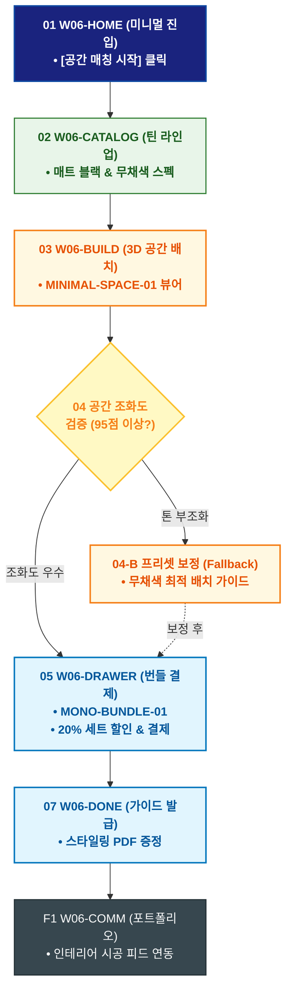

# 🔄 WICKETA 이도은 서비스 흐름도 [미니멀 인테리어 모노크롬 무채색 틴 & 글래스웨어 번들 구매]

> **프로젝트명**: WICKETA 미니멀 인테리어 & 캄테크 안식처 (Minimal Calm-Tech)  
> **분석 대상 클라이언트**: [`[가상클라이언트_06] 이도은_인테리어디자이너_미니멀캄테크.txt`](file:///C:/Users/user/Desktop/이지희%20에이전트/설계%20마저%20해오기/자동화/03_클라이언트/01_가상_클라이언트/[가상클라이언트_06] 이도은_인테리어디자이너_미니멀캄테크.txt)  
> **기준 사이트맵 문서**: [`C:\Users\SBS\Desktop\0819 이지희\한명씩 화면 설계도 진행\자동화\04_설계_및_스토리보드\03_사이트맵\06_이도은\사이트맵_목적1_캄테크번들.md`](file:///C:/Users/SBS/Desktop/0819%20%EC%9D%B4%EC%A7%80%ED%9D%AC/%ED%95%9C%EB%AA%85%EC%94%A9%20%ED%99%94%EB%A9%B4%20%EC%84%A4%EA%B3%84%EB%8F%84%20%EC%A7%84%ED%96%89/%EC%9E%90%EB%8F%99%ED%99%94/04_%EC%84%A4%EA%B3%84_%EB%B0%8F_%EC%8A%A4%ED%86%A0%EB%A6%AC%EB%B3%B4%EB%93%9C/03_%EC%82%AC%EC%9D%B4%ED%8A%B8%EB%A7%B5/06_이도은/사이트맵_목적1_캄테크번들.md)  
> **접속 목적**: 미니멀 인테리어 공간 매칭 3D 시뮬레이션 및 무채색 틴 번들 발주  
> **목적별 고유 킬러 기능**: **미니멀 3D 공간 뷰어 (`MINIMAL-SPACE-01`) & 모노크롬 번들 셀렉터 (`MONO-BUNDLE-01`)**  
> **작성일자**: 2026년 8월 19일  
> **작성자**: Antigravity UI/UX 설계팀  
> **문서 인코딩**: UTF-8 (유니코드)  

---

## 1. 목적별 핵심 서비스 흐름 개요

미니멀 인테리어 공간에 무채색 매트 틴과 글래스웨어를 3D로 가상 배치하여 공간 조화도를 검증하고, 모노크롬 번들을 1초 만에 발주하는 인테리어 디자이너 여정

---

## 2. 목적 맞춤형 가변 여정 스테이지 (Dynamic Journey Stages)

### 🏛️ Stage 1: 모노크롬 인테리어 화보 탐색
- **01 미니멀 홈 진입 (`W06-HOME`)**: 무채색 미니멀 비주얼 캔버스 로딩 ➔ [공간 매칭 시작] 클릭
- **02 모노크롬 틴 라인업 확인 (`W06-CATALOG`)**: 매트 블랙 / 쿨 그레이 틴케이스(SEC-03, SEC-07) 스펙 확인

### 📐 Stage 2: 3D 미니멀 공간 배치 & 조화도 검증
- **03 3D 미니멀 공간 뷰어 실행 (`W06-BUILD`)**: MINIMAL-SPACE-01 가상 선반에 틴케이스 3D 드래그 배치
- **04 인테리어 조화도 검증 (`W06-BUILD`)**:
  - `{공간 톤앤매너 적합도?}`
  - `[우수 (95점 이상)]` ➔ MONO-BUNDLE-01 20% 세트 할인 적용
  - `[톤 부조화(Fallback)]` ➔ 무채색 최적 배치 가이드 자동 적용

### 🛒 Stage 3: Slide-out 1초 결제
- **05 번들 드로어 호출 (`W06-DRAWER`)**: 20% 할인 확인 ➔ 1-Click 간편결제
- **06 결제 승인 (`W06-DRAWER`)**: 주문 완료 및 익일 안전 배송 큐 등록

### 📖 Stage 4: 주문 완료 & 미니멀 인테리어 가이드
- **07 가이드북 발급 (`W06-DONE`)**: 이도은의 미니멀 인테리어 스타일링 PDF 증정
- **F1 공간 포트폴리오 연동 (`W06-COMM`)**: 인테리어 시공 사진 피드 연동

---

## 3. 단계별 명세표 (Flow Matrix Table)

| 단계 ID | 단계 명칭 | 사용자 행동 | 화면 접점 | 서비스/시스템 반응 | 매핑 요구사항 | 다음 진입 조건 |
| :---: | :--- | :--- | :--- | :--- | :--- | :--- |
| **01** | 미니멀 진입 | [공간 매칭 시작] 클릭 | `W06-HOME` | 미니멀 3D 캔버스 로딩 | `REQ-01 미니멀 기획` | 02 라인업 확인 |
| **02** | 라인업 확인 | 매트 블랙 틴 스펙 확인 | `W06-CATALOG` | 무채색 오브제 스펙 렌더링 | `REQ-05 상품 선택` | 03 3D 공간 배치 |
| **03** | 3D 공간 배치 | 가상 선반에 틴 배치 | `W06-BUILD` | MINIMAL-SPACE-01 3D 실시간 렌더링 | `REQ-02 3D 뷰어` | 04 조화도 검증 |
| **04-A** | [성공] 95점 획득 | 공간 조화도 확인 | `W06-BUILD` | 20% 번들 할인 뱃지 활성화 | `REQ-02 조화도 검증` | 05 번들 결제 |
| **04-B** | [예외] 톤 부조화 | 자동 정렬 탭 (Fallback) | `W06-BUILD` | 무채색 최적 배치 프리셋 자동 보정 | `예외 복구` | 05 번들 결제 |
| **05** | 번들 결제 | [번들 구매하기] 클릭 | `W06-DRAWER` | Slide-out Drawer 오픈, 20% 할인 | `REQ-06 번들 결제` | 06 결제 승인 |
| **06** | 결제 승인 | 카카오페이 1-Click 승인 | `W06-DRAWER` | 안전 포장 및 출고 지시 | `REQ-06 출고 지시` | 07 가이드 발급 |
| **07** | 가이드 발급 | 스타일링 가이드 확인 | `W06-DONE` | 미니멀 인테리어 PDF 발급 | `REQ-06 가이드 PDF` | F1 포트폴리오 |
| **F1** | 포트폴리오 | 인테리어 피드 확인 | `W06-COMM` | 공간 스타일링 커뮤니티 연동 | `사후 확산` | 여정 완료 |

---

## 4. 목적별 서비스 흐름도 다이어그램 (Mermaid)

---

## 5. 최종 품질 검토 및 연계 설계 문서

- [x] **고정 템플릿 탈피**: 목적별 특성에 맞춘 독자적 가변 스테이지 및 분기 조건 반영
- [x] **예외 상황(Fallback) 및 루프 완비**: 재고 부족, 결제 실패, 글자수 오류, 연속 출석 등의 분기/복구 파이프라인 수록
- [x] **연계 사이트맵**: [`사이트맵_목적1_캄테크번들.md`](file:///C:/Users/SBS/Desktop/0819%20%EC%9D%B4%EC%A7%80%ED%9D%AC/%ED%95%9C%EB%AA%85%EC%94%A9%20%ED%99%94%EB%A9%B4%20%EC%84%A4%EA%B3%84%EB%8F%84%20%EC%A7%84%ED%96%89/%EC%9E%90%EB%8F%99%ED%99%94/04_%EC%84%A4%EA%B3%84_%EB%B0%8F_%EC%8A%A4%ED%86%A0%EB%A6%AC%EB%B3%B4%EB%93%9C/03_%EC%82%AC%EC%9D%B4%ED%8A%B8%EB%A7%B5/06_이도은/사이트맵_목적1_캄테크번들.md)
