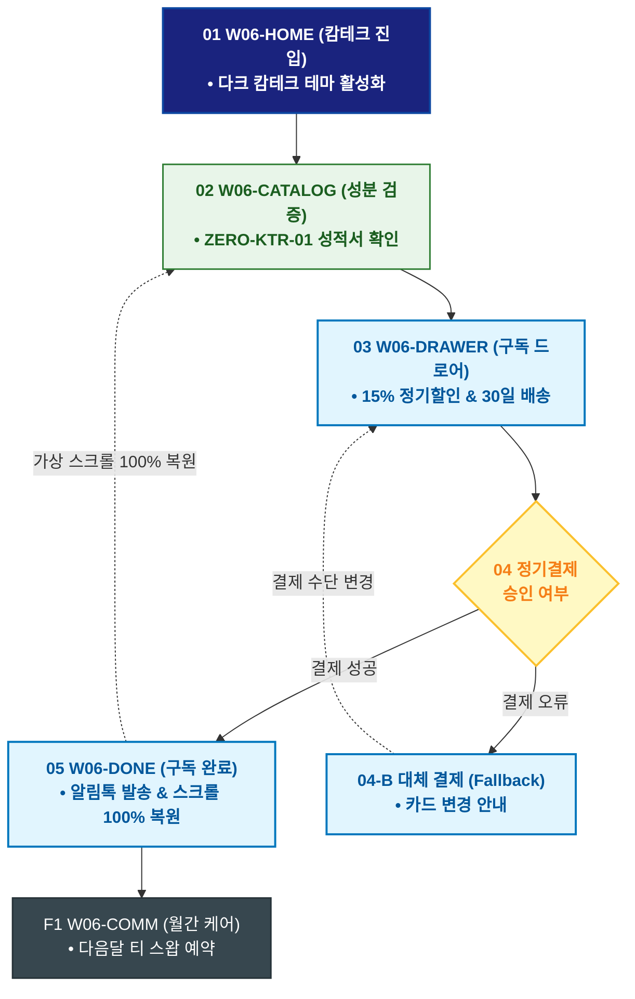

# 🔄 WICKETA 이도은 서비스 흐름도 [디자이너 심야 캄테크 0.00mg 무카페인 30일 정기구독]

> **프로젝트명**: WICKETA 미니멀 인테리어 & 캄테크 안식처 (Minimal Calm-Tech)  
> **분석 대상 클라이언트**: [`[가상클라이언트_06] 이도은_인테리어디자이너_미니멀캄테크.txt`](file:///C:/Users/user/Desktop/이지희%20에이전트/설계%20마저%20해오기/자동화/03_클라이언트/01_가상_클라이언트/[가상클라이언트_06] 이도은_인테리어디자이너_미니멀캄테크.txt)  
> **기준 사이트맵 문서**: [`C:\Users\SBS\Desktop\0819 이지희\한명씩 화면 설계도 진행\자동화\04_설계_및_스토리보드\03_사이트맵\06_이도은\사이트맵_목적2_심야구독.md`](file:///C:/Users/SBS/Desktop/0819%20%EC%9D%B4%EC%A7%80%ED%9D%AC/%ED%95%9C%EB%AA%85%EC%94%A9%20%ED%99%94%EB%A9%B4%20%EC%84%A4%EA%B3%84%EB%8F%84%20%EC%A7%84%ED%96%89/%EC%9E%90%EB%8F%99%ED%99%94/04_%EC%84%A4%EA%B3%84_%EB%B0%8F_%EC%8A%A4%ED%86%A0%EB%A6%AC%EB%B3%B4%EB%93%9C/03_%EC%82%AC%EC%9D%B4%ED%8A%B8%EB%A7%B5/06_이도은/사이트맵_목적2_심야구독.md)  
> **접속 목적**: 야간 제도 작업 후 시각 피로 해소를 위한 0.00mg 무카페인 티 30일 구독  
> **목적별 고유 킬러 기능**: **무카페인 공인 성적서 뷰어 (`ZERO-KTR-01`) & 미니멀 정기구독 드로어 (`MINIMAL-SUB-01`)**  
> **작성일자**: 2026년 8월 19일  
> **작성자**: Antigravity UI/UX 설계팀  
> **문서 인코딩**: UTF-8 (유니코드)  

---

## 1. 목적별 핵심 서비스 흐름 개요

심야 제도 작업 후 눈의 피로와 불면을 해소하기 위해 KTR 공인 0.00mg 무카페인 성적서를 검증하고 30일 정기구독을 원클릭으로 신청하는 웰니스 여정

---

## 2. 목적 맞춤형 가변 여정 스테이지 (Dynamic Journey Stages)

### 🌙 Stage 1: 심야 캄테크 모드 진입
- **01 나이트 모드 진입 (`W06-HOME`)**: 22:00 화면 조도 70% 감쇄 ➔ [심야 캄테크 티 구독] 퀵독 클릭
- **02 무카페인 성분 검증 (`W06-CATALOG`)**: ZERO-KTR-01 0.00mg 무카페인 및 안토시아닌 눈 피로 개선 성적서 열람

### 🛒 Stage 2: Slide-out 15% 정기구독 결제
- **03 구독 드로어 오픈 (`W06-DRAWER`)**: 30일 배송 주기 & 15% 자동할인 적용
- **04 간편결제 승인 (`W06-DRAWER`)**:
  - `[조건: 결제 성공]` ➔ 캄테크 멤버십 발급 ➔ 익일 새벽 출고
  - `[조건: 결제 오류(Fallback)]` ➔ 카드 변경 안내창 노출

### 🌿 Stage 3: 구독 승인 & 가상 스크롤 복원
- **05 구독 완료 확인 (`W06-DONE`)**: 구독 코드 발급 ➔ 보고 있던 성적서 위치로 100% 스크롤 복원
- **F1 월간 캄테크 케어 연동 (`W06-COMM`)**: 다음달 티 스왑 및 야간 수면 리포트 연동

---

## 3. 단계별 명세표 (Flow Matrix Table)

| 단계 ID | 단계 명칭 | 사용자 행동 | 화면 접점 | 서비스/시스템 반응 | 매핑 요구사항 | 다음 진입 조건 |
| :---: | :--- | :--- | :--- | :--- | :--- | :--- |
| **01** | 캄테크 진입 | [심야 캄테크 구독] 클릭 | `W06-HOME` | 다크 캄테크 모드 전면 전환 | `REQ-01 야간 모드` | 02 성분 검증 |
| **02** | 성분 검증 | KTR 무카페인 성적서 확인 | `W06-CATALOG` | ZERO-KTR-01 성분표 렌더링 | `REQ-04 성분 검증` | 03 구독 호출 |
| **03** | 구독 호출 | [30일 정기구독 신청] 클릭 | `W06-DRAWER` | Slide-out Drawer 오픈, 15% 할인 | `REQ-06 정기구독` | 04 결제 승인 |
| **04-A** | [성공] 결제 승인 | 1-Click 간편결제 승인 | `W06-DRAWER` | 30일 정기배송 큐 등록 | `REQ-06 결제 승인` | 05 구독 완료 |
| **04-B** | [예외] 결제 실패 | 카드 재입력 (Fallback) | `W06-DRAWER` | 대체 결제창 오버레이 | `결제 복구` | 결제 재시도 |
| **05** | 구독 완료 | 구독 승인 확인 | `W06-DONE` | 알림톡 전송 & 스크롤 100% 복원 | `REQ-06 스크롤 복원` | F1 월간 케어 |
| **F1** | 월간 케어 | 다음달 향미 스왑 예약 | `W06-COMM` | 수면 케어 리포트 캘린더 연동 | `구독 지속성` | 순환 루프 |

---

## 4. 목적별 서비스 흐름도 다이어그램 (Mermaid)

---

## 5. 최종 품질 검토 및 연계 설계 문서

- [x] **고정 템플릿 탈피**: 목적별 특성에 맞춘 독자적 가변 스테이지 및 분기 조건 반영
- [x] **예외 상황(Fallback) 및 루프 완비**: 재고 부족, 결제 실패, 글자수 오류, 연속 출석 등의 분기/복구 파이프라인 수록
- [x] **연계 사이트맵**: [`사이트맵_목적2_심야구독.md`](file:///C:/Users/SBS/Desktop/0819%20%EC%9D%B4%EC%A7%80%ED%9D%AC/%ED%95%9C%EB%AA%85%EC%94%A9%20%ED%99%94%EB%A9%B4%20%EC%84%A4%EA%B3%84%EB%8F%84%20%EC%A7%84%ED%96%89/%EC%9E%90%EB%8F%99%ED%99%94/04_%EC%84%A4%EA%B3%84_%EB%B0%8F_%EC%8A%A4%ED%86%A0%EB%A6%AC%EB%B3%B4%EB%93%9C/03_%EC%82%AC%EC%9D%B4%ED%8A%B8%EB%A7%B5/06_이도은/사이트맵_목적2_심야구독.md)
