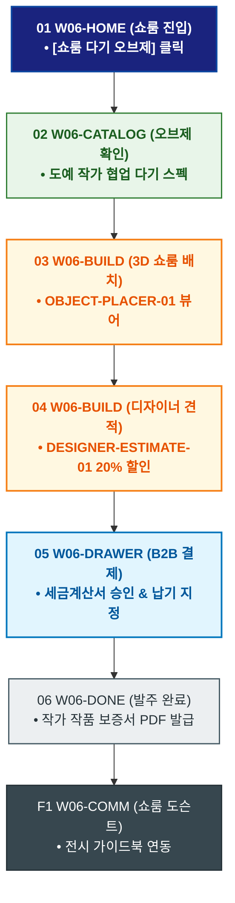

# 🔄 WICKETA 이도은 서비스 흐름도 [인테리어 디자이너 쇼룸 전용 다기 오브제 커스텀 주문]

> **프로젝트명**: WICKETA 미니멀 인테리어 & 캄테크 안식처 (Minimal Calm-Tech)  
> **분석 대상 클라이언트**: [`[가상클라이언트_06] 이도은_인테리어디자이너_미니멀캄테크.txt`](file:///C:/Users/user/Desktop/이지희%20에이전트/설계%20마저%20해오기/자동화/03_클라이언트/01_가상_클라이언트/[가상클라이언트_06] 이도은_인테리어디자이너_미니멀캄테크.txt)  
> **기준 사이트맵 문서**: [`C:\Users\SBS\Desktop\0819 이지희\한명씩 화면 설계도 진행\자동화\04_설계_및_스토리보드\03_사이트맵\06_이도은\사이트맵_목적5_데스크셋업.md`](file:///C:/Users/SBS/Desktop/0819%20%EC%9D%B4%EC%A7%80%ED%9D%AC/%ED%95%9C%EB%AA%85%EC%94%A9%20%ED%99%94%EB%A9%B4%20%EC%84%A4%EA%B3%84%EB%8F%84%20%EC%A7%84%ED%96%89/%EC%9E%90%EB%8F%99%ED%99%94/04_%EC%84%A4%EA%B3%84_%EB%B0%8F_%EC%8A%A4%ED%86%A0%EB%A6%AC%EB%B3%B4%EB%93%9C/03_%EC%82%AC%EC%9D%B4%ED%8A%B8%EB%A7%B5/06_이도은/사이트맵_목적5_데스크셋업.md)  
> **접속 목적**: 쇼룸 전시용 미니멀 다기 오브제 3D 배치 및 B2B 견적 발주  
> **목적별 고유 킬러 기능**: **쇼룸 3D 오브제 배치기 (`OBJECT-PLACER-01`) & 디자이너 B2B 견적기 (`DESIGNER-ESTIMATE-01`)**  
> **작성일자**: 2026년 8월 19일  
> **작성자**: Antigravity UI/UX 설계팀  
> **문서 인코딩**: UTF-8 (유니코드)  

---

## 1. 목적별 핵심 서비스 흐름 개요

인테리어 쇼룸 및 클라이언트 미팅 룸에 비치할 최고급 무채색 다기 오브제를 3D로 배치해보고, 디자이너 전용 B2B 할인 견적을 발주하는 전문 프로젝트 여정

---

## 2. 목적 맞춤형 가변 여정 스테이지 (Dynamic Journey Stages)

### 🏛️ Stage 1: 쇼룸 다기 오브제 쇼케이스 탐색
- **01 쇼룸 포털 진입 (`W06-HOME`)**: [쇼룸 전용 다기 오브제] 클릭 ➔ 오브제 갤러리 로딩
- **02 한정판 무채색 다기 스펙 확인 (`W06-CATALOG`)**: 도예 작가 협업 무광 블랙 다기 및 티 트레이 스펙 검토

### 📐 Stage 2: 3D 쇼룸 배치 & 견적 산출
- **03 3D 쇼룸 오브제 배치 (`W06-BUILD`)**: OBJECT-PLACER-01 쇼룸 테이블에 다기 세트 3D 배치
- **04 디자이너 B2B 단가 검증 (`W06-BUILD`)**:
  - DESIGNER-ESTIMATE-01 디자이너 회원 인증 ➔ `{20% B2B 특별 할인 적용 여부?}`

### 🛒 Stage 3: B2B 결제 및 시공 일정 지정
- **05 주문 드로어 호출 (`W06-DRAWER`)**: 할인 견적 확인 ➔ 세금계산서 승인 ➔ 법인 결제
- **06 쇼룸 오픈 일정 납기 지정 (`W06-DRAWER`)**: 지정일 특급 배송 예약

### 📜 Stage 4: 발주 완료 & 작품 보증서
- **07 발주 승인 및 보증서 발급 (`W06-DONE`)**: 도예 작가 작품 보증서 PDF 발급
- **F1 쇼룸 전시 가이드 연동 (`W06-COMM`)**: 쇼룸 전시 도슨트 안내서 다운로드

---

## 3. 단계별 명세표 (Flow Matrix Table)

| 단계 ID | 단계 명칭 | 사용자 행동 | 화면 접점 | 서비스/시스템 반응 | 매핑 요구사항 | 다음 진입 조건 |
| :---: | :--- | :--- | :--- | :--- | :--- | :--- |
| **01** | 쇼룸 진입 | [쇼룸 다기 오브제] 클릭 | `W06-HOME` | 쇼룸 오브제 쇼케이스 노출 | `REQ-05 쇼룸 기획` | 02 오브제 확인 |
| **02** | 오브제 확인 | 도예 작가 다기 스펙 확인 | `W06-CATALOG` | 작가 협업 한정판 스펙 노출 | `REQ-05 상품 스펙` | 03 3D 배치 |
| **03** | 3D 배치 | 쇼룸 가상 테이블에 배치 | `W06-BUILD` | OBJECT-PLACER-01 3D 실시간 렌더링 | `REQ-02 3D 배치기` | 04 견적 검증 |
| **04** | 견적 검증 | 디자이너 회원 인증 | `W06-BUILD` | DESIGNER-ESTIMATE-01 20% 할인 산출 | `REQ-06 B2B 견적` | 05 주문 드로어 |
| **05** | 주문 드로어 | 법인 세금계산서 결제 승인 | `W06-DRAWER` | 납기 지정 및 발주 승인 완료 | `REQ-06 법인 결제` | 06 발주 완료 |
| **06** | 발주 완료 | 작품 보증서 확인 | `W06-DONE` | 도예 작가 공식 보증서 PDF 발급 | `REQ-06 작품 보증서` | F1 쇼룸 도슨트 |
| **F1** | 쇼룸 도슨트 | 쇼룸 전시 가이드 확인 | `W06-COMM` | 쇼룸 전시 도슨트 PDF 연동 | `파트너십 지속` | 여정 완료 |

---

## 4. 목적별 서비스 흐름도 다이어그램 (Mermaid)

---

## 5. 최종 품질 검토 및 연계 설계 문서

- [x] **고정 템플릿 탈피**: 목적별 특성에 맞춘 독자적 가변 스테이지 및 분기 조건 반영
- [x] **예외 상황(Fallback) 및 루프 완비**: 재고 부족, 결제 실패, 글자수 오류, 연속 출석 등의 분기/복구 파이프라인 수록
- [x] **연계 사이트맵**: [`사이트맵_목적5_데스크셋업.md`](file:///C:/Users/SBS/Desktop/0819%20%EC%9D%B4%EC%A7%80%ED%9D%AC/%ED%95%9C%EB%AA%85%EC%94%A9%20%ED%99%94%EB%A9%B4%20%EC%84%A4%EA%B3%84%EB%8F%84%20%EC%A7%84%ED%96%89/%EC%9E%90%EB%8F%99%ED%99%94/04_%EC%84%A4%EA%B3%84_%EB%B0%8F_%EC%8A%A4%ED%86%A0%EB%A6%AC%EB%B3%B4%EB%93%9C/03_%EC%82%AC%EC%9D%B4%ED%8A%B8%EB%A7%B5/06_이도은/사이트맵_목적5_데스크셋업.md)
