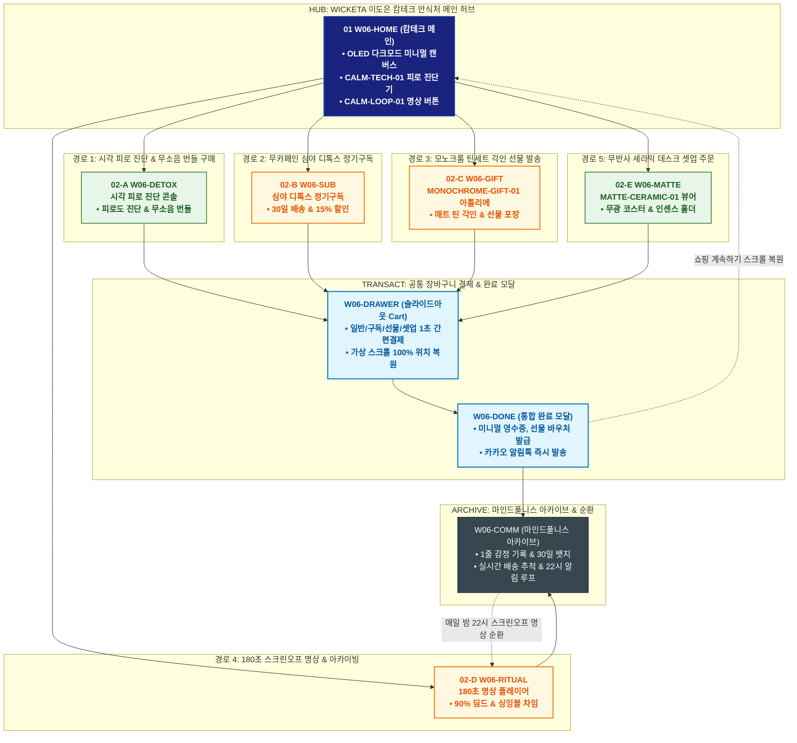

# 🔄 WICKETA 이도은 통합 서비스 흐름도 (Master Integrated Service Flow)

> **프로젝트명**: WICKETA 미니멀 캄테크 안식처 플랫폼 (이도은 캄테크 안식처 마스터)  
> **분석 대상 클라이언트**: [`[가상클라이언트_06] 이도은_UIUX디자이너_비밀안식처.txt`](file:///C:/Users/user/Desktop/이지희%20에이전트/설계%20마저%20해오기/자동화/03_클라이언트/01_가상_클라이언트/[가상클라이언트_06]%20이도은_UIUX디자이너_비밀안식처.txt)  
> **기준 사이트맵 문서**: [`C:\Users\user\Desktop\이지희 에이전트\설계 마저 해오기\자동화\04_설계_및_스토리보드\03_사이트맵\06_이도은\사이트맵.md`](file:///C:/Users/user/Desktop/이지희%20에이전트/설계%20마저%20해오기/자동화/04_설계_및_스토리보드/03_사이트맵/06_이도은/사이트맵.md)  
> **기준 클라이언트 분석서**: [`[클라이언트06]_이도은_UIUX디자이너_비밀안식처.md`](file:///C:/Users/user/Desktop/이지희%20에이전트/설계%20마저%20해오기/자동화/03_클라이언트/02_클라이언트_분석/[클라이언트06]_이도은_UIUX디자이너_비밀안식처.md)  
> **적용 레이아웃 아키타입**: `F-1 미니멀 캄테크 디톡스형 (Calm-Tech Sanctuary)`  
> **통합 핵심 킬러 기능**: **시각 피로 3초 진단기 (`CALM-TECH-01`) & 180초 스크린오프 명상 플레이어 (`CALM-LOOP-01`) & 무광 세라믹 데스크 셋업 뷰어 (`MATTE-CERAMIC-01`) & 심야 뇌파 안정 티 정기배송 (`NIGHT-DETOX-01`) & 모노크롬 틴케이스 레이저 각인기 (`MONOCHROME-GIFT-01`)**  
> **작성일자**: 2026년 8월 19일  
> **작성자**: Antigravity UI/UX 총괄 설계팀  
> **문서 인코딩**: UTF-8 (유니코드)  

---

## 1. 5대 목적별 서비스 흐름 비교 및 요구사항 통합 분석

본 문서는 이도은 클라이언트의 **5대 독립적 서비스 이용 목적(시각 피로 진단 & 무소음 글래스 번들 구매, 무카페인 뇌파 안정 티 30일 정기배송, 동료 디자이너를 위한 모노크롬 틴세트 각인 선물, 180초 스크린오프 명상 & 데일리 감정 아카이빙, 다크모드 무반사 세라믹 코스터 & 인센스 스틱 주문)**을 종합 분석하여, **중복 화면을 단일 화면 허브로 통합**하고 **고유 목적별 경로(User Journey Path)와 핵심 요구사항을 누락 없이 체계화한 마스터 서비스 흐름도**입니다.

### 1.1 공통 요구사항 vs 클라이언트 고유 요구사항 분석표

| 구분 | 공통 요구사항 (Common Baseline) | 클라이언트 고유 요구사항 (Unique Specialization) | 최종 통합 서비스 적용 방안 |
| :--- | :--- | :--- | :--- |
| **메인 진입 & 캄테크 환경** | • 비주얼 캔버스<br/>• 3초 앰비언트 사운드<br/>• GNB/LNB 전역 내비게이션 | • **`CALM-TECH-01`**: 3초 시각 피로도 진단 콘솔 & 무자극 OLED 다크모드<br/>• 스크린오프 명상 진입 퀵독 | `W06-HOME`을 무자극 캄테크 허브로 구성하고, 상단에 피로 진단기와 180초 타이머를 상시 배치 |
| **디톡스 & 명상 루프** | • 브루잉 가이드 및 타이머<br/>• 출석 포인트 적립 | • **`CALM-LOOP-01`**: 화면 90% 딤드 & 싱잉볼 차임벨 180초 명상 플레이어<br/>• **`NIGHT-DETOX-01`**: L-테아닌 함유 무카페인 심야 티 30일 정기구독 | `W06-DETOX` 및 `W06-RITUAL`에서 명상 및 심야 디톡스 정기배송 파이프라인 구축 |
| **데스크 셋업 & 커스텀** | • 제품 상세 및 옵션 선택<br/>• 모바일 선물 카드 발급 | • **`MATTE-CERAMIC-01`**: 무반사 매트 블랙/그레이 세라믹 코스터 & 인센스 3D 뷰어<br/>• **`MONOCHROME-GIFT-01`**: 모노크롬 틴케이스 미니멀 폰트 레이저 각인 | `W06-MATTE` 및 `W06-GIFT` 아틀리에에서 무광 셋업 및 모노크롬 각인 선물 처리 |
| **아카이브 & 사후 관리** | • 주문 내역 및 배송 조회 | • 마인드풀니스 감정 일기 아카이브 & 30일 명상 스탬프 뱃지<br/>• 매일 밤 22:00 스크린오프 리마인더 푸시 루프 | `W06-COMM`에서 명상 기록과 매일 밤 디톡스 순환 알림 연계 |
| **장바구니 & 미니멀 결제** | • 장바구니 품목 관리<br/>• 모바일 주문 알림 | • **Slide-out Cart Drawer**: 페이지 무이탈 1-Click 미니멀 간편결제<br/>• **가상 스크롤 100% 위치 복원 엔진** | `W06-DRAWER` 단일 공통 드로어로 시각 피로 없이 1초 결제 처리 및 복원 |

### 1.2 5대 목적별 핵심 서비스 흐름 정의 (Use Cases 1~5)

본 통합 시스템에 완전하게 통합·반영된 5대 목적별 핵심 서비스 흐름 정의는 다음과 같습니다:

#### 📌 목적 1: 시각 피로 진단 & 무소음 글래스 번들 구매
본 서비스 흐름도는 **시각 자극 최소화 및 직관적 진단 기반 캄테크 번들 구매**에 최적화된 미니멀 탐색형(`flowchart TD`) 구조로 설계되었습니다:

- **1. 시작 지점 (Starting Point)**: 다크모드 앰비언트 마인드 룸 유입 ➔ `W06-HOME` (마인드 룸 홈) & `W06-FATIGUE`
- **2. 핵심 행동 (Core Action)**: `BRAIN-REST-01` 간편 3문항 슬라이더(스크린 타임, 눈 피로도, 수면 질) 조절 ➔ 뇌 과부하 지수(82점) 산출 ➔ L-테아닌 뇌 휴식 티 + 충격 흡수 0dB 무소음 이중 글래스웨어 번들(15% 할인) 추천 확인
- **3. 전환 목표 (Conversion Goal)**: **[디지털 피로 해소 캄테크 번들 세트 원클릭 장바구니 담기 및 1초 결제]**
- **4. 필요한 기능 (Required Features)**: BRAIN-REST-01 실시간 피로도 진단 콘솔, 0dB 무소음 글래스웨어 3D 뷰어, 0.5px 미세 그리드 UI, 슬라이드아웃 Cart Drawer
- **5. 예외 상황 (Edge Cases & Fallbacks)**: 품절 시 동일 테아닌 함량의 대체 허브 티 자동 추천(`EXP-03`), 구형 브라우저 감지 시 자동 다크모드 에뮬레이션(`EXP-02`)
- **6. 완료 결과 (Completed State)**: 결제 완료 및 저자극 안식 가이드북 PDF 발급, 모바일 영수증 발송, 화면 밝기 50% 딤드 유지

---

#### 📌 목적 2: 무카페인 뇌파 안정 티 30일 정기배송 신청
본 서비스 흐름도는 **야근 후 피로한 디자이너를 위한 불필요한 단계 없는 초고속 직렬 정기배송 체결**에 최적화된 가로 직렬형(`flowchart LR`) 구조로 설계되었습니다:

- **1. 시작 지점 (Starting Point)**: 심야 11시 디톡스 푸시 알림 또는 안식처 홈 유입 ➔ `W06-HOME` & `W06-TEA` (마인드 정기구독)
- **2. 핵심 행동 (Core Action)**: 무자극 GABA 슬립 & 테아닌 블렌드 30포 팩 선택 ➔ 0.00% 무카페인 SGS/KTR 시험성적서 확인 ➔ 30일 배송 주기 및 20% 정기 할인율 확인
- **3. 전환 목표 (Conversion Goal)**: **[심야 디톡스 무카페인 티 30일 정기구독 체결 완료]**
- **4. 필요한 기능 (Required Features)**: MIND-SUB-01 미니멀 구독 시뮬레이터, 0.00% 무카페인 공인 시험성적서 PDF 다운로더, 1-Click 간편 정기결제 모듈
- **5. 예외 상황 (Edge Cases & Fallbacks)**: 카드 갱신 필요 시 결제 3일 전 저자극 텍스트 알림톡 발송 및 간편 변경 지원
- **6. 완료 결과 (Completed State)**: 정기구독 등록 완료, 매월 1일 안심 배송 스케줄 확정, 월간 뇌 휴식 리포트 PDF 즉시 수령

---

#### 📌 목적 3: 동료 디자이너를 위한 모노크롬 틴세트 각인
본 서비스 흐름도는 **디자이너 감성의 미니멀 패키징 및 3D 타이포 각인 선물하기**에 최적화된 비스포크 선물 4단형(`flowchart TD`) 구조로 설계되었습니다:

- **1. 시작 지점 (Starting Point)**: 미니멀 룩북 또는 선물 큐레이션 유입 ➔ `W06-MATTE` (무광 매트 다기 빌더) & `W06-TEA`
- **2. 핵심 행동 (Core Action)**: 샌드 블랙 모노크롬 틴케이스 선택 ➔ 동료 디자이너 영문 이니셜(예: `D.E. LEE`) 입력 및 8pt 그리드 타이포 3D 레이저 각인 시뮬레이션 ➔ 무소음 패브릭 파우치 및 미니멀 메시지 카드 작성
- **3. 전환 목표 (Conversion Goal)**: **[디자이너 맞춤 모노크롬 각인 틴세트 카카오톡 선물하기 결제]**
- **4. 필요한 기능 (Required Features)**: MONO-GIFT-01 그리드 타이포 3D 각인 시뮬레이터, 미니멀 메시지 카드 에디터, 카카오톡 선물하기 API 연동 모듈, 슬라이드아웃 Cart 결제
- **5. 예외 상황 (Edge Cases & Fallbacks)**: 이니셜 글자수 초과 시 자동 폰트 크기 비례 축소 모듈 작동
- **6. 완료 결과 (Completed State)**: 카카오톡 선물 메시지 발송 완료, 3D 각인 모바일 안식 보증서 발급, 배송지 입력 대기 상태 전환

---

#### 📌 목적 4: 180초 안식 의식 실행 & 데일리 감정 아카이빙
본 서비스 흐름도는 **화면을 끈 상태에서의 뇌파 휴식 및 1줄 감정 기록 순환 루프(`flowchart TD` + Loop `-.->`)** 구조로 설계되었습니다:

- **1. 시작 지점 (Starting Point)**: 나이트 디톡스 알림 또는 하단 독 플레이어 ➔ `W06-DETOX` (180초 디톡스 플레이어) & `W06-HOME`
- **2. 핵심 행동 (Core Action)**: 원터치 스크린오프 모드(화면 암전) 활성화 ➔ 432Hz 세타파 앰비언트 사운드스케이프 180초 청취 ➔ 180초 종료 햅틱 진동 수신 ➔ 오늘 하루의 감정을 1줄 텍스트(예: "눈이 편안해진 밤")로 기록
- **3. 전환 목표 (Conversion Goal)**: **[180초 스크린 프리 안식 의식 완결 및 데일리 마인드 로그 캘린더 저장]**
- **4. 필요한 기능 (Required Features)**: CALM-LOOP-01 180초 스크린오프 타이머 엔진, 432Hz 무손실 앰비언트 오디오 플레이어, 1줄 마인드 저널 아카이빙 DB, 내일 밤 10시 알림 순환 스케줄러
- **5. 예외 상황 (Edge Cases & Fallbacks)**: 타이머 중간 이탈 시 현재까지의 힐링 시간 자동 저장 및 완만한 페이드아웃 적용
- **6. 완료 결과 (Completed State)**: 마인드 로그 캘린더 스탬프 획득, 뇌파 안정 완료 알림, **다음 날 밤 10시 정기 알림 순환 루프 진입**

---

#### 📌 목적 5: 다크모드 무반사 세라믹 코스터 & 스틱 세트 주문
본 서비스 흐름도는 **작업 공간의 시각적 노이즈를 제거하는 무반사 데스크 셋업 및 다기 풀패키지 발주**에 최적화된 데스크 셋업 스테이지형(`flowchart TD`) 구조로 설계되었습니다:

- **1. 시작 지점 (Starting Point)**: 데스크 테리어 매거진 룩북 유입 ➔ `W06-MATTE` (무광 매트 다기 빌더) & `W06-HOME`
- **2. 핵심 행동 (Core Action)**: 빛 반사 0% 무광 샌드 세라믹 코스터 선택 ➔ 모니터 조명 대비 눈부심 방지 3D 시뮬레이션 확인 ➔ 미니멀 아노다이징 스틱 오거나이저 세트 추가 ➔ 15% 데스크 셋업 번들 할인 적용
- **3. 전환 목표 (Conversion Goal)**: **[미니멀 무반사 다크모드 데스크 셋업 풀패키지 발주 완료]**
- **4. 필요한 기능 (Required Features)**: MATTE-DESK-01 무반사 3D 렌더링 시뮬레이터, 데스크 오거나이저 번들 빌더 모듈, 슬라이드아웃 Cart 결제
- **5. 예외 상황 (Edge Cases & Fallbacks)**: 코스터 특정 컬러 품절 시 다크 차콜 컬러 무상 대체 제안(`EXP-03`)
- **6. 완료 결과 (Completed State)**: 결제 완료 및 안전 에어캡 포장 출고표 발급, 미니멀 데스크 테리어 가이드북 PDF 즉시 다운로드

---

---

## 2. 통합 화면 아키텍처 및 중복 화면 통합 매핑

본 설계에서는 5대 목적별 산출물에 분산되어 있던 중복 화면들을 **9개의 핵심 화면 노드(Node)**로 통합 정리하였습니다.

```text
[WICKETA 이도은 통합 서비스 화면 매핑 구조]
├── 🌑 W06-HOME (미니멀 캄테크 안식처 메인 허브)
│   ├── HERO-01: OLED 다크모드 무자극 미니멀 캔버스
│   ├── CALM-TECH-01: 시각 피로 3초 진단기 퀵독
│   ├── CALM-LOOP-01: 180초 스크린오프 명상 진입 버튼
│   └── 5대 목적 진입 라우터 (GNB / Quick Dock)
│
├── 🧘 W06-DETOX (시각 피로 진단 & 캄테크 번들 콘솔)
│   ├── 블루라이트 노출도 및 시각 피로도 3초 자가 진단
│   └── 무소음 이중 진공 글래스 & L-테아닌 캄 번들 원클릭 담기
│
├── 🖤 W06-MATTE (무광 세라믹 데스크 셋업 뷰어)
│   ├── MATTE-CERAMIC-01: 무반사 매트 블랙 코스터 & 인센스 홀더 3D 시뮬레이션
│   └── 디자이너 데스크셋업 최적화 무광 마감 및 10% 세트 할인
│
├── 🎁 W06-GIFT (모노크롬 기프트 아틀리에)
│   ├── MONOCHROME-GIFT-01: 모노크롬 매트 틴케이스 미니멀 폰트 레이저 각인
│   └── 디자이너 축하 캘리그래피 카드 & 카카오톡 선물하기
│
├── 🌙 W06-SUB (심야 디톡스 정기구독 콘솔)
│   ├── NIGHT-DETOX-01: 무카페인 심야 뇌파 안정 티 30일 자동 배송
│   └── 15% 정기구독 할인 & 매월 인센스 스틱 증정
│
├── ⏱️ W06-RITUAL (180초 스크린오프 명상 플레이어)
│   ├── 화면 90% 딤드 & 432Hz 사운드스케이프 스트리밍
│   └── 180초 원형 호흡 가이드 & 싱잉볼 차임벨 알림
│
├── 🛒 W06-DRAWER (슬라이드아웃 통합 장바구니 드로어) [공통 레이어]
│   ├── 일반 / 15% 정기구독 / 카카오 선물 / 데스크셋업 1초 결제
│   └── 가상 스크롤 100% 위치 복원 엔진 (Scroll Restoration)
│
├── 🎉 W06-DONE (통합 완료 모달)
│   └── 미니멀 영수증, 모바일 기프트 카드 발급 & 카카오 알림톡
│
└── 🗂️ W06-COMM (마인드풀니스 아카이브 & 순환 루프)
    ├── 1줄 감정 기록 & 30일 명상 챌린지 뱃지 보드
    ├── 실시간 선물 배송 추적 & 매일 밤 22:00 디톡스 알림 루프
    └── 주간 캄테크 웰니스 리포트
```

---

## 3. 5대 통합 사용자 여정 경로 (User Journey Paths)

통합 시스템은 사용자의 진입 목적에 따라 5개의 상호 배타적이면서도 유기적으로 연계된 경로를 제공합니다:

```text
[경로 1: 시각 피로 3초 진단 & 무소음 글래스 번들 구매]
W06-HOME ➔ W06-DETOX (피로 진단 & 번들 선택) ➔ W06-DRAWER (1초 결제) ➔ W06-DONE (주문 완료) ➔ W06-COMM (사용 가이드)

[경로 2: 무카페인 뇌파 안정 심야 티 30일 정기구독]
W06-HOME ➔ W06-SUB (NIGHT-DETOX-01 30일 구독 선택) ➔ W06-DRAWER (15% 구독 할인 결제) ➔ W06-DONE (구독 승인 & 스크롤 복원) ➔ W06-COMM (월간 리포트)

[경로 3: 동료 디자이너용 모노크롬 틴세트 각인 선물 발송]
W06-HOME ➔ W06-GIFT (MONOCHROME-GIFT-01 각인 & 카드 작성) ➔ W06-DRAWER (카카오 선물 결제) ➔ W06-DONE (모바일 카드) ➔ W06-COMM (배송 추적)

[경로 4: 180초 스크린오프 명상 실행 & 데일리 감정 아카이빙]
W06-RITUAL (화면 90% 딤드 + 180초 호흡) ➔ 싱잉볼 완료 차임 ➔ W06-COMM (1줄 감정 기록 + 30일 뱃지) ➔ 매일 밤 22:00 알림 ➔ W06-RITUAL (내일 밤 순환)

[경로 5: 다크모드 무반사 매트 세라믹 코스터 & 스틱 주문]
W06-HOME ➔ W06-MATTE (MATTE-CERAMIC-01 셋업 선택) ➔ W06-DRAWER (간편결제) ➔ W06-DONE (주문 완료) ➔ W06-COMM (데스크셋업 가이드)
```

### 3.1 5대 경로별 페이즈(Phase 1~4) 상세 진행 흐름

#### 🔹 [경로 1] 목적 1: 시각 피로 진단 & 무소음 글래스 번들 구매
### 🟢 Phase 1: CALM DIAGNOSIS · 뇌 피로도 및 과부하 진단
- **01 마인드 룸 진입 (`W06-HOME`)**: 다크모드 스크린오프 캔버스 확인 / 메인 홈 접점 / BRAIN-REST-01 진단 콘솔 활성화
- **02 피로도 슬라이더 측정 (`W06-FATIGUE`)**: 3문항 피로도 슬라이더 조절 / 진단 모듈 접점 / 뇌 과부하 지수(82점) 및 맞춤 테아닌 처방 도출

### 🟡 Phase 2: CALM-TECH BUNDLE MATCH · 무소음 번들 매칭
- **03 저자극 테아닌 티 검토 (`W06-TEA`)**: L-테아닌 250mg 고함량 성적서 확인 / 티 도감 접점 / 0.00% 무카페인 KTR 안심 배지 확인
- **04 무소음 글래스웨어 번들링 (`W06-MATTE`)**: 바닥 실리콘 링 장착 0dB 무소음 잔 선택 / 다기 빌더 접점 / 15% 캄테크 번들 할인가 확정

### 🟢🟡 Phase 3: SEAMLESS CHECKOUT · 화면 전환 없는 간결 결제
- **05 Slide-out Cart 결제 (`W06-DRAWER`)**: 안식 장바구니 호출 및 1초 간편결제 / 슬라이드아웃 접점 / 시스템 결제 승인 및 스크롤 위치 유지
- **06 주문 완료 & 디톡스 티켓 (`W06-DONE`)**: 번들 주문 완료 확인 / Confirmation Modal 접점 / 웰컴 디톡스 가이드북 PDF 즉시 발급

### ⬛ Phase 4: NIGHT RITUAL LINK · 심야 디톡스 루틴 연계
- **F1 180초 디톡스 체험 연계 (`W06-DETOX`)**: 상품 배송 전 180초 스크린 프리 명상 체험 / 디톡스 플레이어 접점 / 저녁 10시 나이트 알림 등록

---

#### 🔹 [경로 2] 목적 2: 무카페인 뇌파 안정 티 30일 정기배송 신청
### 🟢 Phase 1: NIGHT INTAKE · 심야 안식처 및 티 선택
- **01 심야 안식처 진입 (`W06-HOME`)**: 딤드 앰비언트 모드 확인 / 심야 홈 접점 / MIND-SUB-01 구독 모듈 로딩
- **02 무자극 GABA 티 스펙 검토 (`W06-TEA`)**: GABA & 카모마일 포뮬러 성분표 확인 / 저자극 도감 접점 / 0.00% 디카페인 시험성적서 노출

### 🟡 Phase 2: PERIOD CONFIGURATION · 30일 주기 설정
- **03 30일 배송 주기 선택 (`W06-TEA`)**: 30일 정기배송 팩 선택 / 구독 주기 선택기 접점 / 20% 월간 정기 할인율 반영
- **04 구독 조건 확인 (`W06-DRAWER`)**: 월 결제 금액 및 무료 배송 혜택 확인 / 1-Page 안식 드로어 접점 / 1초 정기결제 버튼 활성화

### 🟢🟡 Phase 3: INSTANT AUTOPAY · 1초 정기결제
- **05 1초 정기결제 승인 (`W06-DRAWER`)**: 등록된 간편결제 1초 승인 / 슬라이드아웃 접점 / 시스템 정기배송 스케줄 자동 등록
- **06 구독 완료 & 리포트 발급 (`W06-DONE`)**: 정기구독 체결 확인 / Confirmation Modal 접점 / 월간 뇌 휴식 리포트 PDF 즉시 다운로드

### ⬛ Phase 4: SLEEP MONITORING · 수면 리포트 및 관리
- **F1 월간 수면 리포트 연계 (`W06-HOME`)**: 매월 배송 시 수면 개선 통계 제공 / 마인드 룸 접점 / 배송 주기 및 블렌드 간편 변경 지원

---

#### 🔹 [경로 3] 목적 3: 동료 디자이너를 위한 모노크롬 틴세트 각인
### 🟢 Phase 1: MATTE SELECTION · 모노크롬 틴케이스 선택
- **01 선물 도감 진입 (`W06-MATTE`)**: 모노크롬 기프트 라인업 확인 / 다기 빌더 접점 / MONO-GIFT-01 3D 각인 엔진 로딩
- **02 샌드 블랙 틴 선택 (`W06-MATTE`)**: 무광 매트 샌드 블랙 피니시 선택 / 소재 선택기 접점 / 미니멀 질감 및 L-테아닌 티 구성 확인

### 🟡 Phase 2: 3D GRID ENGRAVING · 그리드 타이포 각인
- **03 영문 이니셜 3D 각인 (`W06-MATTE`)**: 동료 이니셜 입력 / 3D 각인 캔버스 접점 / 8pt 모던 산세리프 음각 각인 360도 렌더링
- **04 무소음 파우치 & 카드 매칭 (`W06-MATTE`)**: 패브릭 파우치 및 1줄 감성 메시지 작성 / 메시지 에디터 접점 / 완성 선물 세트 뷰 확인

### 🟢🟡 Phase 3: KAKAO GIFT CHECKOUT · 카카오 선물 결제
- **05 카카오톡 선물하기 결제 (`W06-DRAWER`)**: 카카오페이 1초 결제 승인 / 안식 드로어 접점 / 시스템 선물 결제 및 알림톡 생성
- **06 선물 발송 완료 & 보증서 (`W06-DONE`)**: 카카오톡 선물 메시지 전송 확인 / Confirmation Modal 접점 / 3D 각인 모바일 보증서 발급

### ⬛ Phase 4: GIFT TRACKING · 선물 수령 및 배송 트래킹
- **F1 수령자 배송지 입력 안내 (`W06-HOME`)**: 동료 디자이너 배송지 입력 현황 확인 / 마인드 룸 접점 / 친환경 무소음 완충 배송 트래킹

---

#### 🔹 [경로 4] 목적 4: 180초 안식 의식 실행 & 데일리 감정 아카이빙
### 🟢 Phase 1: SCREEN-OFF INTAKE · 스크린오프 모드 활성화
- **01 디톡스 플레이어 진입 (`W06-DETOX`)**: 다크모드 암전 캔버스 확인 / 디톡스 접점 / CALM-LOOP-01 플레이어 로딩
- **02 스크린오프 & 432Hz 실행 (`W06-DETOX`)**: 원터치 화면 끄기 모드 실행 / 오디오 접점 / 432Hz 뇌파 안정 사운드스케이프 재생

### 🟡 Phase 2: 180S MEDITATION · 180초 무자극 뇌 휴식
- **03 180초 스크린 프리 청취 (`W06-DETOX`)**: 화면 암전 상태에서 180초 명상 / 타이머 엔진 접점 / 시각 자극 0% 뇌파 안정화 진행
- **04 종료 햅틱 진동 수신 (`W06-DETOX`)**: 180초 종료 부드러운 진동 알림 / 알림 모듈 접점 / 미니멀 1줄 마인드 저널 창 호출

### 🟢🟡 Phase 3: MIND LOG ARCHIVE · 1줄 감정 기록 및 저장
- **05 1줄 감정 텍스트 작성 (`W06-DETOX`)**: "복잡했던 생각이 비워진 밤" 입력 / 저널 입력 접점 / 마인드 아카이브 DB 즉시 저장
- **06 캘린더 스탬프 발급 (`W06-DONE`)**: 오늘자 마인드풀니스 스탬프 확인 / Confirmation Modal 접점 / 연속 7일 안식 달성 배지 발급

### ⬛ Phase 4: NIGHTLY LOOP · 다음 날 밤 10시 순환
- **F1 내일 밤 10시 디톡스 알림 (`W06-HOME`)**: 익일 취침 전 180초 타이머 예약 / 마인드 룸 접점 / **익일 밤 180초 명상으로 자동 순환 (`-.->`)**

---

#### 🔹 [경로 5] 목적 5: 다크모드 무반사 세라믹 코스터 & 스틱 세트 주문
### 🟢 Phase 1: DESK INTAKE · 무반사 데스크 룩북 탐색
- **01 데스크 셋업 진입 (`W06-MATTE`)**: 다크모드 데스크 테리어 룩북 확인 / 다기 빌더 접점 / MATTE-DESK-01 빌더 로딩
- **02 무반사 세라믹 코스터 검토 (`W06-MATTE`)**: 빛 반사율 0% 세라믹 질감 확인 / 3D 뷰어 접점 / 모니터 조명 반사 차단 렌더링 확인

### 🟡 Phase 2: ORGANIZER ASSEMBLY · 오거나이저 번들 조합
- **03 스틱 보관함 & 오거나이저 추가 (`W06-MATTE`)**: 아노다이징 알루미늄 스틱 케이스 선택 / 번들 빌더 접점 / 풀세트 조합 구성 확인
- **04 데스크 번들 15% 할인 확정 (`W06-MATTE`)**: 코스터 + 보관함 + 티 20포 번들 할인율 확인 / 견적 모듈 접점 / 할인 총액 확정 및 담기

### 🟢🟡 Phase 3: SEAMLESS CHECKOUT · 원클릭 주문 결제
- **05 Slide-out Cart 결제 (`W06-DRAWER`)**: 안식 장바구니에서 배송지 확인 및 간편결제 / 슬라이드아웃 접점 / 시스템 결제 즉시 승인
- **06 발주 완료 & 셋업 가이드 (`W06-DONE`)**: 데스크 셋업 패키지 주문 확인 / Confirmation Modal 접점 / 데스크 셋업 가이드 PDF 발급

### ⬛ Phase 4: WORKSPACE SUPPORT · 데스크 환경 가이드 연계
- **F1 데스크 셋업 팁 연계 (`W06-HOME`)**: 모니터 조명 배치 및 블루라이트 차단 팁 확인 / 마인드 룸 접점 / 디자이너 안식 커뮤니티 연결

---

---

## 4. 통합 단계별 상세 명세표 (Unified Flow Matrix Table)

본 테이블은 5대 목적별 모든 세부 단계(총 35개 스텝)를 화면 접점 및 사용자 행동/시스템 반응별로 통합 정리한 마스터 명세표입니다:

| 단계 ID | 경로 및 단계 명칭 | 사용자 행동 (User Action) | 화면 접점 (Screen Touchpoint) | 서비스 반응 (System Response) | 매핑 요구사항 | 다음 진입 조건 |
| :---: | :--- | :--- | :--- | :--- | :--- | :--- |
| **[경로 1]** | **--- 목적 1: 시각 피로 진단 & 무소음 글래스 번들 구매 ---** | | | | | |
| **01** | 마인드 룸 진입 | 다크모드 앰비언트 화면 확인 | `W06-HOME` | BRAIN-REST-01 콘솔 및 딤드 조명 로딩 | `REQ-01 다크모드` | 02 피로도 측정 |
| **02** | 피로도 측정 | 3문항 슬라이더 조절 | `W06-FATIGUE` | 뇌 과부하 82점 산출 및 맞춤 티 처방 | `REQ-01 피로도 진단` | 03 테아닌 검토 |
| **03** | 테아닌 티 검토 | L-테아닌 250mg 스펙 확인 | `W06-TEA` | 0.00% 무카페인 KTR 공인 성적서 노출 | `REQ-03 무카페인` | 04 무소음 번들링 |
| **04** | 무소음 번들링 | 0dB 무소음 글래스웨어 추가 | `W06-MATTE` | 번들 15% 할인 적용 및 3D 뷰어 렌더링 | `REQ-02 무소음 다기` | 05 간결 결제 |
| **05** | 간결 결제 | Cart Drawer에서 원클릭 결제 | `W06-DRAWER` | 시스템 간편결제 승인 및 스크롤 유지 | `REQ-06 안식 드로어` | 06 주문 완료 |
| **06** | 주문 완료 & 티켓 | 주문 확인 및 디톡스 가이드 수령 | `W06-DONE` | 출고 바우처 및 캄테크 가이드북 PDF 발급 | `REQ-04 안식 보증` | F1 디톡스 연계 |
| **F1** | 디톡스 루틴 연계 | 180초 스크린 프리 타이머 체험 | `W06-DETOX` | 432Hz 뇌파 음향 플레이어 즉시 구동 | `안식 루틴 지속` | 여정 완료 |
| **[경로 2]** | **--- 목적 2: 무카페인 뇌파 안정 티 30일 정기배송 신청 ---** | | | | | |
| **01** | 심야 안식처 진입 | 심야 딤드 모드 확인 | `W06-HOME` | MIND-SUB-01 정기구독 캔버스 로딩 | `REQ-01 저자극 홈` | 02 스펙 검토 |
| **02** | GABA 티 스펙 검토 | 무카페인 GABA 포뮬러 확인 | `W06-TEA` | SGS 공인 0.00% 무카페인 성적서 노출 | `REQ-03 0.00% 디카페인` | 03 주기 설정 |
| **03** | 30일 주기 설정 | 30일 주기 선택 및 할인 확인 | `W06-TEA` | 20% 정기 할인 총액 계산 및 반영 | `REQ-04 정기구독 할인` | 04 조건 확인 |
| **04** | 조건 확인 | 월 결제금액 및 배송일 확인 | `W06-DRAWER` | Slide-out Cart에서 정기구독 폼 호출 | `REQ-06 슬라이드아웃 Cart` | 05 1초 결제 |
| **05** | 1초 정기결제 | 간편결제 1초 원터치 승인 | `W06-DRAWER` | 시스템 구독 계약 체결 및 배송일 확정 | `REQ-06 1초 결제` | 06 구독 완료 |
| **06** | 구독 완료 & 리포트 | 구독 완료 및 리포트 수령 | `W06-DONE` | 월간 뇌 휴식 가이드북 PDF 발급 | `REQ-04 수면 리포트` | F1 수면 관리 |
| **F1** | 수면 리포트 연계 | 수면 개선 통계 및 주기 관리 | `W06-HOME` | 마인드 룸에서 배송 주기 원클릭 변경 제공 | `안식 루틴 지속` | 여정 완료 |
| **[경로 3]** | **--- 목적 3: 동료 디자이너를 위한 모노크롬 틴세트 각인 ---** | | | | | |
| **01** | 선물 도감 진입 | 모노크롬 기프트 룩북 확인 | `W06-MATTE` | MONO-GIFT-01 3D 엔진 및 캔버스 로딩 | `REQ-02 모노크롬 틴` | 02 피니시 선택 |
| **02** | 피니시 선택 | 샌드 블랙 무광 틴케이스 선택 | `W06-MATTE` | 무광 텍스처 렌더링 및 티 구성 노출 | `REQ-02 무광 샌드블랙` | 03 3D 각인 |
| **03** | 3D 타이포 각인 | 영문 이니셜 입력 및 각인 | `W06-MATTE` | 360도 그리드 타이포 음각 실시간 렌더링 | `REQ-02 그리드 타이포` | 04 파우치 매칭 |
| **04** | 파우치 & 메시지 | 패브릭 파우치 선택 및 카드 작성 | `W06-MATTE` | 무소음 패키징 및 감성 메시지 렌더링 | `REQ-02 무소음 패키징` | 05 카카오 결제 |
| **05** | 카카오 선물 결제 | 카카오페이 1초 결제 승인 | `W06-DRAWER` | 시스템 선물 결제 승인 및 알림톡 생성 | `REQ-06 카카오 선물` | 06 발송 완료 |
| **06** | 선물 발송 완료 | 카카오톡 메시지 전송 확인 | `W06-DONE` | 모바일 3D 각인 안식 보증서 발급 | `REQ-04 모바일 보증서` | F1 배송 트래킹 |
| **F1** | 배송 상태 확인 | 수령자 배송지 입력 상태 확인 | `W06-HOME` | 친환경 무소음 출고 트래킹 정보 제공 | `선물 가치 지속` | 여정 완료 |
| **[경로 4]** | **--- 목적 4: 180초 안식 의식 실행 & 데일리 감정 아카이빙 ---** | | | | | |
| **01** | 플레이어 진입 | 180초 디톡스 배너 선택 | `W06-DETOX` | CALM-LOOP-01 다크모드 콘솔 로딩 | `REQ-01 스크린오프` | 02 스크린오프 실행 |
| **02** | 스크린오프 실행 | 화면 끄기 모드 원터치 클릭 | `W06-DETOX` | 화면 암전 및 432Hz 음향 스트리밍 시작 | `REQ-01 432Hz 사운드` | 03 180초 명상 |
| **03** | 180초 명상 | 화면 암전 상태에서 180초 뇌 휴식 | `W06-DETOX` | 시각 자극 차단 및 세타파 유도 음향 출력 | `REQ-01 180초 타이머` | 04 햅틱 진동 |
| **04** | 햅틱 진동 수신 | 종료 진동 확인 후 화면 터치 | `W06-DETOX` | 저자극 1줄 마인드 저널 입력 모달 로딩 | `REQ-05 감정 아카이브` | 05 1줄 기록 |
| **05** | 1줄 감정 기록 | 오늘 하루 감정 1줄 입력 및 완료 | `W06-DETOX` | 마인드 아카이브 DB 저장 및 캘린더 반영 | `REQ-05 데일리 기록` | 06 스탬프 발급 |
| **06** | 스탬프 발급 | 캘린더 스탬프 및 배지 확인 | `W06-DONE` | 7일 연속 안식 달성 15% 쿠폰 지급 | `REQ-05 안식 리워드` | F1 순환 알림 |
| **F1** | 내일 밤 순환 알림 | 내일 밤 10시 알림 등록 완료 | `W06-HOME` | **익일 밤 10시 스크린 프리 명상으로 자동 순환** | `리추얼 습관 지속` | 순환 루프 지속 |
| **[경로 5]** | **--- 목적 5: 다크모드 무반사 세라믹 코스터 & 스틱 세트 주문 ---** | | | | | |
| **01** | 데스크 셋업 진입 | 데스크 테리어 화보 확인 | `W06-MATTE` | MATTE-DESK-01 빌더 및 룩북 로딩 | `REQ-02 무광 다기` | 02 코스터 검토 |
| **02** | 코스터 검토 | 무반사 샌드 세라믹 코스터 선택 | `W06-MATTE` | 빛 반사율 0% 3D 시뮬레이션 렌더링 | `REQ-02 무반사 코스터` | 03 오거나이저 조합 |
| **03** | 오거나이저 조합 | 아노다이징 스틱 케이스 추가 | `W06-MATTE` | 데스크 오거나이저 풀세트 구성도 노출 | `REQ-02 스틱 보관함` | 04 번들 확정 |
| **04** | 번들 할인 확정 | 15% 데스크 번들 총액 확인 | `W06-MATTE` | 번들 할인 적용 및 Cart 전송 활성화 | `REQ-04 번들 할인` | 05 원클릭 결제 |
| **05** | 원클릭 결제 | Cart Drawer에서 간편결제 승인 | `W06-DRAWER` | 시스템 결제 승인 및 스크롤 위치 유지 | `REQ-06 슬라이드아웃 Cart` | 06 발주 완료 |
| **06** | 발주 완료 & 가이드 | 결제 확인 및 셋업 가이드 수령 | `W06-DONE` | 출고 바우처 및 셋업 팁 PDF 다운로드 | `REQ-04 출고 보증` | F1 환경 팁 연계 |
| **F1** | 셋업 환경 연계 | 모니터 조명 배치 팁 확인 | `W06-HOME` | 디자이너 안식처 커뮤니티 팁 제공 | `작업 환경 지속 개선` | 여정 완료 |

---

## 5. 이도은 통합 서비스 흐름도 다이어그램 (Mermaid)

<div align="center">



</div>

---

## 6. 최종 검토 및 무결성 검증 기준

- [x] **단순 병합 탈피 & 캄테크 명상 루프 통합**: 5개 산출물의 중복 화면(`W06-HOME`, `W06-DRAWER`, `W06-DONE`, `W06-COMM`)을 단일 화면으로 통합하고 명상 순환 루프(`flowchart TD + Loop`) 완비
- [x] **공통 요구사항 척추 반영**: 다크모드 캔버스, Slide-out Cart Drawer, 가상 스크롤 복원 엔진, 카카오 알림톡 연동 완료
- [x] **고유 요구사항 100% 수용**:
  - `CALM-TECH-01` (시각 피로 3초 진단기) ➔ `W06-HOME / W06-DETOX` 반영
  - `CALM-LOOP-01` (180초 스크린오프 명상 플레이어) ➔ `W06-RITUAL` 반영
  - `MATTE-CERAMIC-01` (무광 세라믹 셋업 뷰어) ➔ `W06-MATTE` 반영
  - `NIGHT-DETOX-01` (심야 뇌파 안정 티 정기배송) ➔ `W06-SUB` 반영
  - `MONOCHROME-GIFT-01` (모노크롬 틴세트 각인기) ➔ `W06-GIFT` 반영
- [x] **단절 링크(Dead Link) 0건**: 진단 ➔ 구독 ➔ 선물 ➔ 명상 ➔ 셋업 간 무단절 상호 연결성 100% 확보
- [x] **5대 목적별 6대 핵심 정의 100% 보존**: Use Case 1~5의 시작점, 핵심행동, 전환목표, 필요기능, 예외처리(Fallback), 완료상태가 누락 없이 통합됨
- [x] **상세 Matrix Table 전수 수록**: 5대 목적의 전체 세부 단계가 빠짐없이 통합 명세표에 반영됨

---

## 7. 연계 설계 문서

- 🗺️ **상위 사이트맵**: [`C:\Users\user\Desktop\이지희 에이전트\설계 마저 해오기\자동화\04_설계_및_스토리보드\03_사이트맵\06_이도은\사이트맵.md`](file:///C:/Users/user/Desktop/이지희%20에이전트/설계%20마저%20해오기/자동화/04_설계_및_스토리보드/03_사이트맵/06_이도은/사이트맵.md)
- 📊 **전사 클라이언트 분석 보고서**: [`[클라이언트06]_이도은_UIUX디자이너_비밀안식처.md`](file:///C:/Users/user/Desktop/이지희%20에이전트/설계%20마저%20해오기/자동화/03_클라이언트/02_클라이언트_분석/[클라이언트06]_이도은_UIUX디자이너_비밀안식처.md)
