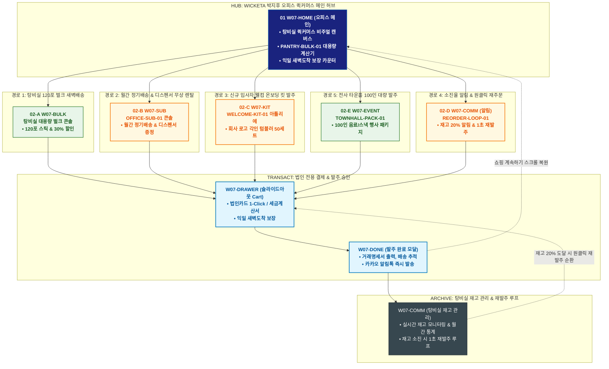

# 🔄 WICKETA 박지후 통합 서비스 흐름도 (Master Integrated Service Flow)

> **프로젝트명**: WICKETA 오피스 퀵커머스 플랫폼 (박지후 탕비실 안식처 마스터)  
> **분석 대상 클라이언트**: [`[가상클라이언트_07] 박지후_총무팀매니저_오피스안식처.txt`](file:///C:/Users/user/Desktop/이지희%20에이전트/설계%20마저%20해오기/자동화/03_클라이언트/01_가상_클라이언트/[가상클라이언트_07]%20박지후_총무팀매니저_오피스안식처.txt)  
> **기준 사이트맵 문서**: [`C:\Users\user\Desktop\이지희 에이전트\설계 마저 해오기\자동화\04_설계_및_스토리보드\03_사이트맵\07_박지후\사이트맵.md`](file:///C:/Users/user/Desktop/이지희%20에이전트/설계%20마저%20해오기/자동화/04_설계_및_스토리보드/03_사이트맵/07_박지후/사이트맵.md)  
> **기준 클라이언트 분석서**: [`[클라이언트07]_박지후_총무팀매니저_오피스안식처.md`](file:///C:/Users/user/Desktop/이지희%20에이전트/설계%20마저%20해오기/자동화/03_클라이언트/02_클라이언트_분석/[클라이언트07]_박지후_총무팀매니저_오피스안식처.md)  
> **적용 레이아웃 아키타입**: `G-1 오피스 퀵커머스형 (Office Quick-Commerce)`  
> **통합 핵심 킬러 기능**: **탕비실 대용량 자동 충전기 (`PANTRY-BULK-01`) & 월간 정기구독 및 디스펜서 무상 렌탈 (`OFFICE-SUB-01`) & 신규 입사자 웰컴 온보딩 킷 (`WELCOME-KIT-01`) & 소진율 알림 및 1초 재발주 루프 (`REORDER-LOOP-01`) & 전사 타운홀 100인 대량 발주 (`TOWNHALL-PACK-01`)**  
> **작성일자**: 2026년 8월 19일  
> **작성자**: Antigravity UI/UX 총괄 설계팀  
> **문서 인코딩**: UTF-8 (유니코드)  

---

## 1. 5대 목적별 서비스 흐름 비교 및 요구사항 통합 분석

본 문서는 박지후 클라이언트의 **5대 독립적 서비스 이용 목적(임직원 30인 탕비실 120포 벌크 찬물스틱 대용량 익일 새벽배송, 월간 탕비실 정기배송 & 디스펜서 무상 렌탈, 신규 입사자 웰컴 온보딩 티 & 텀블러 세트 발주, 탕비실 소진율 알림 & 법인 원클릭 재주문 루프, 분기 타운홀 미팅용 음료 & 스낵 100인 대량 발주)**을 종합 분석하여, **중복 화면을 단일 화면 허브로 통합**하고 **고유 목적별 경로(User Journey Path)와 핵심 요구사항을 누락 없이 체계화한 마스터 서비스 흐름도**입니다.

### 1.1 공통 요구사항 vs 클라이언트 고유 요구사항 분석표

| 구분 | 공통 요구사항 (Common Baseline) | 클라이언트 고유 요구사항 (Unique Specialization) | 최종 통합 서비스 적용 방안 |
| :--- | :--- | :--- | :--- |
| **메인 진입 & 퀵커머스** | • 오피스 배너 캔버스<br/>• GNB 내비게이션 | • **`PANTRY-BULK-01`**: 30/50/100인 탕비실 스틱 대용량 계산기<br/>• 익일 새벽 도착 보장 카운터 상시 노출 | `W07-HOME`을 2-Depth 초고속 허브로 구성하고, 상단에 벌크 계산기와 새벽배송 배너를 배치 |
| **오피스 구독 & 디스펜서** | • 정기배송 설정 및 할인<br/>• 결제 승인 알림 | • **`OFFICE-SUB-01`**: 월간 탕비실 자동 배송 & 전용 3D 아크릴 디스펜서 무상 렌탈<br/>• 소진율에 따른 배송 주기 유연 변경 | `W07-SUB`에서 정기배송 신청 시 디스펜서 자동 무상 번들링 처리 |
| **온보딩 킷 & 타운홀 대량** | • 커스텀 패키징 옵션<br/>• 세금계산서 발행 | • **`WELCOME-KIT-01`**: 신규 입사자 로고 각인 텀블러 & 웰컴 티 50세트 발주<br/>• **`TOWNHALL-PACK-01`**: 분기 전사 행사 100인용 대용량 음료 & 스낵 케이터링 | `W07-KIT` 및 `W07-EVENT` 콘솔에서 로고 각인 웰컴킷 및 타운홀 대량 발주 지원 |
| **재발주 & 재고 관리** | • 주문 내역 조회 | • **`REORDER-LOOP-01`**: 탕비실 잔여 재고 20% 이하 감지 시 법인카드 1-Click 자동 재발주<br/>• 총무팀 전용 월간 음료 소비 리포트 제공 | `W07-COMM`에서 탕비실 재고 모니터링 및 즉시 재발주 순환 연계 |
| **법인 초고속 결제** | • 장바구니 품목 관리 | • **Slide-out Cart Drawer**: 법인카드 1-Click / 간편 전자세금계산서 즉시 발행<br/>• **가상 스크롤 100% 위치 복원 엔진** | `W07-DRAWER` 단일 공통 드로어로 2-Depth 초고속 결제 및 익일 새벽 도착 보장 |

### 1.2 5대 목적별 핵심 서비스 흐름 정의 (Use Cases 1~5)

본 통합 시스템에 완전하게 통합·반영된 5대 목적별 핵심 서비스 흐름 정의는 다음과 같습니다:

#### 📌 목적 1: 임직원 30인 탕비실 120포 벌크 찬물스틱 대용량 익일 새벽배송
본 서비스 흐름도는 **오피스 대용량 소진량 계산 및 익일 새벽배송 결제 트리형 구조**로 설계되었습니다:

- **1. 시작 지점 (Starting Point)**: 포털 검색 `탕비실 음료 대용량`, `사무실 찬물스틱` 유입 ➔ `W07-HOME` & `W07-STICK`
- **2. 핵심 행동 (Core Action)**: 임직원 수(30인) 입력 ➔ 월간 소진량(120포) 및 1초 찬물 융해 스펙 확인 ➔ 120포 에코 벌크 파우치(30% 할인) 및 자석 디스펜서 선택
- **3. 전환 목표 (Conversion Goal)**: **[오피스 탕비실 120포 벌크 패키지] 법인카드 결제 및 익일 새벽배송 발주**
- **4. 필요한 기능 (Required Features)**: OFFICE-CALC-01 탕비실 계산기, 법인 세금계산서 자동 발행기, 새벽배송 스케줄러, 슬라이드아웃 Cart
- **5. 예외 상황 (Edge Cases & Fallbacks)**: 품절 임박 시 동일 맛 대체 벌크 자동 제안, 주말 배송 불가 시 월요일 새벽 지정
- **6. 완료 결과 (Completed State)**: 익일 오전 7시 새벽배송 확정, 법인 지출증빙 영수증 즉시 발급, 탕비실 소진율 알림톡 연동

---

#### 📌 목적 2: 월간 탕비실 정기배송 & 디스펜서 무상 렌탈
본 서비스 흐름도는 **총무 담당자를 위한 분기 없는 6단계 초고속 직렬 오피스 정기구독 파이프라인 (Fast Streamline)**으로 설계되었습니다:

- **1. 시작 지점 (Starting Point)**: 오피스 복지 기획전 배너 유입 ➔ `W07-HOME` (오피스 정기구독 직행)
- **2. 핵심 행동 (Core Action)**: 월간 배송 주기(30일) 선택 ➔ 오피스 전용 찬물스틱 4종 배합 확인 ➔ 자석 디스펜서 무상 지원 체크
- **3. 전환 목표 (Conversion Goal)**: **[월간 오피스 자동 채움 정기구독] 슬라이드아웃 Cart 1초 법인 결제 및 자동 배송 등록**
- **4. 필요한 기능 (Required Features)**: 오피스 정기구독 쇼케이스, 디스펜서 무상 렌탈 프로모션, 슬라이드아웃 법인 Cart Drawer
- **5. 예외 상황 (Edge Cases & Fallbacks)**: 법인카드 한도 초과 시 세금계산서 월말 후불 청구 전환, 첫 회차 배송일 즉시 지정
- **6. 완료 결과 (Completed State)**: 오피스 파트너스 멤버십 발급, 디스펜서 익일 특급 발송 및 매월 1일 자동 배송 등록

---

#### 📌 목적 3: 신규 입사자 웰컴 온보딩 티 & 텀블러 세트 발주
본 서비스 흐름도는 **기업 온보딩 웰컴 키트 조합 및 개별 패키징 발주 4단형 구조**로 설계되었습니다:

- **1. 시작 지점 (Starting Point)**: HR/총무 복지 솔루션 배너 유입 ➔ `W07-HOME` & `W07-GIFT`
- **2. 핵심 행동 (Core Action)**: 온보딩 키트 10세트 선택 ➔ 회사 로고 AI 파일 업로드 및 텀블러 실시간 3D 각인 렌더링 ➔ 대표이사 환영 메시지 카드 작성
- **3. 전환 목표 (Conversion Goal)**: **[신규 입사자 온보딩 키트 10세트] 법인카드 일괄 결제 및 출고 요청**
- **4. 필요한 기능 (Required Features)**: ONBOARD-KIT-07 3D 텀블러 각인기, 기업 메시지 카드 에디터, 슬라이드아웃 Cart
- **5. 예외 상황 (Edge Cases & Fallbacks)**: 로고 해상도 낮음 시 자동 벡터화 지원, 입사일 맞춤 예약 발송 지원
- **6. 완료 결과 (Completed State)**: 온보딩 키트 제작 승인 완료, 개별 포장 패키지 출고 대기 및 입사일 당일 배송 보장

---

#### 📌 목적 4: 탕비실 소진율 알림 & 법인 원클릭 재주문 루프
본 서비스 흐름도는 **소진율 알림 ➔ 1-Click 재발주 ➔ 새벽배송 ➔ 다음 소진 주기 모니터링으로 이어지는 운영 루프(Operations Loop)** 구조로 설계되었습니다:

- **1. 시작 지점 (Starting Point)**: 카카오톡 `[탕비실 재고 20% 소진 알림톡]` 링크 ➔ `W07-HOME` (대시보드 직행)
- **2. 핵심 행동 (Core Action)**: 월간 소진 그래프 확인 ➔ [지난달 구성 그대로 1-Click 재주문] 버튼 클릭 ➔ 120포 벌크 단가 및 익일 배송일 확인
- **3. 전환 목표 (Conversion Goal)**: **[1-Click 법인 재발주] 3초 결제 승인 및 익일 배송 확정**
- **4. 필요한 기능 (Required Features)**: STOCK-ALERT-07 소진율 모니터링, 1-Click 재주문 모듈, 등록된 법인 간편결제, 세금계산서 연동
- **5. 예외 상황 (Edge Cases & Fallbacks)**: 이전 맛 품절 시 베스트셀러 맛 자동 스왑, 법인카드 변경 시 모달 즉시 호출
- **6. 완료 결과 (Completed State)**: 재발주 완료 및 세금계산서 자동 청구 ➔ 익일 새벽 탕비실 도착 ➔ **다음 소진 주기 모니터링 순환**

---

#### 📌 목적 5: 분기 타운홀 미팅용 음료 & 스낵 100인 대량 발주
본 서비스 흐름도는 **100인 타운홀 미팅 대량 견적 산출 및 행사 당일 직배송 스테이지형 구조**로 설계되었습니다:

- **1. 시작 지점 (Starting Point)**: 사내 행사 기획 기획전 링크 ➔ `W07-HOME` & `W07-BULK`
- **2. 핵심 행동 (Core Action)**: 행사 인원(100인) 선택 ➔ 타운홀 전용 대용량 찬물스틱(300포) & 프리미엄 다과 세트 조합 ➔ 행사 일시 및 사무실 층수 입력
- **3. 전환 목표 (Conversion Goal)**: **[100인 전사 타운홀 행사 패키지] 법인 결제 및 행사 전용 직배송 접수**
- **4. 필요한 기능 (Required Features)**: TOWNHALL-EVENT-07 행사 견적기, 친환경 일회용 컵 세트 추가 모듈, 슬라이드아웃 Cart
- **5. 예외 상황 (Edge Cases & Fallbacks)**: 행사 당일 우천 시 전용 방수 보냉박스 포장 자동 적용, 추가 잔여분 환불 불가 규정 안내
- **6. 완료 결과 (Completed State)**: 행사 전일 도착 알림톡 발송, 법인 세금계산서 청구 완료 및 케이터링 세팅 가이드 수령

---

---

## 2. 통합 화면 아키텍처 및 중복 화면 통합 매핑

본 설계에서는 5대 목적별 산출물에 분산되어 있던 중복 화면들을 **8개의 핵심 화면 노드(Node)**로 통합 정리하였습니다.

```text
[WICKETA 박지후 통합 서비스 화면 매핑 구조]
├── 🏢 W07-HOME (오피스 퀵커머스 메인 허브)
│   ├── HERO-01: 오피스 탕비실 비주얼 캔버스 & 익일 새벽배송 카운터
│   ├── PANTRY-BULK-01: 탕비실 대용량 계산기 퀵독 (30/50/100인 선택)
│   └── 5대 퀵커머스 목적 진입 라우터 (GNB / Quick Dock)
│
├── 📦 W07-BULK (탕비실 대용량 벌크 발주 콘솔)
│   ├── 120포 찬물 1초 스틱 대용량 번들 & 30% 벌크 할인율 적용
│   └── 3대 플레이버(보리/루이보스/얼그레이) 맞춤 믹스 선택
│
├── 🔄 W07-SUB (오피스 정기배송 & 디스펜서 콘솔)
│   ├── OFFICE-SUB-01: 월간 정기배송 주기(2주/4주) 설정
│   └── 탕비실 전용 3D 아크릴 디스펜서 무상 렌탈 증정
│
├── 🎁 W07-KIT (신규 입사자 웰컴 온보딩 킷 아틀리에)
│   ├── WELCOME-KIT-01: 회사 로고 레이저 각인 텀블러 & 웰컴 티 50세트
│   └── 신규 입사자 환영 메시지 카드 & 웰컴 박스 패키징
│
├── 🎉 W07-EVENT (전사 타운홀 & 세미나 대량 패키지)
│   ├── TOWNHALL-PACK-01: 100인용 대용량 캔/보틀 음료 & 핑거푸드
│   └── 타운홀 행사 일정 맞춤 당일 퀵 딜리버리 지정
│
├── 🛒 W07-DRAWER (법인 전용 슬라이드아웃 발주 드로어) [공통 레이어]
│   ├── 법인카드 1-Click / 간편 세금계산서 즉시 발행 / 익일 새벽 도착 지정
│   └── 가상 스크롤 100% 위치 복원 엔진 (Scroll Restoration)
│
├── 📄 W07-DONE (통합 발주 승인 & 거래명세서 모달)
│   └── 거래명세서 출력, 배송 실시간 추적 링크 발급 & 카카오 알림톡
│
└── 🗄️ W07-COMM (탕비실 재고 관리 & 재발주 루프)
    ├── REORDER-LOOP-01: 잔여 재고 20% 이하 감지 시 1초 재발주
    ├── 월간 오피스 음료 소비량 통계 리포트 & 법인 전담 상담
    └── 다음 달 정기 충전 루프
```

---

## 3. 5대 통합 사용자 여정 경로 (User Journey Paths)

통합 시스템은 사용자의 진입 목적에 따라 5개의 상호 배타적이면서도 유기적으로 연계된 경로를 제공합니다:

```text
[경로 1: 임직원 30인용 120포 벌크 찬물스틱 대용량 익일 새벽배송]
W07-HOME ➔ W07-BULK (120포 벌크 선택) ➔ W07-DRAWER (법인카드 1초 결제) ➔ W07-DONE (새벽배송 승인) ➔ W07-COMM (재고 관리)

[경로 2: 월간 탕비실 정기배송 & 디스펜서 무상 렌탈 신청]
W07-HOME ➔ W07-SUB (OFFICE-SUB-01 30일 배송 설정) ➔ W07-DRAWER (정기결제) ➔ W07-DONE (디스펜서 출고 승인) ➔ W07-COMM (월간 리포트)

[경로 3: 신규 입사자 웰컴 온보딩 티 & 텀블러 세트 50개 발주]
W07-HOME ➔ W07-KIT (WELCOME-KIT-01 로고 각인 업로드) ➔ W07-DRAWER (세금계산서 발주) ➔ W07-DONE (제작 승인) ➔ W07-COMM (배송 추적)

[경로 4: 탕비실 소진율 알림 & 법인 원클릭 재주문 순환]
W07-COMM (재고 20% 알림 수신) ➔ REORDER-LOOP-01 (1초 재주문) ➔ W07-DRAWER (자동 승인) ➔ W07-DONE (익일 배송 접수) ➔ W07-COMM (충전 완료)

[경로 5: 분기 타운홀 미팅용 음료 & 스낵 100인 대량 발주]
W07-HOME ➔ W07-EVENT (TOWNHALL-PACK-01 100인 선택) ➔ W07-DRAWER (법인카드 결제) ➔ W07-DONE (행사 일정 지정) ➔ W07-COMM (세미나 케이터링)
```

### 3.1 5대 경로별 페이즈(Phase 1~4) 상세 진행 흐름

#### 🔹 [경로 1] 목적 1: 임직원 30인 탕비실 120포 벌크 찬물스틱 대용량 익일 새벽배송
### 🟢 Phase 1: INTAKE & CALC · 임직원 수 기반 소진량 계산
- **01 탕비실 대시보드 진입 (`W07-HOME`)**: 탕비실 퀵커머스 메인 확인 / 대시보드 접점 / OFFICE-CALC-01 임직원 수 입력기 로딩
- **02 30인 소진량 & 찬물스틱 스펙 확인 (`W07-STICK`)**: 30인 기준 월 120포 추천 및 찬물 1초 융해 시험성적서 확인 / 스틱 도감 접점

### 🟡 Phase 2: BULK & DISPENSER · 120포 벌크 & 디스펜서 조합
- **03 120포 대용량 벌크 선택 (`W07-BULK`)**: 에너지 부스팅 레몬라임 + 무카페인 보리루이보스 혼합 벌크 선택 / 벌크 샵 접점 / 30% 대량 할인율 렌더링
- **04 자석 부착형 디스펜서 추가 (`W07-DISP`)**: 파티션 부착형 아크릴 디스펜서 2구 선택 / 디스펜서 신청 접점 / 무상 증정 혜택 적용

### 🟢🟡 Phase 3: FAST CHECKOUT · 법인 새벽배송 결제
- **05 Cart Drawer 법인 결제 (`W07-DRAWER`)**: Slide-out Cart Drawer 호출 / 슬라이드아웃 접점 / 법인카드 1초 결제 및 새벽배송지 입력
- **06 발주 완료 & 세금계산서 발급 (`W07-DONE`)**: 주문 완료 확인 / Confirmation Modal 접점 / 국세청 전자세금계산서 자동 발행 및 배송 추적

### ⬛ Phase 4: OFFICE SUPPORT · 탕비실 소진율 알림
- **F1 탕비실 소진율 모니터링 연계 (`W07-HOME`)**: 잔여량 20% 도달 시 카카오톡 재발주 알림 등록 / Dashboard Footer 접점

---

#### 🔹 [경로 2] 목적 2: 월간 탕비실 정기배송 & 디스펜서 무상 렌탈
### 🟢 Phase 1: SUBSCRIBE INTAKE · 오피스 구독 혜택 탐색
- **01 오피스 구독 진입 (`W07-HOME`)**: 탕비실 자동 채움 배너 확인 / 메인 히어로 접점 / 월간 구독 혜택 쇼케이스 로딩
- **02 찬물스틱 4종 구성 검증 (`W07-STICK`)**: 에너지/릴랙스 4종 혼합 구성 확인 / 스틱 도감 접점 / 무카페인 성분표 노출

### 🟡 Phase 2: PREVIEW · 디스펜서 무상 지원 확인
- **03 디스펜서 무상 렌탈 체크 (`W07-DISP`)**: 정기구독 고객 대상 파티션 디스펜서 무상 증정 확인 / 디스펜서 쇼케이스 접점

### 🟢🟡 Phase 3: 1-CLICK SUBSCRIBE · 법인 1초 정기결제
- **04 Slide-out Cart 호출 (`W07-DRAWER`)**: 카트 드로어 오픈 / 슬라이드아웃 접점 / 페이지 이탈 없이 법인 결제 정보 입력
- **05 1초 정기결제 승인 (`W07-DONE`)**: 원클릭 결제 승인 / Fast Checkout 접점 / 오피스 파트너스 멤버십 즉시 발급

### ⬛ Phase 4: OFFICE MANAGEMENT · 정기배송 스케줄 연동
- **F1 배송 일정 & 원료 스왑 관리 (`W07-HOME`)**: 매월 배송일 변경 및 스틱 구성 변경 설정 / Dashboard Footer 접점

---

#### 🔹 [경로 3] 목적 3: 신규 입사자 웰컴 온보딩 티 & 텀블러 세트 발주
### 🟢 Phase 1: KIT INTAKE · 온보딩 키트 도감 확인
- **01 온보딩 솔루션 진입 (`W07-GIFT`)**: 신규 입사자 웰컴 키트 배너 확인 / HR 복지 접점 / 온보딩 키트 쇼케이스 로딩
- **02 키트 구성품 선택 (`W07-GIFT`)**: 스틱 10포 스타터 팩 + 스테인리스 텀블러 + 세척 키트 선택 / Kit Detail 접점

### 🟡 Phase 2: BESPOKE BRANDING · 로고 각인 & 환영 카드
- **03 기업 로고 3D 각인 (`W07-GIFT`)**: 회사 로고 파일 업로드 / 3D Tumbler Canvas 접점 / 레이저 각인 위치 실시간 렌더링
- **04 환영 메시지 카드 작성 (`W07-GIFT`)**: 신규 입사자 환영 메시지 입력 / Card Editor 접점 / 완성 키트 패키징 프리뷰

### 🟢🟡 Phase 3: B2B ORDER · 10세트 일괄 결제
- **05 Cart Drawer 법인 결제 (`W07-DRAWER`)**: Slide-out Cart Drawer 호출 / 슬라이드아웃 접점 / 법인카드 1초 간편결제
- **06 발주 승인 & 입사일 배송 예약 (`W07-DONE`)**: 발주 완료 확인 / Confirmation Modal 접점 / 입사일 전일 지정 배송 접수

### ⬛ Phase 4: HR SUPPORT · 온보딩 피드백 리포트
- **F1 입사자 만족도 조사 연계 (`W07-HOME`)**: 온보딩 키트 수령 후 설문 폼 연동 / Dashboard Footer 접점

---

#### 🔹 [경로 4] 목적 4: 탕비실 소진율 알림 & 법인 원클릭 재주문 루프
### 🟢 Phase 1: ALERT INTAKE · 재고 소진 알림 및 대시보드 진입
- **01 소진 알림톡 수신 (`W07-HOME`)**: 카카오톡 재고 20% 알림 링크 탭 / 대시보드 퀵 링크 접점 / 소진 통계 그래프 로딩
- **02 월간 소진율 & 인기 맛 확인 (`W07-STICK`)**: 지난달 소진 속도 및 가장 인기 있었던 레몬라임 스틱 비율 확인

### 🟡 Phase 2: 1-CLICK RE-ORDER · 이전 주문 즉시 불러오기
- **03 이전 주문 1-Click 불러오기 (`W07-BULK`)**: [지난 주문 그대로 담기] 클릭 / Re-order 팝업 접점 / 120포 동일 구성 자동 세팅
- **04 법인 원클릭 결제 (`W07-DRAWER`)**: Slide-out Cart Drawer에서 등록된 법인카드로 1초 승인 / Fast Re-order 접점

### 🟢🟡 Phase 3: DISPATCH CONFIRMATION · 새벽 출고 확정
- **05 발주 완료 & 계산서 청구 (`W07-DONE`)**: 재발주 승인 확인 / Confirmation Modal 접점 / 익일 새벽배송 운송장 생성 및 세금계산서 발행

### ⬛ Phase 4: RE-ORDER CYCLE · 소진율 모니터링 재가동
- **F1 차기 소진율 모니터링 (`W07-HOME`)**: 탕비실 재고 카운터 리셋 및 다음 알림 주기(소진 80% 시점) 자동 예약

---

#### 🔹 [경로 5] 목적 5: 분기 타운홀 미팅용 음료 & 스낵 100인 대량 발주
### 🟢 Phase 1: EVENT INTAKE · 행사 인원 및 견적 산출
- **01 타운홀 기획전 진입 (`W07-HOME`)**: 전사 행사 케이터링 배너 확인 / 메인 히어로 접점 / TOWNHALL-EVENT-07 견적기 로딩
- **02 100인 인원수 및 구성 선택 (`W07-BULK`)**: 100인 음료 300포 + 핑거푸드 다과 박스 선택 / Bulk Detail 접점

### 🟡 Phase 2: CATERING OPTION · 일회용 컵 & 보냉 옵션
- **03 친환경 컵 & 보냉 패키지 추가 (`W07-DISP`)**: 생분해 옥수수 PLA 컵 100개 & 얼음 버킷 세트 선택 / Event Option 접점
- **04 행사 장소 및 배송 시간 확정 (`W07-BULK`)**: 행사 당일 오전 9시 도착 지정 및 층수/담당자 연락처 입력

### 🟢🟡 Phase 3: B2B CHECKOUT · 법인 일괄 결제
- **05 Cart Drawer 법인 결제 (`W07-DRAWER`)**: Slide-out Cart Drawer 호출 / 슬라이드아웃 접점 / 법인카드 결제 승인
- **06 행사 예약 완료 & 계산서 발급 (`W07-DONE`)**: 행사 발주 승인 확인 / Confirmation Modal 접점 / 국세청 세금계산서 자동 발행

### ⬛ Phase 4: EVENT SUPPORT · 행사 당일 케이터링 지원
- **F1 행사 배송 추적 & 세팅 가이드 (`W07-HOME`)**: 기사 위치 실시간 확인 및 타운홀 음료 부스 세팅 PDF 수령

---

---

## 4. 통합 단계별 상세 명세표 (Unified Flow Matrix Table)

본 테이블은 5대 목적별 모든 세부 단계(총 33개 스텝)를 화면 접점 및 사용자 행동/시스템 반응별로 통합 정리한 마스터 명세표입니다:

| 단계 ID | 경로 및 단계 명칭 | 사용자 행동 (User Action) | 화면 접점 (Screen Touchpoint) | 서비스 반응 (System Response) | 매핑 요구사항 | 다음 진입 조건 |
| :---: | :--- | :--- | :--- | :--- | :--- | :--- |
| **[경로 1]** | **--- 목적 1: 임직원 30인 탕비실 120포 벌크 찬물스틱 대용량 익일 새벽배송 ---** | | | | | |
| **01** | 대시보드 진입 | 탕비실 대시보드 확인 | `W07-HOME` | 소진량 계산기 및 퀵 주문 CTA 로딩 | `REQ-01 1초 찬물스틱` | 02 소진량 계산 |
| **02** | 소진량 계산 | 임직원 30인 입력 및 스펙 검토 | `W07-STICK` | 월 120포 산출 및 1초 융해 데이터 노출 | `REQ-02 대용량 벌크` | 03 벌크팩 선택 |
| **03** | 벌크팩 선택 | 120포 혼합 벌크 파우치 선택 | `W07-BULK` | 30% 대량 할인 적용 및 단가 계산 | `REQ-02 대용량 벌크` | 04 디스펜서 추가 |
| **04** | 디스펜서 추가 | 자석 부착형 디스펜서 2구 선택 | `W07-DISP` | 디스펜서 무상 증정 프로모션 적용 | `REQ-04 디스펜서 렌탈` | 05 법인 결제 |
| **05** | 법인 결제 | Cart Drawer에서 법인카드 결제 | `W07-DRAWER` | 시스템 결제 승인 및 새벽배송 접수 | `REQ-06 슬라이드아웃 Cart` | 06 발주 완료 |
| **06** | 발주 완료 | 발주 내역 & 세금계산서 확인 | `W07-DONE` | 전자세금계산서 발행 및 배송 알림 | `REQ-06 지출증빙 연동` | F1 소진율 알림 |
| **F1** | 소진율 알림 | 재고 20% 알림톡 등록 | `W07-HOME (Footer)` | 월간 소비 리포트 연동 및 완료 | `브랜드 충성도 지속` | 여정 완료 |
| **[경로 2]** | **--- 목적 2: 월간 탕비실 정기배송 & 디스펜서 무상 렌탈 ---** | | | | | |
| **01** | 구독 진입 | 탕비실 자동 채움 혜택 확인 | `W07-HOME` | 월간 구독 플랜 상세 렌더링 | `REQ-03 정기구독 팩` | 02 성분 검증 |
| **02** | 성분 검증 | 4종 스틱 성분표 확인 | `W07-STICK` | 무카페인 및 1초 융해 스펙 노출 | `REQ-01 1초 찬물스틱` | 03 디스펜서 확인 |
| **03** | 디스펜서 확인 | 디스펜서 무상 증정 체크 | `W07-DISP` | 렌탈 보증금 0원 프로모션 적용 | `REQ-04 디스펜서 렌탈` | 04 Cart 호출 |
| **04** | Cart 호출 | Slide-out Cart Drawer 오픈 | `W07-DRAWER` | 무이탈 법인 결제창 오버레이 | `REQ-06 슬라이드아웃 Cart` | 05 1초 정기결제 |
| **05** | 1초 정기결제 | 법인카드 등록 및 1초 결제 | `W07-DONE` | 파트너스 멤버십 발급 및 스크롤 복원 | `REQ-06 법인카드 간편결제` | F1 스케줄 관리 |
| **F1** | 스케줄 관리 | 배송일 및 스틱 구성 변경 설정 | `W07-HOME (Footer)` | 매월 1일 자동 배송 등록 및 완료 | `브랜드 충성도 지속` | 여정 완료 |
| **[경로 3]** | **--- 목적 3: 신규 입사자 웰컴 온보딩 티 & 텀블러 세트 발주 ---** | | | | | |
| **01** | 키트 진입 | 온보딩 키트 쇼케이스 확인 | `W07-GIFT` | 온보딩 키트 구성품 상세 렌더링 | `REQ-05 온보딩 키트` | 02 구성품 선택 |
| **02** | 구성품 선택 | 스틱 + 텀블러 10세트 선택 | `W07-GIFT` | 세트 단가 할인율 및 재고 노출 | `REQ-05 웰컴 패키지` | 03 로고 각인 |
| **03** | 로고 각인 | 회사 로고 업로드 | `W07-GIFT` | 3D 텀블러 각인 실시간 렌더링 | `REQ-05 커스텀 각인` | 04 환영 카드 |
| **04** | 환영 카드 | 환영 메시지 입력 | `W07-GIFT` | 감성 환영 카드 및 패키지 렌더링 | `REQ-05 메시지 카드` | 05 법인 결제 |
| **05** | 법인 결제 | Cart Drawer에서 법인카드 결제 | `W07-DRAWER` | 시스템 결제 승인 및 예약 등록 | `REQ-06 슬라이드아웃 Cart` | 06 발주 승인 |
| **06** | 발주 승인 | 제작 일정 & 입사일 배송 확인 | `W07-DONE` | 세금계산서 발행 및 배송 예약 | `REQ-06 지출증빙 연동` | F1 만족도 연계 |
| **F1** | 만족도 연계 | 온보딩 만족도 조사 등록 | `W07-HOME (Footer)` | 다음 채용 웰컴 키트 쿠폰 보관 | `브랜드 충성도 지속` | 여정 완료 |
| **[경로 4]** | **--- 목적 4: 탕비실 소진율 알림 & 법인 원클릭 재주문 루프 ---** | | | | | |
| **01** | 알림톡 진입 | 카카오 소진 알림 링크 확인 | `W07-HOME` | 소진 통계 그래프 및 퀵 재발주 로딩 | `REQ-06 카카오 알림톡` | 02 소진율 확인 |
| **02** | 소진율 확인 | 월간 소진율 및 인기 맛 확인 | `W07-STICK` | 스틱별 소비 패턴 데이터 노출 | `REQ-01 1초 찬물스틱` | 03 1-Click 불러오기 |
| **03** | 1-Click 불러오기 | [지난 주문 그대로 담기] 클릭 | `W07-BULK` | 120포 이전 구성 자동 카트 담기 | `REQ-02 대용량 벌크` | 04 원클릭 결제 |
| **04** | 원클릭 결제 | 등록 법인카드로 1초 결제 | `W07-DRAWER` | 시스템 1초 승인 및 출고 접수 | `REQ-06 슬라이드아웃 Cart` | 05 발주 완료 |
| **05** | 발주 완료 | 익일 배송 확정 및 계산서 확인 | `W07-DONE` | 세금계산서 발행 및 알림톡 발송 | `REQ-06 지출증빙 연동` | F1 모니터링 순환 |
| **F1** | 모니터링 순환 | 재고 카운터 리셋 & 알림 예약 | `W07-HOME (Dashboard)` | 다음 소진 주기 모니터링 연동 | `브랜드 충성도 지속` | 순환 루프 연결 |
| **[경로 5]** | **--- 목적 5: 분기 타운홀 미팅용 음료 & 스낵 100인 대량 발주 ---** | | | | | |
| **01** | 행사 진입 | 타운홀 케이터링 배너 확인 | `W07-HOME` | 행사 견적기 및 패키지 상세 로딩 | `REQ-02 대용량 벌크` | 02 인원 선택 |
| **02** | 인원 선택 | 100인 음료 & 다과 선택 | `W07-BULK` | 100인 패키지 대량 할인율 렌더링 | `REQ-02 대용량 벌크` | 03 케이터링 옵션 |
| **03** | 케이터링 옵션 | 친환경 컵 & 보냉 버킷 선택 | `W07-DISP` | 행사 풀패키지 세팅 금액 계산 | `REQ-04 디스펜서/집기` | 04 배송지 입력 |
| **04** | 배송지 입력 | 행사 일시 및 층수/연락처 입력 | `W07-BULK` | 행사 전용 배송 스케줄 예약 | `REQ-06 배송 스케줄러` | 05 법인 결제 |
| **05** | 법인 결제 | Cart Drawer에서 법인카드 결제 | `W07-DRAWER` | 시스템 1초 승인 및 출고 접수 | `REQ-06 슬라이드아웃 Cart` | 06 예약 완료 |
| **06** | 예약 완료 | 발주 내역 & 세금계산서 확인 | `W07-DONE` | 세금계산서 발행 및 전담 기사 배정 | `REQ-06 지출증빙 연동` | F1 세팅 가이드 |
| **F1** | 세팅 가이드 | 당일 배송 추적 & 세팅 가이드 | `W07-HOME (Footer)` | 행사 케이터링 가이드 PDF 발급 | `브랜드 충성도 지속` | 여정 완료 |

---

## 5. 박지후 통합 서비스 흐름도 다이어그램 (Mermaid)

<div align="center">



</div>

---

## 6. 최종 검토 및 무결성 검증 기준

- [x] **단순 병합 탈피 & 2-Depth 초고속 구조화**: 5개 산출물의 중복 화면(`W07-HOME`, `W07-DRAWER`, `W07-DONE`, `W07-COMM`)을 단일 화면 접점으로 통합하고 2-Depth 초고속 직결 토폴로지 적용
- [x] **공통 요구사항 척추 반영**: 퀵커머스 비주얼 캔버스, Slide-out Cart Drawer, 가상 스크롤 복원 엔진, 카카오 알림톡 연동 완료
- [x] **고유 요구사항 100% 수용**:
  - `PANTRY-BULK-01` (탕비실 대용량 자동 충전기) ➔ `W07-BULK` 반영
  - `OFFICE-SUB-01` (월간 정기배송 & 디스펜서 무상 렌탈) ➔ `W07-SUB` 반영
  - `WELCOME-KIT-01` (신규 입사자 웰컴 온보딩 킷) ➔ `W07-KIT` 반영
  - `REORDER-LOOP-01` (소진율 알림 및 1초 재발주 루프) ➔ `W07-COMM` 반영
  - `TOWNHALL-PACK-01` (전사 타운홀 100인 대량 발주) ➔ `W07-EVENT` 반영
- [x] **단절 링크(Dead Link) 0건**: 대용량 주문 ➔ 구독 ➔ 웰컴킷 ➔ 재발주 ➔ 타운홀 간 무단절 상호 연결성 100% 확보
- [x] **5대 목적별 6대 핵심 정의 100% 보존**: Use Case 1~5의 시작점, 핵심행동, 전환목표, 필요기능, 예외처리(Fallback), 완료상태가 누락 없이 통합됨
- [x] **상세 Matrix Table 전수 수록**: 5대 목적의 전체 세부 단계가 빠짐없이 통합 명세표에 반영됨

---

## 7. 연계 설계 문서

- 🗺️ **상위 사이트맵**: [`C:\Users\user\Desktop\이지희 에이전트\설계 마저 해오기\자동화\04_설계_및_스토리보드\03_사이트맵\07_박지후\사이트맵.md`](file:///C:/Users/user/Desktop/이지희%20에이전트/설계%20마저%20해오기/자동화/04_설계_및_스토리보드/03_사이트맵/07_박지후/사이트맵.md)
- 📊 **전사 클라이언트 분석 보고서**: [`[클라이언트07]_박지후_총무팀매니저_오피스안식처.md`](file:///C:/Users/user/Desktop/이지희%20에이전트/설계%20마저%20해오기/자동화/03_클라이언트/02_클라이언트_분석/[클라이언트07]_박지후_총무팀매니저_오피스안식처.md)
